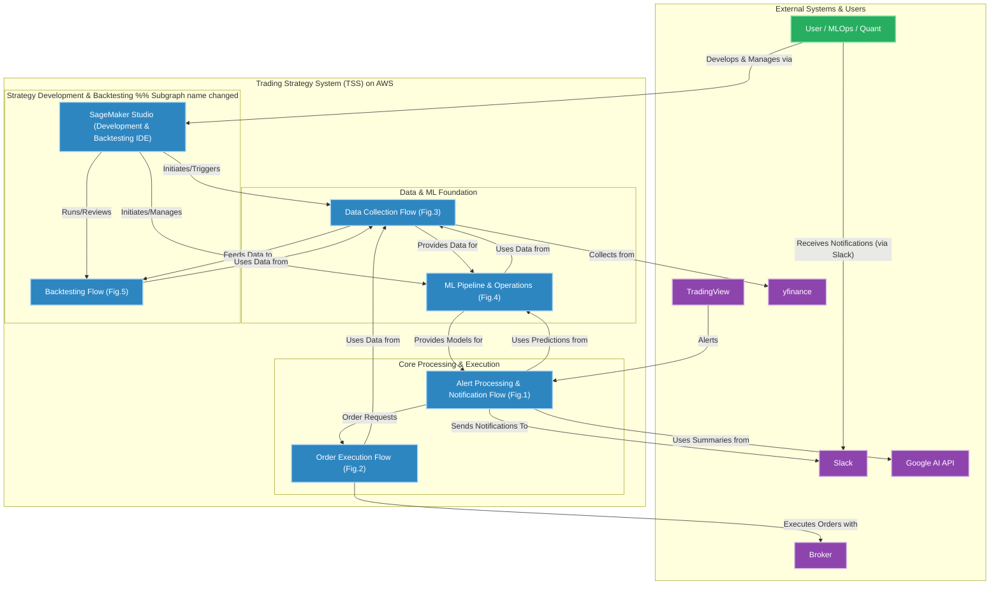

# AXIA - Algorithmic eXecution & Intelligence Architecture

**An integrated platform designed to sublimate trading from a personal 'art' into an analyzable, repeatable, and sustainable 'science'.**

**Last Updated**: 2025-08-03  
**Version**: 2.0  

---

### Abstract

AXIAは、属人的な「アート」と見なされがちなトレーディングを、データとAIを駆使して、分析可能で、再現性があり、持続可能な「サイエンス」へと昇華させることを目的とした、統合的取引基盤です。

本プロジェクトは、イベント駆動型のサーバーレスアーキテクチャを基盤とし、戦略のバックテスト、自動執行、リスク管理、そしてMLOpsによる自己進化まで、トレーディング戦略のライフサイクル全体をシームレスに結合します。

### Vision

AXIAは、自己進化する、インテリジェントな取引基盤となることを目指します。

最終的な目標は、単に取引を自動化することではありません。混沌とした金融市場という環境の中で、客観的で、データに基づいた意思決定を行うための、堅牢なフレームワークを創造することです。

### Key Features

* **イベント駆動型アーキテクチャ:** **TradingView**からのWebhookアラートを起点とし、サーバーレスパイプライン（**API Gateway** → **Lambda** → **SQS**）で処理することで、高い拡張性と信頼性を実現。
* **自動執行とリスク管理:** **IFOCO注文**を含む複雑なオーダーを**MetaTrader 5 (MT5)**で直接執行。システム全体のキルスイッチや、ポジションとオーダーに対する高度な状態管理機能を搭載。
* **高度なバックテスト環境:** **Amazon SageMaker Studio**を中心的なIDEとして活用。S3に蓄積されたヒストリカルデータを用い、**`vectorbt`**のような強力なフレームワークで取引戦略を厳格に検証。
* **End-to-End MLOpsパイプライン:** **SageMaker Pipelines**で構築された、完全な機械学習オペレーションパイプライン。モデルの学習、評価、登録、デプロイ、そして監視までを自動化し、システムの自己進化を可能にする。
* **AIによるインテリジェンス強化:** SageMakerエンドポイントからの**ML予測値**（例：取引の成功確率）でアラートを強化。オプションとして**生成AI**による状況要約や洞察を生成し、Slackへインテリジェントな通知を送信。
* **統一されたデータと状態管理:** 生の市場データを格納する**Amazon S3**上の堅牢なデータレイクと、最高のパフォーマンスと拡張性を実現するために**Single-Table Design**の哲学に基づいて設計された**DynamoDB**上の高度な状態管理システム。

### System Architecture

システムは5つの核となるプロセスフローで構成され、その全てがAWS上でオーケストレーションされる。SageMaker Studioが、開発、分析、そして運用の中心的なハブとして機能する。

1.  **[(Fig.1) アラート処理・通知フロー:](./docs/architecture/architecture_diagram/(Fig.1)%20Alert%20Processing%20&%20Notification%20Flow.md)** アラートを受信・解析し、AIで情報を強化し、インテリジェントな通知を送信。
2.  **[(Fig.2) 注文実行フロー:](./docs/architecture/architecture_diagram/(Fig.2)%20Order%20Execution%20Flow.md)** 堅牢なリスクチェックと状態管理で、注文の全ライフサイクルを管理。
3.  **[(Fig.3) データ収集フロー:](./docs/architecture/architecture_diagram/(Fig.3)%20Data%20Collection%20Flow.md)** バックテストとMLモデルを養うための、市場データ及び補足データを収集。
4.  **[(Fig.4) MLパイプライン・運用フロー:](./docs/architecture/architecture_diagram/(Fig.4)%20ML%20Pipeline%20&%20Operations.md)** SageMaker Pipelinesによって管理される、システムの自己進化する頭脳。
5.  **[(Fig.5) バックテストフロー:](./docs/architecture/architecture_diagram/(Fig.5)%20Backtesting%20Flow.md)** SageMaker Studio内に構築された、戦略を検証し、発見するための実験室。

### The Philosophy of AXIA

#### <u>AXIA's Initial Code</u>

- `IF (problem.isComplex) THEN (systematically_decompose)`
- `DEFINE goal = ideal.to_reality()`
- `REQUIRE full_ownership = true`

#### <u>AXIAを構成する「3つの公理」</u>

本システムは3つの「公理（Axiom）」で構成された一つの思想体系として **「真価（AXIA）」とは何か** を問い続ける。

1.  **公理①：Systematic Approach（体系的であること）**
    全ての課題は、相互に関連し合う「システム」として捉える。場当たり的な解決策ではなく、システム全体の健全性と、未来の拡張性を常に最優先する。この思想は、AWSのアーキテクチャから、DynamoDBのスキーマ設計、そしてコーディング規約に至るまで、このシステムの全ての血肉となっている。

2.  **公理②：ROI-Driven（投資対効果に基づいていること）**
    全ての機能実装は、「技術的に面白いから」という理由では行われない。全ての判断は、「その機能に有限な時間を投資することが、将来のリターン（戦略の優位性）に見合うか」という、極めて合理的な基準によってのみ下される。

3.  **公理③：Built for the Future（未来のために構築されていること）**
    このシステムは、完成した瞬間から、過去の遺物となる宿命を持つ。したがって、設計の初期段階から、未来のチームメンバーのための保守性、そしてMLOpsによる自己進化の可能性が、完全に織り込まれている。

### Tech Stack

* **Cloud:** AWS (Lambda, SQS, EC2, S3, DynamoDB, SageMaker Studio, etc.)
* **Machine Learning:** Amazon SageMaker (Pipelines, Endpoints, etc.), vectorbt, scikit-learn
* **Languages & Tools:** Python, MetaTrader 5 (MT5), yfinance, boto3, IaC (AWS SAM)
* **External Services:** TradingView, Google AI API, Slack

## License

Proprietary - All Rights Reserved
