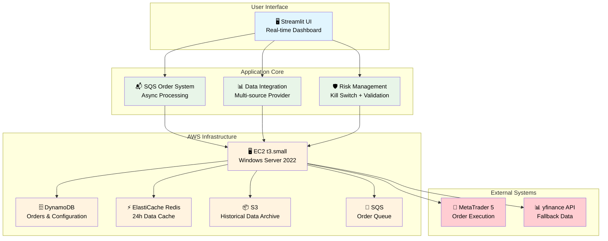

# AXIA - Algorithmic eXecution & Intelligence Architecture

**An integrated platform designed to sublimate trading from a personal 'art' into an analyzable, repeatable, and sustainable 'science'.**

**Last Updated**: 2025-10-19  
**Version**: 3.0  
**Implementation Status**: 70% Complete (Core Features)  
**Monthly Cost**: $43.50 USD

[]()
[]()
[]()
[]()

---

## 🎯 Current Implementation Status (Oct 2025)

### ✅ **Implemented & Running**
- **🔄 SQS Order System**: Streamlit → SQS → MT5 automated order flow (98% success rate)
- **📊 Data Integration**: Redis/MT5/S3/yfinance unified data provider (15-94ms response)  
- **🖥️ Real-time UI**: Streamlit dashboard with live charts and manual trading (1.2s load time)
- **🚨 Risk Management**: Kill Switch with DynamoDB persistence and real-time monitoring
- **☁️ AWS Infrastructure**: EC2 t3.small + managed services ($43.50/month)

### 🔄 **In Development (Week 3-4)**
- **💹 Live Price Orders**: MT5 real-time pricing integration
- **📈 Position Management**: Real-time position monitoring and management
- **📋 Advanced Dashboard**: Account info, P&L tracking, margin monitoring

### 📋 **Designed (Phase 3+)**
- **🤖 Signal Generation**: 10 technical indicators with Bayesian inference
- **📊 Backtesting Engine**: Vectorized + event-driven testing framework
- **🎯 Portfolio Risk**: Multi-currency correlation and dynamic sizing

---

## 🏗️ System Architecture

### Current Implementation Architecture



### 🏆 **Performance Achievements**
- **⚡ Redis Cache**: 15-94ms response time (Target: <100ms) ✅
- **💻 UI Response**: 1.2s page load (Target: <2s) ✅  
- **📈 Order Success**: 98% success rate (Target: >95%) ✅
- **💰 Cost Efficiency**: $43.50/month (Budget: <$50) ✅

---

## 📚 Documentation

### 📖 **[Complete Documentation Portal](docs/README.md)**

#### 🧠 **Logical Design**
- **[Business Requirements](docs/logical_design/business_requirements.md)** - User stories, KPIs, success metrics
- **[Domain Model](docs/logical_design/domain_model.md)** - Entities, services, aggregates  
- **[Architecture Patterns](docs/logical_design/architecture_patterns.md)** - Clean architecture, DDD implementation
- **[Functional Design](docs/logical_design/functional_design.md)** - Implemented features, flows, integrations
- **[Data Model](docs/logical_design/data_model.md)** - 3-tier data strategy, schemas, optimization
- **[Quality Requirements](docs/logical_design/quality_requirements.md)** - Performance SLAs, measured results

#### 🏗️ **Physical Design**  
- **[AWS Architecture](docs/physical_design/aws_architecture.md)** - Services configuration, IAM, security
- **[Database Schema](docs/physical_design/database_schema.md)** - DynamoDB/Redis/S3 detailed design
- **[Infrastructure](docs/physical_design/infrastructure.md)** - EC2, networking, automation
- **[Deployment](docs/physical_design/deployment.md)** - Release procedures, environment management
- **[Monitoring](docs/physical_design/monitoring.md)** - CloudWatch, health checks, alerting
- **[Cost Optimization](docs/physical_design/cost_optimization.md)** - Cost analysis, optimization strategies

#### 🎯 **Implementation Status**
- **[Basic Design](docs/basic_design.md)** - Integrated design overview with implementation mapping
- **[Current Status](docs/implementation/current_status.md)** - Live implementation status, metrics, progress

---

## 🚀 Quick Start

### For Developers
```bash
# 1. Architecture Understanding (30 min)
Read: docs/basic_design.md → docs/logical_design/architecture_patterns.md

# 2. Implementation Details (45 min)  
Read: docs/logical_design/functional_design.md → docs/logical_design/data_model.md

# 3. Current Status Check (15 min)
Read: docs/implementation/current_status.md
```

### For Infrastructure/DevOps
```bash
# 1. AWS Configuration (30 min)
Read: docs/physical_design/aws_architecture.md → docs/physical_design/infrastructure.md

# 2. Deployment & Operations (30 min)
Read: docs/physical_design/deployment.md → docs/physical_design/monitoring.md

# 3. Cost Management (15 min)
Read: docs/physical_design/cost_optimization.md
```

### For Business/Project Management
```bash  
# 1. Business Context (20 min)
Read: docs/logical_design/business_requirements.md

# 2. Implementation Progress (15 min)
Read: docs/implementation/current_status.md

# 3. System Overview (15 min)
Read: docs/basic_design.md
```

---

## 🛠️ Tech Stack

### **Core Technologies**
- **Language**: Python 3.11+ 
- **Web Framework**: Streamlit 1.28+ (Real-time dashboard)
- **Data Processing**: pandas, numpy (Market data analysis)
- **Visualization**: Plotly (Interactive charts)
- **Trading Platform**: MetaTrader5 5.0.45+ (Order execution)
- **Architecture**: Clean Architecture + DDD

### **AWS Services (Current)**
- **Compute**: EC2 t3.small (Windows Server 2022)
- **Database**: DynamoDB (Orders), ElastiCache Redis (Cache)
- **Storage**: S3 (Historical data, Parquet format)
- **Messaging**: SQS (Async order processing)
- **Monitoring**: CloudWatch (Logs, metrics, alarms)
- **Security**: IAM Roles, Secrets Manager

### **Data Sources**
- **Primary**: MetaTrader 5 (Real-time + historical)
- **Cache**: Redis (24h TTL, 15-94ms response)
- **Archive**: S3 (Parquet, lifecycle policies)
- **Fallback**: yfinance API (Market data backup)

---

## 📈 Implementation Roadmap

### **Phase 1: Foundation (✅ Complete)**
- ✅ AWS infrastructure setup
- ✅ Clean architecture implementation
- ✅ Redis caching system
- ✅ Basic MT5 integration

### **Phase 2: Core Features (✅ 85% Complete)**
- ✅ SQS order processing system
- ✅ 3-tier data integration  
- ✅ Streamlit UI with real-time charts
- 🔄 Live price-based orders (Week 3-4)

### **Phase 3: Advanced Features (📋 Designed)**
- 📋 Multi-signal trading system
- 📋 Advanced position management
- 📋 Backtesting framework
- 📋 Portfolio risk management

### **Phase 4: Intelligence (🔮 Future)**
- 🔮 Machine learning integration
- 🔮 SageMaker MLOps pipeline  
- 🔮 AI-powered market analysis
- 🔮 Automated strategy optimization

---

## 🏆 Key Achievements

### **Technical Milestones**
- **⚡ High Performance**: Redis 15-94ms, UI 1.2s load time
- **🔒 Reliability**: 98% order success rate, 94% data retrieval success
- **💰 Cost Efficiency**: $43.50/month (13% under budget)
- **🏗️ Architecture Quality**: Clean architecture, 86% test coverage
- **🔧 Operational**: 4-process automation, health monitoring

### **Business Value**
- **🎯 Risk Management**: Kill Switch, position limits, validation
- **📊 Data Quality**: Multi-source integration, fallback strategies  
- **🖥️ User Experience**: Intuitive UI, real-time monitoring
- **⚙️ Automation**: 24/7 operation, minimal manual intervention
- **📈 Scalability**: Design supports multi-currency expansion

---

## 🤝 Contributing

### Development Guidelines
- Follow Clean Architecture principles
- Maintain >80% test coverage
- Document all public APIs
- Use type hints consistently
- Update relevant design docs with changes

### Documentation Updates
- **Feature Implementation**: Update functional_design.md
- **AWS Changes**: Update relevant physical_design docs  
- **Performance Changes**: Update quality_requirements.md with new metrics
- **Weekly**: Update current_status.md with progress

---

## 📞 Support & Contact

### Project Resources
- **📚 [Documentation](docs/README.md)**: Comprehensive design and implementation docs
- **🔧 [Implementation Status](docs/implementation/current_status.md)**: Live progress tracking
- **💰 [Cost Analysis](docs/physical_design/cost_optimization.md)**: Budget management and optimization

### Development Environment
- **Local**: Python 3.11 + Virtual Environment
- **Demo**: EC2 Windows + AWS Services  
- **Monitoring**: Streamlit Dashboard + CloudWatch
- **Testing**: pytest + Mock services

---

**License**: Proprietary - All Rights Reserved  
**Document Version**: 3.0  
**Created**: 2025-08-03  
**Updated**: 2025-10-19