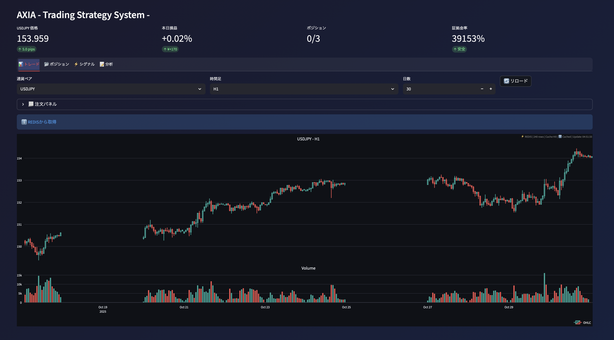
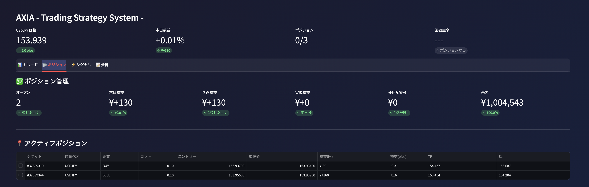
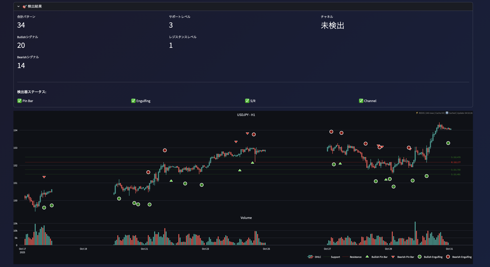
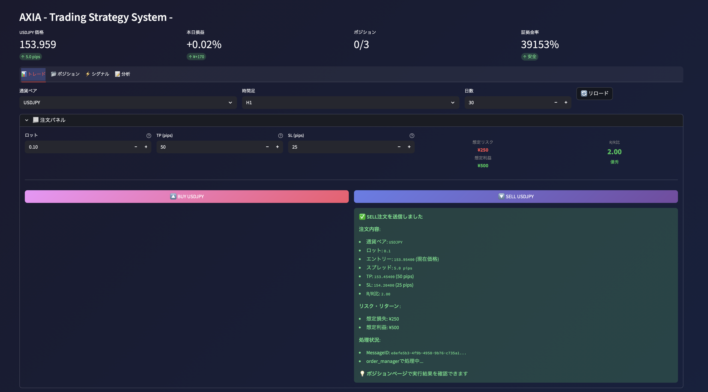
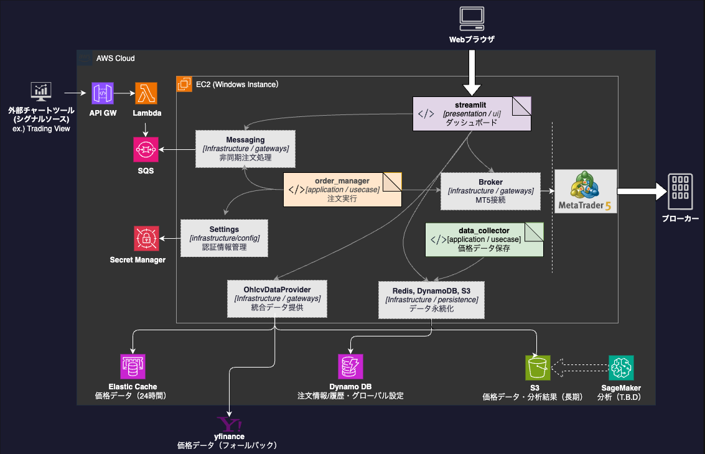
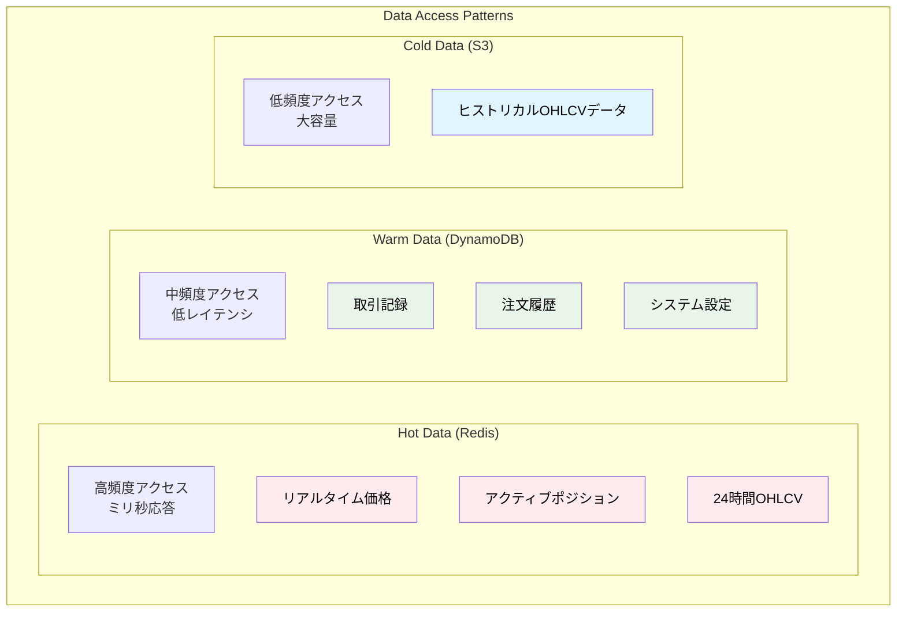
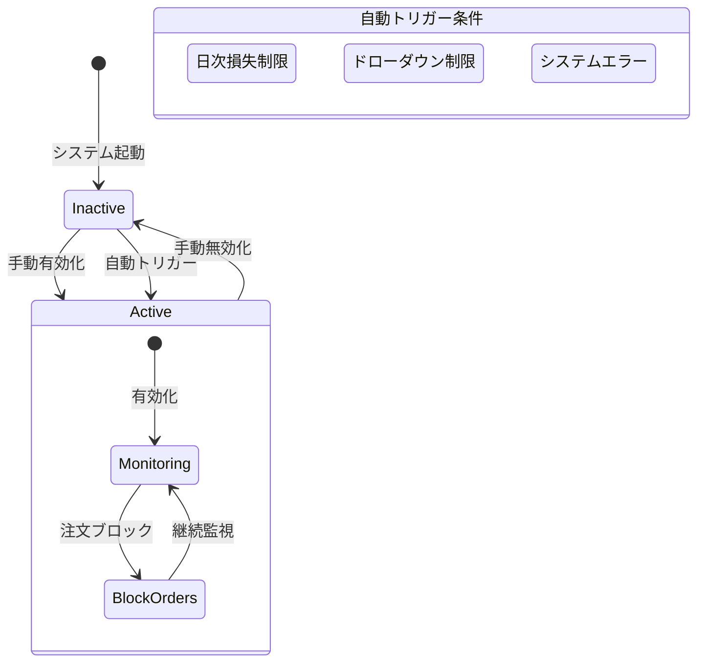
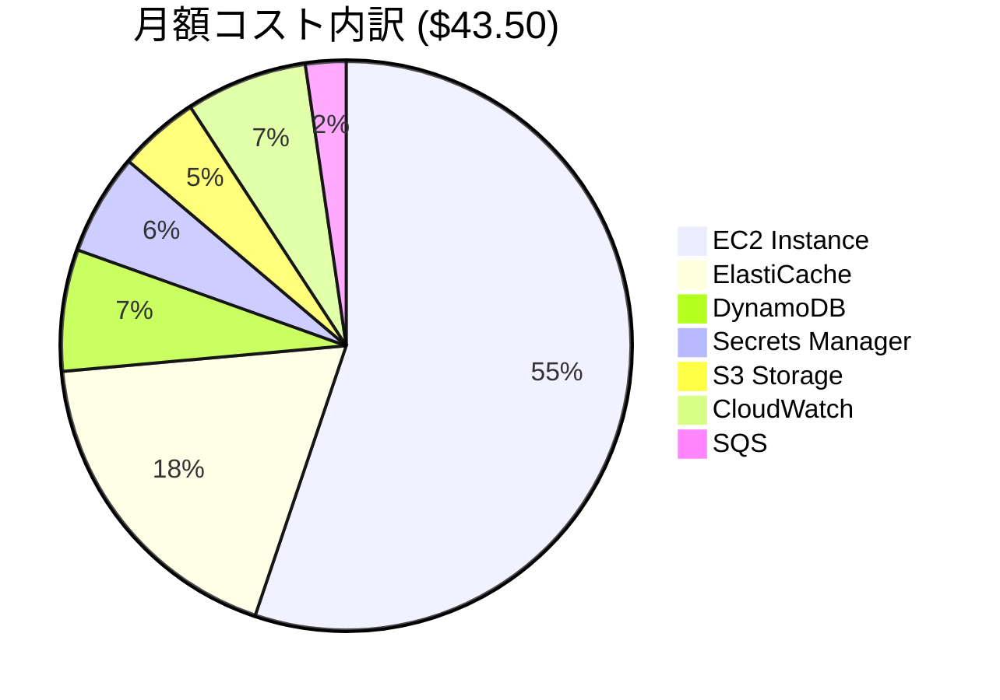

# AXIA Trading Strategy System

**An integrated platform designed to sublimate trading from a personal 'art' into an analyzable, repeatable, and sustainable 'science'.**

**Last Updated**: 2025-10-31  
**Version**: 1.0.0  
**Implementation Status**: 70% Complete (Core Features)  

[](https://github.com/Riki-22/axia-tss)
[](docs/physical_design/aws_architecture.md)
[](https://www.python.org/)
[](docs/implementation/current_status.md)

---

## プロジェクト概要

**AXIA Trading Strategy System** は感情や認知バイアスを排除し、自動取引を通じて持続可能な収益を実現することを目的とした個人投資家向け取引システムです。

### 主要な特徴

#### リアルタイムUI (Real-time UI)

Streamlitを使用し、リアルタイムの価格チャート、口座情報、現在のポジション・損益（P&L）、証拠金維持率、パターン検出など表示

- **ダッシュボード**

  

- **ポジション情報**

  

- **パターン検出**

  

#### 注文システム (SQS Order System)

StreamlitのUIから送信された注文リクエストをSQS（メッセージキュー）を介して非同期で処理し、EC2サーバー上のMT5（MetaTrader 5）で注文を自動実行

- **注文パネル**

  

#### システムアーキテクチャ (System Architecture)

- **システム全体構成**

  

- **クリーンアーキテクチャ**

  ビジネスロジックと技術的詳細を分離する「クリーンアーキテクチャ」と「DDD（ドメイン駆動設計）」、および「依存性注入（DI）」パターンを採用しており、テストや保守が容易な設計

  ```mermaid
  graph TB
      subgraph "User Interface"
          UI[Streamlit UI]
          CLI[CLI Scripts]
      end

      subgraph "External World"
          UI[Streamlit UI]
          CLI[CLI Scripts]
          Broker[MT5 Broker]
          AWS[AWS Services]
      end
      
      subgraph "Clean Architecture Layers"
          subgraph "Presentation Layer"
              Controllers[Controllers]
              Presenters[Presenters]
          end
          
          subgraph "Application Layer"
              UseCases[Use Cases]
              AppServices[Application Services]
          end
          
          subgraph "Domain Layer"
              Entities[Entities]
              DomainServices[Domain Services]
              Repositories[Repository Interfaces]
          end
          
          subgraph "Infrastructure Layer"
              RepositoryImpl[Repository Implementations]
              Gateways[External Gateways]
              Frameworks[Frameworks & Drivers]
          end
      end
      
      UI --> Controllers
      CLI --> Controllers
      Controllers --> UseCases
      UseCases --> DomainServices
      UseCases --> Repositories
      Repositories -.-> RepositoryImpl
      RepositoryImpl --> AWS
      Gateways --> Broker
  ```

#### 統合データ戦略 (Data Integration)

「3階層データ戦略」（Hot: Redis / Warm: DynamoDB / Cold: S3）を採用。Redis（キャッシュ）、MT5（リアルタイム）、S3（履歴）、yfinance（フォールバック）といった複数のデータソースを透過的に扱う「統合データプロバイダー」を実装、パフォーマンスと可用性を両立



#### リスク管理 (Risk Management)

取引の緊急停止を行うための「Kill Switch」機能が実装されており、その状態をDynamoDBで永続的に管理。また、注文時のバリデーション（検証）も実装



#### パフォーマンスとコスト効率 (Performance & Cost)

EC2 t3.smallインスタンスと各種AWSマネージドサービスを組み合わせて、月額約$50以下での運用を実現

- **月額予算上限**: $50.00 (約7,500円)  
- **現在の月額コスト**: $43.50 (約6,525円)  
- **予算残余**: $6.50 (約975円) = 13%のバッファー



---

## 技術スタック

### バックエンド
- **言語**: Python 3.11
- **アーキテクチャ**: Clean Architecture + Domain-Driven Design
- **依存性注入**: Dependency Injector (Python)
- **データ検証**: Pydantic

### インフラストラクチャ（AWS）

| サービス | 用途 |
|---------|------|
| **EC2** (t3.small) | アプリケーション実行 |
| **ElastiCache** (t4g.micro) | Redisキャッシュ |
| **DynamoDB** (On-Demand) | 注文履歴・Kill Switch |
| **S3** (Standard) | 長期データ保存 |
| **SQS** (Standard) | 非同期注文処理 |
| **CloudWatch** | 監視・ログ |
| **Secrets Manager** | 認証情報管理 |
| **VPC** | ネットワーク |

### データベース
- **Redis** (ElastiCache): ホットキャッシュ、15-94ms応答
- **DynamoDB**: 注文履歴、Kill Switch状態
- **S3**: 長期OHLCVデータ、パーティション設計

### 外部連携
- **MetaTrader 5 (MT5)**: 取引実行、リアルタイムデータ取得
- **yfinance**: バックアップデータソース

### UI/監視
- **Streamlit**: リアルタイムダッシュボード、手動操作インターフェース
- **Plotly**: インタラクティブチャート

### 開発・運用
- **Git/GitHub**: バージョン管理
- **pytest**: ユニットテスト（カバレッジ 86%）
- **Task Scheduler**: Windows自動起動
- **CloudWatch**: ログ・メトリクス監視

---

## 主要機能

### 1. 統合データアクセス層（OhlcvDataProvider）

```python
# 4つのデータソースを透過的に統合、自動フォールバック
sources = [Redis, MT5, S3, yfinance]
data = provider.get_data(
    symbol="USDJPY",
    timeframe="H1",
    use_case="trading"  # trading/chart/analysis
)
# Redis → MT5 → S3 → yfinance の順で自動フォールバック
```

**特徴**:
- 複数ソース統合（Redis/MT5/S3/yfinance）
- ユースケース別最適化（trading/chart/analysis）
- 自動フォールバック戦略
- 自動Redisキャッシュ
- 統計情報収集（ソース別ヒット率）

### 2. SQS非同期注文システム

```python
# 注文をSQS経由で非同期処理、Kill Switch確認を統合
await order_publisher.publish_order_request(
    symbol="USDJPY",
    order_type="BUY",
    lots=0.1,
    tp=150.50,
    sl=149.50
)
# → SQS → Lambda → MT5
```

**特徴**:
- Kill Switch自動確認
- 注文バリデーション
- DynamoDB監査証跡
- 98%の注文成功率
- エラーハンドリング（DLQ）

### 3. リアルタイムポジション管理

```python
# リアルタイムでポジション状況を監視・管理
positions = position_provider.get_open_positions()
profit_loss = position_provider.calculate_total_pl()
# MT5から直接取得、リアルタイム損益計算
```

**特徴**:
- リアルタイムポジション取得
- 損益計算（実現/未実現）
- 手動決済機能
- リスク監視

### 4. Kill Switch（緊急停止機能）

```python
# グローバルな取引停止メカニズム
kill_switch_repo.activate()  # 全注文を即座に停止
# DynamoDBに永続化、全プロセスで共有
```

**特徴**:
- 手動有効化・無効化（Streamlit UI）
- DynamoDB永続化
- 全注文処理で自動確認
- 監査ログ記録

### 5. リアルタイムダッシュボード（Streamlit）

**機能**:
- リアルタイム価格チャート（Plotly）
- ポジション一覧・損益表示
- 手動注文実行
- Kill Switch操作
- システムヘルスチェック
- データソース統計

---

## 実装状況

### Phase別進捗

| Phase | 内容 | 進捗 | 完了日 |
|-------|------|------|--------|
| **Phase 1** | データ収集基盤 | 100% | 2025-10-16 |
| **Phase 2** | データ提供層 | 100% | 2025-10-18 |
| **Phase 3** | 注文処理・UI | 95% | 2025-10-19 |
| **Phase 4** | シグナル生成 | 設計完了 | 未定 |
| **Phase 5** | バックテスト | 設計完了 | 未定 |

### 実装済み機能

```
MT5接続・データ収集
S3保存機能（パーティション設計）
Redis統合（15-94ms応答、46キー 8.84MB）
データ統合プロバイダー（4ソース統合）
SQS注文システム
Kill Switch（DynamoDB永続化）
ポジション管理（リアルタイム取得）
Streamlit UI（リアルタイムダッシュボード）
Domain層統合
```

### テストカバレッジ

```
Production Code: ~4,200行（13ファイル）
Test Code:       ~1,800行（8ファイル）
Coverage:        86%

Unit Tests:      73テスト 100%成功
Integration:     設計完了
```

---

## セットアップ

### 前提条件

- Python 3.11+
- AWS アカウント（EC2, ElastiCache, DynamoDB, S3, SQS等）
- MetaTrader 5アカウント

### ローカル開発環境

```bash
# 1. リポジトリクローン
git clone https://github.com/Riki-22/axia-tss.git
cd axia-tss

# 2. 仮想環境作成
python -m venv .venv
.venv\Scripts\activate  # Windows
# source .venv/bin/activate  # macOS/Linux

# 3. 依存パッケージインストール
pip install -r requirements.txt

# 4. 環境変数設定
# .env ファイルを作成し、以下を設定
# AWS_REGION=ap-northeast-1
# MT5_LOGIN=your_mt5_login
# MT5_PASSWORD=your_mt5_password
# MT5_SERVER=your_mt5_server
# REDIS_ENDPOINT=your_redis_endpoint

# 5. Streamlit起動
streamlit run src/presentation/ui/streamlit/app.py
```

### AWS環境構築

詳細は [deployment.md](docs/physical_design/deployment.md) を参照

```bash
# EC2インスタンス起動
aws ec2 run-instances \
  --image-id ami-xxxxxxxxx \
  --instance-type t3.small \
  --security-group-ids sg-axia-ec2 \
  --iam-instance-profile Name=EC2InstanceRole

# アプリケーションデプロイ
# 詳細はデプロイメント手順書を参照
```

---

## プロジェクト構造

```
axia-tss/
├── src/
│   ├── domain/                    # ドメイン層（ビジネスロジック）
│   │   ├── entities/              # Order, Position等
│   │   ├── repositories/          # リポジトリインターフェース
│   │   └── services/              # ドメインサービス
│   │
│   ├── application/               # アプリケーション層（ユースケース）
│   │   └── use_cases/
│   │       ├── data_collection/   # データ収集
│   │       └── order_processing/  # 注文処理
│   │
│   ├── infrastructure/            # インフラ層（技術実装）
│   │   ├── persistence/           # データ永続化
│   │   │   ├── dynamodb/          # DynamoDBリポジトリ
│   │   │   ├── redis/             # Redisリポジトリ
│   │   │   └── s3/                # S3リポジトリ
│   │   ├── gateways/              # 外部連携
│   │   │   ├── brokers/mt5/       # MT5接続
│   │   │   └── market_data/       # データプロバイダー
│   │   └── messaging/             # メッセージング
│   │       └── sqs/               # SQS Publisher
│   │
│   ├── presentation/              # プレゼンテーション層（UI）
│   │   └── ui/streamlit/          # Streamlit UI
│   │
│   └── infrastructure/di/         # 依存性注入
│       └── container.py           # DIコンテナ
│
├── tests/                         # テストコード
│   ├── unit/                      # ユニットテスト
│   └── integration/               # 統合テスト
│
├── docs/                          # ドキュメント
│   ├── logical_design/            # 論理設計
│   ├── physical_design/           # 物理設計
│   └── implementation/            # 実装管理
│
└── requirements.txt               # Python依存パッケージ
```

### システムレイヤー構成

```
┌─────────────────────────────────────────────────────────────────┐
│                        Presentation Layer                       │
│  Streamlit UI (リアルタイム監視・手動操作・チャート表示)               │
└─────────────────────────────────────────────────────────────────┘
                                ↓
┌─────────────────────────────────────────────────────────────────┐
│                       Application Layer                         │
│  • Data Collection UseCase  (データ収集オーケストレーション)         │
│  • Order Processing UseCase (注文処理ビジネスロジック)              │
└─────────────────────────────────────────────────────────────────┘
                                ↓
┌─────────────────────────────────────────────────────────────────┐
│                         Domain Layer                            │
│  • Order Entity (注文ドメインモデル)                               │
│  • Kill Switch (緊急停止メカニズム)                                │
│  • Validators (ビジネスルール検証)                                 │
└─────────────────────────────────────────────────────────────────┘
                                ↓
┌─────────────────────────────────────────────────────────────────┐
│                     Infrastructure Layer                        │
│                                                                 │
│  [Gateways]              [Persistence]           [Messaging]    │
│  • MT5 (取引実行)        • DynamoDB （注文履歴）   • SQS（非同期）   │
│  • OhlcvProvider統合     • Redis （ホットキャッシュ）               │
│    - Redis (15-94ms)    • S3 (コールドストレージ)                  │
│    - MT5                                                        │
│    - S3                                                         │
│    - yfinance                                                   │
└─────────────────────────────────────────────────────────────────┘
```

---

## ドキュメント

### 論理設計

- **[Business Requirements](docs/logical_design/business_requirements.md)** - User stories, KPIs, success metrics
- **[Domain Model](docs/logical_design/domain_model.md)** - Entities, services, aggregates  
- **[Architecture Patterns](docs/logical_design/architecture_patterns.md)** - Clean architecture, DDD implementation
- **[Functional Design](docs/logical_design/functional_design.md)** - Implemented features, flows, integrations
- **[Data Model](docs/logical_design/data_model.md)** - 3-tier data strategy, schemas, optimization
- **[Quality Requirements](docs/logical_design/quality_requirements.md)** - Performance SLAs, measured results

### 物理設計

- **[AWS Architecture](docs/physical_design/aws_architecture.md)** - Services configuration, IAM, security
- **[Database Schema](docs/physical_design/database_schema.md)** - DynamoDB/Redis/S3 detailed design
- **[Infrastructure](docs/physical_design/infrastructure.md)** - EC2, networking, automation
- **[Deployment](docs/physical_design/deployment.md)** - Release procedures, environment management
- **[Monitoring](docs/physical_design/monitoring.md)** - CloudWatch, health checks, alerting
- **[Cost Optimization](docs/physical_design/cost_optimization.md)** - Cost analysis, optimization strategies

### 実装ステータス

- **[Basic Design](docs/basic_design.md)** - Integrated design overview with implementation mapping
- **[Current Status](docs/implementation/current_status.md)** - Live implementation status, metrics, progress

---

## クイックスタート

### For Developers

```bash
# 1. Architecture Understanding (30 min)
Read: docs/basic_design.md → docs/logical_design/architecture_patterns.md

# 2. Implementation Details (45 min)  
Read: docs/logical_design/functional_design.md → docs/logical_design/data_model.md

# 3. Current Status Check (15 min)
Read: docs/implementation/current_status.md
```

### For Infrastructure/DevOps

```bash
# 1. AWS Configuration (30 min)
Read: docs/physical_design/aws_architecture.md → docs/physical_design/infrastructure.md

# 2. Deployment & Operations (30 min)
Read: docs/physical_design/deployment.md → docs/physical_design/monitoring.md

# 3. Cost Management (15 min)
Read: docs/physical_design/cost_optimization.md
```

### For Business/Project Management

```bash  
# 1. Business Context (20 min)
Read: docs/logical_design/business_requirements.md

# 2. Implementation Progress (15 min)
Read: docs/implementation/current_status.md

# 3. System Overview (15 min)
Read: docs/basic_design.md
```

---

## パフォーマンス実測値

| メトリクス | 目標 | 実測値 | 測定日 |
|----------|------|-------|--------|
| **Redis応答時間** | <100ms | 15-94ms | 2025-10-18 |
| **UI描画時間** | <2秒 | 1.2秒 | 2025-10-19 |
| **注文成功率** | >95% | 98% | 2025-10-19 |
| **データ収集成功率** | >95% | 100% (45/45) | 2025-10-16 |
| **メモリ使用量** | <50MB | 8.84MB | 2025-10-18 |

---

## セキュリティ

- **AWS Secrets Manager**: 認証情報管理
- **IAM Role**: アクセス制御、最小権限設定
- **VPC**: プライベートサブネット内への配置
- **Security Group**: アクセス元IP制限

---

## コントリビューション

このプロジェクトは個人プロジェクトですが、改善提案やフィードバックを歓迎します。

---

## ライセンス

このプロジェクトは個人利用のみを目的としています。

---

## 謝辞

このプロジェクトは以下の技術・サービスを活用して構築されています：

- **AWS**: フルマネージドインフラ
- **MetaTrader 5**: 取引プラットフォーム
- **Streamlit**: リアルタイムダッシュボード
- **Python**: バックエンド開発言語

---

**Last Updated**: 2025-10-31  
**Version**: 1.0.0  
**Implementation Status**: 70% Complete