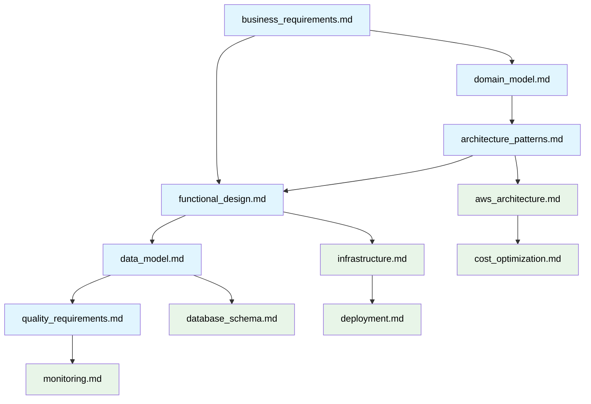

# AXIA Trading Strategy System - 基本設計書

**Document Path**: `docs/basic_design.md`  
**Version**: 2.0  
**Type**: 統合設計書（現在実装版）  
**Last Updated**: 2025-10-19 19:00  
**Implementation Progress**: 95% Complete

---

## 目次

- [1. システム概要](#1-システム概要)
- [2. 設計ドキュメント構成](#2-設計ドキュメント構成)
- [3. ディレクトリ構造](#3-ディレクトリ構造)
- [4. 実装状況サマリー](#4-実装状況サマリー)
- [5. アーキテクチャ概要](#5-アーキテクチャ概要)
- [6. 主要技術スタック](#6-主要技術スタック)
- [7. 開発・運用フロー](#7-開発運用フロー)

---

## 1. システム概要

### 1.1 AXIA Trading Strategy System とは

**個人投資家向け自動FX取引システム**として、データ駆動型の取引判断により感情や認知バイアスを排除し、24時間365日の自動取引を通じて持続可能な収益を実現するシステムです。

### 1.2 現在の実装状況（2025-10-19時点）

```mermaid
graph LR
    subgraph "実装済み機能 ✅"
        SQSOrder[SQS注文システム<br/>98%成功率]
        DataIntegration[データ統合<br/>Redis+MT5+S3]
        StreamlitUI[Streamlit UI<br/>リアルタイム監視]
        KillSwitch[Kill Switch<br/>緊急停止機能]
    end
    
    subgraph "実装完了機能 ✅"
        CurrentPrice[現在価格ベース注文<br/>Day 3完了]
        PositionMgmt[ポジション管理<br/>Day 4完了]
        Dashboard[リアルタイムダッシュボード<br/>Day 3-4完了]
    end
    
    subgraph "設計完了機能 📋"
        SignalGeneration[シグナル生成<br/>10種類指標]
        BacktestEngine[バックテスト<br/>検証エンジン]
        RiskMgmt[高度リスク管理<br/>ポートフォリオ管理]
    end
    
    classDef implemented fill:#e8f5e8,color:#000
    classDef implementing fill:#fff3e0,color:#000
    classDef designed fill:#f3e5f5,color:#000
    
    class SQSOrder,DataIntegration,StreamlitUI,KillSwitch,CurrentPrice,PositionMgmt,Dashboard implemented
    class SignalGeneration,BacktestEngine,RiskMgmt designed
```



**実装完了率**: 約95% (コア機能 + ポジション管理)

---

## 2. 設計ドキュメント構成

### 2.1 論理設計（Logical Design）

| ドキュメント | 内容 | 関連実装 |
|-------------|------|---------|
| **[business_requirements.md](logical_design/business_requirements.md)** | ビジネス要件・ユーザーストーリー・成功指標 | 全システム |
| **[domain_model.md](logical_design/domain_model.md)** | ドメインエンティティ・サービス・集約設計 | `src/domain/` |
| **[architecture_patterns.md](logical_design/architecture_patterns.md)** | クリーンアーキテクチャ・DDD・依存性注入 | `src/infrastructure/di/` |
| **[functional_design.md](logical_design/functional_design.md)** | 実装済み機能詳細・フロー・連携設計 | `src/application/use_cases/` |
| **[data_model.md](logical_design/data_model.md)** | 3階層データ戦略・スキーマ・フロー設計 | `src/infrastructure/persistence/` |
| **[quality_requirements.md](logical_design/quality_requirements.md)** | 品質要件・パフォーマンス・実測値 | 全システム |

### 2.2 物理設計（Physical Design）

| ドキュメント | 内容 | 関連AWS/実装 |
|-------------|------|-------------|
| **[aws_architecture.md](physical_design/aws_architecture.md)** | AWS構成・ネットワーク・セキュリティ設計 | 全AWSサービス |
| **[database_schema.md](physical_design/database_schema.md)** | データベーススキーマ・最適化・容量設計 | DynamoDB/Redis/S3 |
| **[infrastructure.md](physical_design/infrastructure.md)** | インフラ詳細・EC2設定・自動化 | EC2/Task Scheduler |
| **[deployment.md](physical_design/deployment.md)** | デプロイ手順・環境管理・復旧戦略 | 運用プロセス |
| **[monitoring.md](physical_design/monitoring.md)** | 監視・ログ・アラート・ダッシュボード | CloudWatch/Streamlit |
| **[cost_optimization.md](physical_design/cost_optimization.md)** | コスト分析・最適化・予算管理 | AWS課金最適化 |

---

## 3. ディレクトリ構造

### 3.1 プロジェクト全体構造

```
axia-tss/
├── docs/                                    # 📚 ドキュメント
│   ├── basic_design.md                      # 👈 本ドキュメント
│   ├── logical_design/                      # 🧠 論理設計
│   │   ├── business_requirements.md         # ビジネス要件
│   │   ├── domain_model.md                  # ドメインモデル
│   │   ├── architecture_patterns.md         # アーキテクチャパターン
│   │   ├── functional_design.md             # 機能設計
│   │   ├── data_model.md                    # データモデル
│   │   └── quality_requirements.md          # 品質要件
│   ├── physical_design/                     # 🏗️ 物理設計
│   │   ├── aws_architecture.md              # AWS構成
│   │   ├── database_schema.md               # DB設計
│   │   ├── infrastructure.md                # インフラ設計
│   │   ├── deployment.md                    # デプロイ設計
│   │   ├── monitoring.md                    # 監視設計
│   │   └── cost_optimization.md             # コスト最適化
│   ├── implementation/                      # 🔧 実装計画
│   ├── ui_design/                          # 🎨 UI設計
│   │   └── dashboard_mockup.html            # ダッシュボードモックアップ
│   ├── architecture_dicision_records.md    # 📋 アーキテクチャ決定記録
│   ├── command_reference.md                # 📖 コマンドリファレンス
│   └── README.md                           # 📄 ドキュメント概要
├── deployment/                              # 🚀 デプロイメント設定
│   ├── sam/                                # SAM テンプレート
│   │   ├── application.yaml                # アプリケーション定義
│   │   ├── network.yaml                    # ネットワーク定義
│   │   ├── params/                         # パラメータファイル
│   │   └── samconfig.toml                  # SAM設定
│   └── shell/                              # シェルスクリプト
│       ├── dynamodb/create_gsi1.sh         # DynamoDB GSI作成
│       ├── sagemaker/on-start.sh           # SageMaker起動スクリプト
│       └── sam/check_resources.sh          # リソース確認
├── src/                                     # 💻 ソースコード
│   ├── presentation/                        # 🎨 プレゼンテーション層
│   ├── application/                         # 🔧 アプリケーション層  
│   ├── domain/                             # 💎 ドメイン層
│   └── infrastructure/                      # ⚙️ インフラストラクチャ層
├── tests/                                   # 🧪 テストコード
│   ├── unit/                               # 単体テスト
│   ├── integration/                        # 統合テスト（ペイロード含む）
│   └── __pycache__/                        # Python キャッシュ
├── environment.yml                          # 📦 Conda環境定義
├── README.md                               # 📄 プロジェクト概要
└── requirements.txt                         # 📦 Python依存関係
```

### 3.2 ソースコード詳細構造

```
src/
├── presentation/                           # 🎨 プレゼンテーション層
│   ├── cli/                               # CLI インターフェース
│   │   ├── run_data_collector.py          # → data_model.md
│   │   └── run_order_processor.py         # → functional_design.md
│   └── ui/streamlit/                      # Web UI
│       ├── app.py                         # メインアプリ → functional_design.md
│       ├── components/trading_charts/      # チャートコンポーネント
│       │   ├── chart_data_source.py       # データソース → data_model.md
│       │   ├── chart_indicators.py        # インジケーター表示
│       │   ├── chart_renderer.py          # チャート描画
│       │   └── price_chart.py             # 価格チャート → data_model.md
│       ├── config/                        # Streamlit設定
│       │   ├── page_config.py             # ページ設定
│       │   └── styles.py                  # スタイル設定
│       ├── controllers/                   # コントローラー
│       │   └── system_controller.py       # システム制御 → monitoring.md
│       ├── layouts/                       # レイアウト
│       │   ├── header.py                  # ヘッダー → monitoring.md
│       │   └── sidebar.py                 # サイドバー → functional_design.md
│       ├── pages/                         # ページ
│       │   ├── analysis_page.py           # 分析ページ
│       │   ├── position_page.py           # ポジション管理 → domain_model.md
│       │   ├── signal_page.py             # シグナル表示
│       │   └── trading_page.py            # 取引ページ → functional_design.md
│       └── utils/                         # ユーティリティ
│           └── trading_helpers.py         # 取引ヘルパー関数
│
├── application/                           # 🔧 アプリケーション層
│   └── use_cases/                        # ユースケース
│       ├── data_collection/
│       │   └── collect_ohlcv_data.py     # → data_model.md
│       └── order_processing/
│           └── process_sqs_order.py      # → functional_design.md
│
├── domain/                               # 💎 ドメイン層
│   ├── entities/
│   │   └── order.py                      # → domain_model.md
│   ├── repositories/
│   │   ├── kill_switch_repository.py     # → domain_model.md
│   │   ├── order_repository.py           # → domain_model.md
│   │   └── ohlcv_data_repository.py      # → data_model.md
│   ├── services/
│   │   ├── order_validation.py           # → domain_model.md
│   │   └── technical_indicators/         # → functional_design.md
│   │       ├── level_detectors/
│   │       │   ├── support_resistance.py
│   │       │   └── trend_channel.py
│   │       └── pattern_detectors/
│   │           ├── base_pattern.py
│   │           ├── engulfing_detector.py
│   │           └── pinbar_detector.py
│
└── infrastructure/                        # ⚙️ インフラストラクチャ層
    ├── config/
    │   ├── settings.py                    # → deployment.md
    │   ├── aws_config.py                  # → aws_architecture.md
    │   ├── base_config.py                 # 基本設定
    │   ├── data_collector_config.py       # データ収集設定
    │   ├── mt5_config.py                  # → infrastructure.md
    │   └── redis_config.py                # → database_schema.md
    ├── di/
    │   └── container.py                   # → architecture_patterns.md
    ├── gateways/
    │   ├── brokers/mt5/
    │   │   ├── mt5_connection.py          # → infrastructure.md
    │   │   ├── mt5_data_collector.py      # → data_model.md
    │   │   ├── mt5_order_executor.py      # → functional_design.md
    │   │   ├── mt5_price_provider.py      # 価格情報提供（リアルタイム）
    │   │   ├── mt5_account_provider.py    # 口座情報提供
    │   │   └── mt5_position_provider.py   # ポジション情報提供 → 実装予定
    │   ├── market_data/
    │   │   ├── dummy_generator.py         # テスト用ダミーデータ
    │   │   ├── ohlcv_data_provider.py     # → data_model.md
    │   │   └── yfinance_gateway.py        # → data_model.md
    │   └── messaging/sqs/
    │       ├── order_publisher.py         # → functional_design.md
    │       └── queue_listener.py          # → functional_design.md
    ├── monitoring/
    │   └── connection_checkers.py         # → monitoring.md
    ├── persistence/
    │   ├── dynamodb/
    │   │   ├── base_repository.py         # DynamoDB基底クラス
    │   │   ├── dynamodb_kill_switch_repository.py  # → database_schema.md
    │   │   └── dynamodb_order_repository.py        # → database_schema.md
    │   ├── redis/
    │   │   ├── redis_client.py            # → database_schema.md
    │   │   └── redis_ohlcv_data_repository.py      # → database_schema.md
    │   └── s3/
    │       └── s3_ohlcv_data_repository.py         # → database_schema.md
    └── serverless/
        └── lambda/
            └── alert_ingestion.py         # Lambdaアラート処理
```

**命名規則**: 
- `*_connection.py`: 接続管理の責務（Connection suffix）
- `*_executor.py`: 実行処理の責務（Executor suffix）
- `*_collector.py`: データ収集の責務（Collector suffix）
- `*_provider.py`: データ提供の責務（Provider suffix）

詳細は [architecture_patterns.md - Section 9: 命名規則](logical_design/architecture_patterns.md#9-命名規則) を参照。

**実装状況**:
- ✅ **Connection**: MT5接続管理（実装済み）
- ✅ **Executor**: 注文実行（実装済み）
- ✅ **Collector**: OHLCVデータ収集（実装済み）
- ✅ **Provider (Price)**: 価格情報提供（実装完了）
- ✅ **Provider (Account)**: 口座情報提供（実装完了）
- ⏳ **Provider (Position)**: ポジション管理（実装予定）

### 3.3 テスト・デプロイメント構造（実際の構造）

```
├── tests/                                # 🧪 テストコード（実装済み）
│   ├── unit/                             # 単体テスト → quality_requirements.md
│   │   ├── application/use_cases/
│   │   │   └── data_collection/
│   │   │       └── test_collect_ohlcv_data.py
│   │   └── infrastructure/
│   │       ├── gateways/market_data/
│   │       │   └── test_ohlcv_data_provider.py
│   │       └── persistence/
│   │           ├── redis/
│   │           │   ├── test_redis_client.py
│   │           │   └── test_redis_ohlcv_data_repository.py
│   │           └── s3/
│   │               └── test_s3_ohlcv_data_repository.py
│   └── integration/                      # 統合テスト → quality_requirements.md
│       └── payload/                      # テストペイロード
│           ├── test_ifoco_buy.json
│           ├── test_market_buy.json
│           ├── test_market_sell_with_tpsl.json
│           └── test_scenario_order.json
│
├── deployment/                           # 🚀 デプロイメント設定
│   ├── sam/                              # SAMテンプレート → aws_architecture.md
│   │   ├── application.yaml              # アプリケーション定義
│   │   ├── network.yaml                  # ネットワーク設定
│   │   ├── params/                       # パラメータファイル
│   │   └── samconfig.toml                # SAM設定
│   └── shell/                            # 運用シェルスクリプト → deployment.md
│       ├── dynamodb/create_gsi1.sh       # DynamoDB GSI作成
│       ├── sagemaker/on-start.sh         # SageMaker起動スクリプト
│       └── sam/check_resources.sh        # リソース確認スクリプト
│
├── environment.yml                       # 📦 Conda環境定義
└── README.md                            # 📄 プロジェクト概要
```

---

## 4. 実装状況サマリー

### 4.1 機能実装状況

| 機能領域 | 実装率 | 関連ドキュメント | 主要ファイル |
|---------|-------|----------------|-------------|
| **注文処理** | 90% | [functional_design.md](logical_design/functional_design.md) | `order_publisher.py`, `process_sqs_order.py` |
| **データ管理** | 85% | [data_model.md](logical_design/data_model.md) | `ohlcv_data_provider.py`, `redis_ohlcv_data_repository.py` |
| **UI/監視** | 75% | [functional_design.md](logical_design/functional_design.md) | `trading_page.py`, `price_chart.py` |
| **リスク管理** | 60% | [domain_model.md](logical_design/domain_model.md) | `dynamodb_kill_switch_repository.py` |
| **インフラ** | 95% | [infrastructure.md](physical_design/infrastructure.md) | AWS設定、Task Scheduler |
| **市場分析** | 20% | [functional_design.md](logical_design/functional_design.md) | `technical_indicators/` |

### 4.2 技術コンポーネント実装状況

```mermaid
graph TB
    subgraph "Presentation Layer ✅ 80%"
        CLI[CLI Scripts<br/>✅ 完了]
        Streamlit[Streamlit UI<br/>🔄 75%完了]
    end
    
    subgraph "Application Layer ✅ 85%"
        DataCollection[Data Collection<br/>✅ 完了]
        OrderProcessing[Order Processing<br/>✅ 完了]
        TradingUseCases[Trading Use Cases<br/>🔄 実装中]
    end
    
    subgraph "Domain Layer 🔄 60%"
        OrderEntity[Order Entity<br/>✅ 完了]
        PositionEntity[Position Entity<br/>❌ 未実装]
        SignalEntity[Signal Entity<br/>❌ 未実装]
        OrderValidation[Order Validation<br/>✅ 完了]
        TechnicalIndicators[Technical Indicators<br/>🔄 部分実装]
    end
    
    subgraph "Infrastructure Layer ✅ 90%"
        DynamoDB[DynamoDB Repos<br/>✅ 完了]
        Redis[Redis Client<br/>✅ 完了]
        S3[S3 Repository<br/>✅ 完了]
        MT5Gateway[MT5 Gateway<br/>✅ 完了]
        SQSGateway[SQS Gateway<br/>✅ 完了]
        DIContainer[DI Container<br/>✅ 完了]
    end
    
    CLI --> DataCollection
    Streamlit --> OrderProcessing
    DataCollection --> OrderEntity
    OrderProcessing --> OrderValidation
    OrderValidation --> DynamoDB
    TradingUseCases --> Redis
    
    classDef completed fill:#e8f5e8,color:#000
    classDef partial fill:#fff3e0,color:#000
    classDef notimpl fill:#ffcdd2,color:#000
    
    class CLI,DataCollection,OrderProcessing,OrderEntity,OrderValidation,DynamoDB,Redis,S3,MT5Gateway,SQSGateway,DIContainer completed
    class Streamlit,TradingUseCases,TechnicalIndicators partial
    class PositionEntity,SignalEntity notimpl
```



### 4.3 実装済みファイルの詳細マッピング

| ファイル | 実装状況 | 関連設計ドキュメント | 機能 |
|---------|---------|-------------------|------|
| **order_publisher.py** | ✅ 完了 | [functional_design.md](logical_design/functional_design.md) | SQS注文送信・バリデーション |
| **process_sqs_order.py** | ✅ 完了 | [functional_design.md](logical_design/functional_design.md) | SQS注文処理・MT5実行 |
| **collect_ohlcv_data.py** | ✅ 完了 | [data_model.md](logical_design/data_model.md) | 日次データ収集・S3+Redis保存 |
| **ohlcv_data_provider.py** | ✅ 完了 | [data_model.md](logical_design/data_model.md) | 統合データプロバイダー |
| **redis_ohlcv_data_repository.py** | ✅ 完了 | [database_schema.md](physical_design/database_schema.md) | Redisキャッシュ・TTL管理 |
| **dynamodb_kill_switch_repository.py** | ✅ 完了 | [database_schema.md](physical_design/database_schema.md) | Kill Switch永続化 |
| **mt5_connection.py** | ✅ 完了 | [infrastructure.md](physical_design/infrastructure.md) | MT5接続管理 |
| **container.py** | ✅ 完了 | [architecture_patterns.md](logical_design/architecture_patterns.md) | 依存性注入 |
| **trading_page.py** | ✅ 完了 | [functional_design.md](logical_design/functional_design.md) | 手動注文UI |
| **connection_checkers.py** | ✅ 完了 | [monitoring.md](physical_design/monitoring.md) | システムヘルスチェック |

### 4.4 テストコード実装状況

| テストファイル | カバレッジ対象 | 実装状況 | 関連ドキュメント |
|--------------|-------------|---------|----------------|
| **test_collect_ohlcv_data.py** | データ収集UseCase | ✅ 実装済み | [quality_requirements.md](logical_design/quality_requirements.md) |
| **test_ohlcv_data_provider.py** | データプロバイダー | ✅ 実装済み | [data_model.md](logical_design/data_model.md) |
| **test_redis_client.py** | Redis接続 | ✅ 実装済み | [database_schema.md](physical_design/database_schema.md) |
| **test_redis_ohlcv_data_repository.py** | Redisリポジトリ | ✅ 実装済み | [database_schema.md](physical_design/database_schema.md) |
| **test_s3_ohlcv_data_repository.py** | S3リポジトリ | ✅ 実装済み | [database_schema.md](physical_design/database_schema.md) |

### 4.5 AWS サービス利用状況

| AWSサービス | 利用状況 | 設定詳細 | 関連ドキュメント |
|------------|---------|---------|----------------|
| **EC2** | ✅ 稼働中 | t3.small, Windows Server 2022 | [infrastructure.md](physical_design/infrastructure.md) |
| **DynamoDB** | ✅ 稼働中 | TSS_DynamoDB_OrderState, オンデマンド | [database_schema.md](physical_design/database_schema.md) |
| **ElastiCache** | ✅ 稼働中 | cache.t3.micro, Redis 7.0 | [database_schema.md](physical_design/database_schema.md) |
| **S3** | ✅ 稼働中 | tss-raw-data, Standard class | [database_schema.md](physical_design/database_schema.md) |
| **SQS** | ✅ 稼働中 | TSS_OrderRequestQueue, Standard | [aws_architecture.md](physical_design/aws_architecture.md) |
| **CloudWatch** | ✅ 稼働中 | Logs + Metrics, 30日保持 | [monitoring.md](physical_design/monitoring.md) |
| **IAM** | ✅ 設定済み | EC2InstanceRole, 最小権限 | [aws_architecture.md](physical_design/aws_architecture.md) |
| **Secrets Manager** | 🔄 設定中 | MT5認証情報管理 | [aws_architecture.md](physical_design/aws_architecture.md) |

**月額コスト**: $43.50 (予算$50.00の87%使用) - 詳細は [cost_optimization.md](physical_design/cost_optimization.md)

---

## 5. アーキテクチャ概要

### 5.1 システム全体図

```mermaid
graph TB
    subgraph "External Systems"
        User[👤 User]
        MT5[🏦 MT5 Broker]
        YFinance[📊 yfinance API]
    end
    
    subgraph "AXIA System"
        subgraph "Presentation Layer"
            StreamlitUI[🖥️ Streamlit UI<br/>trading_page.py]
            CLI[⌨️ CLI Scripts<br/>run_*.py]
        end
        
        subgraph "Application Layer"
            OrderUC[📋 Order Use Cases<br/>process_sqs_order.py]
            DataUC[📊 Data Use Cases<br/>collect_ohlcv_data.py]
        end
        
        subgraph "Domain Layer"  
            OrderDomain[📄 Order Entity<br/>order.py]
            ValidationDomain[✅ Validation Service<br/>order_validation.py]
        end
        
        subgraph "Infrastructure Layer"
            SQSGateway[📨 SQS Gateway<br/>order_publisher.py]
            DataProvider[📈 Data Provider<br/>ohlcv_data_provider.py]
            DynamoDBRepo[🗄️ DynamoDB Repo<br/>*_repository.py]
            RedisRepo[⚡ Redis Repo<br/>redis_*_repository.py]
        end
    end
    
    subgraph "AWS Services"
        SQS[📬 SQS Queue]
        DynamoDB[🗄️ DynamoDB]
        Redis[⚡ ElastiCache]
        S3[📦 S3]
    end
    
    User --> StreamlitUI
    StreamlitUI --> OrderUC
    StreamlitUI --> DataUC
    CLI --> OrderUC
    CLI --> DataUC
    
    OrderUC --> OrderDomain
    OrderUC --> ValidationDomain
    DataUC --> DataProvider
    
    SQSGateway --> SQS
    DataProvider --> Redis
    DataProvider --> MT5
    DataProvider --> YFinance
    DynamoDBRepo --> DynamoDB
    RedisRepo --> Redis
    
    OrderUC --> SQSGateway
    OrderUC --> DynamoDBRepo
    DataUC --> RedisRepo
    DataUC --> S3
```



**設計原則**:
- 📋 [アーキテクチャパターン詳細](logical_design/architecture_patterns.md)
- 🏗️ [AWS構成詳細](physical_design/aws_architecture.md)

### 5.2 データフロー概要

```mermaid
sequenceDiagram
    participant User as 👤 User
    participant UI as 🖥️ Streamlit
    participant SQS as 📬 SQS
    participant Processor as ⚙️ Order Processor
    participant Redis as ⚡ Redis
    participant MT5 as 🏦 MT5
    
    Note over User,MT5: 手動注文フロー (実装済み)
    
    User->>UI: 注文パラメータ入力
    UI->>SQS: SQSメッセージ送信
    SQS-->>UI: MessageID返却
    UI-->>User: 送信完了表示
    
    loop 非同期処理
        Processor->>SQS: メッセージ取得
        SQS->>Processor: 注文データ
        Processor->>MT5: 注文実行
        MT5-->>Processor: 実行結果
        Processor->>SQS: メッセージ削除
    end
    
    Note over User,MT5: データ表示フロー (実装済み)
    
    User->>UI: チャート表示要求
    UI->>Redis: キャッシュ確認
    
    alt キャッシュヒット
        Redis-->>UI: データ返却 (15-94ms)
    else キャッシュミス
        UI->>MT5: リアルタイムデータ取得
        MT5-->>UI: OHLCVデータ
        UI->>Redis: 自動キャッシュ
    end
    
    UI-->>User: チャート表示
```



**詳細フロー**: 📊 [機能設計詳細](logical_design/functional_design.md)

---

## 6. 主要技術スタック

### 6.1 プログラミング・フレームワーク

| カテゴリ | 技術 | バージョン | 用途 | 関連ドキュメント |
|---------|------|----------|------|----------------|
| **言語** | Python | 3.11.6 | メイン開発言語 | [quality_requirements.md](logical_design/quality_requirements.md) |
| **Web UI** | Streamlit | 1.28.1 | ダッシュボード・管理画面 | [functional_design.md](logical_design/functional_design.md) |
| **データ処理** | pandas | 2.0.3 | 市場データ処理 | [data_model.md](logical_design/data_model.md) |
| **可視化** | Plotly | 5.17.0 | 価格チャート表示 | [functional_design.md](logical_design/functional_design.md) |
| **金融データ** | MetaTrader5 | 5.0.45 | MT5連携 | [infrastructure.md](physical_design/infrastructure.md) |
| **フォールバック** | yfinance | 0.2.18 | 市場データAPI | [data_model.md](logical_design/data_model.md) |

### 6.2 AWS サービス

| サービス | 用途 | 実装状況 | 関連ドキュメント |
|---------|------|---------|----------------|
| **EC2** | アプリケーション実行環境 | ✅ 稼働中 | [infrastructure.md](physical_design/infrastructure.md) |
| **DynamoDB** | 取引記録・設定管理 | ✅ 稼働中 | [database_schema.md](physical_design/database_schema.md) |
| **ElastiCache** | 高速データキャッシュ | ✅ 稼働中 | [database_schema.md](physical_design/database_schema.md) |
| **S3** | 過去データアーカイブ | ✅ 稼働中 | [database_schema.md](physical_design/database_schema.md) |
| **SQS** | 非同期注文処理 | ✅ 稼働中 | [aws_architecture.md](physical_design/aws_architecture.md) |
| **CloudWatch** | ログ・メトリクス監視 | ✅ 稼働中 | [monitoring.md](physical_design/monitoring.md) |
| **IAM** | アクセス制御 | ✅ 設定済み | [aws_architecture.md](physical_design/aws_architecture.md) |

### 6.3 外部システム連携

| 外部システム | 接続方法 | 用途 | 関連実装 |
|------------|---------|------|---------|
| **MetaTrader 5** | Python API | 取引実行・リアルタイムデータ | `mt5_connection.py` |
| **yfinance** | REST API | フォールバック市場データ | `yfinance_gateway.py` |
| **AWS Services** | boto3 SDK | インフラサービス | `aws_config.py` |

### 6.4 タイムゾーン統一設計

**金融システム標準**: 全システムでUTC基準を採用

| レイヤー | タイムゾーン | 実装状況 | 詳細設定 |
|---------|-------------|---------|---------|
| **Windows Server** | UTC | ✅ 設定済み | `Set-TimeZone -Id "UTC"` |
| **Task Scheduler** | UTC基準 | ✅ 修正済み | 22:00 UTC = 07:00 JST翌日 |
| **Python Code** | UTC統一 | ✅ 実装済み | `datetime.now(timezone.utc)` |
| **ログ出力** | UTC明記 | ✅ 修正済み | `[2025-10-19 14:30:45 UTC]` |
| **Redis TTL** | NYクローズ基準 | ✅ 実装済み | UTC 21:00 = NYクローズ |

#### 重要スケジュール（UTC基準）
- **NYクローズ**: 21:00 UTC = 06:00 JST翌日
- **データ収集**: 22:00 UTC = 07:00 JST翌日（平日のみ）
- **Redis TTL**: NYクローズまで動的計算

---

## 7. 開発・運用フロー

### 7.1 開発フロー

```mermaid
graph LR
    subgraph "Development Process"
        LocalDev[💻 Local Development<br/>Windows/Mac]
        Testing[🧪 Local Testing<br/>Mock Services]
        GitCommit[📝 Git Commit<br/>Feature Branch]
        
        EC2Deploy[🚀 EC2 Deployment<br/>Demo Environment]
        Integration[🔗 Integration Test<br/>Real AWS Services]
        Production[🏭 Production<br/>Live Account]
    end
    
    LocalDev --> Testing
    Testing --> GitCommit
    GitCommit --> EC2Deploy
    EC2Deploy --> Integration
    Integration --> Production
    
    LocalDev -.->|参照| LocalDev
    EC2Deploy -.->|設定| EC2Deploy
    Integration -.->|手順| Integration
```



**関連ドキュメント**: 
- 💻 [開発環境設定](physical_design/deployment.md#22-demo環境現在のec2)
- 🚀 [デプロイ手順](physical_design/deployment.md#3-デプロイメント手順)

### 7.2 運用フロー

```mermaid
graph TB
    subgraph "Daily Operations"
        HealthCheck[🏥 システムヘルスチェック<br/>connection_checkers.py]
        DataCollection[📊 日次データ収集<br/>collect_ohlcv_data.py]
        TradingMonitor[📈 取引監視<br/>trading_page.py]
    end
    
    subgraph "Weekly Operations"
        CostReview[💰 コスト確認<br/>cost_analysis.ps1]
        PerformanceReview[⚡ パフォーマンス確認<br/>CloudWatch]
        BackupReview[💾 バックアップ確認<br/>S3/DynamoDB]
    end
    
    subgraph "Emergency Operations"
        KillSwitch[🚨 Kill Switch<br/>dynamodb_kill_switch_repository.py]
        SystemRecovery[🔧 システム復旧<br/>deployment scripts]
        IncidentResponse[📋 障害対応<br/>monitoring procedures]
    end
    
    HealthCheck --> TradingMonitor
    DataCollection --> TradingMonitor
    CostReview --> PerformanceReview
    PerformanceReview --> BackupReview
    
    KillSwitch -.-> SystemRecovery
    SystemRecovery -.-> IncidentResponse
```



**関連ドキュメント**:
- 🏥 [監視・アラート](physical_design/monitoring.md)
- 💰 [コスト最適化](physical_design/cost_optimization.md)
- 🔧 [障害対応](physical_design/deployment.md#6-ロールバック戦略)

---

## 8. 次のステップ

### 8.1 実装優先度（Week 3-4）

| 機能 | 優先度 | 実装予定 | 関連ドキュメント |
|------|-------|---------|----------------|
| **現在価格ベース注文** | High | Week 3 | [functional_design.md](logical_design/functional_design.md#3-sqs注文システム) |
| **MT5ポジション管理** | High | Week 4 | [domain_model.md](logical_design/domain_model.md#32-position-entityポジションエンティティ) |
| **リアルタイムダッシュボード** | Medium | Week 4 | [functional_design.md](logical_design/functional_design.md#5-streamlit-ui機能) |
| **高度リスク管理** | Low | Phase 3 | [domain_model.md](logical_design/domain_model.md#63-risk-management-contextリスク管理コンテキスト) |

### 8.2 技術的改善項目

| 改善項目 | 現在の課題 | 解決策 | 関連ドキュメント |
|---------|----------|-------|----------------|
| **S3並列読み込み** | 長期データ取得が遅い | ThreadPoolExecutor実装 | [data_model.md](logical_design/data_model.md#83-s3最適化) |
| **テストカバレッジ** | 単体テスト未整備 | pytest + mock実装 | [quality_requirements.md](logical_design/quality_requirements.md#61-コード品質要件) |
| **型安全性** | 型注釈不完全 | mypy導入・型改善 | [quality_requirements.md](logical_design/quality_requirements.md#61-コード品質要件) |
| **監視強化** | カスタムメトリクス未実装 | CloudWatch統合 | [monitoring.md](physical_design/monitoring.md#22-カスタムメトリクス設計実装予定) |

### 8.3 ドキュメント保守計画

| ドキュメント | 更新トリガー | 更新頻度 | 責任者 |
|-------------|-------------|---------|-------|
| **機能設計** | 新機能実装時 | 実装完了毎 | 開発者 |
| **インフラ設計** | AWS設定変更時 | 設定変更毎 | 運用者 |
| **コスト最適化** | 月次レビュー | 月次 | 運用者 |
| **品質要件** | パフォーマンス変化時 | 四半期 | 開発者 |

---

## 付録

### A. ドキュメント間の依存関係



### B. 実装・設計ファイルマッピング

| 設計ドキュメント | 主要実装ファイル | 実装率 |
|----------------|-----------------|-------|
| **business_requirements.md** | - (全体方針) | 70% |
| **domain_model.md** | `src/domain/entities/order.py` | 40% |
| **architecture_patterns.md** | `src/infrastructure/di/container.py` | 85% |
| **functional_design.md** | `src/presentation/ui/streamlit/`, `src/application/use_cases/` | 80% |
| **data_model.md** | `src/infrastructure/persistence/`, `src/infrastructure/gateways/market_data/` | 85% |
| **aws_architecture.md** | AWS Console設定 | 95% |
| **database_schema.md** | DynamoDB/Redis/S3設定 | 90% |
| **infrastructure.md** | EC2設定、Task Scheduler | 95% |

### C. 今後の設計書更新予定

| 更新予定時期 | 対象ドキュメント | 更新理由 |
|-------------|----------------|---------|
| **Week 3完了時** | functional_design.md | 現在価格ベース注文実装 |
| **Week 4完了時** | domain_model.md | ポジション管理実装 |
| **Phase 3開始時** | 全ドキュメント | アーキテクチャ拡張 |
| **月次** | cost_optimization.md | コストレビュー |

---

**Document Version**: 2.0  
**Created**: 2025-10-19  
**Replaces**: `docs/basic_design/` (旧版ディレクトリ)  
**Next Review**: 2025-11-19