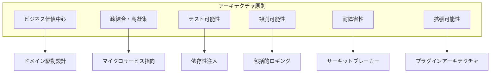
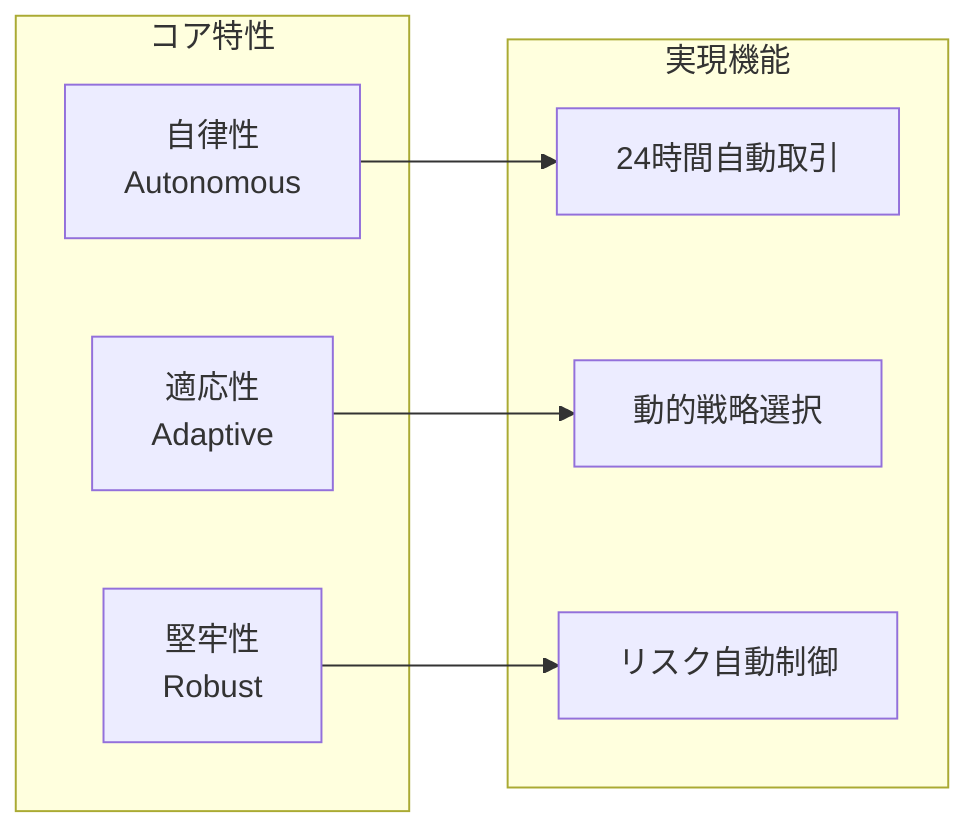
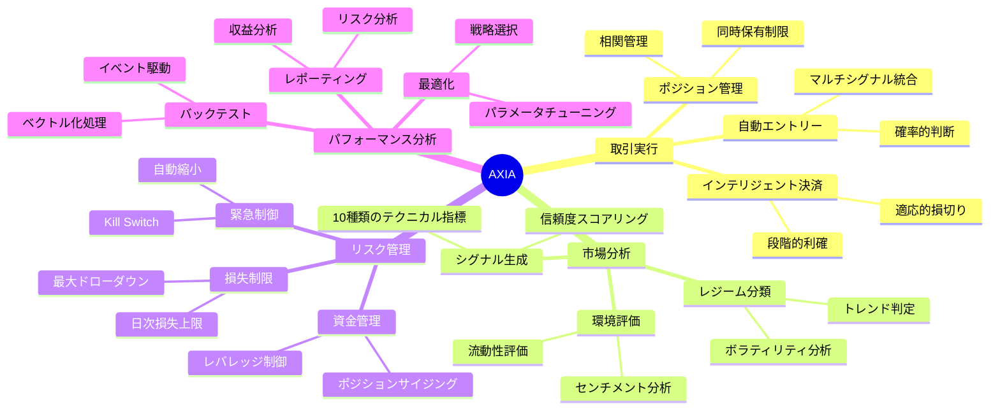
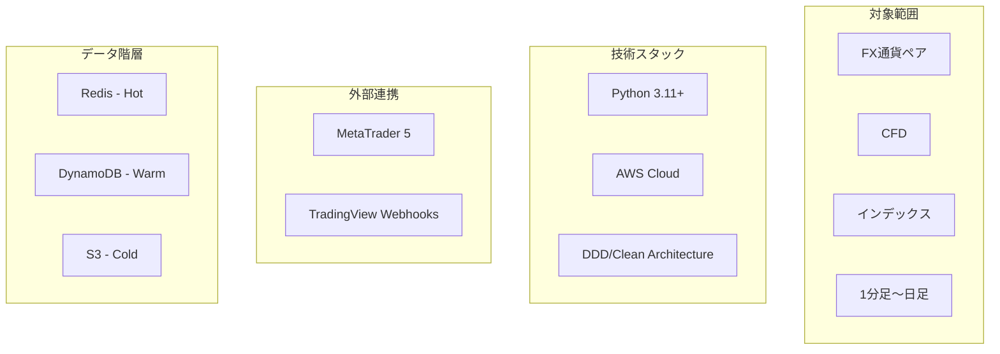

# システム概要

**Document Path**: `docs/basic_design/01_overview.md`  
**Version**: 2.0  
**Type**: システム概要書

---
## 目次

- [システム概要](#システム概要)
  - [目次](#目次)
  - [1. システム概要](#1-システム概要)
    - [1.1 ビジョンとミッション](#11-ビジョンとミッション)
      - [ビジョン](#ビジョン)
      - [ミッション](#ミッション)
    - [1.2 システムアーキテクチャ原則](#12-システムアーキテクチャ原則)
    - [1.3 システム特性](#13-システム特性)
    - [1.4 主要機能](#14-主要機能)
      - [1.4.1 自動取引機能](#141-自動取引機能)
      - [1.4.2 市場分析機能](#142-市場分析機能)
      - [1.4.3 リスク管理機能](#143-リスク管理機能)
      - [1.4.4 バックテスト機能](#144-バックテスト機能)
      - [1.4.5 データ管理機能](#145-データ管理機能)
    - [1.5 主要機能マップ](#15-主要機能マップ)
    - [1.6 価値提案](#16-価値提案)
    - [1.7 スコープと制約](#17-スコープと制約)
      - [1.7.1 対象金融商品・時間足](#171-対象金融商品時間足)
      - [1.7.2 技術的前提条件](#172-技術的前提条件)
      - [1.7.3 外部システム依存](#173-外部システム依存)
    - [1.8 システムスコープ図](#18-システムスコープ図)

## 1. システム概要

### 1.1 ビジョンとミッション

#### ビジョン
市場の複雑性と不確実性に対して、データ駆動型の意思決定と継続的な学習により、持続可能な収益を実現する自律型取引システムのリファレンスアーキテクチャとなる。

#### ミッション
- 感情や認知バイアスを排除した、純粋に論理的な取引判断の実現
- 24時間365日の市場機会を逃さない完全自動取引の提供
- 市場環境の変化に動的に適応する知的な取引戦略の実装
- リスク管理を最優先とした資産保全メカニズムの確立

### 1.2 システムアーキテクチャ原則

1. **ビジネス価値中心**: 技術ではなくビジネス価値を中心に設計
2. **疎結合・高凝集**: コンポーネント間の依存を最小化し、責務を明確化
3. **テスト可能性**: 全てのビジネスロジックが独立してテスト可能
4. **観測可能性**: システムの状態と振る舞いが常に監視・分析可能
5. **耐障害性**: 部分的な障害がシステム全体に波及しない設計
6. **拡張可能性**: 新機能追加が既存機能に影響を与えない構造

### 1.3 システム特性

### 1.4 主要機能

本システムは、以下の5つの主要機能群から構成される。

#### 1.4.1 自動取引機能

システムの根幹をなす機能。市場分析機能からの情報に基づき、エントリーから決済までの一連の取引プロセスを自律的に実行する。

- **シグナル統合とエントリー判断**: 複数のシグナルを統合的に評価し、確率的優位性（ベイズ推論）に基づいてエントリーを決定する。
- **動的なポジション管理**: 市場のボラティリティやトレンドに応じて、ポジションサイズや利食い/損切りラインを動的に調整する。
- **インテリジェントな決済ロジック**: 単純な価格到達だけでなく、市場環境の変化やシグナルの減衰を検知し、最適なタイミングで決済を実行する。

#### 1.4.2 市場分析機能

リアルタイムおよびヒストリカルデータを分析し、取引判断の基礎となる洞察を生成する。

- **市場レジーム分類**: 現在の市場がトレンド相場かレンジ相場かを自動で分類する。
- **マルチタイムフレーム分析**: 長期・中期・短期の時間足を横断的に分析し、市場の全体構造を把握する。
- **環境スコアリング**: 複数のテクニカル指標を統合し、現在の市場環境の有利・不利を数値化（スコアリング）する。
- **通貨強弱分析**: 主要8通貨の相対的強弱を対数変化率により計算し、強弱乖離度に基づき最適通貨ペアを自動選択する。

#### 1.4.3 リスク管理機能

システムの安定稼働と資産の保護を目的としたセーフティ機能群。

- **緊急停止機能（Kill Switch）**: 手動またはシステム的な閾値超過により、全ての取引活動を即座に停止する。
- **ドローダウン管理**: 口座全体のドローダウンを常に監視し、設定された閾値を超えた場合に自動でポジションを縮小またはクローズする。
- **ポジションサイズ制御**: 許容リスクに基づき、各取引のポジションサイズを自動で計算・制限する。

#### 1.4.4 バックテスト機能

過去のデータを用いて取引戦略の有効性を検証し、最適化するための機能。

- **高速な検証エンジン**: ベクトル化処理とイベントドリブン処理の両方に対応し、大規模なデータセットに対しても高速なバックテストを実行する。
- **詳細なパフォーマンス分析**: シャープレシオ、最大ドローダウン、プロフィットファクターなど、多角的な指標を用いて戦略を評価する。
- **可視化レポート**: 取引履歴や資産曲線をインタラクティブなチャートで可視化し、直感的な分析を支援する。

#### 1.4.5 データ管理機能

システムの全機能が必要とするデータを効率的かつ安定的に供給する基盤機能。

- **3階層データストア**: リアルタイム性、信頼性、コストの要件に応じて、Redis（ホット）、DynamoDB（ウォーム）、S3（コールド）の3層でデータを管理する。
- **データ収集とクレンジング**: 外部APIから市場データを取得し、欠損値の補完や異常値の除去を行う。
- **状態管理**: システム全体の最新の状態（ポジション、注文状況など）を一元的に管理し、各コンポーネントに提供する。

### 1.5 主要機能マップ

### 1.6 価値提案

| 領域 | 従来の課題 | AXIAの解決策 | 提供価値 |
|------|------------|--------------|----------|
| **判断品質** | 感情的・衝動的な取引判断 | データ駆動型の論理的判断 | 一貫性のある高品質な意思決定 |
| **市場カバレッジ** | 限定的な監視時間 | 24時間365日の自動監視 | 機会損失の最小化 |
| **戦略適応** | 固定的な取引ルール | 動的な戦略選択メカニズム | 市場環境への最適な適応 |
| **リスク管理** | 手動での損切り判断 | 自動リスク制御システム | 確実な資産保全 |
| **分析能力** | 限定的なバックテスト | 包括的な検証フレームワーク | 戦略の科学的検証 |

### 1.7 スコープと制約

#### 1.7.1 対象金融商品・時間足

- **対象範囲**: MT5ブローカーが提供する全ての金融商品（FX通貨ペア、CFD、インデックス等）。具体的な対象は設定ファイル (config.yml) により定義され、動的な追加・変更が可能である。
- **対象外**: MT5ブローカーで取り扱いのない金融商品。
- **時間足**: マルチタイムフレーム分析を前提とし、1分足（M1）から日足（D1）まで、設定ファイルで定義された複数の時間足に対応する。

#### 1.7.2 技術的前提条件

- **クラウドプロバイダー**: AWSを全面的に採用する。他のクラウドプラットフォームへの対応は考慮しない。
- **開発言語**: Python 3.11以上を標準開発言語とする。
- **実行環境**: EC2を主要な本番実行環境とし、分析・開発環境としてSageMakerを利用する。一部機能はLambdaによるサーバレス実行も活用する。
- **データベース**: 3階層データ戦略に基づき、Redis, DynamoDB, S3を要件に応じて使い分けることを前提とする。

#### 1.7.3 外部システム依存

- **取引ブローカー**: MetaTrader 5 (MT5) との連携を必須とする。注文執行、ポジション管理、口座情報の取得はすべてMT5のPython連携ライブラリ経由で行う。MT5以外のブローカーAPIへの対応はスコープ外とする。
- **シグナルソース**:
  - **自律取引**: 本システムの自動取引機能は、内部の市場分析ロジックに基づきシグナルを自律的に生成するものであり、外部のシグナルソースには依存しない。
  - **裁量取引支援**: TradingViewのアラートをWebhook経由で受信する機能は、あくまで裁量取引の判断支援や通知を目的としたものであり、自動取引サイクルとは独立している。
- **可用性の制約**: 上記外部システムの障害やメンテナンス、API仕様の変更は、本システムの稼働に直接的な影響を与える可能性がある。

### 1.8 システムスコープ図

