# アーキテクチャ設計

**Document Path**: `docs/basic_design/02_architecture.md`  
**Version**: 2.0  
**Type**: アーキテクチャ設計書

---
## 目次

- [アーキテクチャ設計](#アーキテクチャ設計)
  - [目次](#目次)
  - [2. アーキテクチャ設計](#2-アーキテクチャ設計)
    - [2.1 設計方針](#21-設計方針)
      - [2.1.1 基本設計思想](#211-基本設計思想)
      - [2.1.2 クリーンアーキテクチャ＆ドメイン駆動設計の採用](#212-クリーンアーキテクチャドメイン駆動設計の採用)
      - [2.1.3 段階的実装アプローチ](#213-段階的実装アプローチ)
        - [Phase 1: 基盤構築とMVP（Minimum Viable Product）](#phase-1-基盤構築とmvpminimum-viable-product)
        - [Phase 2: 高度化と最適化](#phase-2-高度化と最適化)
        - [Phase 3: マルチアセット対応とスケーラビリティ](#phase-3-マルチアセット対応とスケーラビリティ)
        - [Phase 4: AI/ML統合と完全自動化](#phase-4-aiml統合と完全自動化)
    - [2.2 アーキテクチャ概要](#22-アーキテクチャ概要)
    - [2.3 レイヤー構成](#23-レイヤー構成)
      - [2.3.1 Presentation層](#231-presentation層)
      - [2.3.2 Application層](#232-application層)
      - [2.3.3 Domain層](#233-domain層)
      - [2.3.4 Infrastructure層](#234-infrastructure層)
    - [2.4 レイヤード・アーキテクチャ](#24-レイヤードアーキテクチャ)
      - [レイヤーの責務](#レイヤーの責務)
    - [2.5 ヘキサゴナル・アーキテクチャ視点](#25-ヘキサゴナルアーキテクチャ視点)
    - [2.6 コンポーネント構成](#26-コンポーネント構成)
    - [2.7 イベント駆動アーキテクチャ](#27-イベント駆動アーキテクチャ)
    - [2.8 データフロー・アーキテクチャ](#28-データフローアーキテクチャ)
      - [2.8.1 基本データフロー](#281-基本データフロー)
      - [2.8.2 通貨強弱分析フロー](#282-通貨強弱分析フロー)
    - [2.9 ディレクトリ構造](#29-ディレクトリ構造)
      - [レイヤー別の詳細構造](#レイヤー別の詳細構造)
    - [2.10 依存性注入とインターフェース設計](#210-依存性注入とインターフェース設計)
      - [依存関係の原則](#依存関係の原則)
      - [インターフェース定義例](#インターフェース定義例)
    - [2.11 ドメインモデル](#211-ドメインモデル)
    - [2.12 システム責務領域](#212-システム責務領域)
      - [コンテキスト間の関係性](#コンテキスト間の関係性)
    - [2.13 イベントソーシング設計](#213-イベントソーシング設計)
      - [主要ドメインイベント](#主要ドメインイベント)

## 2. アーキテクチャ設計

### 2.1 設計方針

#### 2.1.1 基本設計思想

本システムのアーキテクチャは、以下の4つの基本思想に基づき設計される。

- **耐障害性と迅速な復旧 (Fault Tolerance & Fast Recovery)**: 個人プロジェクトとしてのコスト制約を前提に、単一のEC2インスタンスでの運用を基本とする。その上で、アプリケーションの状態をRedisやDynamoDBといった外部のマネージドサービスに保持することで、インスタンス自体をステートレスに保つ。これにより、インスタンス障害が発生した場合でも、CloudWatchアラームによる自動再起動などを通じて、状態を失うことなく迅速にサービスを復旧させることを目指す。

- **保守性・拡張性 (Maintainability & Scalability)**: ドメイン駆動設計（DDD）とクリーンアーキテクチャを採用し、ビジネスロジックと技術的詳細を明確に分離する。これにより、将来的な仕様変更や機能追加が容易で、テストコードが書きやすい構造を維持する。

- **パフォーマンス (Performance)**: 3階層データ戦略を導入し、データのアクセス頻度と求められる応答速度に応じて最適なデータストア（Redis, DynamoDB, S3）を選択する。特にリアルタイム取引エンジンは、Redis上のホットデータのみを参照することで、意思決定のレイテンシを最小化する。

- **コスト効率 (Cost-Effectiveness)**: 全てのヒストリカルデータは安価なS3に保管し、EC2インスタンスは必要最低限のスペックで運用を開始する。CloudWatchによるリソース監視とコストアラートを設定し、継続的なコスト最適化を行う。

#### 2.1.2 クリーンアーキテクチャ＆ドメイン駆動設計の採用

システムの複雑性を管理し、ビジネスの本質的な価値（=取引戦略）に集中するため、クリーンアーキテクチャとドメイン駆動設計（DDD）を全面的に採用する。

- **関心の分離**: システムをPresentation, Application, Domain, Infrastructureの4つの主要なレイヤーに分割し、依存関係の方向を外部のレイヤーから内部のレイヤー（Presentation -> Application -> Domain）に限定する（依存性逆転の原則）。

- **ドメイン中心設計**: 最も重要なビジネスロジックとルールはDomainレイヤーに集約し、フレームワークやデータベースなどの技術的詳細から完全に独立させる。これにより、ドメインロジックの純粋性が保たれ、単体テストが極めて容易になる。

- **インターフェースによる疎結合**: レイヤー間のやり取りは、Application層またはDomain層で定義されたインターフェース（抽象基底クラス）を介して行い、具象クラスへの直接的な依存を排除する。

#### 2.1.3 段階的実装アプローチ

プロジェクト全体を通して、アジャイルな思想に基づいた段階的な実装アプローチを採用する。各フェーズは前フェーズの成果を基盤として、システムを段階的に高度化していく。

##### Phase 1: 基盤構築とMVP（Minimum Viable Product）
- **目標**: コアアーキテクチャの確立と基本機能の実装
- **主要成果物**:
  - **インフラ基盤**: AWS環境構築（EC2, S3, DynamoDB, Redis）
  - **データ収集**: MT5連携によるOHLCVデータ取得・保存（standard_ohlcv_format）
  - **ドメインモデル**: Position, Trade, Signal等の基本エンティティ実装
  - **シグナル生成**: 10種類のテクニカル指標実装（RSI, MACD等）
  - **リスク管理**: Kill Switch実装（日次損失上限2%）
  - **取引実行**: 単一通貨ペア（USDJPY）での自動取引

##### Phase 2: 高度化と最適化
- **目標**: 市場適応力の向上と取引戦略の洗練
- **主要成果物**:
  - **市場分析**: MarketRegimeClassifierによる市場状態判定
  - **動的戦略**: MetaStrategyControllerによる時間足自動選択
  - **通貨強弱分析**: Currency Strength Calculator実装
  - **確率的エントリー**: ベイズ推論による取引判断
  - **バックテスト**: Vectorized, Event-Driven Backtestエンジン追加
  - **パフォーマンス分析**: Sharpe Ratio、ドローダウン分析
  - **UI/UX**: Streamlitダッシュボード実装

##### Phase 3: マルチアセット対応とスケーラビリティ
- **目標**: 複数通貨ペアの並列取引とシステムの拡張性確保
- **主要成果物**:
  - **マルチシンボル**: 最大3通貨ペアの自動選択・並列実行
  - **ポートフォリオ管理**: 相関リスク考慮した動的リスク配分
  - **分散処理**: SQS/SNSによる非同期処理アーキテクチャ
  - **キャッシュ戦略**: 3層キャッシュ（L1:Memory, L2:Redis, L3:DynamoDB）
  - **監視強化**: CloudWatchダッシュボード、Slack通知
  - **A/Bテスト**: 戦略比較フレームワーク実装
  - **API化**: REST API経由での外部連携

##### Phase 4: AI/ML統合と完全自動化
- **目標**: 機械学習による予測精度向上と完全自動運用
- **主要成果物**:
  - **ML予測モデル**: SageMakerによる価格予測モデル統合
  - **強化学習**: パラメータ最適化エージェント
  - **異常検知**: 市場異常パターンの自動検出
  - **自己修復**: 障害時の自動復旧メカニズム
  - **動的スケーリング**: 市場ボラティリティに応じたリソース調整
  - **レポート自動化**: 日次/週次/月次レポートの自動生成・配信
  - **コンプライアンス**: 取引監査ログ、規制対応

### 2.2 アーキテクチャ概要

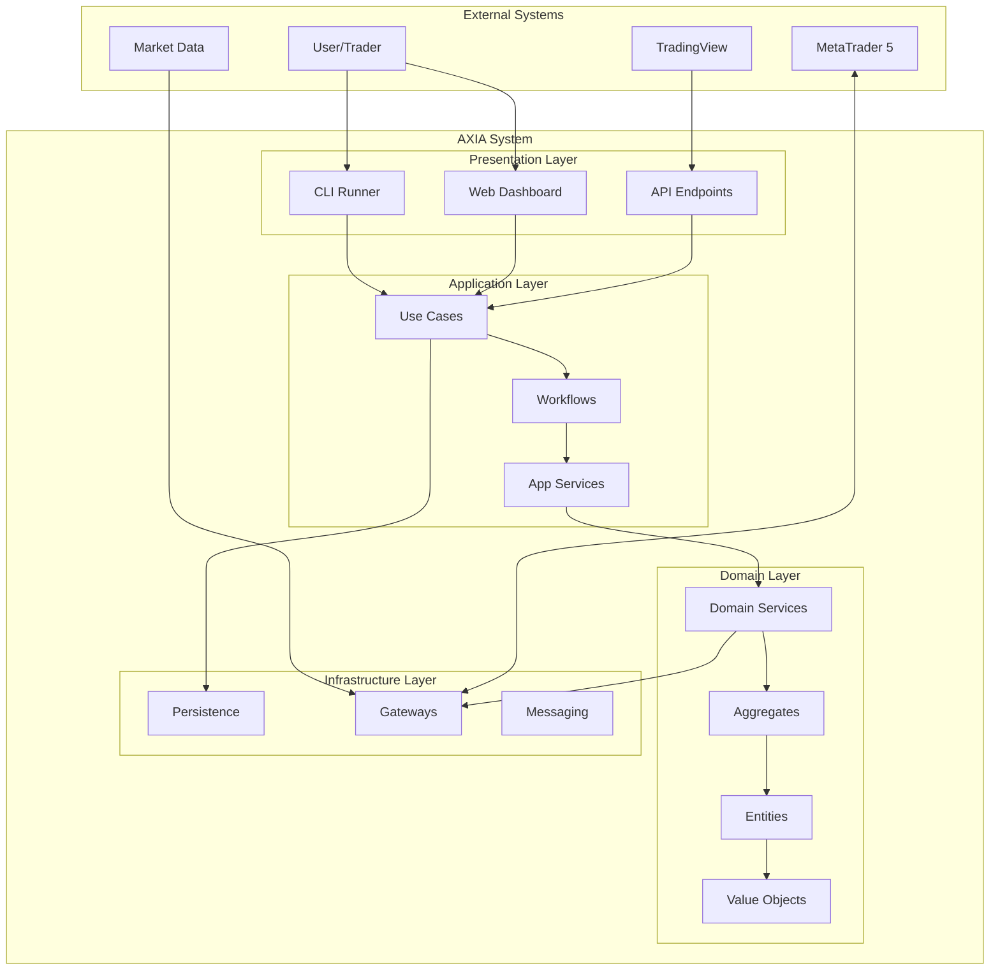

### 2.3 レイヤー構成

本システムは、クリーンアーキテクチャに基づき、以下の4つのレイヤーで構成される。

#### 2.3.1 Presentation層

ユーザーや外部システムとの接点となり、リクエストを受け付けてApplication層に処理を委譲し、結果を返す責務を持つ。本システムでは以下の要素が該当する。

- **実行スクリプト (src/presentation/cli/runners/)**: 各種プロセス（取引エンジン、データ収集等）を起動するためのエントリーポイント。CUIに相当する。
- **Webダッシュボード (src/presentation/ui/streamlit/)**: システムの状態を可視化し、手動操作（緊急停止など）を受け付けるためのGUI。
- **Lambdaハンドラ (src/infrastructure/serverless/lambda/handlers/)**: 外部からのWebhookリクエスト（TradingViewアラート等）を受け付けるAPIエンドポイント。

#### 2.3.2 Application層

システムのユースケースを実装する層。ドメインオブジェクトやサービスを協調させて、具体的なアプリケーションの振る舞いを定義する。ドメインロジックそのものは含まず、あくまでドメイン層の「指揮者」としての役割を担う。

- **ユースケースの実装**: 「バックテストを実行する」「取引注文を処理する」といったシステムの具体的な機能を提供する。
- **インターフェースの定義**: Infrastructure層が実装すべきリポジトリや外部サービスのインターフェース（抽象基底クラス）を定義する。

#### 2.3.3 Domain層

システムの最もコアな部分。ビジネスの概念、ルール、ロジックを表現するオブジェクト（エンティティ、値オブジェクト、ドメインサービス）が集約される。このレイヤーは、他のどのレイヤーにも依存しない、純粋なビジネスロジックの集合体である。

- **エンティティと値オブジェクト**: Trade, Position, Signalなど、ビジネス上の重要な概念をモデル化する。
- **ドメインサービス**: 特定のエンティティに属さない、ドメイン固有の計算やロジック（例：リスク計算、シグナル統合評価）を実装する。
- **リポジトリのインターフェース定義**: データの永続化に関するインターフェース（抽象）を定義する。

#### 2.3.4 Infrastructure層

データベース、外部API、メッセージングキューなど、技術的な詳細を実装する層。Application層およびDomain層で定義されたインターフェースを具象クラスとして実装し、システムと外部世界を接続する。

- **永続化の実装**: DynamoDB, Redis, S3へのデータ読み書きを行うリポジトリを実装する。
- **外部API連携**: MT5ブローカーとの通信や、AWSサービス（SQS, CloudWatch）との連携を行うクライアントを実装する。
- **設定ファイルの読み込み**: config/ディレクトリから設定情報を読み込み、システム全体に提供する。

### 2.4 レイヤード・アーキテクチャ

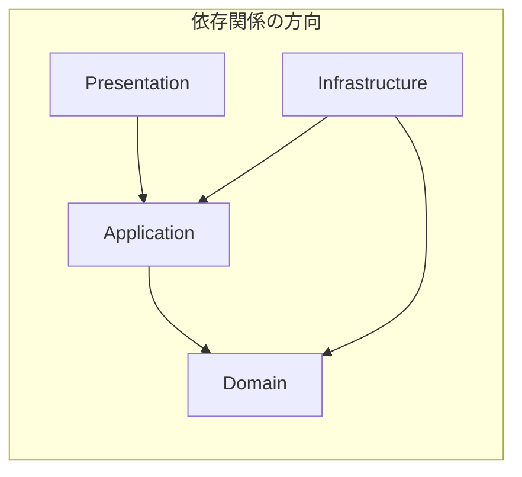

#### レイヤーの責務

| レイヤー | 責務 | 主要コンポーネント | 依存方向 |
|---------|------|-------------------|----------|
| **Presentation** | ユーザー/外部システムとのインターフェース | CLI, Web UI, REST API | → Application |
| **Application** | ユースケースの実装とワークフロー制御 | Use Cases, Workflows, Services | → Domain |
| **Domain** | ビジネスロジックとルールの表現 | Entities, Value Objects, Aggregates | 依存なし |
| **Infrastructure** | 技術的詳細の実装 | Repositories, Gateways, Adapters | → Domain, Application |

### 2.5 ヘキサゴナル・アーキテクチャ視点

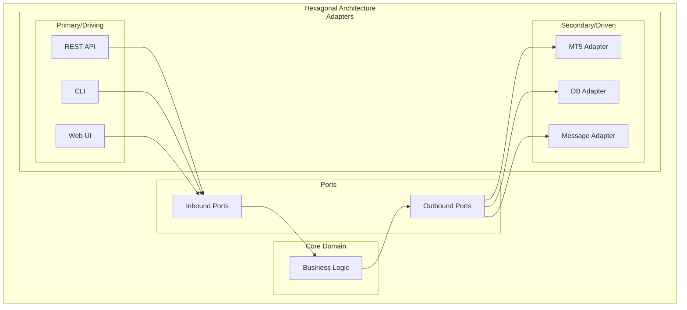

### 2.6 コンポーネント構成

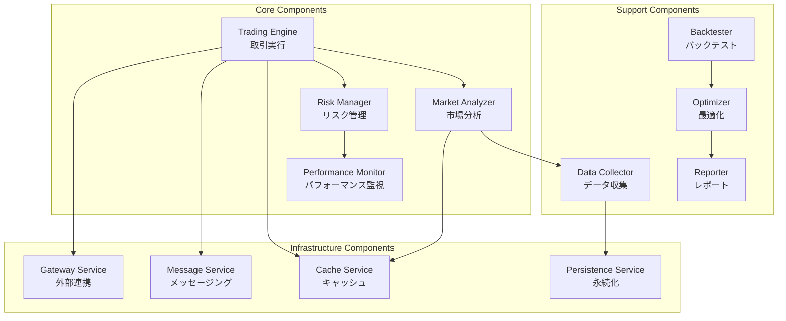

### 2.7 イベント駆動アーキテクチャ

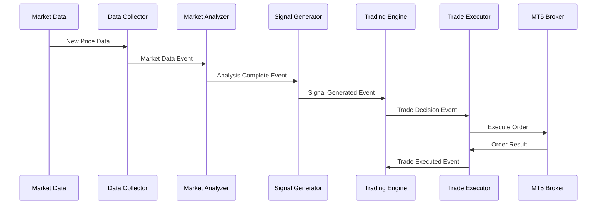

### 2.8 データフロー・アーキテクチャ

#### 2.8.1 基本データフロー

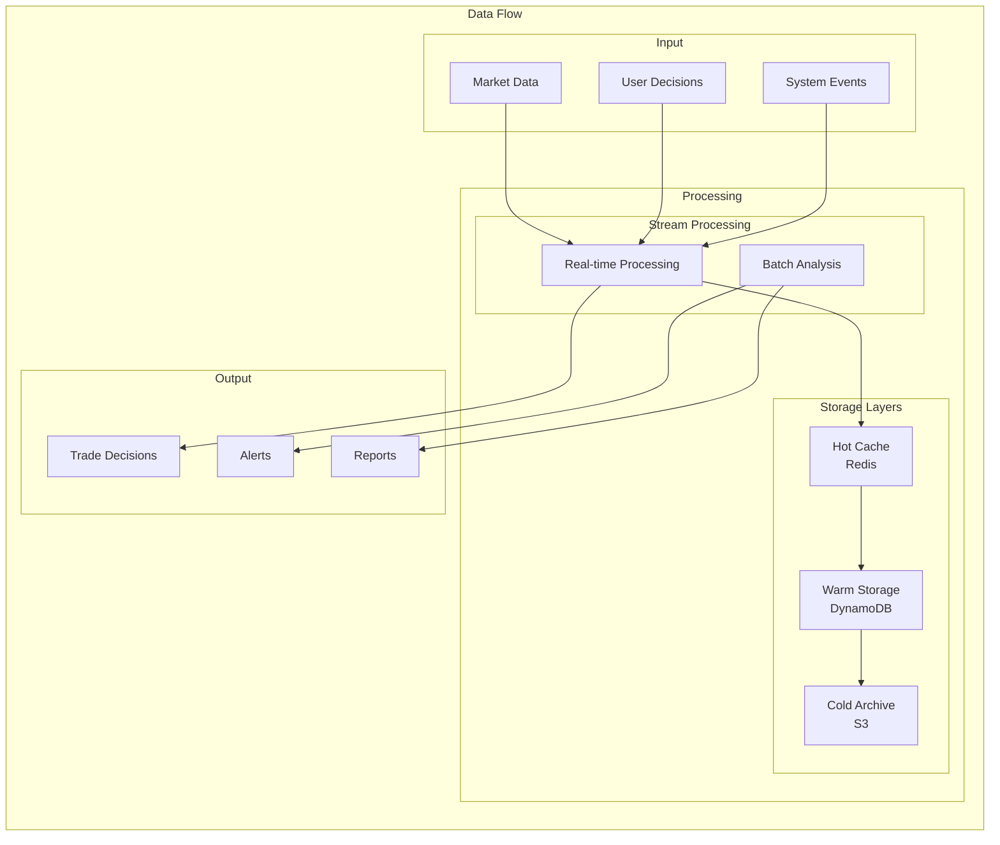

#### 2.8.2 通貨強弱分析フロー

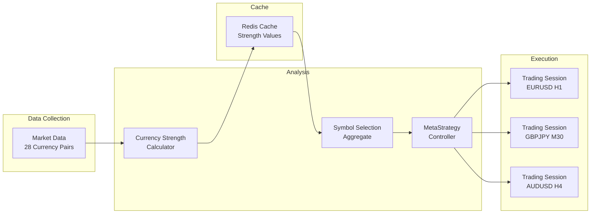

### 2.9 ディレクトリ構造

```
TradingStrategySystem/
├── data/                      # データディレクトリ
│   ├── historical/
│   ├── backtest_results/
│   └── cache/
├── deployment/                # デプロイメント
│   ├── sam/
│   └── scripts/
├── docs/                      # ドキュメント
│   ├── api/
│   ├── architecture/
│   └── project_management/
├── notebooks/                 # Jupyterノートブック
│   ├── sandbox/
│   ├── experiments/
│   ├── reports/
│   └── archive/
├── scripts/                   # ユーティリティスクリプト
│   ├── forex_tester_importer/
│   └── tradingview/
├── src/                       # ソースコード
│   ├── shared/                # 共通基盤
│   │   ├── exceptions/
│   │   ├── constants/
│   │   └── utils/
│   │
│   ├── presentation/          # 🎨 プレゼンテーション層
│   │   ├── api/               # API インターフェース
│   │   │   ├── rest/
│   │   │   │   ├── controllers/
│   │   │   │   ├── schemas/
│   │   │   │   └── middleware/
│   │   │   └── websocket/
│   │   ├── ui/                # UI インターフェース
│   │   │   └── streamlit/
│   │   ├── cli/               # CLI インターフェース
│   │   │   ├── commands/
│   │   │   ├── formatters/
│   │   │   └── runners/
│   │   └── dto/               # データ転送オブジェクト
│   │       ├── requests/
│   │       └── responses/
│   │
│   ├── application/           # 🔧 アプリケーション層
│   │   ├── use_cases/
│   │   │   ├── trading/
│   │   │   ├── analysis/
│   │   │   ├── backtesting/
│   │   │   └── monitoring/
│   │   ├── workflows/
│   │   │   ├── autonomous_trading_workflow.py
│   │   │   ├── backtest_workflow.py
│   │   │   └── analysis_workflow.py
│   │   └── services/
│   │       ├── coordination/
│   │       └── transformation/
│   │
│   ├── domain/                # 💎 ドメイン層
│   │   ├── core/              # Bounded Context定義
│   │   ├── aggregates/        # 集約
│   │   │   ├── trading/
│   │   │   ├── analysis/
│   │   │   └── strategy/
│   │   ├── entities/          # エンティティ
│   │   ├── value_objects/     # 値オブジェクト
│   │   │   ├── money/
│   │   │   ├── time/
│   │   │   ├── probability/
│   │   │   ├── currency/
│   │   │   ├── market/
│   │   │   └── signals/
│   │   ├── services/          # ドメインサービス
│   │   │   ├── domain_services/
│   │   │   ├── application_services/
│   │   │   ├── currency_analysis/
│   │   │   └── signal_generators/
│   │   │       ├── interfaces/
│   │   │       ├── oscillators/
│   │   │       ├── trend/
│   │   │       ├── volatility/
│   │   │       └── market_structure/
│   │   ├── repositories/      # リポジトリインターフェース
│   │   │   ├── trading/
│   │   │   ├── analysis/
│   │   │   └── strategy/
│   │   ├── events/            # ドメインイベント
│   │   │   ├── event_sourcing/
│   │   │   ├── trading/
│   │   │   └── analysis/
│   │   └── specifications/    # 仕様パターン
│   │       ├── trading/
│   │       ├── analysis/
│   │       └── risk/
│   │
│   └── infrastructure/        # ⚙️ インフラストラクチャ層
│       ├── persistence/
│       │   ├── repositories/  # Repository実装
│       │   │   ├── trading/
│       │   │   ├── analysis/
│       │   │   └── strategy/
│       │   ├── dynamodb/      # DynamoDB固有実装
│       │   │   ├── client.py
│       │   │   ├── mappers/
│       │   │   └── queries/
│       │   ├── s3/            # S3固有実装
│       │   │   ├── client.py
│       │   │   └── storage/
│       │   └── cache/         # キャッシュインフラ
│       │       ├── providers/
│       │       ├── strategies/
│       │       ├── invalidation/
│       │       └── decorators/
│       ├── gateways/          # 外部連携
│       │   ├── broker/
│       │   ├── market_data/
│       │   └── aws/
│       ├── monitoring/        # 監視
│       └── serverless/        # サーバーレス
│           ├── lambda/
│           └── step_functions/
│
├── config/                    # ⚙️ 設定ファイル
│   ├── base/
│   │   ├── config.yml
│   │   ├── cache.yml
│   │   ├── domain.yml
│   │   └── logging.yml
│   ├── environments/
│   │   ├── development.yml
│   │   ├── staging.yml
│   │   └── production.yml
│   └── features/
│       └── feature_flags.yml
│
├── tests/                     # 🧪 テスト
│   ├── unit/
│   │   ├── domain/
│   │   ├── application/
│   │   └── infrastructure/
│   ├── integration/
│   │   ├── repositories/
│   │   ├── cache/
│   │   ├── workflows/
│   │   └── api/
│   ├── contract/              # コントラクトテスト
│   └── e2e/
│       ├── scenarios/
│       └── performance/
│
├── environment.yml            # Conda環境設定
├── requirements.txt           # Python依存関係
└── requirements-dev.txt       # 開発用依存関係
```

#### レイヤー別の詳細構造

| レイヤー | ディレクトリ | 責務 |
|---------|-------------|------|
| **Presentation** | `api/`, `ui/`, `cli/`, `dto/` | 外部インターフェース、データ変換 |
| **Application** | `use_cases/`, `workflows/`, `services/` | ユースケース実装、ワークフロー制御 |
| **Domain** | `aggregates/`, `entities/`, `value_objects/`, `services/` | ビジネスロジック、ドメインモデル |
| **Infrastructure** | `persistence/`, `gateways/`, `monitoring/` | 技術的実装、外部連携 |
| **Shared** | `exceptions/`, `constants/`, `utils/` | 共通機能、横断的関心事 |

### 2.10 依存性注入とインターフェース設計

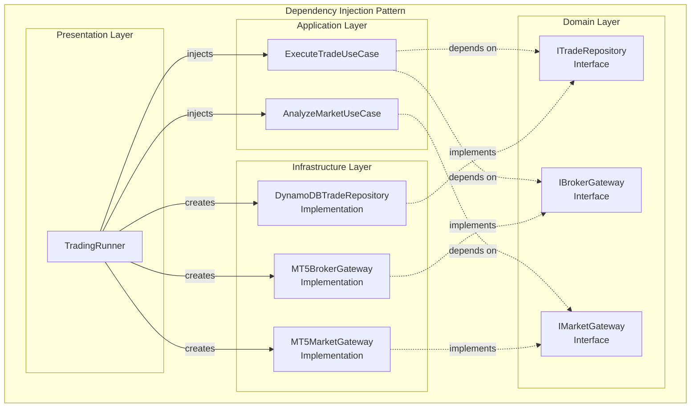

#### 依存関係の原則

| 原則 | 説明 | 実装方法 |
|------|------|----------|
| **依存性逆転** | 上位モジュールは下位モジュールに依存しない | インターフェースを介した依存 |
| **依存性注入** | オブジェクトの生成と使用を分離 | コンストラクタ注入パターン |
| **インターフェース分離** | クライアントが不要なメソッドに依存しない | 役割ごとの細かいインターフェース |
| **単一責任** | 各クラスは一つの責任のみを持つ | 明確な責務の分離 |

#### インターフェース定義例

```python
# Domain層でインターフェース定義
from abc import ABC, abstractmethod

class ITradeRepository(ABC):
    @abstractmethod
    async def save(self, trade: Trade) -> None:
        pass
    
    @abstractmethod
    async def find_by_id(self, trade_id: str) -> Trade:
        pass

# Infrastructure層で実装
class DynamoDBTradeRepository(ITradeRepository):
    async def save(self, trade: Trade) -> None:
        # DynamoDB固有の実装
        pass
    
    async def find_by_id(self, trade_id: str) -> Trade:
        # DynamoDB固有の実装
        pass
```

### 2.11 ドメインモデル

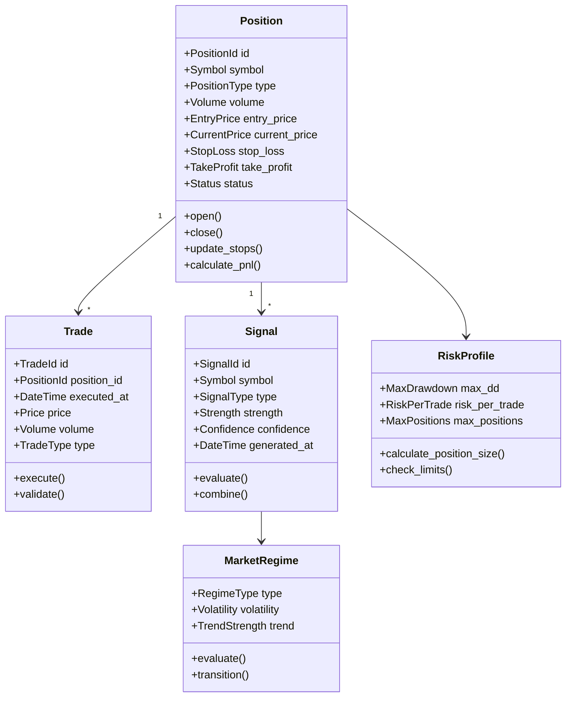

### 2.12 システム責務領域

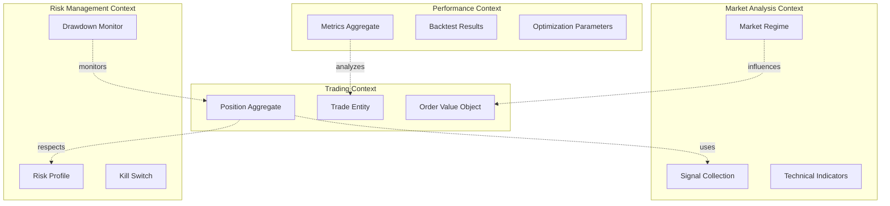

#### コンテキスト間の関係性

| コンテキスト | 責務 | 主要集約 | 他コンテキストとの関係 |
|-------------|------|---------|----------------------|
| **Trading** | 取引実行と管理 | Position, Trade | Market Analysisからシグナル受信 |
| **Market Analysis** | 市場状態の分析 | MarketRegime, Signal | Tradingへシグナル提供 |
| **Risk Management** | リスク制御 | RiskProfile, KillSwitch | 全コンテキストを監視 |
| **Performance** | パフォーマンス測定 | Metrics, BacktestResult | Tradingの結果を分析 |

### 2.13 イベントソーシング設計

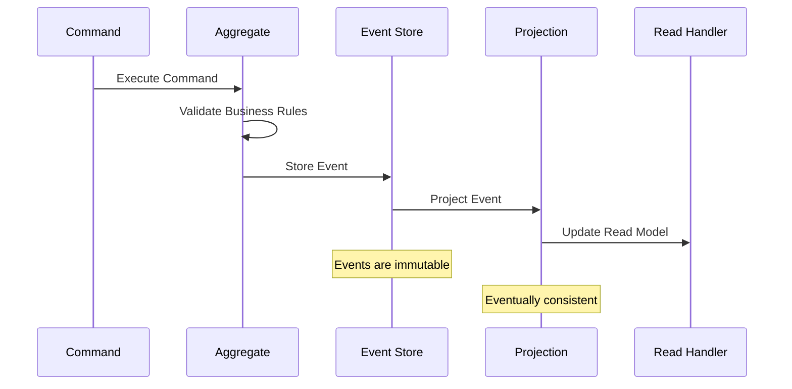

#### 主要ドメインイベント

```python
# ドメインイベントの例
class PositionOpened(DomainEvent):
    position_id: str
    symbol: str
    volume: float
    entry_price: float
    opened_at: datetime

class SignalGenerated(DomainEvent):
    signal_id: str
    symbol: str
    signal_type: str
    strength: float
    confidence: float

class KillSwitchTriggered(DomainEvent):
    reason: str
    triggered_at: datetime
    affected_positions: List[str]
```
