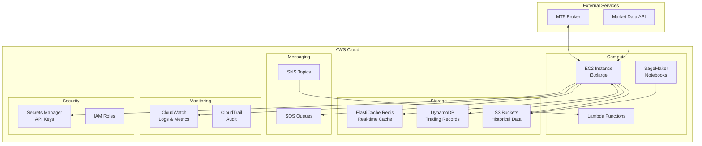
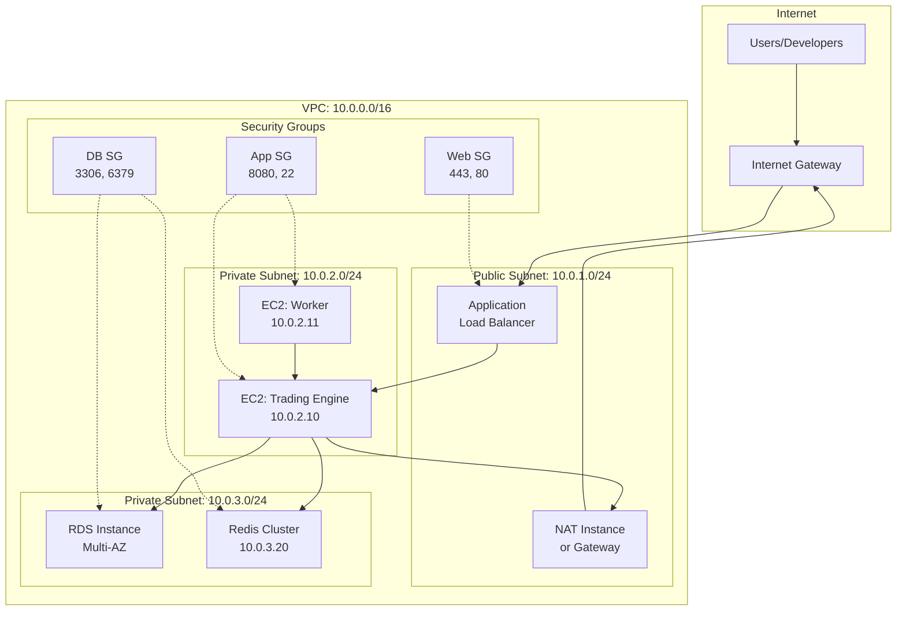
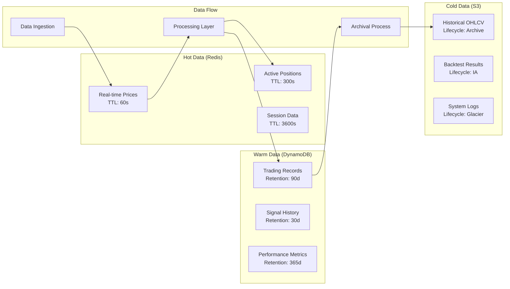
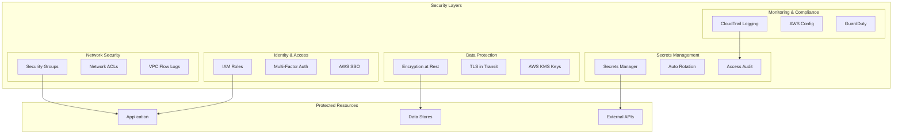

# インフラストラクチャ

**Document Path**: `docs/basic_design/03_infrastructure.md`  
**Version**: 2.0  
**Type**: インフラストラクチャ設計書

---
## 目次

- [インフラストラクチャ](#インフラストラクチャ)
  - [目次](#目次)
  - [3. インフラストラクチャ](#3-インフラストラクチャ)
    - [3.1 インフラストラクチャ全体図](#31-インフラストラクチャ全体図)
    - [3.2 ネットワークアーキテクチャ](#32-ネットワークアーキテクチャ)
    - [3.3 データアーキテクチャ](#33-データアーキテクチャ)
    - [3.4 セキュリティアーキテクチャ](#34-セキュリティアーキテクチャ)
    - [3.5 AWS構成概要](#35-aws構成概要)
      - [3.5.1 リージョン/AZ構成](#351-リージョンaz構成)
      - [3.5.2 ネットワーク構成](#352-ネットワーク構成)
      - [3.5.3 セキュリティグループ設定](#353-セキュリティグループ設定)
      - [3.5.4 IAMロール設計](#354-iamロール設計)
    - [3.6 EC2（実行環境）](#36-ec2実行環境)
      - [3.6.1 インスタンス構成](#361-インスタンス構成)
      - [3.6.2 起動設定](#362-起動設定)
      - [3.6.3 タスクスケジューラ設定](#363-タスクスケジューラ設定)
    - [3.7 SageMaker（開発・バックテスト環境）](#37-sagemaker開発バックテスト環境)
      - [3.7.1 ノートブックインスタンス構成](#371-ノートブックインスタンス構成)
    - [3.8 データストア](#38-データストア)
      - [3.8.1 ElastiCache for Redis設計](#381-elasticache-for-redis設計)
      - [3.8.2 DynamoDB設計](#382-dynamodb設計)
      - [3.8.3 S3設計](#383-s3設計)
    - [3.9 メッセージング（SQS/SNS）](#39-メッセージングsqssns)
      - [3.9.1 キュー構成](#391-キュー構成)
      - [3.9.2 トピック設計](#392-トピック設計)
      - [3.9.3 DLQ設定](#393-dlq設定)
    - [3.10 監視・通知システム](#310-監視通知システム)
      - [3.10.1 CloudWatchメトリクス](#3101-cloudwatchメトリクス)
      - [3.10.2 アラーム設定](#3102-アラーム設定)
      - [3.10.3 ログ収集設定](#3103-ログ収集設定)
      - [3.10.4 ダッシュボード構成](#3104-ダッシュボード構成)
      - [3.10.5 Slack通知（Lambda経由）](#3105-slack通知lambda経由)
    - [3.11 認証情報管理（Secrets Manager）](#311-認証情報管理secrets-manager)
      - [3.11.1 シークレット構成](#3111-シークレット構成)
      - [3.11.2 Slack Webhook URL管理](#3112-slack-webhook-url管理)
    - [3.12 コスト管理](#312-コスト管理)
      - [3.12.1 月額コスト試算](#3121-月額コスト試算)
      - [3.12.2 コスト最適化方針](#3122-コスト最適化方針)
      - [3.12.3 コスト監視設定](#3123-コスト監視設定)

## 3. インフラストラクチャ

### 3.1 インフラストラクチャ全体図



### 3.2 ネットワークアーキテクチャ



### 3.3 データアーキテクチャ



### 3.4 セキュリティアーキテクチャ




### 3.5 AWS構成概要

#### 3.5.1 リージョン/AZ構成

- **リージョン**: 東京リージョン (ap-northeast-1) をプライマリリージョンとして利用する。
- **AZ構成**: コストを抑制するため、EC2、SageMaker、NATインスタンスは単一のAZで起動する。S3, DynamoDB等のマネージドサービスが提供するマルチAZの冗長性を活用する。

#### 3.5.2 ネットワーク構成

**段階的アプローチ**

本システムでは、プロジェクトのフェーズ（デモ口座での運用 vs. 本番口座での運用）に応じて、ネットワーク構成を段階的に進化させる戦略を採用する。

**フェーズ1: デモ・開発環境 (コスト最優先)**
- EC2インスタンスをパブリックサブネットに配置
- インターネットゲートウェイを介して直接インターネットと通信
- NAT Gateway / NATインスタンスは使用しない
- セキュリティグループを厳格に設定し、SSH(22)ポートへのアクセスを制限

**フェーズ2: 本番環境 (セキュリティ最優先)**
- EC2インスタンスをプライベートサブネットに配置
- NATインスタンス経由でのアウトバウンド通信のみ許可
- 攻撃対象領域を最小化

#### 3.5.3 セキュリティグループ設定

「最小権限の原則」に基づき、各コンポーネント間の通信を厳密に制御する。

- **sg-ec2-trading-engine**:
  - インバウンド: sg-nat-instanceからの関連トラフィック、sg-sagemakerからのSSH(22)を許可
  - アウトバウンド: VPC内への全トラフィック、およびNATインスタンスへのルーティングを許可

- **sg-nat-instance**:
  - インバウンド: プライベートサブネット(sg-ec2-trading-engine等)からのHTTP/HTTPS/MT5ポートを許可
  - アウトバウンド: インターネットへのHTTP/HTTPS/MT5ポートを許可

- **sg-elasticache**:
  - インバウンド: sg-ec2-trading-engine および sg-sagemaker からのRedisポート (6379) のみ許可

#### 3.5.4 IAMロール設計

「最小権限の原則」に基づき、各AWSリソースに必要最低限の権限のみを付与したIAMロールを割り当てる。

- **EC2InstanceRole**: S3バケット、DynamoDBテーブル、ElastiCacheクラスタ、SQSキュー、SNSトピック、Secrets Manager、CloudWatch Logsへのアクセス権限
- **SageMakerExecutionRole**: EC2InstanceRole とほぼ同等の権限に加え、SageMaker固有のアクション権限
- **LambdaExecutionRole**: 各Lambda関数ごとに専用のロールを作成し、必要最小限の権限のみを付与

### 3.6 EC2（実行環境）

本システムの主要なプロセス（自律取引エンジン、データコレクター等）を実行するためのコアとなるコンピュートリソース。

#### 3.6.1 インスタンス構成

- **インスタンスタイプ**: t4g.small (2 vCPU, 2 GiBメモリ)
- **AMI**: Amazon Linux 2023
- **ストレージ**: gp3 (10 GiB)

**選定理由**: ARMベースのGraviton2プロセッサは優れたコストパフォーマンスを提供し、Pythonの数値計算ライブラリがARMアーキテクチャに最適化されている。

#### 3.6.2 起動設定

インスタンスのプロビジョニングとアプリケーションのデプロイを自動化し、迅速な復旧を可能にする。

**ユーザーデータ**:
- Python 3.11、Gitなどの基本パッケージのインストール
- GitHubリポジトリからの最新ソースコードクローン
- requirements.txtに基づく依存ライブラリのインストール
- systemdサービスファイルの設定

**自動起動**: systemdを利用して、主要なアプリケーションプロセスをサービスとして管理する。

#### 3.6.3 タスクスケジューラ設定

- **メインプロセス**: autonomous_engine.pyやdata_collector.pyなどのコアプロセスをsystemdサービスとして常時稼働
- **定期タスク**: 夜間データバックアップや週次レポート生成などはcronで実行

### 3.7 SageMaker（開発・バックテスト環境）

#### 3.7.1 ノートブックインスタンス構成

分析、バックテスト、機械学習モデル開発の主要な環境としてSageMakerノートブックインスタンスを活用する。

- **インスタンスタイプ**: ml.t3.medium
- **ライフサイクル設定**: ノートブックインスタンス起動時の環境自動構築
- **VPC連携**: 本番環境と同じVPC内に起動し、開発環境と本番環境の差異を最小限に抑制

### 3.8 データストア

ADR-001で決定した3階層データ戦略に基づく設計。

#### 3.8.1 ElastiCache for Redis設計

**クラスタ構成**:
- **インスタンスタイプ**: cache.t4g.micro

**データ構造**:
1. `ohlcv:{symbol}:{timeframe}` - Sorted Set: 最新OHLCVデータの時系列保持
2. `positions:{symbol}` - Hash: 現在のオープンポジション状態
3. `system:status` - Hash: Kill Switchなどシステム全体のグローバルステータス

**TTL戦略**:
- `ohlcv:*`: 24時間（メモリ使用量抑制）
- `positions:*`: 無期限（ポジション存在中は維持）
- `system:status`: 無期限

**永続化設定**: 
- AOF（Append Only File）毎秒保存
- RDBスナップショット15分毎
- 最大メモリ使用量制限とLRU除去

#### 3.8.2 DynamoDB設計

##### 単一テーブル設計

本システムでは、DynamoDBのベストプラクティスである**単一テーブル設計 (Single Table Design)** を採用し、`TSS_DynamoDB_OrderState`テーブルに全ての永続化データを集約する。これにより、クエリ効率の向上、コスト削減、スケーリングの簡素化を実現する。

##### プライマリキー設計

汎用的な名前を持つプライマリキー（`pk`/`sk`）を使用し、プレフィックスと識別子の組み合わせにより多様なエンティティタイプに対応：

| エンティティ | パーティションキー (pk) | ソートキー (sk) | 説明 |
|------------|------------------------|---------------|------|
| グローバル設定 | `GLOBALCONFIG` | `SETTING#<key>` | Kill Switchなどシステム全体設定 |
| 取引 | `TRADE#<trade_id>` | `METADATA` | 個別取引の詳細情報 |
| ポジション | `POSITION#<position_id>` | `TRADE#<trade_id>` | ポジションと取引の関連付け |
| シンボル別 | `SYMBOL#<symbol>` | `POSITION#<status>#<timestamp>#<position_id>` | シンボル単位の集約 |
| 戦略別 | `STRATEGY#<strategy_id>` | `POSITION#<status>#<timestamp>#<position_id>` | 戦略単位の集約 |

##### グローバルセカンダリインデックス（GSI）設計

| GSI名 | パーティションキー | ソートキー | 用途 | プロジェクション |
|-------|------------------|-----------|------|----------------|
| **GSI1** | `gs1pk` = `STRATEGY#<id>` | `gs1sk` = `STATUS#<status>#<timestamp>` | 戦略別ポジション管理 | INCLUDE |
| **GSI2** | `gs2pk` = `SYMBOL#<symbol>` | `gs2sk` = `STATUS#<status>#<timestamp>` | シンボル別アクティブポジション | INCLUDE |
| **GSI3** | `gs3pk` = `OPEN_POSITIONS` | `gs3sk` = `SYMBOL#<symbol>#<timestamp>` | オープンポジション高速取得（スパース） | INCLUDE |
| **GSI4** | `gs4pk` = `SIGNAL#<signal_id>` | `gs4sk` = `TIMESTAMP#<created_at>` | シグナル別取引追跡 | INCLUDE |
| **GSI5** | `gs5pk` = `DATE#<YYYY-MM-DD>` | `gs5sk` = `TIME#<HH:MM:SS>#<position_id>` | 日付範囲検索 | INCLUDE |

##### 属性設計

**共通属性**：
- `item_type`: エンティティ種別（Position/Trade/GlobalSetting）
- `version`: 楽観的ロック用バージョン番号
- `last_updated_utc`: 最終更新日時（ISO 8601形式）
- `created_utc`: 作成日時（ISO 8601形式）

**ポジション属性**：
```json
{
  "position_id": "POS-xxx",
  "trade_id": "TRD-xxx",
  "signal_id": "SIG-xxx",
  "strategy_id": "STRAT-001",
  "symbol": "USDJPY",
  "side": "BUY",
  "status": "OPEN",
  "entry_price": 145.500,
  "current_price": 145.750,
  "size": 0.10,
  "stop_loss": 145.000,
  "take_profit": 146.500,
  "trailing_stop_distance": 50,
  
  // ポジション管理機能
  "enable_add_position": true,
  "add_position_config": {
    "max_levels": 3,
    "level_configs": [
      {"level": 1, "price_offset": 50, "lot_multiplier": 1.5}
    ]
  },
  "current_add_position_level": 0,
  
  // ブレークイーブン機能
  "enable_breakeven": true,
  "breakeven_status": "PENDING",
  "breakeven_trigger_price": 145.700,
  
  // 損益
  "unrealized_pnl": 250.00,
  "realized_pnl": 0
}
```

##### データ整合性機構

**楽観的ロック**：
- `version`属性を使用した同時実行制御
- 更新時の`ConditionExpression`による競合検出

**アトミックカウンター**：
- ポジションレベル等の数値フィールドの原子的更新
- `ADD`オペレーションによる競合回避

**条件付き書き込み**：
- ステータス遷移の整合性保証
- ビジネスルールの強制適用

##### アクセスパターン

| パターン | 説明 | 実装方法 |
|---------|------|---------|
| AP1 | 特定ポジション取得 | `GetItem`: pk=`POSITION#<id>`, sk=`TRADE#<id>` |
| AP2 | シンボルのオープンポジション | GSI2: `gs2pk`=`SYMBOL#<symbol>`, `gs2sk` begins_with `STATUS#OPEN#` |
| AP3 | Kill Switch状態確認 | `GetItem`: pk=`GLOBALCONFIG`, sk=`SETTING#KILL_SWITCH` |
| AP4 | 戦略別ポジション | GSI1: `gs1pk`=`STRATEGY#<id>` |
| AP5 | 日付範囲検索 | GSI5: `gs5pk`=`DATE#<date>` |

##### パフォーマンス最適化

**ホットパーティション対策**：
- 高カーディナリティキーの使用
- 書き込みシャーディング（必要に応じて）
- アプリケーションレベルキャッシング

**スパースインデックス活用**：
- GSI3はOPENステータスのポジションのみインデックス化
- ストレージコストとクエリ性能の最適化

**プロジェクション最適化**：
- 各GSIで必要最小限の属性のみプロジェクション
- RCU/WCUコストの削減

##### TTL設定

- クローズドポジション: 365日後に自動削除
- 取引ログ: 90日後に自動削除
- 一時データ: `ttl`属性によるカスタム期限設定

#### 3.8.3 S3設計

**バケット構成**:
- `tss-raw-market-data-{account_id}`: 生データ保存
- `tss-processed-market-data-{account_id}`: クレンジング済みOHLCVデータ（Parquet形式）
- `tss-backtest-results-{account_id}`: バックテスト実行結果レポート

**ライフサイクルポリシー**:
- 30日後: Standard-IA
- 90日後: Glacier Instant Retrieval

**アクセス制御**: 
- S3バケットポリシーでIAMロールベースアクセス
- 暗号化: SSE-S3でデータ暗号化
- アクセスログ: CloudTrail連携

**バージョニング設定**: 全バケットでバージョニング有効化

### 3.9 メッセージング（SQS/SNS）

#### 3.9.1 キュー構成

**TSS_OrderRequestQueue**:
- 役割: 外部からの非同期リクエスト受付
- 設定: 標準キュー、可視性タイムアウト60秒、保持期間4日、ロングポーリング20秒

**TSS_OrderRequestQueue_DLQ**:
- 役割: 処理失敗メッセージの隔離

#### 3.9.2 トピック設計

**TSS_SystemEventsTopic**:
- 役割: システム内重要ビジネスイベントの一元発行
- Publisher: EC2取引エンジン
- Subscriber: SlackNotificationLambda、将来の拡張購読者

#### 3.9.3 DLQ設定

CloudWatchアラームを設定し、DLQへのメッセージ移動を即時通知。

### 3.10 監視・通知システム

#### 3.10.1 CloudWatchメトリクス

**標準メトリクス**:
- EC2: CPUUtilization, MemoryUtilization, NetworkIn/Out
- ElastiCache: CPUUtilization, FreeableMemory, CacheHits/Misses
- Lambda: Invocations, Errors, Duration
- SQS: ApproximateNumberOfMessagesVisible, ApproximateAgeOfOldestMessage

**カスタムメトリクス**:
- TradingSystem/ActivePositions: 現在のオープンポジション数
- TradingSystem/CurrentProfitLoss: 全ポジション現在損益
- TradingSystem/MT5ConnectionStatus: MT5ブローカー接続状態
- TradingSystem/Heartbeat: 取引エンジンメインループ正常動作シグナル

#### 3.10.2 アラーム設定

**クリティカルアラート（即時通知）**:
- EC2 CPUUtilization 5分間80%超過
- SQS DLQメッセージ存在
- MT5ConnectionStatus 1分間0継続
- Heartbeat 5分間途絶

**警告アラート**:
- ElastiCache FreeableMemory 100MB以下
- Lambda Errors発生

#### 3.10.3 ログ収集設定

- **収集先**: CloudWatch Logs
- **ログ形式**: 構造化ロギング（JSON形式）
- **ロググループ**: `/aws/ec2/trading-system`, `/aws/lambda/TSS_AlertIngestionLambda`

#### 3.10.4 ダッシュボード構成

主要メトリクスの時系列グラフ、損益・ポジション数グラフ、接続・ハートビートステータス、直近エラーログ一覧を一元表示。

#### 3.10.5 Slack通知（Lambda経由）

CloudWatchアラーム → SNS → SlackNotificationLambda → Slack投稿のフローで通知を疎結合に実現。

### 3.11 認証情報管理（Secrets Manager）

#### 3.11.1 シークレット構成

全機密情報をSecrets Managerで一元管理：
- `TSS/mt5/credentials`: MT5ブローカー接続情報
- `TSS/slack/webhook_url`: Slack通知用WebhookURL
- `TSS/database/config`: 将来のデータベース接続情報

#### 3.11.2 Slack Webhook URL管理

SlackNotificationLambdaがSecrets Managerから動的取得し、WebhookURLの漏洩リスクを最小化。

### 3.12 コスト管理

#### 3.12.1 月額コスト試算

**フェーズ1（デモ環境）**: 約$34.06（約5,200円）
**フェーズ2（本番環境）**: 約$37.49（約5,700円）

#### 3.12.2 コスト最適化方針

- リザーブドインスタンス/Savings Plans活用
- 週末自動停止スクリプト導入
- VPCエンドポイント活用によるデータ転送料削減
- S3ライフサイクルポリシー適用

#### 3.12.3 コスト監視設定

AWS Budgets、Cost Anomaly Detection、コスト配分タグによる継続的監視。