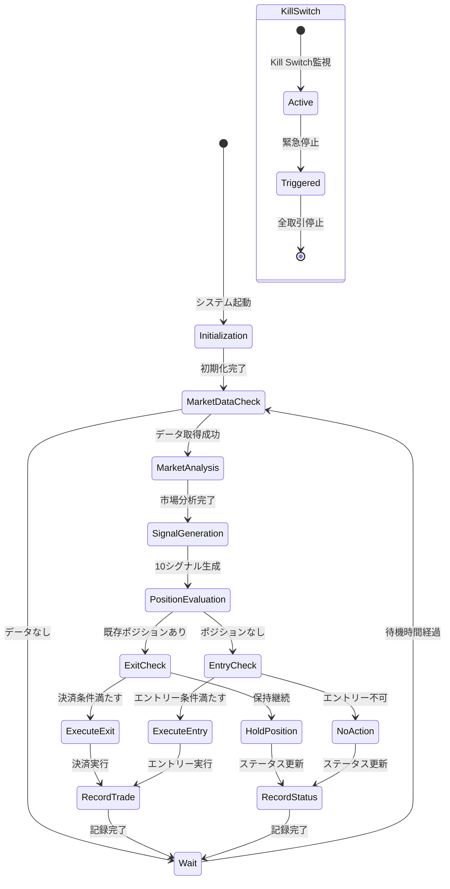
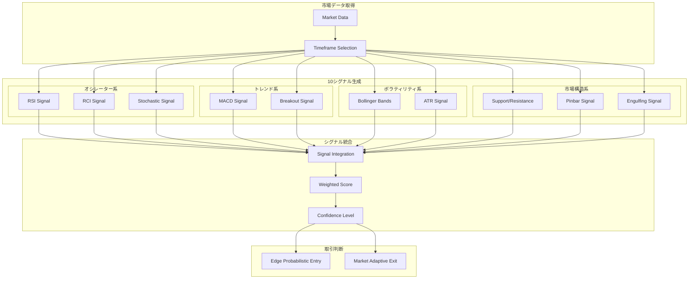
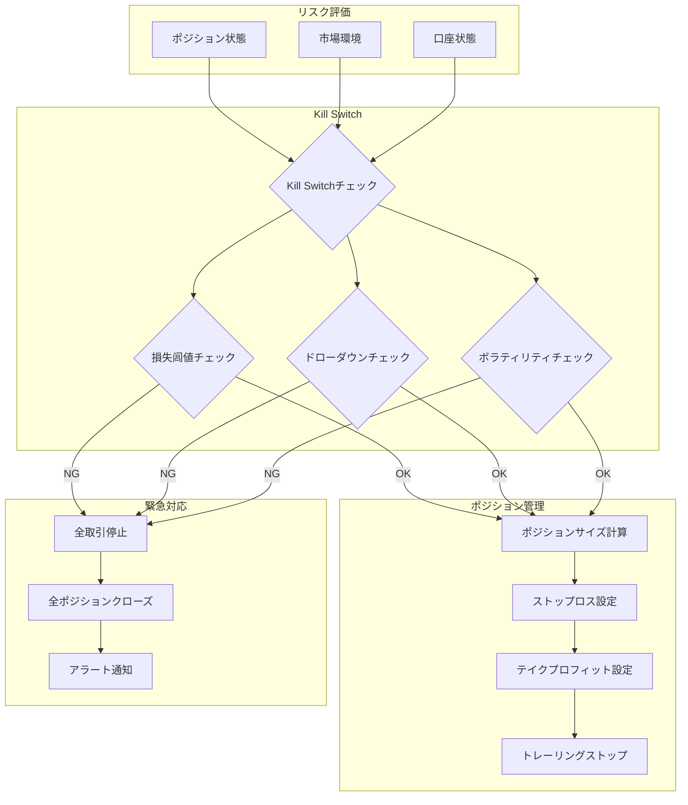
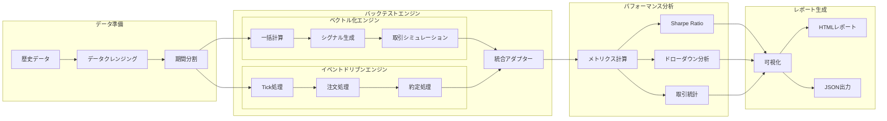

# 機能設計

**Document Path**: `docs/basic_design/04_features.md`  
**Version**: 2.0  
**Type**: 機能設計書

---
## 目次

- [機能設計](#機能設計)
  - [目次](#目次)
  - [4. 機能設計](#4-機能設計)
    - [4.1 取引サイクルフロー](#41-取引サイクルフロー)
    - [4.2 シグナル統合フロー](#42-シグナル統合フロー)
    - [4.3 リスク管理フロー](#43-リスク管理フロー)
    - [4.4 バックテストアーキテクチャ](#44-バックテストアーキテクチャ)
    - [4.5 自動取引機能](#45-自動取引機能)
      - [4.5.1 取引サイクル](#451-取引サイクル)
      - [4.5.2 エントリー判定ロジック](#452-エントリー判定ロジック)
      - [4.5.3 決済判定ロジック](#453-決済判定ロジック)
      - [4.5.4 ポジション管理](#454-ポジション管理)
    - [4.6 市場分析機能](#46-市場分析機能)
      - [4.6.1 市場レジーム分類](#461-市場レジーム分類)
      - [4.6.2 環境スコアリング](#462-環境スコアリング)
      - [4.6.3 相関分析](#463-相関分析)
      - [4.6.4 マルチタイムフレーム分析](#464-マルチタイムフレーム分析)
      - [4.6.5 シグナル生成詳細](#465-シグナル生成詳細)
    - [4.7 リスク管理機能](#47-リスク管理機能)
      - [4.7.1 緊急停止機能（Kill Switch）](#471-緊急停止機能kill-switch)
      - [4.7.2 ポジションサイズ管理](#472-ポジションサイズ管理)
      - [4.7.3 損失制限](#473-損失制限)
      - [4.7.4 リスク評価](#474-リスク評価)
      - [4.7.5 ドローダウン管理](#475-ドローダウン管理)
    - [4.8 バックテスト機能](#48-バックテスト機能)
      - [4.8.1 バックテストフレームワーク](#481-バックテストフレームワーク)
      - [4.8.2 パフォーマンス分析](#482-パフォーマンス分析)
      - [4.8.3 比較検証機能](#483-比較検証機能)
      - [4.8.4 レポート生成](#484-レポート生成)
    - [4.9 データ管理機能](#49-データ管理機能)
      - [4.9.1 市場データ収集](#491-市場データ収集)
      - [4.9.2 取引履歴管理](#492-取引履歴管理)
      - [4.9.3 パフォーマンス記録](#493-パフォーマンス記録)
      - [4.9.4 データクレンジング](#494-データクレンジング)

## 4. 機能設計

### 4.1 取引サイクルフロー

### 4.2 シグナル統合フロー

### 4.3 リスク管理フロー

### 4.4 バックテストアーキテクチャ

### 4.5 自動取引機能

#### 4.5.1 取引サイクル

自律取引エンジンは設定間隔でメインループを実行し、継続的な取引判断を行う。

**フロー**:
1. 最新データ取得（Redis）
2. 市場レジーム分析
3. シグナル生成と統合
4. 既存ポジション評価（決済ロジック）
5. 新規エントリー機会評価
6. 注文実行
7. 待機

#### 4.5.2 エントリー判定ロジック

**シグナル統合評価**: 最大10種類のシグナルと市場レジームを統合し信頼度スコアを算出

**確率的エントリー判定（ベイズ推論）**: シグナル統合の信頼度スコアを事前確率とし、リアルタイム市場情報で事後確率を更新

**信頼度計算**: 
- 実装済み: `src/domain/signal_generators/signal_integration.py`
  - 移行先: `src/domain/services/signal_generators/integration/signal_aggregator.py`
- 4つの集約手法: WEIGHTED_AVERAGE, CONSENSUS, CONFIDENCE_WEIGHTED, CATEGORY_BALANCED
- 並列処理による高速化（10シグナル並列生成）
- 相関分析とカテゴリバランシング機能

**ポジションサイズ最適化**: 許容リスク額とボラティリティ（ATR）に基づく動的計算

#### 4.5.3 決済判定ロジック

- 利益確定: トレーリングストップ、サポート/レジスタンスライン到達検知
- 損切り: ボラティリティ考慮の初期損切りライン
- 適応的決済: 市場レジーム転換、シグナル信頼度低下の早期撤退検討

#### 4.5.4 ポジション管理

オープンポジション状態の一元管理とブローカー側状態同期。

### 4.6 市場分析機能

#### 4.6.1 市場レジーム分類

**トレンド/レンジ判定**: 
- 実装済み: `src/domain/alpha_management/market_regime_classifier.py`
  - 移行先: `src/domain/aggregates/analysis/market_regime/regime_classifier.py`
- ADX、移動平均クロス、ボラティリティ分析による分類
- 5つの市場レジーム: STRONG_TREND, WEAK_TREND, RANGING, VOLATILE, QUIET

**ボラティリティ分析**: 
- 実装済み: `src/domain/trade_execution/volatility_adapter.py`
  - 移行先: `src/domain/aggregates/analysis/volatility/volatility_analyzer.py`
- ATRベースの動的ストップロス調整
- ボラティリティレベルに応じたポジションサイズ最適化

**流動性評価**: 
- 実装済み: `src/domain/market_analysis/environment_scorer.py`
  - 移行先: `src/domain/aggregates/analysis/liquidity/liquidity_evaluator.py`
- スプレッド、出来高、ボラティリティを統合評価
- 0-100の環境スコアと取引適応度判定

#### 4.6.2 環境スコアリング

複数テクニカル指標統合による市場環境の有利・不利数値化。

#### 4.6.3 相関分析

**通貨ペア相関分析**:
- 主要通貨ペア間の相関係数計算（ピアソン相関）
- ローリングウィンドウによる動的相関追跡（20日/60日/120日）
- 相関マトリックスの定期更新（1時間毎）

**ポートフォリオ効果**:
- 負相関ペアによるリスク分散
- 最適ポートフォリオウェイト計算（マーコビッツ理論）
- 相関ブレイクダウン検出アラート（閾値: ±0.3の変化）

**実装予定**:
- 移行先: `src/domain/aggregates/analysis/correlation/correlation_analyzer.py`

#### 4.6.4 マルチタイムフレーム分析

長期・中期・短期時間足の横断分析による市場全体構造把握。

#### 4.6.5 シグナル生成詳細

**オシレーター系（RSI, RCI, Stochastic）**: 
- RSI: `src/domain/signal_generators/oscillators/rsi_signal.py` - 買われ過ぎ/売られ過ぎ判定
- RCI: `src/domain/signal_generators/oscillators/rci_signal.py` - ランク相関による反転検知
- Stochastic: `src/domain/signal_generators/oscillators/stochastic_signal.py` - モメンタム分析

**トレンド系（MACD, Breakout）**: 
- MACD: `src/domain/signal_generators/trend_following/macd_signal.py` - ゼロライン/シグナルクロス判定
- Breakout: `src/domain/signal_generators/trend_following/breakout_signal.py` - 価格チャネルブレイクアウト検知

**ボラティリティ系（BB, ATR）**: 
- Bollinger Bands: `src/domain/signal_generators/volatility/bollinger_bands_signal.py` - バンドタッチ/ブレイク判定
- ATR: `src/domain/signal_generators/volatility/atr_signal.py` - ボラティリティ基準のポジションサイジング

**市場構造系（SR, Pinbar, Engulfing）**: 
- Support/Resistance: `src/domain/signal_generators/market_structure/support_resistance_signal.py` - ピボットポイント分析
- Pinbar: `src/domain/signal_generators/market_structure/pinbar_signal.py` - プライスアクション反転パターン
- Engulfing: `src/domain/signal_generators/market_structure/engulfing_signal.py` - 包み足パターン検知

**シグナル統合ロジック**: 
- 実装済み: `src/domain/signal_generators/signal_integration.py`
  - 移行先: `src/domain/services/signal_generators/integration/signal_orchestrator.py`
- SignalIntegrationSystem: 10シグナルの並列生成と統合
- 信頼度加重平均、コンセンサス、カテゴリバランス等の集約方式
- タイムアウト制御とエラーハンドリング

### 4.7 リスク管理機能

#### 4.7.1 緊急停止機能（Kill Switch）

手動または閾値超過による全取引活動即座停止。

#### 4.7.2 ポジションサイズ管理

許容リスクベースの各取引ポジションサイズ自動計算・制限。

#### 4.7.3 損失制限

- 実装済み: `src/application/safety/kill_switch.py`
  - 移行先: `src/domain/services/domain_services/risk_management/kill_switch.py`
- 日次損失上限: 口座資金の2%
- 連続損失回数: 3回以上で自動停止
- ポジション別損失上限: ポジションサイズの1%

#### 4.7.4 リスク評価

- 実装済み: `src/domain/trade_execution/probabilistic_entry.py`
  - 移行先: `src/domain/aggregates/trading/entry/probabilistic_evaluator.py`
- ベイズ推論によるエントリー確率計算
- リスクリワードレシオ評価
- シャープレシオによる取引品質評価

#### 4.7.5 ドローダウン管理

口座ドローダウン常時監視と閾値超過時の自動ポジション縮小・クローズ。

### 4.8 バックテスト機能

#### 4.8.1 バックテストフレームワーク

**ベクトル化処理エンジン**: 
- 実装済み: `src/application/backtesting/vectorized_runner.py`
  - 移行先: `src/application/use_cases/backtesting/engines/vectorized_engine.py`
- NumPy/Pandasによる高速ベクトル演算
- 大規模データセットのバックテスト対応
- メモリ効率的な処理

**イベントドリブン処理エンジン**: 
- 実装済み: `src/application/backtesting/event_driven_runner.py`
  - 移行先: `src/application/use_cases/backtesting/engines/event_driven_engine.py`
- リアルタイム取引をシミュレート
- ティック単位の精密な執行モデリング
- スリッページと手数料の考慮

**統合アダプター機能**: 
- 実装済み: `src/application/backtesting/adapter.py`
  - 移行先: `src/application/use_cases/backtesting/adapters/engine_adapter.py`
- ベクトル化とイベントドリブンエンジンの統合インターフェース
- 戦略の互換性確保
- パフォーマンス分析の統一化

#### 4.8.2 パフォーマンス分析

**Sharpe Ratio計算**: 
- 実装済み: `src/application/backtesting/analysis_report.py`
  - 移行先: `src/application/use_cases/backtesting/analysis/performance_metrics.py`
- リスク調整後リターンの計算
- 年率化対応（日次/週次/月次）

**ドローダウン分析**: 
- 実装済み: `src/application/backtesting/analysis_report.py`
  - 移行先: `src/application/use_cases/backtesting/analysis/drawdown_analyzer.py`
- 最大ドローダウン、回復期間、ドローダウン期間
- ドローダウンヒートマップ可視化

**取引統計分析**: 
- 実装済み: `src/application/backtesting/backtest_visualizer.py`
  - 移行先: `src/application/use_cases/backtesting/visualization/trade_statistics.py`
- 勝率、プロフィットファクター、平均捝益
- インタラクティブチャートでの可視化

#### 4.8.3 比較検証機能

**戦略間比較**: T.B.D

**パラメータ最適化**: T.B.D

**A/Bテスト機能**: T.B.D

#### 4.8.4 レポート生成

**HTML/JSON出力**: T.B.D

**可視化機能（インタラクティブチャート）**: T.B.D

### 4.9 データ管理機能

#### 4.9.1 市場データ収集

外部APIからの市場データ取得と3層データストアへの効率的配置。

#### 4.9.2 取引履歴管理

T.B.D

#### 4.9.3 パフォーマンス記録

T.B.D

#### 4.9.4 データクレンジング

欠損値補完、異常値除去による高品質データ維持。
