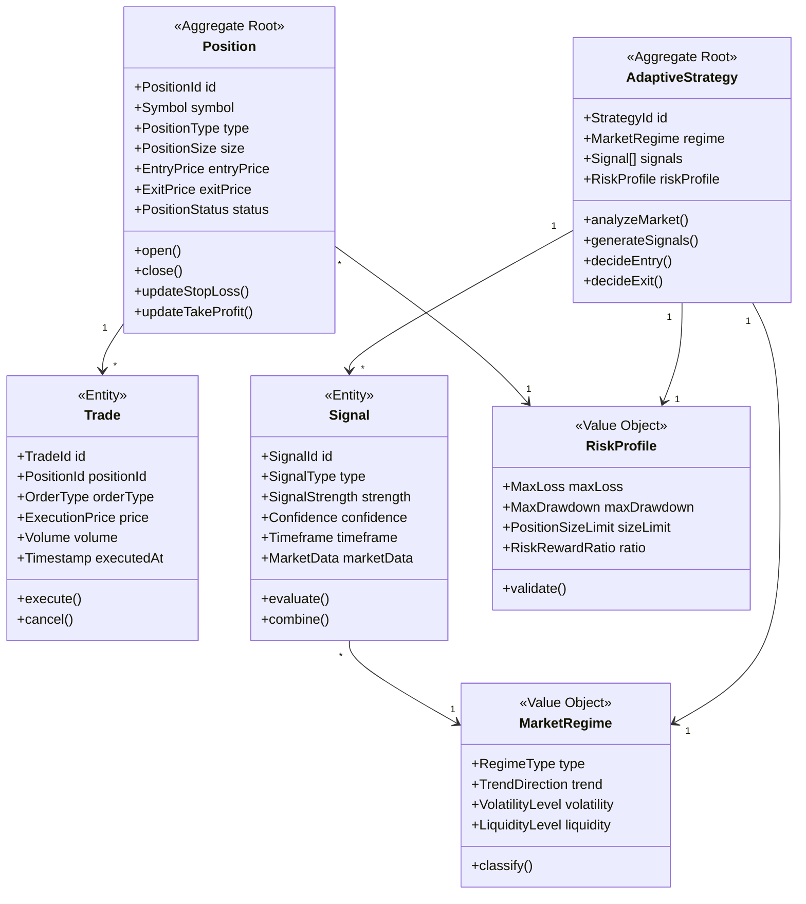
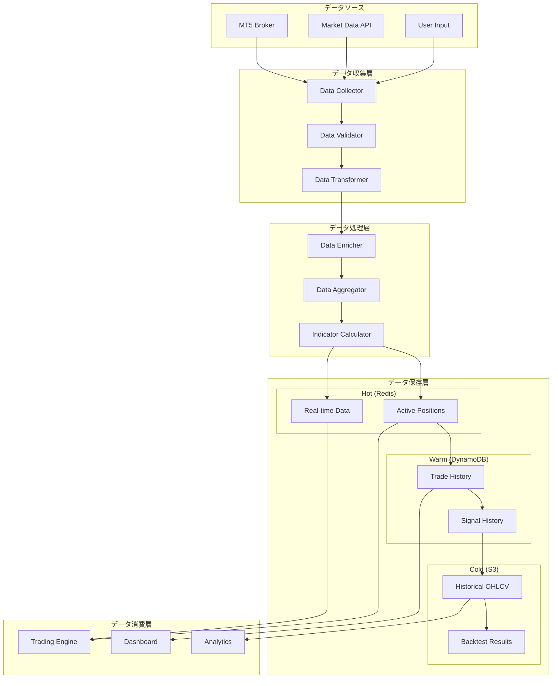
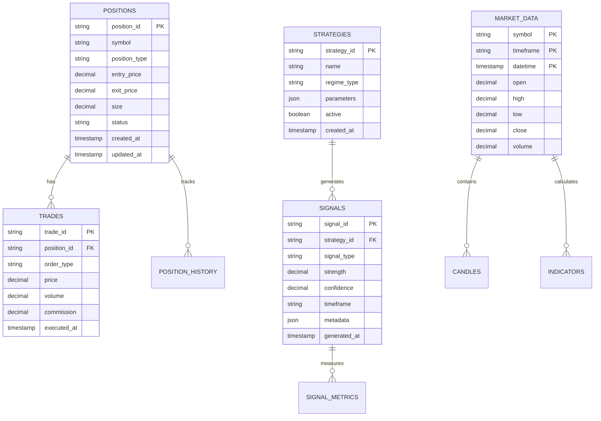
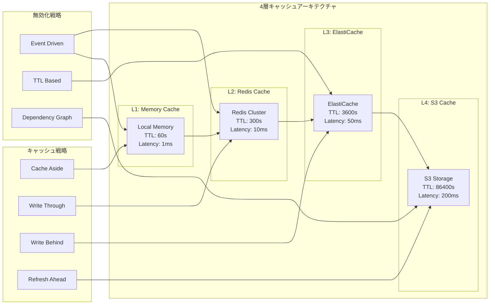

# データ設計

**Document Path**: `docs/basic_design/05_data_design.md`  
**Version**: 2.0  
**Type**: データ設計書

---
## 目次

- [データ設計](#データ設計)
  - [目次](#目次)
  - [5. データ設計](#5-データ設計)
    - [5.1 ドメインモデル概要](#51-ドメインモデル概要)
    - [5.2 データフローアーキテクチャ](#52-データフローアーキテクチャ)
    - [5.3 データスキーマ設計](#53-データスキーマ設計)
    - [5.4 キャッシュ戦略](#54-キャッシュ戦略)
    - [5.5 データモデル](#55-データモデル)
      - [5.5.1 エンティティ定義](#551-エンティティ定義)
      - [5.5.2 値オブジェクト定義](#552-値オブジェクト定義)
      - [5.5.3 集約定義](#553-集約定義)
    - [5.6 データフロー](#56-データフロー)
      - [5.6.1 リアルタイムデータフロー](#561-リアルタイムデータフロー)
      - [5.6.2 バッチデータフロー](#562-バッチデータフロー)
      - [5.6.3 キャッシュ戦略](#563-キャッシュ戦略)
    - [5.7 永続化戦略](#57-永続化戦略)
      - [5.7.1 トランザクション管理](#571-トランザクション管理)
      - [5.7.2 データ保存期間](#572-データ保存期間)
      - [5.7.3 バックアップ方針](#573-バックアップ方針)


## 5. データ設計

### 5.1 ドメインモデル概要



### 5.2 データフローアーキテクチャ



### 5.3 データスキーマ設計



### 5.4 キャッシュ戦略



### 5.5 データモデル

#### 5.5.1 エンティティ定義

**Trade（取引）**: 
- ID、シンボル、エントリー/エグジット価格、サイズ、約定時刻
- ステータス: PENDING, FILLED, CANCELLED, REJECTED
- 損益計算と手数料管理

**Position（ポジション）**: 
- ポジションID、シンボル、方向（LONG/SHORT）
- エントリー価格、現在価格、サイズ
- ストップロス、テイクプロフィット設定

**Signal（シグナル）**: 
- シグナルID、タイプ、強度（-1〜1）、信頼度
- 生成時刻、有効期限、タイムフレーム
- メタデータ（指標値、閾値等）

**MarketData（市場データ）**: 
- OHLCVデータ、タイムスタンプ
- スプレッド、ティックデータ
- データ品質フラグ（欠損、異常値等）

#### 5.5.2 値オブジェクト定義

**Price（価格）**:
```python
class Price:
    def __init__(self, value: Decimal, currency: str):
        if value < 0:
            raise ValueError("Price cannot be negative")
        self.value = value
        self.currency = currency
    
    def add(self, other: 'Price') -> 'Price'
    def multiply(self, factor: Decimal) -> 'Price'
    def to_base_currency(self, rate: Decimal) -> 'Price'
```
- 不変性を保証
- 通貨変換ロジック内包
- 精度保証（Decimal使用）
- 移行先: `src/domain/value_objects/money/price.py`

**Volume（取引量）**:
```python
class Volume:
    def __init__(self, lots: Decimal, unit_size: int = 100000):
        if lots <= 0:
            raise ValueError("Volume must be positive")
        self.lots = lots
        self.unit_size = unit_size
    
    @property
    def units(self) -> int
    def split(self, parts: int) -> List['Volume']
```
- ロット数と単位サイズの管理
- 分割ロジック
- 最小取引単位の検証
- 移行先: `src/domain/value_objects/market/volume.py`

**Timestamp（タイムスタンプ）**:
```python
class TradingTimestamp:
    def __init__(self, dt: datetime):
        self.utc_time = dt.replace(tzinfo=timezone.utc)
    
    def to_market_timezone(self, market: str) -> datetime
    def is_market_open(self, market: str) -> bool
    def to_bar_start(self, timeframe: str) -> 'TradingTimestamp'
```
- UTC正規化
- 市場時間変換
- 取引時間判定
- 移行先: `src/domain/value_objects/time/trading_timestamp.py`

#### 5.5.3 集約定義

**Trading集約**:
- ルート: Position
- エンティティ: Trade, Order
- 値オブジェクト: EntryPrice, StopLoss, TakeProfit
- 境界: ポジションのライフサイクル管理
- 移行先: `src/domain/aggregates/trading/`

**Analysis集約**:
- ルート: MarketRegime
- エンティティ: Signal, Indicator
- 値オブジェクト: Confidence, Strength
- 境界: 市場分析とシグナル生成
- 移行先: `src/domain/aggregates/analysis/`

**Strategy集約**:
- ルート: TradingStrategy
- エンティティ: Rule, Parameter
- 値オブジェクト: Threshold, Weight
- 境界: 戦略定義とパラメータ管理
- 移行先: `src/domain/aggregates/strategy/`

### 5.6 データフロー

#### 5.6.1 リアルタイムデータフロー

**データ取得パイプライン**:
1. MT5 WebSocket接続 → 価格ティック受信
2. データ検証・正規化 → Golden Schema変換
3. Redisキャッシュ更新 → TTL 60秒
4. イベント発火 → PriceUpdateEvent
5. サブスクライバー通知

**ストリーム処理**:
- Apache Kafkaスタイルのイベントストリーム
- バックプレッシャー制御
- ウォーターマーク管理
- 移行先: `src/infrastructure/gateways/market_data/stream_processor.py`

#### 5.6.2 バッチデータフロー

**日次バッチ処理**:
1. S3から前日データロード
2. データクレンジング・補完
3. 指標計算（RSI, MACD等）
4. 集計レポート生成
5. DynamoDB/S3への保存

**スケジューリング**:
- CloudWatch Eventsによる定期実行
- 日次: UTC 00:00
- 週次: 月曜日 00:00
- 月次: 毎月1日 00:00
- 移行先: `src/application/workflows/batch_processing_workflow.py`

#### 5.6.3 キャッシュ戦略

3階層データ戦略によるアクセス頻度・応答速度要件に応じた最適配置。

### 5.7 永続化戦略

#### 5.7.1 トランザクション管理

- DynamoDBトランザクション: ConditionalCheckFailedExceptionでロールバック
- Redisトランザクション: MULTI/EXECコマンドでアトミック処理
- 分散ロック: Redlockアルゴリズム

#### 5.7.2 データ保存期間

- リアルタイムデータ（Redis）: 24時間
- 取引履歴（DynamoDB）: 1年間
- 歴史データ（S3）: 無期限（Glacier移行あり）

#### 5.7.3 バックアップ方針

- DynamoDB: ポイントインタイムリカバリ有効
- S3: バージョニングとクロスリージョンレプリケーション
- Redis: AOFとRDBの二重バックアップ