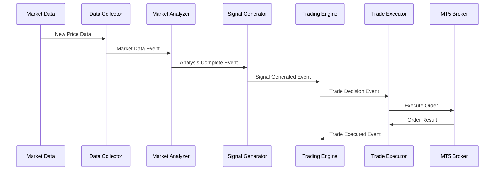

# 外部連携

**Document Path**: `docs/basic_design/06_integrations.md`  
**Version**: 2.0  
**Type**: 外部連携設計書

---
## 目次

- [外部連携](#外部連携)
  - [目次](#目次)
  - [6. 外部連携](#6-外部連携)
    - [6.1 MT5連携](#61-mt5連携)
      - [6.1.1 接続仕様](#611-接続仕様)
      - [6.1.2 データ取得API](#612-データ取得api)
      - [6.1.3 注文実行API](#613-注文実行api)
      - [6.1.4 エラーハンドリング](#614-エラーハンドリング)
    - [6.2 メッセージング](#62-メッセージング)
      - [6.2.1 SQSメッセージフォーマット](#621-sqsメッセージフォーマット)
      - [6.2.2 メッセージ変換（MessageTransformerV2）](#622-メッセージ変換messagetransformerv2)
      - [6.2.3 イベント駆動アーキテクチャ](#623-イベント駆動アーキテクチャ)
    - [6.3 TradingView連携](#63-tradingview連携)
      - [6.3.1 Webhook受信](#631-webhook受信)
      - [6.3.2 シグナル変換](#632-シグナル変換)
    - [6.4 データプロバイダー連携](#64-データプロバイダー連携)
      - [6.4.1 市場データ取得](#641-市場データ取得)
      - [6.4.2 ファンダメンタルデータ連携](#642-ファンダメンタルデータ連携)
    - [6.5 外部連携セキュリティ](#65-外部連携セキュリティ)
      - [6.5.1 認証情報管理](#651-認証情報管理)
      - [6.5.2 通信暗号化](#652-通信暗号化)

## 6. 外部連携

### 6.1 MT5連携

#### 6.1.1 接続仕様

MetaTrader 5との必須連携。注文執行、ポジション管理、口座情報取得をPython連携ライブラリ経由で実行。

#### 6.1.2 データ取得API

- 実装済み: `src/infrastructure/broker/mt5_handler.py`
- copy_rates_from_pos(): OHLCVデータ取得
- positions_get(): ポジション情報取得
- account_info(): 口座情報取得

#### 6.1.3 注文実行API

- 実装済み: `src/infrastructure/aws/ec2/order_manager/mt5_handler.py`
  - 移行先: `src/infrastructure/gateways/broker/mt5/order_gateway.py`
- order_send(): 成行/指値注文実行
- order_check(): 注文検証
- ポジション管理と同期処理

#### 6.1.4 エラーハンドリング

- 接続エラー: 自動再接続（最大3回、指数バックオフ）
- タイムアウト: 30秒でキャンセル
- エラーコードマッピングとログ出力

### 6.2 メッセージング

#### 6.2.1 SQSメッセージフォーマット

MessageTransformerV2仕様準拠の標準JSONフォーマット。

#### 6.2.2 メッセージ変換（MessageTransformerV2）

- 実装済み: `src/infrastructure/messaging/message_transformer_v2.py`
- 統一JSONフォーマットへの変換
- スキーマ検証とエラーハンドリング
- メッセージルーティング機能

#### 6.2.3 イベント駆動アーキテクチャ

TSS_SystemEventsTopicを中心とした将来の包括的イベント駆動アーキテクチャへの拡張基盤。

### 6.3 TradingView連携

#### 6.3.1 Webhook受信

- 実装済み: Lambda Functionによる非同期受信
- アラート情報の標準化とSQSキューへの配信
- 裁量取引支援機能（自動取引サイクルとは独立）

#### 6.3.2 シグナル変換

- TradingViewアラートからAXIA内部シグナルへの変換
- メタデータの付加（信頼度、有効期限等）
- 重複アラートの除去とフィルタリング

### 6.4 データプロバイダー連携

#### 6.4.1 市場データ取得

- MT5を主要なデータソースとして活用
- リアルタイム価格フィード
- ヒストリカルデータの定期取得

#### 6.4.2 ファンダメンタルデータ連携

将来拡張として、経済指標やニュースデータの取得機能を検討。

### 6.5 外部連携セキュリティ

#### 6.5.1 認証情報管理

- Secrets Managerによる一元管理
- 自動ローテーション機能
- アクセス権限の最小化

#### 6.5.2 通信暗号化

- すべての外部通信でTLS 1.3を使用
- API Keyとトークンの暗号化保存
- 通信ログの暗号化とマスキング