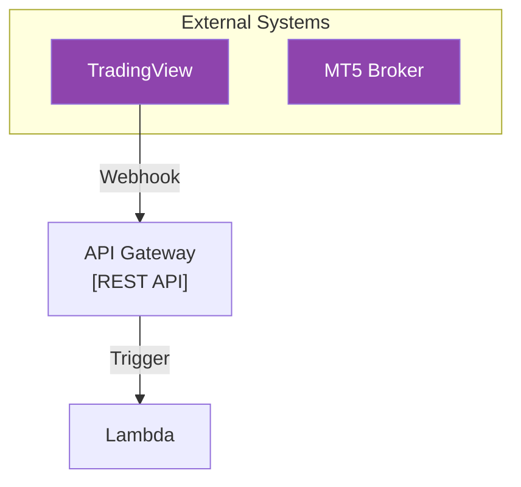

# AXIA Coding Standards and Guidelines

**Last Updated**: 2025-01-26  
**Version**: 2.0  
**Status**: Active Development Phase

## Overview

本規約は、AXIA (Algorithmic eXecution & Intelligence Architecture) プロジェクトにおけるコーディング標準を定めたものです。プロジェクトの成長と共に更新されることを前提としています。

## Table of Contents

1. [基本原則](#1-基本原則)
2. [プロジェクト構造](#2-プロジェクト構造)
3. [命名規則](#3-命名規則)
4. [Pythonコーディング規約](#4-pythonコーディング規約)
5. [AWSリソース管理](#5-awsリソース管理)
6. [データベース設計](#6-データベース設計)
7. [設定管理とセキュリティ](#7-設定管理とセキュリティ)
8. [テストとデバッグ](#8-テストとデバッグ)
9. [ドキュメント作成](#9-ドキュメント作成)
10. [Git管理](#10-git管理)

---

## 1. 基本原則

### 1.1 AXIA設計理念

プロジェクト全体は以下の3つの公理に基づいています：

1. **Systematic Approach（体系的であること）**
   - 場当たり的な解決策を避け、システム全体の健全性を優先
   - モジュール間の依存関係を明確に定義

2. **ROI-Driven（投資対効果に基づく）**
   - すべての実装判断はROIを基準とする
   - 技術的興味だけでの実装は行わない

3. **Built for the Future（未来のために構築）**
   - 保守性と拡張性を初期設計から考慮
   - MLOpsによる自己進化の可能性を織り込む

### 1.2 開発アプローチ

```python
# 段階的実装の例
# Phase 1: 基本機能
def execute_market_order(symbol, action, size):
    """市場注文の基本実装"""
    pass

# Phase 2: エラーハンドリング追加
def execute_market_order(symbol, action, size):
    """市場注文（エラーハンドリング付き）"""
    try:
        # 実装
    except MT5Error as e:
        logger.error(f"MT5 order failed: {e}")
        raise

# Phase 3: 高度な機能追加
def execute_market_order(symbol, action, size, tp=None, sl=None):
    """市場注文（TP/SL設定対応）"""
    # さらなる機能追加
```

---

## 2. プロジェクト構造

### 2.1 ディレクトリ構成

```
TradingStrategySystem/
├── docs/                           # すべてのドキュメント
│   ├── project_management/         # プロジェクト管理文書
│   ├── architecture/              # アーキテクチャ設計
│   ├── implementation/            # 実装ガイド
│   └── operations/               # 運用手順書
├── src/
│   ├── application/              # アプリケーション層
│   │   └── backtesting/         # バックテスト関連
│   ├── domain/                  # ドメイン層（ビジネスロジック）
│   │   ├── market_analyzer.py   # 市場分析
│   │   ├── trade_executor.py    # 取引実行ロジック
│   │   └── signal_generators.py # シグナル生成
│   └── infrastructure/          # インフラ層
│       ├── aws/                # AWS関連
│       │   ├── ec2/           # EC2スクリプト
│       │   ├── lambdas/       # Lambda関数
│       │   └── s3/            # S3操作
│       └── broker/            # ブローカー連携
├── tests/                      # テストコード
├── infrastructure/             # IaC（Infrastructure as Code）
│   ├── sam/                   # AWS SAMテンプレート
│   └── terraform/             # Terraform（将来用）
└── scripts/                   # ユーティリティスクリプト
```

### 2.2 レイヤー構造

```python
# レイヤー間の依存関係
# application -> domain -> infrastructure

# 正しい例：
# src/application/backtesting/event_driven_runner.py
from src.domain.market_analyzer import MarketAnalyzer
from src.domain.trade_executor import TradeExecutor

# 間違った例：
# src/domain/market_analyzer.py
# from src.application.backtesting import BacktestRunner  # ドメインがアプリケーションに依存してはいけない
```

---

## 3. 命名規則

### 3.1 Pythonコード

| 対象 | 規則 | 例 |
|------|------|-----|
| ファイル名 | snake_case | `market_analyzer.py` |
| クラス名 | PascalCase | `MarketAnalyzer` |
| 関数名 | snake_case | `analyze_market()` |
| 変数名 | snake_case | `current_price` |
| 定数 | UPPER_SNAKE_CASE | `INITIAL_CAPITAL` |
| プライベート | 先頭に`_` | `_calculate_internal()` |

### 3.2 AWSリソース

| リソース | 命名パターン | 例 |
|----------|-------------|-----|
| Lambda関数 | TSS_[機能]Lambda | `TSS_AlertIngestionLambda` |
| DynamoDBテーブル | TSS_DynamoDB_[用途] | `TSS_DynamoDB_OrderState` |
| S3バケット | tss-[用途]-[環境] | `tss-raw-data` |
| SQSキュー | TSS_[用途]Queue | `TSS_OrderRequestQueue` |
| EC2インスタンス | TSS-[用途]-Server | `TSS-MT5-Server` |
| IAMロール | TSS_[サービス]_[用途]Role | `TSS_Lambda_AlertIngestionRole` |

### 3.3 データベース属性

```python
# DynamoDBの属性名はすべてsnake_case
order_item = {
    'pk': f'ORDER#{ticket_id}',              # Primary Key
    'sk': 'METADATA',                        # Sort Key
    'ticket_id': 12345,                      # 数値
    'symbol': 'USDJPY',                      # 文字列
    'order_status': 'OPEN',                  # ステータス
    'created_utc': '2025-01-26T12:00:00Z',   # ISO 8601形式
    'executed_entry_price': Decimal('145.50') # 金融データ
}
```

---

## 4. Pythonコーディング規約

### 4.1 基本スタイル

PEP 8に準拠し、以下の追加ルールを適用：

```python
# インポートの順序
import os                          # 1. 標準ライブラリ
import json
from datetime import datetime

import pandas as pd                # 2. サードパーティ
import boto3
import MetaTrader5 as mt5

from src.domain.market_analyzer import MarketAnalyzer  # 3. プロジェクト内
import config                      # 4. 設定ファイル
```

### 4.2 型ヒント

Python 3.11+の機能を活用：

```python
from typing import Dict, List, Optional, Tuple, Any
from decimal import Decimal

def execute_order(
    symbol: str,
    action: str,
    size: float,
    tp_price: Optional[Decimal] = None,
    sl_price: Optional[Decimal] = None
) -> Tuple[bool, Optional[Dict[str, Any]]]:
    """
    注文を実行する
    
    Args:
        symbol: 通貨ペア (例: "USDJPY")
        action: 注文タイプ ("BUY" or "SELL")
        size: ロットサイズ
        tp_price: テイクプロフィット価格
        sl_price: ストップロス価格
        
    Returns:
        (成功フラグ, 注文結果の辞書 or None)
    """
    pass
```

### 4.3 エラーハンドリング

```python
import logging

logger = logging.getLogger(__name__)

def process_order(message: dict) -> bool:
    """注文処理の標準的なエラーハンドリングパターン"""
    try:
        # 検証
        if not validate_message(message):
            logger.error(f"Invalid message format: {message}")
            return True  # 不正なメッセージは削除
            
        # 処理実行
        result = execute_order(**message)
        
        # 成功
        logger.info(f"Order processed successfully: {result}")
        return True
        
    except MT5ConnectionError as e:
        # 一時的なエラー - リトライ
        logger.warning(f"MT5 connection error, will retry: {e}")
        return False
        
    except Exception as e:
        # 予期せぬエラー
        logger.critical(f"Unexpected error in order processing: {e}", exc_info=True)
        return False
    finally:
        # クリーンアップ
        if mt5.terminal_state() == mt5.TERMINAL_STATE_CONNECTED:
            mt5.shutdown()
```

### 4.4 金融データの扱い

```python
from decimal import Decimal, ROUND_HALF_UP

# 価格の扱い
def normalize_price(price: float, digits: int = 3) -> Decimal:
    """価格を適切な精度のDecimalに変換"""
    quantizer = Decimal(f'1e-{digits}')
    return Decimal(str(price)).quantize(quantizer, rounding=ROUND_HALF_UP)

# DynamoDBへの保存
def prepare_for_dynamodb(item: dict) -> dict:
    """DynamoDBに保存する前の前処理"""
    # Noneの属性を削除
    cleaned_item = {k: v for k, v in item.items() if v is not None}
    
    # Decimalへの変換
    for key, value in cleaned_item.items():
        if isinstance(value, float):
            cleaned_item[key] = Decimal(str(value))
            
    return cleaned_item
```

---

## 5. AWSリソース管理

### 5.1 IAMポリシー

最小権限の原則を厳守：

```json
{
    "Version": "2012-10-17",
    "Statement": [
        {
            "Effect": "Allow",
            "Action": [
                "s3:PutObject",
                "s3:GetObject"
            ],
            "Resource": "arn:aws:s3:::tss-raw-data/*"
        },
        {
            "Effect": "Allow",
            "Action": [
                "dynamodb:PutItem",
                "dynamodb:GetItem",
                "dynamodb:Query"
            ],
            "Resource": "arn:aws:dynamodb:ap-northeast-1:*:table/TSS_DynamoDB_OrderState"
        }
    ]
}
```

### 5.2 Lambda関数の構造

```python
# src/infrastructure/aws/lambdas/alert_ingestion/app.py
import json
import os
import boto3
import logging

# ロガー設定（グローバル）
logger = logging.getLogger()
logger.setLevel(logging.INFO)

# 環境変数（グローバル）
SQS_QUEUE_URL = os.environ.get('SQS_QUEUE_URL')
EXPECTED_SECRET = os.environ.get('SECRET_PHRASE')

# クライアント初期化（グローバル - コールドスタート最適化）
sqs_client = boto3.client('sqs')

def lambda_handler(event, context):
    """Lambda関数のエントリーポイント"""
    logger.info(f"Received event: {json.dumps(event)}")
    
    try:
        # 処理ロジック
        return {
            'statusCode': 200,
            'body': json.dumps({'message': 'Success'})
        }
    except Exception as e:
        logger.error(f"Error: {e}", exc_info=True)
        return {
            'statusCode': 500,
            'body': json.dumps({'message': 'Internal error'})
        }
```

---

## 6. データベース設計

### 6.1 DynamoDB単一テーブル設計

```python
# キーパターン
KEY_PATTERNS = {
    'order': {
        'pk': 'ORDER#<ticket_id>',
        'sk': 'METADATA'
    },
    'global_config': {
        'pk': 'GLOBALCONFIG',
        'sk': 'SETTING#<setting_name>'
    },
    'strategy': {
        'pk': 'STRATEGY#<strategy_id>',
        'sk': 'VERSION#<version>'
    }
}

# GSI (Global Secondary Index) 設計
GSI_PATTERNS = {
    'GSI1': {
        'pk': 'strategy_id',
        'sk': 'created_utc',
        'purpose': '戦略別の注文履歴'
    },
    'GSI2': {
        'pk': 'symbol',
        'sk': 'created_utc',
        'purpose': '通貨ペア別の注文履歴'
    }
}
```

### 6.2 タイムスタンプ管理

```python
from datetime import datetime, timezone

def get_current_timestamp() -> str:
    """現在時刻をISO 8601形式のUTC文字列で取得"""
    return datetime.now(timezone.utc).isoformat()

# 使用例
order = {
    'created_utc': get_current_timestamp(),  # '2025-01-26T12:00:00.000000+00:00'
    'last_updated_utc': get_current_timestamp()
}
```

---

## 7. 設定管理とセキュリティ

### 7.1 環境変数とSecrets

```python
# EC2/ローカル環境: .envファイル使用
# src/infrastructure/aws/ec2/order_manager/.env
"""
AWS_REGION=ap-northeast-1
SQS_QUEUE_URL=https://sqs.ap-northeast-1.amazonaws.com/123456789/TSS_OrderRequestQueue
MT5_SECRET_NAME=TSS/MT5/Credentials
DYNAMODB_STATE_TABLE_NAME=TSS_DynamoDB_OrderState
MT5_TERMINAL_PATH=C:\\Program Files\\MetaTrader 5\\terminal64.exe
MT5_MAGIC_NUMBER=12345
"""

# 設定ローダー
# src/infrastructure/aws/ec2/order_manager/config_loader.py
import os
from dotenv import load_dotenv
import logging

load_dotenv()

# 必須設定値の検証
REQUIRED_CONFIGS = [
    'SQS_QUEUE_URL',
    'MT5_SECRET_NAME',
    'DYNAMODB_STATE_TABLE_NAME'
]

missing = [cfg for cfg in REQUIRED_CONFIGS if not os.getenv(cfg)]
if missing:
    raise ValueError(f"Missing required configs: {missing}")
```

### 7.2 Secrets Manager活用

```python
def get_mt5_credentials():
    """Secrets ManagerからMT5認証情報を安全に取得"""
    try:
        client = boto3.client('secretsmanager')
        response = client.get_secret_value(SecretId=MT5_SECRET_NAME)
        
        secret = json.loads(response['SecretString'])
        required_keys = ['mt5_login', 'mt5_password', 'mt5_server']
        
        if all(key in secret for key in required_keys):
            logger.info("MT5 credentials retrieved successfully")
            return secret
        else:
            raise ValueError(f"Missing keys in secret")
            
    except Exception as e:
        logger.error(f"Failed to get MT5 credentials: {e}")
        return None
```

---

## 8. テストとデバッグ

### 8.1 ユニットテスト

```python
# tests/unit/order_manager/test_validators.py
import unittest
from unittest.mock import patch, MagicMock
from decimal import Decimal

from src.infrastructure.aws.ec2.order_manager.validators import check_tp_sl_validity

class TestCheckTpSlValidity(unittest.TestCase):
    def setUp(self):
        self.mock_symbol_info = MagicMock()
        self.mock_symbol_info.stops_level = 50
        self.mock_symbol_info.point = 0.001
        self.mock_symbol_info.digits = 3
        
    @patch('validators.mt5.symbol_info')
    def test_buy_order_valid_tp_sl(self, mock_symbol_info):
        mock_symbol_info.return_value = self.mock_symbol_info
        
        is_valid, tp, sl = check_tp_sl_validity(
            "BUY", 
            Decimal("150.000"),
            Decimal("150.500"),
            Decimal("149.500"),
            "USDJPY"
        )
        
        self.assertTrue(is_valid)
        self.assertEqual(tp, Decimal("150.500"))
        self.assertEqual(sl, Decimal("149.500"))
```

### 8.2 統合テスト

```python
# tests/integration/test_order_flow.py
import pytest
import json

@pytest.fixture
def sqs_message():
    return {
        "Body": json.dumps({
            "symbol": "USDJPY",
            "order_action": "BUY",
            "order_type": "MARKET",
            "lot_size": 0.01
        }),
        "MessageId": "test-message-123"
    }

def test_order_processing_flow(sqs_message):
    """注文処理の全体フローをテスト"""
    # キルスイッチ確認
    # MT5接続
    # 注文実行
    # DB保存
    pass
```

---

## 9. ドキュメント作成

### 9.1 コード内ドキュメント

```python
def analyze_market(symbol: str, timeframe: str) -> Dict[str, Any]:
    """
    指定された通貨ペアと時間枠で市場を分析する
    
    市場の現在状態を分析し、トレンド、サポート/レジスタンス、
    テクニカル指標などの構造化されたデータを返す。
    
    Args:
        symbol: 分析対象の通貨ペア（例: "USDJPY"）
        timeframe: 分析時間枠（"M5", "H1", "D1"など）
        
    Returns:
        以下のキーを含む辞書:
        - trend: トレンド情報 {"direction": "up", "strength": 0.8}
        - support_levels: サポートレベルのリスト
        - resistance_levels: レジスタンスレベルのリスト
        - indicators: 各種指標の値
        
    Raises:
        DataNotAvailableError: 必要なデータが取得できない場合
        
    Example:
        >>> result = analyze_market("USDJPY", "H1")
        >>> print(result['trend']['direction'])
        'up'
    """
    pass
```

### 9.2 Markdownドキュメント

```markdown
# モジュール名

## 概要
このモジュールの目的と機能の簡潔な説明

## 使用方法
\```python
# 基本的な使用例
from module import function
result = function(param1, param2)
\```

## API仕様
### function_name(param1: type, param2: type) -> return_type
パラメータと戻り値の詳細説明

## 設定
必要な環境変数や設定ファイル

## 注意事項
- 既知の制限事項
- パフォーマンス上の考慮事項
```

---

## 10. Git管理

### 10.1 コミットメッセージ

Conventional Commitsに準拠：

```bash
# フォーマット: <type>(<scope>): <subject>

# 例
feat(order-manager): add IFOCO order type support
fix(backtest): correct ATR calculation in signal generator
docs(api): update webhook payload specification
test(validators): add edge cases for TP/SL validation
refactor(analyzer): simplify support/resistance detection
perf(vectorized): optimize backtest execution speed
chore(deps): update pandas to 2.0.0
```

### 10.2 ブランチ戦略

```bash
# メインブランチ
main          # 本番環境
develop       # 開発環境

# フィーチャーブランチ
feature/add-trailing-stop
feature/ml-prediction

# バグ修正
fix/order-validation-error
fix/memory-leak-in-backtest

# リリース準備
release/v2.0.0
```

### 10.3 .gitignore

```gitignore
# Python
__pycache__/
*.pyc
.pytest_cache/
.coverage

# Jupyter
.ipynb_checkpoints/

# 環境設定
.env*
!.env.example

# AWS
*.pem
credentials

# データ
data/historical/*
data/backtest_results/*
*.parquet
*.csv

# IDE
.vscode/
.idea/
*.swp

# OS
.DS_Store
Thumbs.db
```

---

## Appendix A: Mermaid図の作成ルール

### 基本ルール



### よくある間違い

```mermaid
%% NG: リンクの終点に余計な情報
APIGW --> Lambda [1, 2, 3]  ❌

%% OK: ラベルは矢印に付ける
APIGW -- "[1, 2, 3]" --> Lambda ✅

%% NG: 改行で\n使用
Node["Line1\nLine2"] ❌

%% OK: <br>タグ使用
Node["Line1<br>Line2"] ✅
```

---

## Appendix B: チェックリスト

### コードレビュー前チェックリスト

- [ ] PEP 8準拠（flake8でチェック）
- [ ] 型ヒント追加
- [ ] docstring記載
- [ ] エラーハンドリング実装
- [ ] ログ出力追加
- [ ] ユニットテスト作成
- [ ] 環境変数の.env.example更新
- [ ] ドキュメント更新

### デプロイ前チェックリスト

- [ ] すべてのテストがパス
- [ ] 設定値の確認
- [ ] IAM権限の最小化
- [ ] Secrets Managerの設定
- [ ] CloudWatchアラームの設定
- [ ] ロールバック手順の確認

---

## Appendix C: Configuration Parameter Naming Standards

### C.1 パラメータ命名規則

#### `_PERIOD` を使用する場合
計算期間をパラメータとして持つ、全ての標準的なテクニカル指標に使用：

```python
# ✅ 推奨: 標準的なテクニカル指標
RSI_PERIOD = 14           # RSI計算期間
MA_PERIOD = 20            # 移動平均期間  
MACD_FAST_PERIOD = 12     # MACD高速EMA期間
MACD_SLOW_PERIOD = 26     # MACD低速EMA期間
ATR_PERIOD = 14           # ATR計算期間
BB_PERIOD = 20            # ボリンジャーバンド期間
```

#### `_LOOKBACK` を使用する場合
過去の特定の高値・安値や価格パターンを参照する、より裁量的な判断に近いロジックに使用：

```python
# ✅ 推奨: 裁量的な判断・パターン認識
BREAKOUT_LOOKBACK = 20    # ブレイクアウト判定用の過去参照期間
SUPPORT_RESISTANCE_LOOKBACK = 50  # サポート/レジスタンス検出期間
PINBAR_LOOKBACK = 10      # ピンバーパターン検証期間
SIGNAL_LOOKBACK_PERIOD = 10   # シグナル記憶期間
```

#### 使い分けの理由
- **`_PERIOD`**: 数学的・統計的な計算に基づく標準的な指標
- **`_LOOKBACK`**: 市場構造や価格パターンの主観的・裁量的な分析

---

*このドキュメントは継続的に更新されます。最新版は常にGitHubリポジトリを参照してください。*