# Phase 3.5: Architecture Refinement - 詳細実装計画書 Rev.2

**Document Path**: `docs/implementation/phase3.5_implementation_plan.md`  
**Version**: 2.0 (Revised)  
**Type**: 実装計画書  
**作成日**: 2026-01-12  
**改訂日**: 2026-01-12  
**実装期間**: 2-3日（12-18時間）

---

## 📌 Rev.2 改訂内容

### 主要変更点

| 項目 | Rev.1 | Rev.2 | 理由 |
|------|-------|-------|------|
| **UseCase設計** | 非同期（async/await） | 同期メソッド | Streamlit互換性 |
| **Position確認** | Repository経由で事前確認 | MT5実行時に確認 | 二重チェック不要 |
| **GSI設計** | GSI2新規追加 | GSI1拡張利用 | インフラ変更最小化 |
| **エラーハンドリング** | 基本実装のみ | リトライ+冪等性 | データ整合性保証 |
| **監視** | 基本ログ | CloudWatch監視 | 運用品質向上 |

### 改訂理由

1. **Streamlit非同期処理問題**: `asyncio.run()`の複雑性を回避
2. **インフラ変更の最小化**: 既存GSI1を活用してデプロイ時間短縮
3. **データ整合性リスク**: MT5決済成功後のDynamoDB保存失敗に対応

---

## 目次

- [1. Phase概要](#1-phase概要)
- [2. 現状分析](#2-現状分析)
- [3. アーキテクチャ設計（Rev.2）](#3-アーキテクチャ設計rev2)
- [4. 実装計画（Rev.2）](#4-実装計画rev2)
- [5. エラーハンドリング戦略](#5-エラーハンドリング戦略)
- [6. テスト戦略](#6-テスト戦略)
- [7. 完成判定基準](#7-完成判定基準)
- [8. リスク管理](#8-リスク管理)

---

## 1. Phase概要

### 1.1 Phase名称

**Phase 3.5: アーキテクチャ整合性改善 (Architecture Refinement)**

### 1.2 目的

Position管理のクリーンアーキテクチャ統合により、システム全体のアーキテクチャ原則への完全準拠を達成する。

### 1.3 背景

Phase 3完了時点で、Order処理は完全なクリーンアーキテクチャで実装されているが、Position管理は以下の問題を抱えている：

1. **Repository Pattern未適用**: Position管理はMT5Providerを直接呼び出し
2. **SQSフロー非統一**: 注文作成はSQS経由、決済は直接実行
3. **Domain層バイパス**: Position Entityが実装済みだが未使用
4. **監査証跡不完全**: 決済記録がDynamoDBに残らない
5. **Kill Switch確認不統一**: 決済時のKill Switch確認が不十分

### 1.4 Rev.2の設計原則

```mermaid
graph LR
    A[シンプル] --> B[実用的]
    B --> C[保守しやすい]
    C --> D[Streamlit互換]
    D --> E[既存インフラ活用]
    
    style A fill:#e8f5e8
    style E fill:#e8f5e8
```



**キーポイント**:
- **同期設計**: Streamlitとの親和性を重視
- **既存活用**: GSI1を拡張利用、新規インフラ不要
- **堅牢性**: リトライ+冪等性でデータ整合性保証

---

## 2. 現状分析

### 2.1 現在のアーキテクチャ

#### Order処理（クリーンアーキテクチャ準拠）✅

```python
# 注文作成フロー
StreamlitUI (trading_page.py)
    ↓
SQSOrderPublisher.publish_order()
    ↓
SQS Queue (FIFO)
    ↓
ProcessSQSOrderUseCase.execute()  # 同期メソッド
    ↓ (Kill Switch確認)
    ↓
MT5OrderExecutor.execute_order()
    ↓
DynamoDBOrderRepository.save(Order)
```

**特徴**:
- 全て同期メソッド ✅
- SQS経由の非同期処理 ✅
- Kill Switch統合 ✅

#### Position管理（アーキテクチャ違反）❌

```python
# 決済フロー（現状）
StreamlitUI (position_page.py)
    ↓ (直接呼び出し)
MT5PositionProvider.close_position()
    ↓
MT5 API
```

**問題点**:
- Domain層バイパス ❌
- SQS未使用 ❌
- DynamoDB保存なし ❌

### 2.2 既存の未使用実装

以下が実装済みだが未使用：

- **Position Entity** (`src/domain/entities/position.py`)
- **IPositionRepository** (`src/domain/repositories/position_repository.py`)
- **DynamoDBPositionRepository** (`src/infrastructure/persistence/dynamodb/`)
- **DynamoDB GSI1** (既存インデックス)

---

## 3. アーキテクチャ設計（Rev.2）

### 3.1 目標アーキテクチャ

#### Position決済フロー（Phase 3.5完了後）

```python
# 決済フロー（目標）
StreamlitUI (position_page.py)
    ↓ 同期呼び出し
ClosePositionUseCase.execute(ClosePositionCommand)  # 同期メソッド
    ↓ (Kill Switch確認)
    ↓
SQSOrderPublisher.publish_close_order()
    ↓
SQS Queue (FIFO)
    ↓
ProcessSQSOrderUseCase.execute()  # 同期メソッド
    ↓ (action == "CLOSE"で分岐)
    ↓
MT5PositionProvider.close_position()
    ↓ (リトライ処理)
DynamoDBPositionRepository.save(Position)  # 冪等な保存
    ↓ (リトライ処理)
DynamoDBOrderRepository.update_status()  # 冪等な更新
```

**達成要素**:
- Repository Pattern適用 ✅
- SQS経由の非同期処理 ✅
- Kill Switch統合 ✅
- 完全な監査証跡 ✅
- **Streamlit互換（全て同期）** ✅
- **データ整合性保証（リトライ+冪等性）** ✅

### 3.2 クラス設計（Rev.2）

#### 新規作成クラス

```python
# 1. ClosePositionCommand (DTO) - 変更なし
@dataclass
class ClosePositionCommand:
    """ポジション決済コマンド"""
    mt5_ticket: int
    close_volume: Optional[Decimal] = None
    reason: str = "manual_close"
    requested_by: str = "streamlit_user"
```

```python
# 2. ClosePositionUseCase - 同期版に変更
class ClosePositionUseCase:
    """ポジション決済ユースケース（同期版）
    
    Rev.2変更点:
    - async/await削除 → Streamlit互換
    - Position事前確認削除 → MT5で確認
    
    責務:
    1. Kill Switch確認
    2. CLOSE注文をSQS送信
    3. 監査ログ記録
    """
    
    def __init__(
        self,
        kill_switch_repo: IKillSwitchRepository,
        sqs_publisher: SQSOrderPublisher,
        logger: logging.Logger
    ):
        self.kill_switch_repo = kill_switch_repo
        self.sqs_publisher = sqs_publisher
        self.logger = logger
    
    def execute(self, command: ClosePositionCommand) -> bool:
        """決済コマンド実行（同期版）
        
        Note: Position存在確認はMT5実行時に行われる
        
        Returns:
            bool: True=SQS送信成功, False=Kill Switch有効
        """
        self.logger.info(
            f"ClosePositionUseCase started: MT5 Ticket={command.mt5_ticket}"
        )
        
        # 1. Kill Switch確認
        if self.kill_switch_repo.is_active():
            self.logger.warning(
                f"Kill Switch active, close rejected: {command.mt5_ticket}"
            )
            return False
        
        # 2. CLOSE注文構築
        close_order = {
            "action": "CLOSE",
            "mt5_ticket": command.mt5_ticket,
            "close_volume": str(command.close_volume) if command.close_volume else "",
            "reason": command.reason,
            "requested_by": command.requested_by,
            "timestamp": datetime.utcnow().isoformat()
        }
        
        # 3. SQS送信
        success = self.sqs_publisher.publish_close_order(close_order)
        
        if success:
            self.logger.info(f"Close order sent to SQS: {command.mt5_ticket}")
        else:
            self.logger.error(f"SQS send failed: {command.mt5_ticket}")
        
        return success
```

#### 修正クラス

```python
# 1. SQSOrderPublisher - 変更なし
class SQSOrderPublisher:
    def publish_close_order(self, close_data: Dict[str, Any]) -> bool:
        """CLOSE注文をSQS送信"""
        message_body = {
            "action": "CLOSE",
            "mt5_ticket": close_data["mt5_ticket"],
            "close_volume": close_data.get("close_volume", ""),
            "reason": close_data.get("reason", "manual_close"),
            "requested_by": close_data.get("requested_by", "unknown"),
            "timestamp": close_data.get("timestamp", datetime.utcnow().isoformat())
        }
        
        return self._send_to_sqs(message_body)
```

```python
# 2. ProcessSQSOrderUseCase - CLOSE処理追加（リトライ+冪等性）
class ProcessSQSOrderUseCase:
    def execute(self, message: Dict[str, Any]) -> bool:
        """SQSメッセージ処理（同期版）"""
        action = message.get("action")
        
        if action == "CLOSE":
            return self._process_close_order(message)
        elif action in ["BUY", "SELL"]:
            return self._process_new_order(message)
        else:
            self.logger.error(f"Unknown action: {action}")
            return False
    
    def _process_close_order(self, message: Dict[str, Any]) -> bool:
        """CLOSE注文処理
        
        Rev.2変更点:
        - リトライ処理追加
        - 冪等性設計
        - CloudWatch監視
        
        フロー:
        1. MT5でポジション決済
        2. Position保存（リトライ+冪等）
        3. Order更新（リトライ+冪等）
        
        Returns:
            bool: 処理成功/失敗
        """
        mt5_ticket = message["mt5_ticket"]
        close_volume = message.get("close_volume")
        reason = message.get("reason", "unknown")
        
        self.logger.info(f"Processing CLOSE: MT5 Ticket={mt5_ticket}")
        
        # 1. MT5決済実行
        try:
            result = self.mt5_position_provider.close_position(
                ticket=mt5_ticket,
                volume=Decimal(close_volume) if close_volume else None
            )
        except Exception as e:
            self.logger.error(f"MT5 close failed: {e}")
            return False
        
        if not result.success:
            self.logger.error(f"MT5 close rejected: {result.error_message}")
            return False
        
        # 2. Position Entity構築
        position = self._build_position_from_close_result(result, reason)
        
        # 3. DynamoDB Position保存（リトライ+冪等）
        try:
            self._save_position_with_retry(position, max_retries=3)
        except Exception as e:
            # CRITICAL: MT5決済済みだがDynamoDB保存失敗
            self._log_critical_inconsistency(
                "position_save_failed",
                mt5_ticket=mt5_ticket,
                error=str(e)
            )
            # 処理は継続（Order更新を試みる）
        
        # 4. Order更新（MT5Ticket逆引き + リトライ）
        try:
            order = self._find_order_by_mt5_ticket(mt5_ticket)
            if order:
                self._update_order_with_retry(
                    order.ticket_id, 
                    "CLOSED",
                    max_retries=3
                )
        except Exception as e:
            self.logger.error(f"Order update failed: {e}")
            # 処理は継続（Position保存は成功済み）
        
        return True
    
    def _save_position_with_retry(
        self, 
        position: Position, 
        max_retries: int = 3
    ) -> None:
        """Position保存（指数バックオフリトライ）
        
        Note: DynamoDB put_item は冪等（同じposition_idなら上書き）
        """
        for attempt in range(max_retries):
            try:
                self.position_repo.save(position)
                self.logger.info(f"Position saved: {position.position_id}")
                return
            
            except Exception as e:
                if attempt == max_retries - 1:
                    # 最終試行失敗
                    self.logger.error(
                        f"Position save failed after {max_retries} retries: {e}"
                    )
                    raise
                
                # 指数バックオフ
                wait_time = 2 ** attempt  # 1秒, 2秒, 4秒
                self.logger.warning(
                    f"Position save attempt {attempt+1} failed, "
                    f"retrying in {wait_time}s: {e}"
                )
                time.sleep(wait_time)
    
    def _update_order_with_retry(
        self, 
        order_id: str, 
        status: str,
        max_retries: int = 3
    ) -> None:
        """Order更新（指数バックオフリトライ）
        
        Note: UpdateItem は冪等（同じステータスを何度設定しても同じ結果）
        """
        for attempt in range(max_retries):
            try:
                self.order_repo.update_status(order_id, status)
                self.logger.info(f"Order updated: {order_id} -> {status}")
                return
            
            except Exception as e:
                if attempt == max_retries - 1:
                    self.logger.error(
                        f"Order update failed after {max_retries} retries: {e}"
                    )
                    raise
                
                wait_time = 2 ** attempt
                self.logger.warning(
                    f"Order update attempt {attempt+1} failed, "
                    f"retrying in {wait_time}s: {e}"
                )
                time.sleep(wait_time)
    
    def _build_position_from_close_result(
        self, 
        close_result, 
        reason: str
    ) -> Position:
        """MT5決済結果からPosition Entity作成"""
        return Position(
            position_id=f"POS-{close_result.mt5_ticket}",
            mt5_ticket=close_result.mt5_ticket,
            symbol=close_result.symbol,
            side=close_result.side,
            volume=close_result.volume,
            entry_price=close_result.entry_price,
            current_price=close_result.close_price,
            stop_loss=close_result.stop_loss,
            take_profit=close_result.take_profit,
            status="CLOSED",
            unrealized_pnl=Decimal("0"),
            realized_pnl=close_result.profit,
            swap=close_result.swap,
            opened_at=close_result.opened_at,
            closed_at=datetime.utcnow(),
            order_id=None,  # 後で設定
            comment=f"Closed: {reason}",
            created_at=datetime.utcnow(),
            updated_at=datetime.utcnow()
        )
    
    def _find_order_by_mt5_ticket(self, mt5_ticket: int) -> Optional[Order]:
        """MT5チケット番号からOrder検索（GSI1活用）"""
        try:
            return self.order_repo.find_by_mt5_ticket(mt5_ticket)
        except Exception as e:
            self.logger.warning(f"Order lookup by MT5 ticket failed: {e}")
            return None
    
    def _log_critical_inconsistency(
        self, 
        error_type: str,
        **kwargs
    ) -> None:
        """CRITICAL: データ不整合をCloudWatch Logsに記録
        
        Note: 運用でこのログを監視し、アラートを設定
        """
        self.logger.error(
            f"CRITICAL_DATA_INCONSISTENCY: {error_type}",
            extra={
                "error_type": error_type,
                "severity": "CRITICAL",
                "requires_manual_intervention": True,
                **kwargs
            }
        )
```

### 3.3 DynamoDB設計（Rev.2）

#### GSI1拡張利用戦略

**既存GSI1の用途拡張**:

```python
# 用途1: オープンポジション高速取得（既存）
Position Item (OPEN):
    gs1pk = 'OPEN_POSITIONS'
    gs1sk = 'SYMBOL#{symbol}#{timestamp}'

# 用途2: MT5Ticket逆引き（新規追加）
Order Item (MT5実行済み):
    gs1pk = 'MT5_TICKET#{mt5_ticket}'
    gs1sk = 'ORDER#{order_id}'
```

**実装**:

```python
# Order保存時にGSI1属性設定
class DynamoDBOrderRepository:
    def save(self, order: Order) -> None:
        """Order保存
        
        Rev.2: MT5実行済みの場合、GSI1設定
        """
        item = order.to_dict()
        
        # MT5実行済みならGSI1設定
        if order.mt5_ticket:
            item['gs1pk'] = f'MT5_TICKET#{order.mt5_ticket}'
            item['gs1sk'] = f'ORDER#{order.ticket_id}'
        
        self.table.put_item(Item=item)
    
    def find_by_mt5_ticket(self, mt5_ticket: int) -> Optional[Order]:
        """MT5チケット番号でOrder検索（GSI1活用）
        
        Rev.2: 既存GSI1を使用（新規インデックス不要）
        """
        response = self.table.query(
            IndexName='GSI1',
            KeyConditionExpression='gs1pk = :pk',
            ExpressionAttributeValues={
                ':pk': f'MT5_TICKET#{mt5_ticket}'
            }
        )
        
        items = response.get('Items', [])
        if not items:
            return None
        
        return Order.from_dict(items[0])
```

**利点**:
- インフラ変更不要 ✅
- 即座に実装可能 ✅
- SAMデプロイ不要 ✅

---

## 4. 実装計画（Rev.2）

### 4.1 Day 1: Domain層確認 & Application層基盤（4-5時間）

#### 午前セッション（2-3時間）

**タスク1-1: 既存Position Entity動作確認**

```bash
# 実施内容
1. Position.to_dict() メソッドテスト
2. Position.from_dict() メソッドテスト
3. Decimal型変換確認

# 確認コマンド
pytest tests/unit/domain/entities/test_position.py -v
```

**タスク1-2: 既存Repository確認**

```bash
# GSI1存在確認
aws dynamodb describe-table \
    --table-name TSS_DynamoDB_OrderState \
    --query "Table.GlobalSecondaryIndexes[?IndexName=='GSI1']" \
    --output json
```

#### 午後セッション（2時間）

**タスク1-3: ClosePositionCommand DTO作成**

```python
# src/application/use_cases/position_management/position_commands.py
from dataclasses import dataclass
from decimal import Decimal
from typing import Optional

@dataclass
class ClosePositionCommand:
    """ポジション決済コマンド"""
    mt5_ticket: int
    close_volume: Optional[Decimal] = None
    reason: str = "manual_close"
    requested_by: str = "streamlit_user"
    
    def __post_init__(self):
        """バリデーション"""
        if self.mt5_ticket <= 0:
            raise ValueError("mt5_ticket must be positive")
        
        if self.close_volume is not None and self.close_volume <= 0:
            raise ValueError("close_volume must be positive")
```

**成果物**: `position_commands.py` (50行)

**タスク1-4: ClosePositionUseCase実装（同期版）**

```python
# src/application/use_cases/position_management/close_position.py
import logging
from datetime import datetime
from typing import Optional

from src.domain.repositories.kill_switch_repository import IKillSwitchRepository
from src.infrastructure.gateways.messaging.sqs.order_publisher import SQSOrderPublisher
from .position_commands import ClosePositionCommand


class ClosePositionUseCase:
    """ポジション決済ユースケース（同期版）
    
    Rev.2変更:
    - async/await削除（Streamlit互換性）
    - Position事前確認削除（MT5で確認）
    """
    
    def __init__(
        self,
        kill_switch_repo: IKillSwitchRepository,
        sqs_publisher: SQSOrderPublisher,
        logger: Optional[logging.Logger] = None
    ):
        self.kill_switch_repo = kill_switch_repo
        self.sqs_publisher = sqs_publisher
        self.logger = logger or logging.getLogger(__name__)
    
    def execute(self, command: ClosePositionCommand) -> bool:
        """決済コマンド実行（同期版）
        
        Args:
            command: ポジション決済コマンド
            
        Returns:
            bool: True=SQS送信成功, False=Kill Switch有効
        """
        self.logger.info(
            f"ClosePositionUseCase started: MT5 Ticket={command.mt5_ticket}, "
            f"Volume={command.close_volume}, Reason={command.reason}"
        )
        
        # 1. Kill Switch確認
        if self.kill_switch_repo.is_active():
            self.logger.warning(
                f"Kill Switch is active, position close rejected: "
                f"MT5 Ticket={command.mt5_ticket}"
            )
            return False
        
        # 2. CLOSE注文構築
        close_order = {
            "action": "CLOSE",
            "mt5_ticket": command.mt5_ticket,
            "close_volume": str(command.close_volume) if command.close_volume else "",
            "reason": command.reason,
            "requested_by": command.requested_by,
            "timestamp": datetime.utcnow().isoformat()
        }
        
        # 3. SQS送信
        success = self.sqs_publisher.publish_close_order(close_order)
        
        if success:
            self.logger.info(
                f"Position close order sent to SQS successfully: "
                f"MT5 Ticket={command.mt5_ticket}"
            )
        else:
            self.logger.error(
                f"Failed to send position close order to SQS: "
                f"MT5 Ticket={command.mt5_ticket}"
            )
        
        return success
```

**成果物**: `close_position.py` (120行) ← Rev.1より短縮

---

### 4.2 Day 2: SQS統合 & 決済フロー実装（6-7時間）

#### 午前セッション（3時間）

**タスク2-1: SQSOrderPublisher修正**

```python
# src/infrastructure/gateways/messaging/sqs/order_publisher.py に追加
def publish_close_order(self, close_data: Dict[str, Any]) -> bool:
    """CLOSE注文をSQS送信
    
    Args:
        close_data: {
            "action": "CLOSE",
            "mt5_ticket": 12345678,
            "close_volume": "0.10",  # Optional
            "reason": "manual_close"
        }
    """
    message_body = {
        "action": "CLOSE",
        "mt5_ticket": close_data["mt5_ticket"],
        "close_volume": close_data.get("close_volume", ""),
        "reason": close_data.get("reason", "manual_close"),
        "requested_by": close_data.get("requested_by", "unknown"),
        "timestamp": close_data.get("timestamp", datetime.utcnow().isoformat())
    }
    
    return self._send_to_sqs(message_body)
```

**成果物**: `order_publisher.py` 修正（+50行）

**タスク2-2: OrderRepository にfind_by_mt5_ticket追加**

```python
# src/domain/repositories/order_repository.py に追加
from abc import ABC, abstractmethod
from typing import Optional
from src.domain.entities.order import Order

class IOrderRepository(ABC):
    # 既存メソッド...
    
    @abstractmethod
    def find_by_mt5_ticket(self, mt5_ticket: int) -> Optional[Order]:
        """MT5チケット番号でOrder検索"""
        pass
```

```python
# src/infrastructure/persistence/dynamodb/dynamodb_order_repository.py に実装
def find_by_mt5_ticket(self, mt5_ticket: int) -> Optional[Order]:
    """GSI1を使ってMT5チケット番号で検索
    
    Rev.2: 既存GSI1を活用
    """
    try:
        response = self.table.query(
            IndexName='GSI1',
            KeyConditionExpression='gs1pk = :pk',
            ExpressionAttributeValues={
                ':pk': f'MT5_TICKET#{mt5_ticket}'
            }
        )
        
        items = response.get('Items', [])
        if not items:
            return None
        
        return Order.from_dict(items[0])
    
    except Exception as e:
        self.logger.error(f"find_by_mt5_ticket failed: {e}")
        return None

def save(self, order: Order) -> None:
    """Order保存
    
    Rev.2: MT5実行済みの場合、GSI1設定
    """
    item = order.to_dict()
    
    # MT5実行済みならGSI1設定（逆引き用）
    if order.mt5_ticket:
        item['gs1pk'] = f'MT5_TICKET#{order.mt5_ticket}'
        item['gs1sk'] = f'ORDER#{order.ticket_id}'
    
    # 楽観的ロック
    if item.get('version'):
        self.table.put_item(
            Item=item,
            ConditionExpression='version = :prev_version OR attribute_not_exists(version)',
            ExpressionAttributeValues={':prev_version': item['version'] - 1}
        )
    else:
        self.table.put_item(Item=item)
```

**成果物**: Repository修正（+80行）

#### 午後セッション（3-4時間）

**タスク2-3: ProcessSQSOrderUseCase にCLOSE処理追加**

上記「3.2 クラス設計」のコードを実装

**重点項目**:
- リトライ処理の実装
- 冪等性の確保
- Critical エラーログ

**成果物**: `process_sqs_order.py` 修正（+150行）

---

### 4.3 Day 3: UI統合 & テスト（5-6時間）

#### 午前セッション（2-3時間）

**タスク3-1: position_page.py修正（同期呼び出し）**

```python
# src/presentation/ui/streamlit/pages/position_page.py

import streamlit as st
import logging
from src.infrastructure.di.container import DIContainer
from src.application.use_cases.position_management.position_commands import ClosePositionCommand

def _close_position(ticket: int):
    """ポジション決済（UseCase経由・同期版）
    
    Rev.2: asyncio.run()不要
    """
    container = DIContainer()
    close_use_case = container.get_close_position_use_case()
    
    command = ClosePositionCommand(
        mt5_ticket=ticket,
        close_volume=None,  # 全決済
        reason="manual_close_from_ui",
        requested_by="streamlit_user"
    )
    
    try:
        with st.spinner(f"決済処理中... (Ticket: {ticket})"):
            # 同期呼び出し（asyncio.run()不要）
            success = close_use_case.execute(command)
        
        if success:
            st.success(
                f"✅ 決済注文をキューに送信しました\n\n"
                f"**MT5 Ticket**: {ticket}\n"
                f"処理完了まで数秒お待ちください"
            )
        else:
            st.error(
                "⚠️ **Kill Switchが有効**なため、決済できません\n\n"
                "システム設定ページでKill Switchを無効化してください"
            )
    
    except Exception as e:
        st.error(f"❌ エラーが発生しました: {str(e)}")
        logging.error(f"Position close error: {e}", exc_info=True)
```

**成果物**: `position_page.py` 修正

**タスク3-2: DIContainer修正**

```python
# src/infrastructure/di/container.py

from src.application.use_cases.position_management.close_position import ClosePositionUseCase

class DIContainer:
    def __init__(self):
        self._close_position_use_case: Optional[ClosePositionUseCase] = None
    
    def get_close_position_use_case(self) -> ClosePositionUseCase:
        """ClosePositionUseCase取得
        
        Rev.2: Position Repository不要
        """
        if not self._close_position_use_case:
            self._close_position_use_case = ClosePositionUseCase(
                kill_switch_repo=self.get_kill_switch_repository(),
                sqs_publisher=self.get_sqs_order_publisher(),
                logger=logging.getLogger(__name__)
            )
        return self._close_position_use_case
```

**成果物**: `container.py` 修正（+20行）

#### 午後セッション（3時間）

**タスク3-3: 単体テスト実装**

```python
# tests/unit/application/use_cases/position_management/test_close_position.py

import pytest
from unittest.mock import Mock
from decimal import Decimal

from src.application.use_cases.position_management.close_position import ClosePositionUseCase
from src.application.use_cases.position_management.position_commands import ClosePositionCommand


@pytest.fixture
def mock_dependencies():
    """Mockオブジェクト準備"""
    return {
        'kill_switch_repo': Mock(),
        'sqs_publisher': Mock(),
        'logger': Mock()
    }


class TestClosePositionUseCase:
    """ClosePositionUseCase単体テスト（同期版）"""
    
    def test_close_position_success(self, mock_dependencies):
        """正常系: ポジション決済成功"""
        # Mock設定
        mock_dependencies['kill_switch_repo'].is_active.return_value = False
        mock_dependencies['sqs_publisher'].publish_close_order.return_value = True
        
        # UseCase実行（同期）
        use_case = ClosePositionUseCase(**mock_dependencies)
        command = ClosePositionCommand(mt5_ticket=12345678)
        result = use_case.execute(command)
        
        # 検証
        assert result == True
        mock_dependencies['kill_switch_repo'].is_active.assert_called_once()
        mock_dependencies['sqs_publisher'].publish_close_order.assert_called_once()
    
    def test_close_position_kill_switch_active(self, mock_dependencies):
        """異常系: Kill Switch有効"""
        mock_dependencies['kill_switch_repo'].is_active.return_value = True
        
        use_case = ClosePositionUseCase(**mock_dependencies)
        command = ClosePositionCommand(mt5_ticket=12345678)
        result = use_case.execute(command)
        
        assert result == False
        mock_dependencies['sqs_publisher'].publish_close_order.assert_not_called()
    
    def test_close_position_sqs_failure(self, mock_dependencies):
        """異常系: SQS送信失敗"""
        mock_dependencies['kill_switch_repo'].is_active.return_value = False
        mock_dependencies['sqs_publisher'].publish_close_order.return_value = False
        
        use_case = ClosePositionUseCase(**mock_dependencies)
        command = ClosePositionCommand(mt5_ticket=12345678)
        result = use_case.execute(command)
        
        assert result == False
    
    def test_close_position_partial(self, mock_dependencies):
        """正常系: 部分決済"""
        mock_dependencies['kill_switch_repo'].is_active.return_value = False
        mock_dependencies['sqs_publisher'].publish_close_order.return_value = True
        
        use_case = ClosePositionUseCase(**mock_dependencies)
        command = ClosePositionCommand(
            mt5_ticket=12345678,
            close_volume=Decimal("0.05")
        )
        result = use_case.execute(command)
        
        assert result == True
        call_args = mock_dependencies['sqs_publisher'].publish_close_order.call_args
        assert call_args[0][0]['close_volume'] == "0.05"
    
    def test_command_validation_negative_ticket(self):
        """コマンドバリデーション: 負のTicket"""
        with pytest.raises(ValueError):
            ClosePositionCommand(mt5_ticket=-1)
    
    def test_command_validation_negative_volume(self):
        """コマンドバリデーション: 負のVolume"""
        with pytest.raises(ValueError):
            ClosePositionCommand(mt5_ticket=12345678, close_volume=Decimal("-0.01"))
```

**成果物**: `test_close_position.py` (150行) ← Rev.1より簡潔

**タスク3-4: 統合テスト & E2E確認**

```bash
# 1. 単体テスト実行
pytest tests/unit/application/use_cases/position_management/ -v

# 2. Git コミット
git add .
git commit -m "feat(phase3.5): Position管理クリーンアーキテクチャ統合 Rev.2"
git push

# 3. EC2デプロイ

# 4. E2Eテスト
# - StreamlitでPosition決済
# - CloudWatch Logs確認
# - DynamoDB確認
```

---

## 5. エラーハンドリング戦略

### 5.1 リトライ処理設計

#### 指数バックオフ実装

```python
def _retry_with_exponential_backoff(
    func,
    max_retries: int = 3,
    base_delay: float = 1.0
) -> Any:
    """汎用リトライ処理
    
    Args:
        func: 実行する関数
        max_retries: 最大リトライ回数
        base_delay: 基本待機時間（秒）
    """
    for attempt in range(max_retries):
        try:
            return func()
        except Exception as e:
            if attempt == max_retries - 1:
                raise
            
            wait_time = base_delay * (2 ** attempt)
            logging.warning(
                f"Attempt {attempt+1} failed, retrying in {wait_time}s: {e}"
            )
            time.sleep(wait_time)
```

#### リトライ対象の選定

| 処理 | リトライ | 理由 |
|------|---------|------|
| **MT5決済** | ❌ しない | 重複決済リスク |
| **DynamoDB Position保存** | ✅ する | 冪等（上書き） |
| **DynamoDB Order更新** | ✅ する | 冪等 |
| **SQS送信** | ❌ しない | SQS側でリトライ |

### 5.2 冪等性設計

#### DynamoDB操作の冪等性

```python
# ✅ 冪等な操作
self.table.put_item(Item=item)
# 同じposition_idで何度実行しても同じ結果

# ✅ 冪等な更新
self.table.update_item(
    Key={'pk': 'ORDER#123', 'sk': 'METADATA'},
    UpdateExpression='SET #status = :status',
    ExpressionAttributeNames={'#status': 'status'},
    ExpressionAttributeValues={':status': 'CLOSED'}
)
# statusを何度CLOSEDに設定しても同じ結果
```

#### MT5操作の非冪等性

```python
# ❌ 非冪等な操作
mt5_provider.close_position(ticket=12345678)
# 2回実行すると、2回目はエラー（既に決済済み）
# → リトライ不可
```

### 5.3 監視戦略

#### CloudWatch Logs構造化ログ

```python
# CRITICAL エラーの記録
logger.error(
    "CRITICAL_DATA_INCONSISTENCY",
    extra={
        "error_type": "position_save_failed",
        "severity": "CRITICAL",
        "mt5_ticket": 12345678,
        "mt5_status": "CLOSED",
        "dynamodb_status": "NOT_SAVED",
        "requires_manual_intervention": True,
        "timestamp": datetime.utcnow().isoformat()
    }
)
```

#### CloudWatch Insights クエリ例

```sql
# CRITICAL エラーの検索
fields @timestamp, error_type, mt5_ticket
| filter severity = "CRITICAL"
| sort @timestamp desc
| limit 20
```

#### CloudWatch Alarm設定（Phase 4推奨）

```yaml
# CRITICAL エラーのアラート
MetricFilter:
  FilterPattern: '{ $.severity = "CRITICAL" }'
  MetricName: CriticalDataInconsistency
  MetricNamespace: AXIA/Trading

Alarm:
  MetricName: CriticalDataInconsistency
  Threshold: 1
  EvaluationPeriods: 1
  ComparisonOperator: GreaterThanOrEqualToThreshold
  AlarmActions:
    - SNS Topic ARN
```

---

## 6. テスト戦略

### 6.1 単体テスト

#### 対象

| クラス | テスト数 | カバー内容 |
|-------|---------|-----------|
| ClosePositionUseCase | 6 | 正常系・異常系・バリデーション |
| ProcessSQSOrderUseCase | 8 | CLOSE処理・リトライ・エラー |
| OrderRepository | 3 | MT5Ticket逆引き・GSI1 |

#### テストケース優先度

**High（必須）**:
- Kill Switch有効時の決済拒否
- SQS送信成功/失敗
- MT5決済成功/失敗
- DynamoDBリトライ処理

**Medium（推奨）**:
- 部分決済
- バリデーションエラー
- MT5Ticket逆引き

**Low（オプション）**:
- ログ出力確認
- タイムスタンプ形式

### 6.2 統合テスト

#### E2Eシナリオ

```
シナリオ: 手動決済フルフロー
1. StreamlitでPosition一覧表示
2. 決済ボタンクリック
3. ClosePositionUseCase実行（同期）
4. SQS送信確認
5. ProcessSQSOrderUseCase実行
6. MT5決済確認
7. DynamoDB Position保存確認（リトライログ確認）
8. DynamoDB Order更新確認
```

#### 確認項目

- [ ] Kill Switch有効時に決済拒否
- [ ] SQS FIFOキューに正しいメッセージ送信
- [ ] MT5で実際に決済実行
- [ ] Position DynamoDB保存（3回までリトライ）
- [ ] Order DynamoDB更新
- [ ] CloudWatch Logs記録（INFO/ERROR/CRITICAL）

---

## 7. 完成判定基準

### 7.1 必須要件（Must Have）

- [ ] **ClosePositionUseCase実装完了**
  - 同期メソッド実装 ✅
  - Kill Switch確認実装 ✅
  - SQS送信実装 ✅
  
- [ ] **SQS CLOSE注文処理実装完了**
  - publish_close_order() 実装 ✅
  - _process_close_order() 実装 ✅
  - リトライ処理実装 ✅
  
- [ ] **Position DynamoDB保存動作確認**
  - 決済後のPosition保存成功 ✅
  - リトライ動作確認 ✅
  
- [ ] **OrderRepository GSI1対応**
  - find_by_mt5_ticket() 実装 ✅
  - save() 修正（GSI1設定） ✅
  
- [ ] **position_page.py UseCase統合完了**
  - 同期呼び出し実装 ✅
  - エラーハンドリング実装 ✅
  
- [ ] **単体テスト全合格（6テスト以上）**
  - ClosePositionUseCaseテスト ✅
  - 正常系・異常系カバー ✅
  
- [ ] **E2E動作確認成功**
  - 実際のポジション決済成功 ✅
  - DynamoDB保存確認 ✅

### 7.2 推奨要件（Should Have）

- [ ] Order ↔ Position 関連付け実装
- [ ] CloudWatch監視設定
- [ ] 冪等性テスト

---

## 8. リスク管理

### 8.1 技術的リスク

| リスク | 影響度 | Rev.2対策 | 状態 |
|-------|-------|----------|------|
| **非同期処理の複雑性** | High | 同期設計に変更 | ✅ 解消 |
| **DynamoDB GSI追加遅延** | Medium | 既存GSI1活用 | ✅ 解消 |
| **データ整合性問題** | High | リトライ+冪等性 | ✅ 対策済み |
| **MT5 API障害** | Medium | エラーハンドリング | ✅ 対策済み |

### 8.2 データ整合性リスク詳細

#### リスクシナリオ

```
MT5決済成功 → DynamoDB保存失敗（全リトライ失敗）

結果:
- MT5: ポジションCLOSED ✅
- DynamoDB Position: 記録なし ❌
- DynamoDB Order: EXECUTED（更新なし）❌

影響:
- 監査証跡の欠落
- 手動でDynamoDB修正が必要
```

#### 対策

1. **リトライ処理**: 3回まで自動リトライ（指数バックオフ）
2. **冪等性**: 何度実行しても同じ結果
3. **監視**: CRITICAL ログでアラート
4. **運用**: CloudWatch Logsで定期確認

#### 発生確率と影響

| 項目 | 値 |
|------|-----|
| **発生確率** | 低（DynamoDBの可用性99.99%） |
| **影響度** | 中（監査証跡欠落、手動修正必要） |
| **検知時間** | 即座（CloudWatch Logs） |
| **復旧時間** | 数分（手動でDynamoDB更新） |

---

## 9. 成果物一覧

### 9.1 実装コード

#### 新規作成（3ファイル）← Rev.1より削減

1. `src/application/use_cases/position_management/position_commands.py` (50行)
2. `src/application/use_cases/position_management/close_position.py` (120行)
3. `tests/unit/application/use_cases/position_management/test_close_position.py` (150行)

#### 修正（5ファイル）

1. `src/infrastructure/gateways/messaging/sqs/order_publisher.py` (+50行)
2. `src/application/use_cases/order_processing/process_sqs_order.py` (+150行)
3. `src/presentation/ui/streamlit/pages/position_page.py` (修正)
4. `src/infrastructure/di/container.py` (+20行)
5. `src/infrastructure/persistence/dynamodb/dynamodb_order_repository.py` (+80行)

**総計**: 約 +470行（Rev.1の950行から削減）

### 9.2 ドキュメント

1. `docs/implementation/phase3.5_architecture_refinement.md` (本ドキュメント Rev.2)
2. `docs/implementation/current_status.md` (Phase 3.5完了報告)
3. `docs/physical_design/database_schema.md` (GSI1拡張仕様追記)

---

## 10. Phase 3.5完了後の状態

### 10.1 アーキテクチャ整合性

```
✅ 完全なクリーンアーキテクチャ適用
Order処理:      UI → UseCase → SQS → ProcessSQS → MT5 → DynamoDB
Position処理:   UI → UseCase → SQS → ProcessSQS → MT5 → DynamoDB

✅ 全て同期設計（Streamlit互換）
✅ リトライ+冪等性（データ整合性保証）
✅ 既存インフラ活用（GSI1拡張）
```

### 10.2 技術的負債解消

| 項目 | Phase 3 | Phase 3.5 Rev.2 |
|------|---------|-----------------|
| Domain層バイパス | ❌ | ✅ 解消 |
| SQSフロー非統一 | ❌ | ✅ 解消 |
| Repository Pattern | 🟡 Order のみ | ✅ 全適用 |
| 監査証跡 | 🟡 部分的 | ✅ 完全 |
| Kill Switch統合 | 🟡 Order のみ | ✅ 全統合 |
| データ整合性保証 | ❌ なし | ✅ リトライ+冪等性 |

### 10.3 Rev.2の優位性

| 観点 | Rev.1 | Rev.2 |
|------|-------|-------|
| **Streamlit互換性** | 🟡 asyncio.run()必要 | ✅ 直接呼び出し |
| **インフラ変更** | ❌ GSI2追加必要 | ✅ 不要 |
| **実装複雑度** | 🟡 非同期処理 | ✅ シンプル |
| **データ整合性** | 🟡 基本実装 | ✅ 堅牢 |
| **実装期間** | 3日 | 2-3日 |
| **コード行数** | +950行 | +470行 |

---

## 11. 次フェーズへの準備

### 11.1 Phase 4準備

Phase 3.5完了により、以下が実現可能：

1. **シグナル生成機能**
   - Position履歴データ活用
   - バックテスト用データ整備

2. **自動取引ロジック**
   - Signal → Order自動生成
   - Position → Signal フィードバック

3. **リスク管理強化**
   - Position履歴分析
   - ドローダウン計算

### 11.2 運用改善（Phase 4推奨）

1. **CloudWatch Dashboard作成**
   - CRITICAL エラー可視化
   - SQS処理メトリクス

2. **SNS アラート設定**
   - データ不整合通知
   - システム障害通知

3. **自動修復機構**
   - Dead Letter Queue
   - Lambda自動復旧

---

## 付録A: Rev.1との差分サマリー

### A.1 設計変更

| 項目 | Rev.1 | Rev.2 |
|------|-------|-------|
| UseCase | async def execute() | def execute() |
| Position確認 | Repository経由 | 削除（MT5で確認） |
| GSI設計 | GSI2新規追加 | GSI1拡張利用 |
| エラーハンドリング | 基本 | リトライ+冪等性+監視 |

### A.2 コード削減

- Position Repository依存削除 → -80行
- async/await削除 → -50行
- 簡潔な実装 → -350行
- **合計削減**: 約480行

### A.3 実装期間

- Rev.1: 3日（GSI2追加待ち含む）
- Rev.2: 2-3日（インフラ変更なし）

---

**Document Version**: 2.0 (Revised)  
**Created**: 2026-01-12  
**Revised**: 2026-01-12  
**Author**: Riki  
**Review Status**: Ready for Implementation  
**Implementation Start**: 2026-01-13（予定）