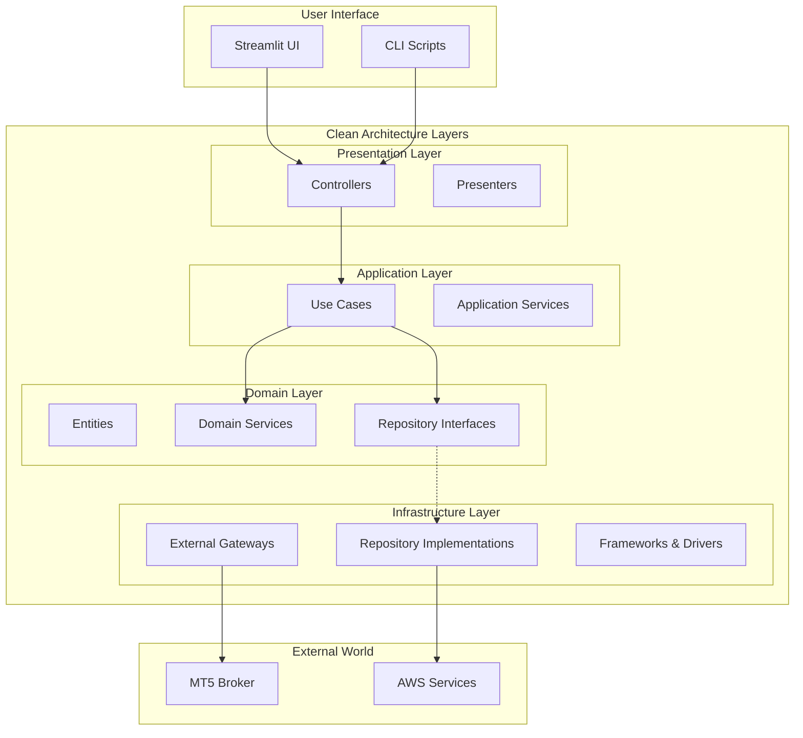
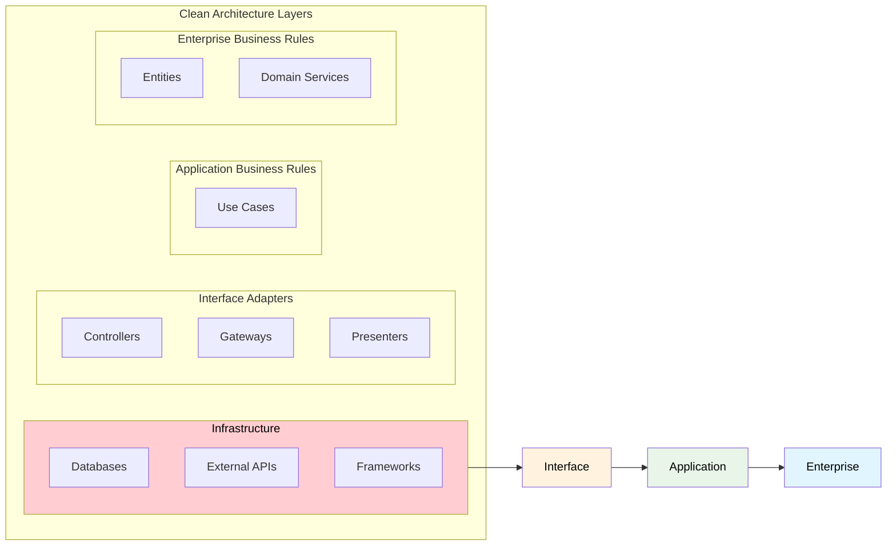
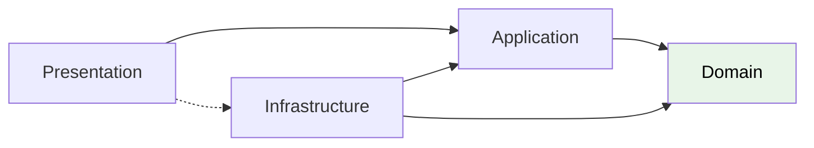
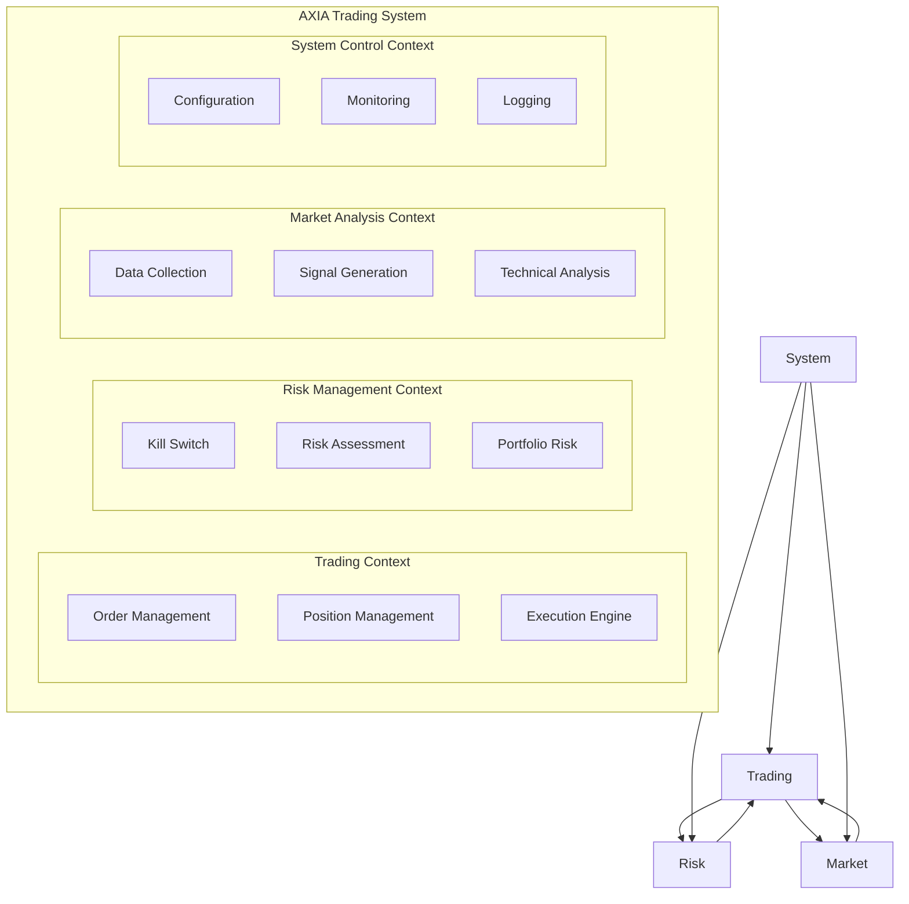
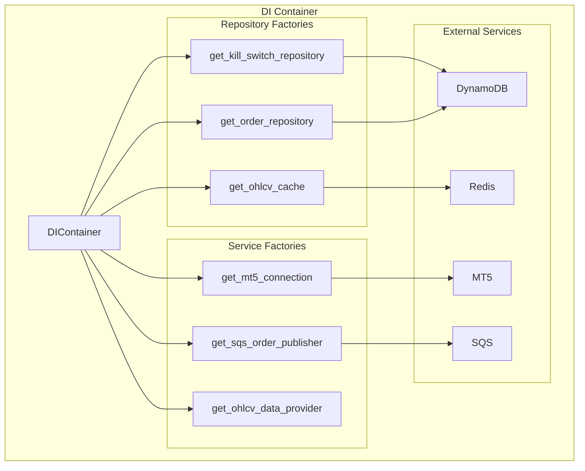
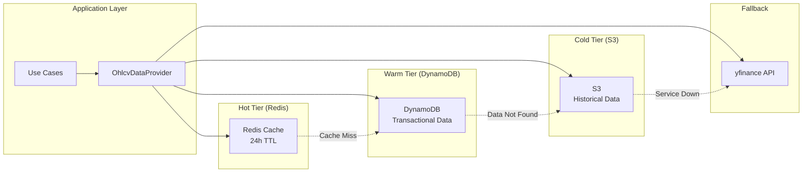
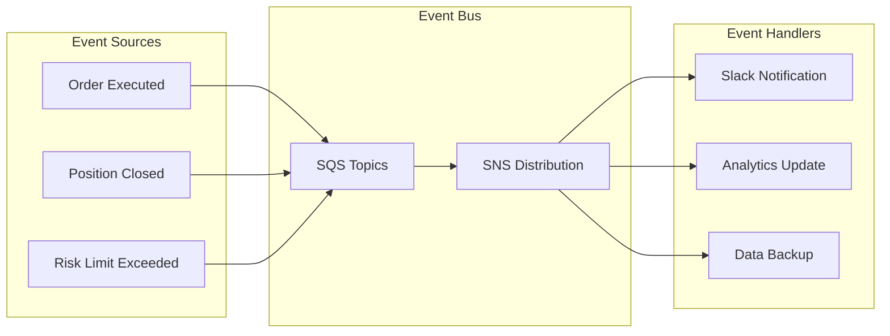
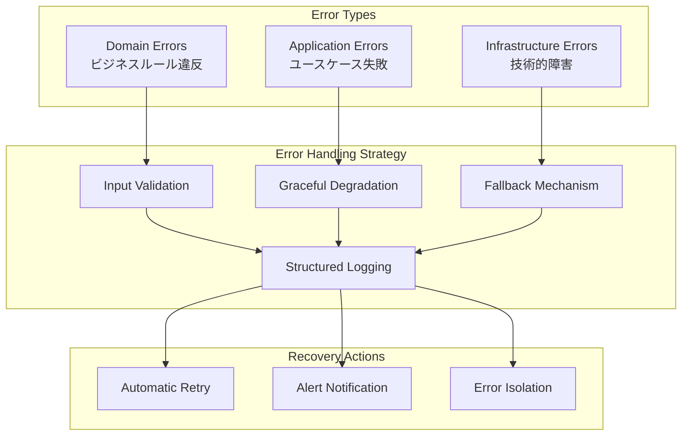

# アーキテクチャパターン設計

**Document Path**: `docs/logical_design/architecture_patterns.md`  
**Version**: 1.0  
**Type**: アーキテクチャパターン設計書  
**Last Updated**: 2025-10-19

---

## 目次

- [1. アーキテクチャ概要](#1-アーキテクチャ概要)
- [2. クリーンアーキテクチャ](#2-クリーンアーキテクチャ)
- [3. ドメイン駆動設計（DDD）](#3-ドメイン駆動設計ddd)
- [4. 依存性注入パターン](#4-依存性注入パターン)
- [5. データアクセスパターン](#5-データアクセスパターン)
- [6. イベント駆動アーキテクチャ](#6-イベント駆動アーキテクチャ)
- [7. エラーハンドリングパターン](#7-エラーハンドリングパターン)
- [8. 設計原則](#8-設計原則)
- [9. 命名規則](#9-命名規則)

---

## 1. アーキテクチャ概要

### 基本アーキテクチャ思想

**関心の分離（Separation of Concerns）** と **依存性逆転の原則（Dependency Inversion Principle）** を基盤とし、ビジネスロジックを技術的詳細から完全に分離した保守性・テスタビリティの高いシステムを構築する。



### アーキテクチャ原則

| 原則 | 説明 | 実装での適用 |
|------|------|-------------|
| **依存性逆転** | 上位モジュールは下位モジュールに依存しない | Domain層がInfrastructure層を知らない |
| **関心の分離** | 各レイヤーは単一の責務を持つ | UI、ビジネス、データの完全分離 |
| **開放閉鎖原則** | 拡張に開放、修正に閉鎖 | インターフェースによる拡張性確保 |
| **単一責任原則** | 各クラスは単一の責任のみ | OrderValidationServiceなど専門特化 |

---

## 2. クリーンアーキテクチャ

### 2.1 レイヤー構成と責務



#### Presentation Layer（プレゼンテーション層）
**責務**: 外部からの入力を受け取り、Application層に処理を委譲、結果を適切な形式で返却

**実装場所**: `src/presentation/`

```python
# 実装例: src/presentation/ui/streamlit/pages/trading_page.py
def render_trading_page():
    """取引ページのレンダリング"""
    # UI固有のロジックのみ
    # ビジネスロジックはApplication層に委譲
    container = DIContainer()
    order_publisher = container.get_sqs_order_publisher()
    
    if st.button("BUY注文"):
        # UseCaseに処理を委譲
        success, message = _execute_order(order_data, order_publisher)
```

**特徴**:
- UI固有のロジック（Streamlit、CLI）のみ含む
- ビジネスロジックを含まない
- Application層への単方向依存

#### Application Layer（アプリケーション層）
**責務**: ユースケースの実装、Domain層のオーケストレーション

**実装場所**: `src/application/`

```python
# 実装例: src/application/use_cases/order_processing/process_sqs_order.py
class ProcessSQSOrderUseCase:
    """SQS注文処理ユースケース"""
    
    def __init__(self, kill_switch_repo, mt5_executor, ...):
        self.kill_switch_repo = kill_switch_repo  # Domain interface
        self.mt5_executor = mt5_executor          # Domain interface
    
    def execute(self, message: Dict[str, Any]) -> bool:
        # ユースケースの実装
        # Domain servicesをオーケストレーション
        if self.kill_switch_repo.is_active():
            return True
        
        # Domain serviceを利用
        result = self.mt5_executor.execute_order(payload, credentials)
        return result
```

**特徴**:
- ユースケースの実装
- Domain層のサービス・エンティティをオーケストレーション
- Infrastructure層を直接知らない（インターフェース経由）

#### Domain Layer（ドメイン層）
**責務**: ビジネスロジック、ドメインモデル、ビジネスルールの実装

**実装場所**: `src/domain/`

```python
# 実装例: src/domain/entities/order.py
@dataclass
class Order:
    """注文エンティティ - 純粋なビジネスロジック"""
    
    ticket_id: str
    symbol: str
    lot_size: Decimal
    # ...
    
    def is_valid(self) -> bool:
        """ビジネスルールに基づく妥当性検証"""
        return (
            self.lot_size > 0 and
            self.symbol and
            self.order_type in ['MARKET', 'LIMIT']
        )

# 実装例: src/domain/services/order_validation.py
class OrderValidationService:
    """注文検証ドメインサービス"""
    
    def validate_order(self, order: Order) -> bool:
        """ドメイン固有の検証ロジック"""
        return order.is_valid() and self._check_business_rules(order)
```

**特徴**:
- 他のレイヤーに依存しない
- フレームワーク非依存
- ビジネスルールの完全な表現

#### Infrastructure Layer（インフラストラクチャ層）
**責務**: 技術的詳細の実装、外部システムとの接続

**実装場所**: `src/infrastructure/`

```python
# 実装例: src/infrastructure/persistence/dynamodb/dynamodb_order_repository.py
class DynamoDBOrderRepository(IOrderRepository):
    """DynamoDB注文リポジトリ実装"""
    
    def __init__(self, table_name: str, dynamodb_resource):
        self.table_name = table_name
        self.dynamodb = dynamodb_resource
    
    async def save(self, order: Order) -> None:
        """DynamoDB固有の保存実装"""
        item = order.to_dict()  # Domain entityをDynamoDB形式に変換
        self.table.put_item(Item=item)
```

**特徴**:
- Domain層のインターフェースを実装
- 技術的詳細（DynamoDB、Redis、MT5 API）を隠蔽
- 外部システムへの適応

### 2.2 依存関係の方向



**依存関係のルール**:
1. **内側のレイヤーは外側のレイヤーを知らない**
2. **依存はすべて内向き（Domain層向き）**
3. **Infrastructure層はDomain層のインターフェースを実装**
4. **Presentation層からInfrastructure層への直接依存は禁止**

---

## 3. ドメイン駆動設計（DDD）

### 3.1 境界づけられたコンテキスト

現在の実装で定義されているコンテキスト：



### 3.2 実装中のDDDパターン

#### Repository Pattern（実装済み）
**目的**: データアクセスの抽象化

```python
# Domain層: インターフェース定義
# src/domain/repositories/kill_switch_repository.py
class IKillSwitchRepository(ABC):
    @abstractmethod
    def is_active(self) -> bool:
        pass
    
    @abstractmethod 
    def update_with_reason(self, activate: bool, reason: str = None) -> bool:
        pass

# Infrastructure層: 実装
# src/infrastructure/persistence/dynamodb/dynamodb_kill_switch_repository.py
class DynamoDBKillSwitchRepository(IKillSwitchRepository):
    def is_active(self) -> bool:
        # DynamoDB固有の実装
        pass
```

#### Domain Service Pattern（実装済み）
**目的**: エンティティに属さないドメインロジックの実装

```python
# src/domain/services/order_validation.py
class OrderValidationService:
    """注文検証のドメインサービス"""
    
    def validate_order_size(self, lot_size: float) -> bool:
        """ロットサイズの妥当性検証"""
        return 0.01 <= lot_size <= 100.0
    
    def validate_price_levels(self, entry: float, sl: float, tp: float) -> bool:
        """価格レベルの妥当性検証"""
        # ドメイン固有のビジネスルール
        pass
```

#### Dependency Injection Pattern（実装済み）
**目的**: 依存関係の疎結合化

```python
# src/infrastructure/di/container.py
class DIContainer:
    """依存性注入コンテナ"""
    
    def get_kill_switch_repository(self) -> IKillSwitchRepository:
        """インターフェースを通じた依存性注入"""
        if not self._kill_switch_repository:
            self._kill_switch_repository = DynamoDBKillSwitchRepository(
                table_name=self.settings.dynamodb_table_name,
                dynamodb_resource=self.settings.dynamodb_resource
            )
        return self._kill_switch_repository
```

---

## 4. 依存性注入パターン

### 4.1 DIコンテナ設計

**実装場所**: `src/infrastructure/di/container.py`



### 4.2 シングルトンパターン実装

```python
class DIContainer:
    def __init__(self):
        # シングルトンインスタンス保持
        self._kill_switch_repository: Optional[IKillSwitchRepository] = None
        self._mt5_connection: Optional[MT5Connection] = None
    
    def get_kill_switch_repository(self) -> IKillSwitchRepository:
        """シングルトンパターンで重いオブジェクトを管理"""
        if not self._kill_switch_repository:
            self._kill_switch_repository = DynamoDBKillSwitchRepository(
                table_name=self.settings.dynamodb_table_name,
                dynamodb_resource=self.settings.dynamodb_resource
            )
        return self._kill_switch_repository

# グローバルシングルトンインスタンス
container = DIContainer()
```

### 4.3 Interface-Based Dependency

```python
# Application LayerでInterface依存
class ProcessSQSOrderUseCase:
    def __init__(
        self,
        kill_switch_repository: IKillSwitchRepository,  # Interface
        mt5_order_executor: IMT5OrderExecutor,          # Interface
        order_repository: IOrderRepository              # Interface
    ):
        # 具象クラスではなくインターフェースに依存
        self.kill_switch_repo = kill_switch_repository
```

---

## 5. データアクセスパターン

### 5.1 Multi-Tier Data Strategy（実装済み）

3階層データ戦略による効率的なデータアクセス：



### 5.2 Provider Pattern実装

**実装場所**: `src/infrastructure/gateways/market_data/ohlcv_data_provider.py`

```python
class OhlcvDataProvider:
    """統合データプロバイダー - 複数ソースからの透過的データアクセス"""
    
    def __init__(
        self,
        ohlcv_cache: Optional[RedisOhlcvDataRepository] = None,
        mt5_data_collector: Optional[MT5DataCollector] = None,
        s3_repository: Optional[S3OhlcvDataRepository] = None,
        yfinance_client: Optional[Any] = None
    ):
        # Optionalな依存関係 - 利用可能なソースのみ使用
        self.cache = ohlcv_cache
        self.mt5 = mt5_data_collector
        self.s3 = s3_repository
        self.yfinance = yfinance_client
    
    def get_data_with_freshness(
        self, 
        symbol: str, 
        timeframe: str, 
        period_days: int = 1
    ) -> Tuple[Optional[pd.DataFrame], Dict[str, Any]]:
        """フォールバック戦略による高可用性データ取得"""
        
        # 優先順位に基づくフォールバック
        sources = self._get_source_priority(period_days)
        
        for source in sources:
            try:
                df = self._fetch_from_source(source, symbol, timeframe, period_days)
                if df is not None:
                    # 成功時は自動キャッシュ
                    self._cache_result(df, symbol, timeframe)
                    return df, {'source': source, 'cache_hit': source == 'redis'}
            except Exception as e:
                logger.warning(f"Failed to fetch from {source}: {e}")
                continue
        
        return None, {'error': 'All sources failed'}
```

### 5.3 Repository Abstraction

```python
# Domain層: 抽象インターフェース
class IOhlcvDataRepository(ABC):
    @abstractmethod
    async def load_ohlcv(self, symbol: str, timeframe: str, days: int) -> Optional[pd.DataFrame]:
        pass
    
    @abstractmethod 
    async def save_ohlcv(self, df: pd.DataFrame, symbol: str, timeframe: str) -> bool:
        pass

# Infrastructure層: Redis実装
class RedisOhlcvDataRepository(IOhlcvDataRepository):
    async def load_ohlcv(self, symbol: str, timeframe: str, days: int) -> Optional[pd.DataFrame]:
        # Redis固有の実装
        pass

# Infrastructure層: S3実装  
class S3OhlcvDataRepository(IOhlcvDataRepository):
    async def load_ohlcv(self, symbol: str, timeframe: str, days: int) -> Optional[pd.DataFrame]:
        # S3固有の実装
        pass
```

---

## 6. イベント駆動アーキテクチャ

### 6.1 Event Publishing Pattern（将来実装）



### 6.2 Domain Events（設計済み）

```python
# src/domain/events/trading_events.py
@dataclass
class PositionOpened(DomainEvent):
    """ポジションオープンイベント"""
    position_id: str
    symbol: str
    volume: Decimal
    entry_price: Price
    opened_at: datetime

@dataclass
class KillSwitchActivated(DomainEvent):
    """Kill Switch有効化イベント"""
    reason: str
    triggered_by: str
    active_positions: List[str]
    activated_at: datetime
```

---

## 7. エラーハンドリングパターン

### 7.1 Layered Error Handling



### 7.2 実装例

```python
# src/application/use_cases/order_processing/process_sqs_order.py
class ProcessSQSOrderUseCase:
    def execute(self, message: Dict[str, Any]) -> bool:
        try:
            # ビジネスルール検証
            if self.kill_switch_repository.is_active():
                logger.info("Kill switch active, skipping order processing")
                return True  # ビジネス上の正常状態
            
            # Infrastructure層の操作
            if self.mt5_connection.connect():
                # 注文処理...
                pass
            else:
                logger.error("MT5 connection failed")
                return True  # 回復不能エラーとして削除
                
        except json.JSONDecodeError:
            # データ形式エラー - 回復不能
            logger.error(f"Invalid JSON: {message['Body']}")
            return True
            
        except Exception as e:
            # 予期しないエラー - リトライ可能
            logger.error(f"Unexpected error: {e}", exc_info=True)
            return False
```

### 7.3 Graceful Degradation

```python
# src/infrastructure/gateways/market_data/ohlcv_data_provider.py
def get_data_with_freshness(self, symbol: str, timeframe: str) -> Tuple[Optional[pd.DataFrame], Dict]:
    """段階的フォールバック戦略"""
    
    # 1. Redis (最高性能)
    try:
        if self.cache:
            df = self.cache.load_ohlcv(symbol, timeframe)
            if df is not None:
                return df, {'source': 'redis', 'cache_hit': True}
    except Exception as e:
        logger.warning(f"Redis cache failed: {e}")
    
    # 2. MT5 (リアルタイム)
    try:
        if self.mt5:
            df = self.mt5.fetch_ohlcv_data(symbol, timeframe, 1000)
            if df is not None:
                return df, {'source': 'mt5', 'cache_hit': False}
    except Exception as e:
        logger.warning(f"MT5 failed: {e}")
    
    # 3. yfinance (最終フォールバック)
    try:
        if self.yfinance:
            df = self._fetch_from_yfinance(symbol, timeframe)
            if df is not None:
                return df, {'source': 'yfinance', 'cache_hit': False}
    except Exception as e:
        logger.error(f"All data sources failed: {e}")
    
    return None, {'error': 'All sources failed'}
```

---

## 8. 設計原則

### 8.1 SOLID原則の適用

| 原則 | 説明 | 実装例 |
|------|------|--------|
| **S** - Single Responsibility | 各クラスは単一の責任 | `OrderValidationService`は検証のみ |
| **O** - Open/Closed | 拡張に開放、修正に閉鎖 | `IDataRepository`で新ソース追加可能 |
| **L** - Liskov Substitution | 派生クラスは基底クラスと置換可能 | 全Repository実装が同じInterface |
| **I** - Interface Segregation | インターフェースを小さく分割 | 機能別Repository分離 |
| **D** - Dependency Inversion | 抽象に依存、具象に依存しない | DIコンテナによる依存注入 |

### 8.2 テスタビリティ原則

```python
# テスタブルな設計例
class ProcessSQSOrderUseCase:
    def __init__(
        self,
        kill_switch_repository: IKillSwitchRepository,  # Mock可能
        mt5_order_executor: IMT5OrderExecutor,          # Mock可能
        order_validator: OrderValidationService         # 単体テスト可能
    ):
        # 依存性注入により各コンポーネントを独立してテスト可能
        pass

# テストコード例
def test_kill_switch_active_skips_order():
    # Mock Repository
    mock_kill_switch = Mock(spec=IKillSwitchRepository)
    mock_kill_switch.is_active.return_value = True
    
    # テスト対象
    use_case = ProcessSQSOrderUseCase(
        kill_switch_repository=mock_kill_switch,
        mt5_order_executor=Mock(),
        order_validator=Mock()
    )
    
    # テスト実行
    result = use_case.execute({"test": "data"})
    
    # 検証
    assert result == True
    mock_kill_switch.is_active.assert_called_once()
```

### 8.3 パフォーマンス原則

```python
# シングルトンパターンによるリソース効率化
class DIContainer:
    def get_redis_client(self) -> RedisClient:
        """重いオブジェクトのシングルトン管理"""
        if not self._redis_client:
            self._redis_client = RedisClient.get_instance(
                host=self.settings.redis.redis_endpoint,
                # 接続プール設定で性能最適化
                max_connections=self.settings.redis.redis_max_connections
            )
        return self._redis_client

# 非同期処理による応答性向上
class OhlcvDataProvider:
    async def get_data_parallel(self, symbols: List[str]) -> Dict[str, pd.DataFrame]:
        """複数シンボルの並列データ取得"""
        tasks = [
            self.get_data_with_freshness(symbol, 'H1') 
            for symbol in symbols
        ]
        results = await asyncio.gather(*tasks, return_exceptions=True)
        return dict(zip(symbols, results))
```

---

## 9. 命名規則

### 9.1 Infrastructure層のSuffix規則

AXIAでは、Infrastructure層のクラス命名に以下のSuffixルールを適用します。

| Suffix | 責務 | 使用例 | 該当ファイル |
|--------|------|--------|-------------|
| **Repository** | データ永続化 | `DynamoDBKillSwitchRepository`<br/>`DynamoDBOrderRepository`<br/>`RedisOhlcvDataRepository` | `src/infrastructure/persistence/dynamodb/`<br/>`src/infrastructure/persistence/redis/` |
| **Provider** | データ提供 | `OhlcvDataProvider`<br/>`MT5PriceProvider`<br/>`MT5AccountProvider` | `src/infrastructure/gateways/market_data/`<br/>`src/infrastructure/gateways/brokers/mt5/` |
| **Gateway** | 外部API統合 | `YFinanceGateway` | `src/infrastructure/gateways/market_data/` |
| **Client** | 接続管理 | `RedisClient` | `src/infrastructure/persistence/redis/` |
| **Connection** | 接続管理（専用） | `MT5Connection` | `src/infrastructure/gateways/brokers/mt5/` |
| **Executor** | 実行処理 | `MT5OrderExecutor` | `src/infrastructure/gateways/brokers/mt5/` |
| **Collector** | データ収集 | `MT5DataCollector` | `src/infrastructure/gateways/brokers/mt5/` |
| **Publisher** | メッセージ送信 | `SQSOrderPublisher` | `src/infrastructure/gateways/messaging/sqs/` |
| **Listener** | メッセージ受信 | `SQSQueueListener` | `src/infrastructure/gateways/messaging/sqs/` |

### 9.2 Domain層のSuffix規則

| Suffix | 責務 | 使用例 | 該当ファイル |
|--------|------|--------|-------------|
| **Service** | ドメインロジック | `OrderValidationService` | `src/domain/services/` |
| **Entity** | エンティティ | `Order` | `src/domain/entities/` |

---

## 付録

### A. 実装済みパターン

| パターン | 実装場所 | 実装状況 |
|---------|----------|---------|
| **Repository Pattern** | `src/domain/repositories/` | ✅ 完了 |
| **Dependency Injection** | `src/infrastructure/di/container.py` | ✅ 完了 |
| **Provider Pattern** | `src/infrastructure/gateways/market_data/` | ✅ 完了 |
| **Domain Service** | `src/domain/services/order_validation.py` | ✅ 完了 |
| **Use Case Pattern** | `src/application/use_cases/` | ✅ 完了 |

### B. 実装予定パターン

| パターン | 実装予定場所 | 優先度 | 実装時期 |
|---------|-------------|-------|---------|
| **Position Domain Integration** | `src/domain/entities/position.py` | High | Phase 3 |
| **Repository Pattern (Position)** | `src/domain/repositories/position_repository.py` | High | Phase 3 |
| **SQS Unified Architecture** | `src/application/use_cases/order_processing/` | High | Phase 3 |
| **Domain Events** | `src/domain/events/` | Medium | Phase 3+ |
| **Event Sourcing** | `src/infrastructure/events/` | Low | Phase 4 |
| **CQRS** | `src/application/queries/` | Low | Phase 4 |

### C. アンチパターンの回避

| アンチパターン | 回避方法 | 実装での対策 |
|--------------|---------|-------------|
| **God Object** | 単一責任原則の徹底 | 機能別クラス分割 |
| **Anemic Domain Model** | ドメインロジックをエンティティに配置 | Order.is_valid()など |
| **Service Locator** | Dependency Injection使用 | DIContainer活用 |
| **Shotgun Surgery** | 関心の分離 | レイヤー分割の徹底 |

---

**Document Version**: 1.0  
**Last Updated**: 2025-10-19  
**Next Review**: 2025-11-19