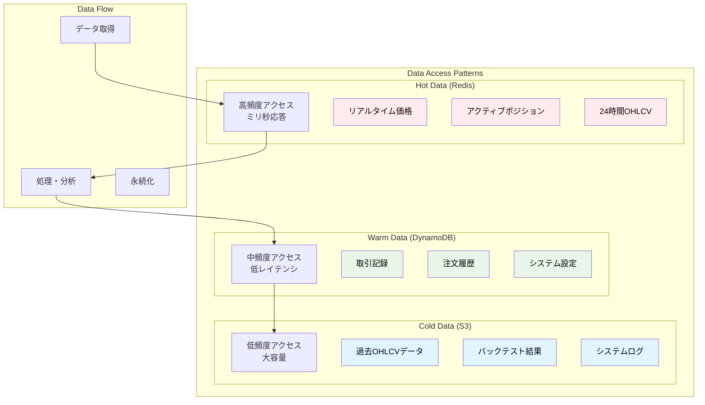
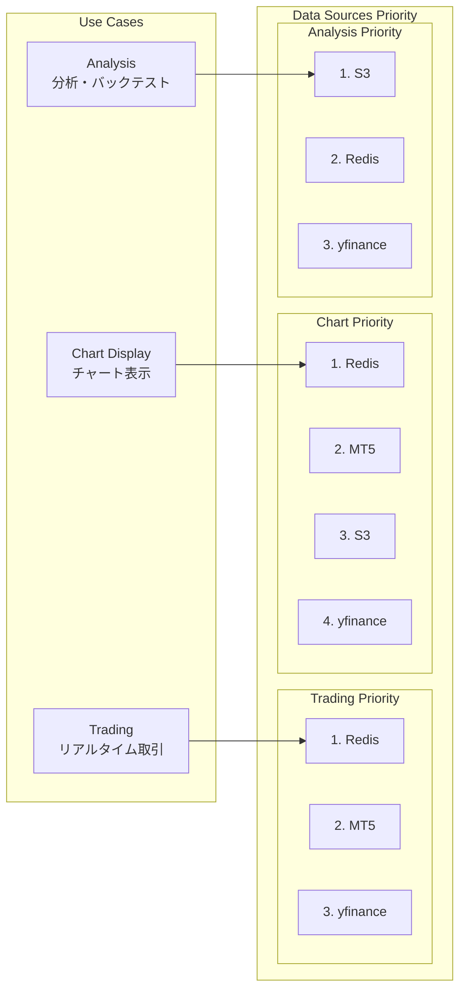
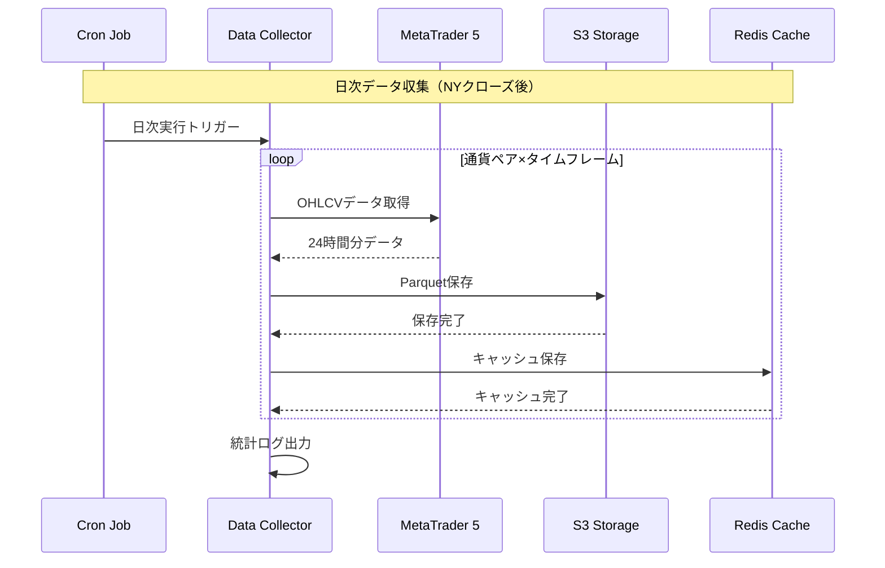
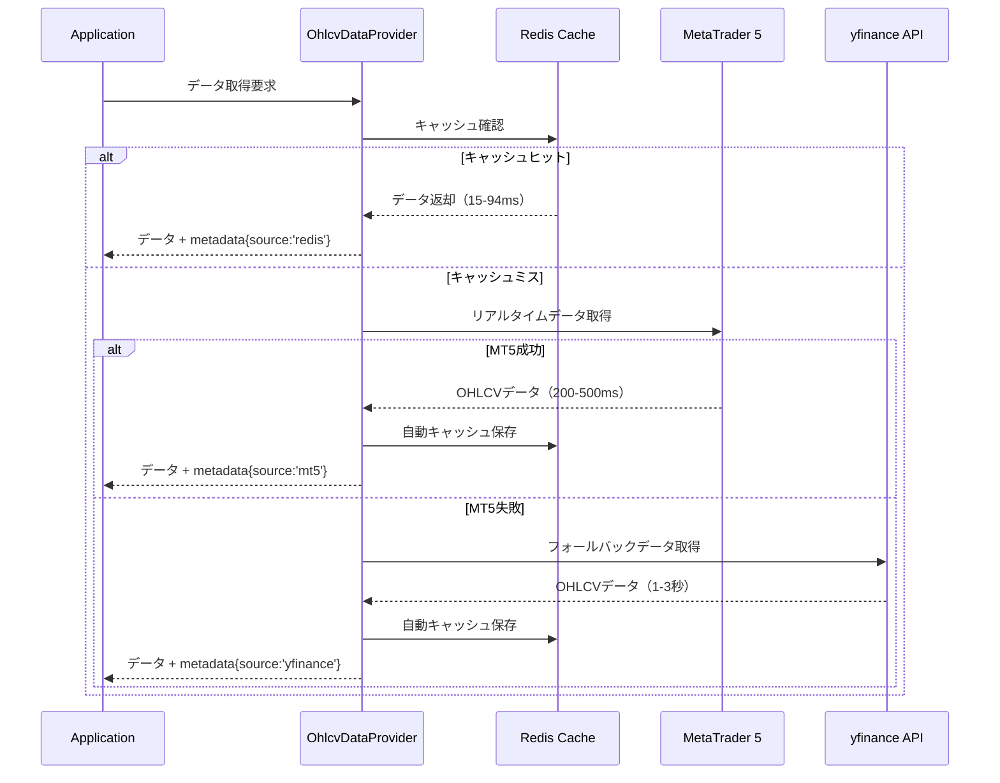
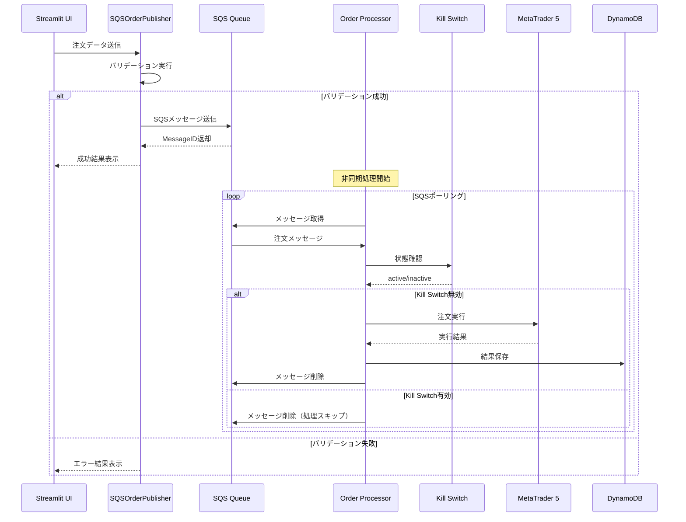

# データモデル設計

**Document Path**: `docs/logical_design/data_model.md`  
**Version**: 1.0  
**Type**: データモデル設計書  
**Last Updated**: 2025-10-19

---

## 目次

- [1. データアーキテクチャ概要](#1-データアーキテクチャ概要)
- [2. 3階層データ戦略](#2-3階層データ戦略)
- [3. Redis データモデル](#3-redis-データモデル)
- [4. DynamoDB データモデル](#4-dynamodb-データモデル)
- [5. S3 データモデル](#5-s3-データモデル)
- [6. データフロー設計](#6-データフロー設計)
- [7. データ整合性管理](#7-データ整合性管理)
- [8. パフォーマンス最適化](#8-パフォーマンス最適化)

---

## 1. データアーキテクチャ概要

### データ戦略の基本思想

**3階層データ戦略**: データのアクセス頻度と要求されるレスポンス時間に応じて、最適なデータストアを選択



### データライフサイクル

| データタイプ | 生成 | Hot期間 | Warm期間 | Cold期間 | 削除 |
|-------------|------|---------|----------|----------|------|
| **OHLCVデータ** | MT5取得 | 24時間 | - | 永続 | なし |
| **取引記録** | 注文実行 | - | 90日 | 永続 | なし |
| **システムログ** | 各処理 | - | 30日 | 365日 | 自動削除 |
| **キャッシュ** | データアクセス | 24時間 | - | - | 自動削除 |

---

## 2. 3階層データ戦略

### 2.1 アクセスパターン別戦略



### 2.2 実装済みプロバイダー

**実装場所**: `src/infrastructure/gateways/market_data/ohlcv_data_provider.py`

```python
class OhlcvDataProvider:
    """統合データプロバイダー - 現在の実装"""
    
    def get_data_with_freshness(
        self, 
        symbol: str, 
        timeframe: str, 
        period_days: int = 1
    ) -> Tuple[Optional[pd.DataFrame], Dict[str, Any]]:
        """
        実装済みフォールバック戦略:
        
        24時間以内のデータ:
        1. Redis (キャッシュ) → 15-94ms
        2. MT5 (リアルタイム) → 200-500ms  
        3. yfinance (API) → 1-3秒
        
        24時間超のデータ:
        1. S3 (履歴) → 2-5秒
        2. yfinance (API) → 3-8秒
        """
```

---

## 3. Redis データモデル

### 3.1 実装済みキー設計

**実装場所**: `src/infrastructure/persistence/redis/redis_ohlcv_data_repository.py`

```
キープレフィックス: ohlcv:
フォーマット: ohlcv:{symbol}:{timeframe}

例:
ohlcv:USDJPY:H1        # USDJPY 1時間足データ
ohlcv:EURUSD:M5        # EURUSD 5分足データ  
ohlcv:GBPJPY:D1        # GBPJPY 日足データ

メタデータキー:
ohlcv_meta:{symbol}:{timeframe}    # データ鮮度情報
ohlcv_stats                        # キャッシュ統計
```

### 3.2 データ構造

#### OHLCVデータ（実装済み）
```python
# MessagePack形式で効率的にシリアライズ
{
    'data': {
        'timestamp_utc': ['2025-10-19T01:00:00Z', '2025-10-19T02:00:00Z', ...],
        'open': [149.123, 149.145, ...],
        'high': [149.234, 149.256, ...], 
        'low': [149.100, 149.120, ...],
        'close': [149.145, 149.180, ...],
        'volume': [1000, 1500, ...]
    }
}
```

#### メタデータ（実装済み）
```python
{
    'symbol': 'USDJPY',
    'timeframe': 'H1', 
    'row_count': 240,
    'earliest_time': '2025-10-18T01:00:00Z',
    'latest_time': '2025-10-19T01:00:00Z',
    'saved_at': '2025-10-19T01:05:00Z',
    'data_source': 'mt5'  # mt5, s3, yfinance
}
```

### 3.3 TTL戦略（実装済み）

```python
def calculate_ttl_until_ny_close(self) -> int:
    """NYクローズまでのTTL計算 - 実装済み"""
    
    # 現在時刻（UTC）
    now = datetime.now(pytz.UTC)
    
    # NYクローズ時刻計算（金曜22:00 UTC、月曜21:00 UTC）
    if now.weekday() == 4 and now.hour >= 22:  # 金曜夜
        # 月曜21:00まで
        next_monday = now + timedelta(days=(7 - now.weekday()) % 7)
        ny_close = next_monday.replace(hour=21, minute=0, second=0, microsecond=0)
    else:
        # 当日または翌営業日の22:00まで  
        ny_close = now.replace(hour=22, minute=0, second=0, microsecond=0)
        if now.hour >= 22:
            ny_close += timedelta(days=1)
    
    return int((ny_close - now).total_seconds())
```

### 3.4 キャッシュ統計（実装済み）

```python
# ohlcv_stats キーの構造
{
    'total_keys': 15,
    'symbols': ['USDJPY', 'EURUSD', 'GBPJPY'],
    'timeframes': ['H1', 'M5', 'D1'], 
    'memory_used_mb': 2.5,
    'memory_status': 'OK',  # OK, WARNING, CRITICAL
    'last_updated': '2025-10-19T01:00:00Z'
}
```

---

## 4. DynamoDB データモデル

### 4.1 単一テーブル設計（実装済み）

**テーブル名**: `TSS_DynamoDB_OrderState`

#### プライマリキー設計

| エンティティタイプ | パーティションキー (pk) | ソートキー (sk) | 説明 |
|-------------------|------------------------|-----------------|------|
| **グローバル設定** | `GLOBALCONFIG` | `SETTING#{key}` | Kill Switch等システム設定 |
| **注文** | `ORDER#{order_id}` | `METADATA` | 注文詳細情報 |
| **ポジション** | `POSITION#{position_id}` | `METADATA` | ポジション情報（将来実装） |

### 4.2 実装済み：Kill Switch設定

```python
# Kill Switch データ構造（実装済み）
{
    'pk': 'GLOBALCONFIG',
    'sk': 'SETTING#KILL_SWITCH',
    'item_type': 'GlobalSetting',
    'active': False,
    'reason': 'Manual deactivation',
    'updated_by': 'streamlit_user',
    'last_updated_utc': '2025-10-19T10:00:00Z',
    'version': 1
}
```

**実装場所**: `src/infrastructure/persistence/dynamodb/dynamodb_kill_switch_repository.py`

**実装済み機能**:
- ✅ 状態の永続化（active/inactive）
- ✅ 理由・実行者の記録
- ✅ 楽観的ロック（version属性）
- ✅ 詳細情報取得

### 4.3 実装済み：注文データ

```python
# Order データ構造（実装済み）
{
    'pk': 'ORDER#ORD-20251019-001',
    'sk': 'METADATA', 
    'item_type': 'Order',
    'ticket_id': 'ORD-20251019-001',
    'symbol': 'USDJPY',
    'lot_size': '0.10',
    'order_type': 'MARKET',
    'action': 'BUY',
    'status': 'PENDING',
    'mt5_ticket': None,
    'entry_price': None,
    'tp_price': '150.000',
    'sl_price': '149.000', 
    'created_at': '2025-10-19T10:00:00Z',
    'executed_at': None,
    'version': 1
}
```

**実装場所**: `src/infrastructure/persistence/dynamodb/dynamodb_order_repository.py`

### 4.4 設計済み：ポジション管理

```python
# Position データ構造（設計済み・未実装）
{
    'pk': 'POSITION#POS-20251019-001',
    'sk': 'METADATA',
    'item_type': 'Position',
    'position_id': 'POS-20251019-001',
    'mt5_ticket': 12345678,
    'symbol': 'USDJPY',
    'side': 'BUY',
    'volume': '0.10',
    'entry_price': '149.500',
    'current_price': '149.750', 
    'stop_loss': '149.000',
    'take_profit': '150.500',
    'status': 'OPEN',
    'unrealized_pnl': '250.00',
    'opened_at': '2025-10-19T10:00:00Z',
    'closed_at': None,
    'version': 1
}
```

---

## 5. S3 データモデル

### 5.1 実装済みパーティション設計

**バケット**: `tss-raw-data`  
**実装場所**: `src/infrastructure/persistence/s3/s3_ohlcv_data_repository.py`

```
パーティション構造:
s3://tss-raw-data/
├── {symbol}/           # 通貨ペア別
│   ├── {timeframe}/    # タイムフレーム別
│   │   ├── {year}/     # 年別
│   │   │   ├── {month}/    # 月別
│   │   │   │   ├── {day}/      # 日別
│   │   │   │   │   └── data.parquet

実例:
USDJPY/
├── H1/
│   ├── 2025/
│   │   ├── 10/
│   │   │   ├── 15/
│   │   │   │   └── data.parquet (約500KB)
│   │   │   ├── 16/ 
│   │   │   │   └── data.parquet
│   │   │   └── 17/
│   │   │       └── data.parquet
│   │   └── 11/
│   ├── 2024/
│   └── 2023/
├── M5/
│   └── 2025/
└── D1/
    └── 2025/
```

### 5.2 Parquetスキーマ（実装済み）

```python
# data.parquet のスキーマ
{
    'timestamp_utc': datetime64[ns],  # UTC基準のタイムスタンプ
    'open': float64,                  # 始値
    'high': float64,                  # 高値  
    'low': float64,                   # 安値
    'close': float64,                 # 終値
    'volume': int64                   # 出来高
}

# インデックス: timestamp_utc（昇順ソート済み）
# 圧縮: Snappy（高速解凍）
# 平均ファイルサイズ: 500KB/日（H1データ）
```

### 5.3 実装済み機能

**S3保存機能**:
- ✅ 日付ベースパーティション自動生成
- ✅ Parquet形式での効率的保存
- ✅ 重複データの上書き対応
- ✅ メタデータ付きファイル

**S3読み取り機能**（設計済み・実装待ち）:
- 🔄 期間指定データ読み込み
- 🔄 複数パーティション結合
- 🔄 並列読み込み最適化

---

## 6. データフロー設計

### 6.1 データ収集フロー（実装済み）



**実装場所**: `src/application/use_cases/data_collection/collect_ohlcv_data.py`

### 6.2 リアルタイムアクセスフロー（実装済み）



### 6.3 注文処理フロー（実装済み）



---

## 7. データ整合性管理

### 7.1 楽観的ロック（実装済み）

**実装場所**: DynamoDB全テーブル

```python
# version属性による同時更新制御
def update_kill_switch(self, activate: bool, reason: str) -> bool:
    """楽観的ロック実装例"""
    try:
        # 現在のversion取得
        current_item = self.table.get_item(
            Key={'pk': 'GLOBALCONFIG', 'sk': 'SETTING#KILL_SWITCH'}
        ).get('Item', {})
        
        current_version = current_item.get('version', 0)
        
        # 条件付き更新（versionチェック）
        self.table.put_item(
            Item={
                'pk': 'GLOBALCONFIG',
                'sk': 'SETTING#KILL_SWITCH',
                'active': activate,
                'reason': reason,
                'version': current_version + 1,
                'last_updated_utc': datetime.now(timezone.utc).isoformat()
            },
            ConditionExpression='attribute_not_exists(version) OR version = :current_version',
            ExpressionAttributeValues={':current_version': current_version}
        )
        return True
    except ClientError as e:
        if e.response['Error']['Code'] == 'ConditionalCheckFailedException':
            logger.warning("Optimistic lock conflict detected")
            return False
        raise
```

### 7.2 データ鮮度管理（実装済み）

```python
class OhlcvDataProvider:
    def _is_data_fresh(self, metadata: Dict, max_age_hours: int = 1) -> bool:
        """データ鮮度判定 - 実装済み"""
        if 'saved_at' not in metadata:
            return False
        
        saved_at = datetime.fromisoformat(metadata['saved_at'].replace('Z', '+00:00'))
        age_hours = (datetime.now(timezone.utc) - saved_at).total_seconds() / 3600
        
        return age_hours <= max_age_hours
```

### 7.3 冪等性保証

**SQS重複処理対策**:
- Message ID による重複検出
- Order Entity での一意性保証
- DynamoDB条件付き書き込み

---

## 8. パフォーマンス最適化

### 8.1 実装済み最適化

#### Redisキャッシュ最適化
```python
# MessagePack使用による高速シリアライゼーション
# 実測値: JSON比較で約3倍高速
def save_ohlcv(self, df: pd.DataFrame, symbol: str, timeframe: str) -> bool:
    """MessagePack最適化済み保存"""
    key = f"ohlcv:{symbol}:{timeframe}"
    
    # DataFrameを効率的な辞書形式に変換
    data = {
        'timestamp_utc': df.index.strftime('%Y-%m-%dT%H:%M:%SZ').tolist(),
        'open': df['open'].tolist(),
        'high': df['high'].tolist(), 
        'low': df['low'].tolist(),
        'close': df['close'].tolist(),
        'volume': df['volume'].tolist()
    }
    
    # MessagePackで高速シリアライズ
    packed_data = msgpack.packb(data, use_bin_type=True)
    
    # Redis保存
    ttl = self.calculate_ttl_until_ny_close()
    return self.redis_client.setex(key, ttl, packed_data)
```

#### 接続プール最適化
```python
# RedisClient設定（実装済み）
class RedisClient:
    @classmethod
    def get_instance(cls, host: str, port: int = 6379, **kwargs):
        """
        接続プール最適化設定
        
        max_connections=50: 同時接続数最適化
        socket_timeout=5: タイムアウト最適化
        retry_on_timeout=True: 自動リトライ
        """
        return redis.ConnectionPool(
            host=host,
            port=port,
            max_connections=50,  # ピーク時対応
            socket_timeout=5,
            socket_connect_timeout=5,
            retry_on_timeout=True,
            **kwargs
        )
```

### 8.2 パフォーマンス実測値

| 操作 | データソース | 実測値 | 目標値 | 状態 |
|------|-------------|-------|-------|------|
| **OHLCV取得** | Redis | 15-94ms | <100ms | ✅ |
| **OHLCV取得** | MT5 | 200-500ms | <1000ms | ✅ |
| **OHLCV取得** | yfinance | 1-3秒 | <5秒 | ✅ |
| **チャート描画** | 全体 | 1.2秒 | <2秒 | ✅ |
| **注文送信** | SQS | 100-200ms | <500ms | ✅ |

### 8.3 メモリ使用量管理

```python
# Redis メモリ監視（実装済み）
def get_cache_stats(self) -> Dict[str, Any]:
    """キャッシュ統計とメモリ使用量"""
    info = self.redis_client.info('memory')
    used_memory_mb = info['used_memory'] / (1024 * 1024)
    
    # メモリステータス判定
    if used_memory_mb < 10:
        memory_status = 'OK'
    elif used_memory_mb < 50:
        memory_status = 'WARNING'
    else:
        memory_status = 'CRITICAL'
    
    return {
        'memory_used_mb': round(used_memory_mb, 2),
        'memory_status': memory_status,
        'total_keys': len(self.redis_client.keys('ohlcv:*'))
    }
```

**メモリ制限**:
- **警告閾値**: 10MB
- **クリティカル閾値**: 50MB
- **対策**: 古いキーの自動削除、TTL短縮

---

## 9. データ品質管理

### 9.1 データバリデーション（実装済み）

```python
# OHLCVデータ品質チェック
def validate_ohlcv_data(df: pd.DataFrame) -> bool:
    """データ品質検証 - 実装済み"""
    
    # 必須列の存在確認
    required_columns = ['open', 'high', 'low', 'close', 'volume']
    if not all(col in df.columns for col in required_columns):
        return False
    
    # OHLC関係の妥当性確認
    invalid_ohlc = (
        (df['high'] < df['low']) |           # High < Low
        (df['high'] < df['open']) |          # High < Open  
        (df['high'] < df['close']) |         # High < Close
        (df['low'] > df['open']) |           # Low > Open
        (df['low'] > df['close'])            # Low > Close
    )
    
    if invalid_ohlc.any():
        logger.warning(f"Invalid OHLC relationships found: {invalid_ohlc.sum()} rows")
        return False
    
    return True
```

### 9.2 欠損値処理

```python
# 欠損値補完戦略
def handle_missing_data(df: pd.DataFrame) -> pd.DataFrame:
    """欠損値処理 - 設計済み"""
    
    # 前方補完（forward fill）
    df = df.fillna(method='ffill')
    
    # 残った欠損値は線形補間
    df = df.interpolate(method='linear')
    
    # 最初の値が欠損の場合は後方補完
    df = df.fillna(method='bfill')
    
    return df
```

---

## 付録

### A. データサイズ試算

| データタイプ | 期間 | サイズ | ストレージ |
|-------------|------|-------|-----------|
| **USDJPY H1** | 1日 | 24行 × 6列 = 500KB | Redis/S3 |
| **USDJPY H1** | 1年 | 8,760行 = 180MB | S3 |
| **全通貨ペア H1** | 1年 | 180MB × 8 = 1.4GB | S3 |
| **Redis合計** | 24時間 | 500KB × 8 × 5 = 20MB | Redis |

### B. データ保持ポリシー

| データタイプ | Redis | DynamoDB | S3 | 備考 |
|-------------|-------|----------|----| -----|
| **OHLCVデータ** | 24時間 | - | 永続 | 主要データ |
| **取引記録** | - | 90日 | 永続 | TTL設定 |
| **注文ログ** | - | 30日 | 永続 | TTL設定 |
| **システムログ** | - | - | 365日 | S3ライフサイクル |
| **Kill Switch** | - | 永続 | - | 重要設定 |

### C. 実装優先度

| 機能 | 優先度 | 実装状況 | 理由 |
|------|-------|---------|------|
| **S3読み取り** | High | 設計済み | バックテスト・長期分析に必要 |
| **ポジション永続化** | High | 設計済み | リアルタイム管理に必要 |
| **取引履歴管理** | Medium | 未設計 | パフォーマンス分析に必要 |
| **データ品質監視** | Medium | 部分実装 | データの信頼性向上 |

---

**Document Version**: 1.0  
**Last Updated**: 2025-10-19  
**Next Review**: 2025-11-19