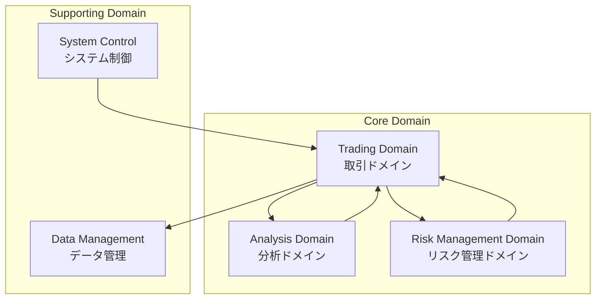
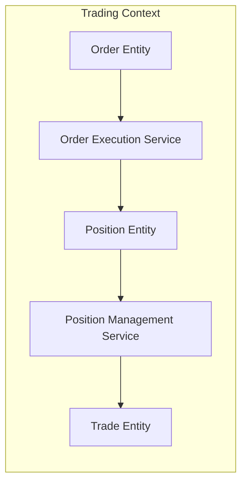
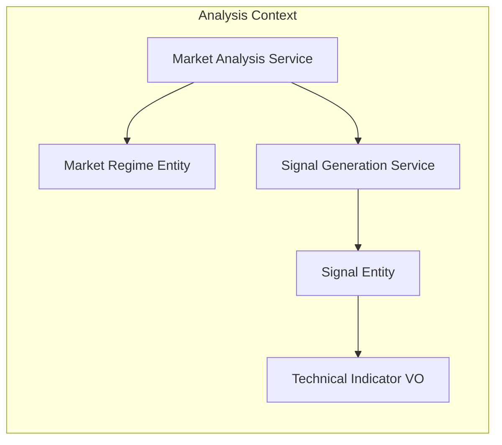
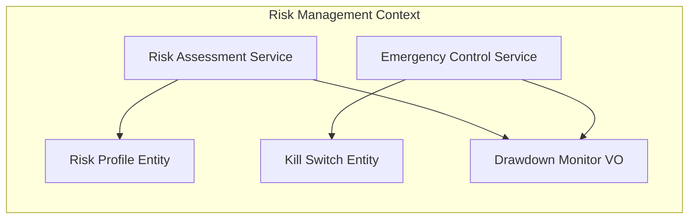
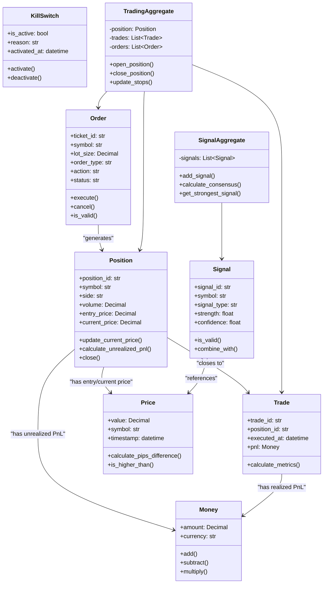

# ドメインモデル設計

**Document Path**: `docs/logical_design/domain_model.md`  
**Version**: 1.0  
**Type**: ドメインモデル設計書  
**Last Updated**: 2025-10-19

---

## 目次

- [1. ドメイン概要](#1-ドメイン概要)
- [2. 境界づけられたコンテキスト](#2-境界づけられたコンテキスト)
- [3. エンティティ設計](#3-エンティティ設計)
- [4. 値オブジェクト設計](#4-値オブジェクト設計)
- [5. 集約設計](#5-集約設計)
- [6. ドメインサービス](#6-ドメインサービス)
- [7. ドメインイベント](#7-ドメインイベント)
- [8. リポジトリインターフェース](#8-リポジトリインターフェース)

---

## 1. ドメイン概要

### ドメインの目的
**自動FX取引システムにおける取引・リスク管理・市場分析の各ビジネスロジックを純粋なドメインモデルとして表現**

### コアドメインコンセプト


---

## 2. 境界づけられたコンテキスト

### 2.1 Trading Context（取引コンテキスト）
**責務**: 注文・ポジション・取引実行の管理



**主要概念**:
- **Order**: 取引注文（未実行状態）
- **Position**: オープンしているポジション
- **Trade**: 実行された取引記録

### 2.2 Analysis Context（分析コンテキスト）
**責務**: 市場分析・シグナル生成・テクニカル指標計算



**主要概念**:
- **Signal**: テクニカル指標に基づく売買シグナル
- **MarketRegime**: 市場状態（トレンド/レンジ/ボラティリティ）
- **TechnicalIndicator**: RSI、MACD等の指標値

### 2.3 Risk Management Context（リスク管理コンテキスト）
**責務**: リスク評価・Kill Switch・損失制限



**主要概念**:
- **RiskProfile**: リスク許容度設定
- **KillSwitch**: 緊急停止状態
- **DrawdownMonitor**: ドローダウン監視

---

## 3. エンティティ設計

### 3.1 Order Entity（注文エンティティ）

**実装場所**: `src/domain/entities/order.py`

```python
@dataclass
class Order:
    """注文エンティティ - 取引注文の表現"""
    
    # アイデンティティ
    ticket_id: str
    
    # 基本属性
    symbol: str
    lot_size: Decimal
    order_type: str  # MARKET, LIMIT, STOP
    action: str      # BUY, SELL
    
    # 価格情報
    entry_price: Optional[Decimal] = None
    tp_price: Optional[Decimal] = None
    sl_price: Optional[Decimal] = None
    
    # 状態管理
    status: str = 'PENDING'  # PENDING, EXECUTED, FAILED, CANCELLED
    mt5_ticket: Optional[int] = None
    
    # 時間情報
    created_at: Optional[datetime] = None
    executed_at: Optional[datetime] = None
    
    def execute(self, mt5_ticket: int, execution_price: Decimal) -> None:
        """注文実行処理"""
        
    def cancel(self, reason: str) -> None:
        """注文キャンセル処理"""
        
    def is_valid(self) -> bool:
        """注文の妥当性検証"""
```

**ビジネスルール**:
- `ticket_id`は一意である必要がある
- `lot_size`は0より大きい値である必要がある
- MARKET注文は`entry_price`が不要
- LIMIT/STOP注文は`entry_price`が必須
- 実行後は`status`の変更ができない

### 3.2 Position Entity（ポジションエンティティ）

**実装予定場所**: `src/domain/entities/position.py`

```python
@dataclass
class Position:
    """ポジションエンティティ - オープンポジションの表現"""
    
    # アイデンティティ  
    position_id: str
    mt5_ticket: int
    
    # 基本属性
    symbol: str
    side: str        # BUY, SELL
    volume: Decimal
    
    # 価格情報
    entry_price: Decimal
    current_price: Decimal
    stop_loss: Optional[Decimal] = None
    take_profit: Optional[Decimal] = None
    
    # 状態管理
    status: str = 'OPEN'  # OPEN, CLOSED
    
    # 関連情報
    order_id: str
    strategy_id: Optional[str] = None
    
    # 時間情報
    opened_at: datetime
    closed_at: Optional[datetime] = None
    
    def update_current_price(self, price: Decimal) -> None:
        """現在価格の更新"""
        
    def calculate_unrealized_pnl(self) -> Decimal:
        """含み損益計算"""
        
    def close(self, close_price: Decimal) -> 'Trade':
        """ポジション決済"""
        
    def update_stops(self, sl: Decimal = None, tp: Decimal = None) -> None:
        """ストップロス・テイクプロフィット更新"""
```

**ビジネスルール**:
- ポジションは必ずOrderから生成される
- OPENステータスのポジションのみ価格更新可能
- 決済時はTradeエンティティが生成される
- stop_lossはentry_priceより不利な価格である必要がある

### 3.3 Signal Entity（シグナルエンティティ）

**実装予定場所**: `src/domain/entities/signal.py`

```python
@dataclass
class Signal:
    """シグナルエンティティ - 売買シグナルの表現"""
    
    # アイデンティティ
    signal_id: str
    
    # 基本属性
    symbol: str
    timeframe: str
    signal_type: str    # BUY, SELL, NEUTRAL
    indicator_name: str # RSI, MACD, Bollinger, etc.
    
    # シグナル詳細
    strength: float     # 0.0-1.0: シグナル強度
    confidence: float   # 0.0-1.0: 信頼度
    
    # 生成情報
    generated_at: datetime
    valid_until: datetime
    
    # メタデータ
    parameters: Dict[str, Any]
    market_regime: str  # TREND, RANGE, VOLATILE
    
    def is_valid(self) -> bool:
        """シグナル有効性チェック"""
        
    def combine_with(self, other_signal: 'Signal') -> 'Signal':
        """他シグナルとの統合"""
        
    def calculate_edge_probability(self) -> float:
        """エッジ確率計算"""
```

**ビジネスルール**:
- シグナルには有効期限がある
- strengthとconfidenceは0.0-1.0の範囲
- 同一シンボル・タイムフレームのシグナルは統合可能
- 市場レジームによってシグナル重みが変わる

---

## 4. 値オブジェクト設計

### 4.1 Money（金額値オブジェクト）

**実装予定場所**: `src/domain/value_objects/money.py`

```python
@dataclass(frozen=True)
class Money:
    """金額を表現する値オブジェクト"""
    
    amount: Decimal
    currency: str = 'JPY'
    
    def __post_init__(self):
        if self.amount < 0:
            raise ValueError("Amount cannot be negative")
    
    def add(self, other: 'Money') -> 'Money':
        """加算"""
        
    def subtract(self, other: 'Money') -> 'Money':
        """減算"""
        
    def multiply(self, multiplier: Decimal) -> 'Money':
        """乗算"""
        
    def is_zero(self) -> bool:
        """ゼロ判定"""
```

### 4.2 Price（価格値オブジェクト）

**実装予定場所**: `src/domain/value_objects/price.py`

```python
@dataclass(frozen=True)
class Price:
    """価格を表現する値オブジェクト"""
    
    value: Decimal
    symbol: str
    timestamp: datetime
    
    def calculate_pips_difference(self, other: 'Price') -> int:
        """pips差計算"""
        
    def is_higher_than(self, other: 'Price') -> bool:
        """価格比較"""
        
    def apply_pip_offset(self, pips: int) -> 'Price':
        """pips分の価格調整"""
```

### 4.3 Risk Parameters（リスクパラメータ値オブジェクト）

**実装予定場所**: `src/domain/value_objects/risk_parameters.py`

```python
@dataclass(frozen=True)
class RiskParameters:
    """リスクパラメータを表現する値オブジェクト"""
    
    max_risk_per_trade: Decimal      # 1取引あたり最大リスク額
    max_daily_loss: Decimal          # 日次最大損失額
    max_drawdown_pct: Decimal        # 最大ドローダウン%
    max_positions: int               # 最大ポジション数
    risk_reward_ratio: Decimal       # 最小リスクリワード比
    
    def validate(self) -> bool:
        """パラメータ妥当性検証"""
        
    def calculate_position_size(self, stop_loss_pips: int, account_balance: Money) -> Decimal:
        """ポジションサイズ計算"""
```

---

## 5. 集約設計

### 5.1 Trading Aggregate（取引集約）

**集約ルート**: Position Entity  
**実装予定場所**: `src/domain/aggregates/trading/`

```python
class TradingAggregate:
    """取引集約 - ポジション管理の整合性を保証"""
    
    def __init__(self, position: Position):
        self._position = position
        self._trades: List[Trade] = []
        self._orders: List[Order] = []
    
    def open_position(self, order: Order, execution_price: Price) -> Position:
        """ポジションオープン"""
        
    def close_position(self, close_price: Price) -> Trade:
        """ポジション決済"""
        
    def partial_close(self, volume: Decimal, close_price: Price) -> Trade:
        """部分決済"""
        
    def update_stops(self, stop_loss: Price = None, take_profit: Price = None) -> None:
        """ストップ更新"""
```

**不変条件**:
- ポジションボリュームは常に正の値
- 決済ボリュームはオープンボリューム以下
- ストップロスはエントリー価格より不利な価格

### 5.2 Signal Aggregate（シグナル集約）

**集約ルート**: SignalCollection  
**実装予定場所**: `src/domain/aggregates/analysis/`

```python
class SignalAggregate:
    """シグナル集約 - 複数シグナルの統合管理"""
    
    def __init__(self, symbol: str, timeframe: str):
        self._symbol = symbol
        self._timeframe = timeframe
        self._signals: List[Signal] = []
    
    def add_signal(self, signal: Signal) -> None:
        """シグナル追加"""
        
    def calculate_consensus(self) -> Signal:
        """コンセンサスシグナル計算"""
        
    def remove_expired_signals(self) -> None:
        """期限切れシグナル削除"""
        
    def get_strongest_signal(self) -> Optional[Signal]:
        """最強シグナル取得"""
```

**不変条件**:
- 同一指標の重複シグナルは最新のもので上書き
- 期限切れシグナルは自動削除
- コンセンサス計算時は有効なシグナルのみ使用

---

## 6. ドメインサービス

### 6.1 Order Validation Service（注文検証サービス）

**実装場所**: `src/domain/services/order_validation.py`

```python
class OrderValidationService:
    """注文検証ドメインサービス"""
    
    def validate_order(self, order: Order, risk_params: RiskParameters) -> ValidationResult:
        """注文の妥当性検証"""
        
    def validate_lot_size(self, lot_size: Decimal, symbol: str) -> bool:
        """ロットサイズ検証"""
        
    def validate_price_levels(self, order: Order) -> bool:
        """価格レベル検証"""
        
    def check_risk_limits(self, order: Order, current_positions: List[Position]) -> bool:
        """リスク制限チェック"""
```

### 6.2 Risk Assessment Service（リスク評価サービス）

**実装予定場所**: `src/domain/services/risk_assessment.py`

```python
class RiskAssessmentService:
    """リスク評価ドメインサービス"""
    
    def calculate_portfolio_risk(self, positions: List[Position]) -> RiskMetrics:
        """ポートフォリオリスク計算"""
        
    def assess_position_correlation(self, positions: List[Position]) -> CorrelationMatrix:
        """ポジション相関評価"""
        
    def evaluate_drawdown_risk(self, trades: List[Trade]) -> DrawdownMetrics:
        """ドローダウンリスク評価"""
        
    def should_trigger_kill_switch(self, risk_metrics: RiskMetrics) -> bool:
        """Kill Switch発動判定"""
```

### 6.3 Signal Integration Service（シグナル統合サービス）

**実装予定場所**: `src/domain/services/signal_integration.py`

```python
class SignalIntegrationService:
    """シグナル統合ドメインサービス"""
    
    def integrate_signals(self, signals: List[Signal]) -> IntegratedSignal:
        """複数シグナルの統合"""
        
    def calculate_confidence_weighted_average(self, signals: List[Signal]) -> float:
        """信頼度加重平均計算"""
        
    def apply_market_regime_filter(self, signals: List[Signal], regime: MarketRegime) -> List[Signal]:
        """市場レジームフィルタ適用"""
        
    def calculate_edge_probability(self, integrated_signal: IntegratedSignal) -> float:
        """エッジ確率計算（ベイズ推論）"""
```

---

## 7. ドメインイベント

### 7.1 Trading Events（取引イベント）

**実装予定場所**: `src/domain/events/trading/`

```python
@dataclass
class PositionOpened(DomainEvent):
    """ポジションオープンイベント"""
    position_id: str
    symbol: str
    side: str
    volume: Decimal
    entry_price: Price
    opened_at: datetime

@dataclass
class PositionClosed(DomainEvent):
    """ポジション決済イベント"""
    position_id: str
    symbol: str
    close_price: Price
    pnl: Money
    closed_at: datetime

@dataclass
class OrderExecuted(DomainEvent):
    """注文実行イベント"""
    order_id: str
    mt5_ticket: int
    execution_price: Price
    executed_at: datetime
```

### 7.2 Risk Management Events（リスク管理イベント）

```python
@dataclass
class KillSwitchActivated(DomainEvent):
    """Kill Switch有効化イベント"""
    reason: str
    triggered_by: str
    active_positions: List[str]
    activated_at: datetime

@dataclass
class RiskLimitExceeded(DomainEvent):
    """リスク制限超過イベント"""
    limit_type: str  # DAILY_LOSS, DRAWDOWN, CORRELATION
    current_value: Decimal
    limit_value: Decimal
    detected_at: datetime

@dataclass
class DrawdownThresholdBreached(DomainEvent):
    """ドローダウン閾値超過イベント"""
    current_drawdown: Decimal
    threshold: Decimal
    account_balance: Money
    detected_at: datetime
```

### 7.3 Analysis Events（分析イベント）

```python
@dataclass
class SignalGenerated(DomainEvent):
    """シグナル生成イベント"""
    signal_id: str
    symbol: str
    signal_type: str
    strength: float
    confidence: float
    generated_at: datetime

@dataclass
class MarketRegimeChanged(DomainEvent):
    """市場レジーム変化イベント"""
    symbol: str
    previous_regime: str
    new_regime: str
    confidence: float
    changed_at: datetime
```

---

## 8. リポジトリインターフェース

### 8.1 Trading Repositories

**実装場所**: `src/domain/repositories/`

```python
class IOrderRepository(ABC):
    """注文リポジトリインターフェース"""
    
    @abstractmethod
    async def save(self, order: Order) -> None:
        pass
    
    @abstractmethod
    async def find_by_id(self, order_id: str) -> Optional[Order]:
        pass
    
    @abstractmethod
    async def find_pending_orders(self) -> List[Order]:
        pass

class IPositionRepository(ABC):
    """ポジションリポジトリインターフェース"""
    
    @abstractmethod
    async def save(self, position: Position) -> None:
        pass
    
    @abstractmethod
    async def find_by_id(self, position_id: str) -> Optional[Position]:
        pass
    
    @abstractmethod
    async def find_open_positions(self, symbol: str = None) -> List[Position]:
        pass
```

### 8.2 Analysis Repositories

```python
class ISignalRepository(ABC):
    """シグナルリポジトリインターフェース"""
    
    @abstractmethod
    async def save(self, signal: Signal) -> None:
        pass
    
    @abstractmethod
    async def find_by_symbol_timeframe(self, symbol: str, timeframe: str) -> List[Signal]:
        pass
    
    @abstractmethod
    async def remove_expired(self) -> int:
        pass

class IOhlcvDataRepository(ABC):
    """OHLCVデータリポジトリインターフェース"""
    
    @abstractmethod
    async def load_ohlcv(self, symbol: str, timeframe: str, period_days: int) -> Optional[pd.DataFrame]:
        pass
    
    @abstractmethod
    async def save_ohlcv(self, df: pd.DataFrame, symbol: str, timeframe: str) -> bool:
        pass
```

### 8.3 Risk Management Repositories

```python
class IKillSwitchRepository(ABC):
    """Kill Switchリポジトリインターフェース"""
    
    @abstractmethod
    async def is_active(self) -> bool:
        pass
    
    @abstractmethod
    async def activate(self, reason: str, activated_by: str) -> bool:
        pass
    
    @abstractmethod
    async def deactivate(self, deactivated_by: str) -> bool:
        pass
    
    @abstractmethod
    async def get_status_detail(self) -> Dict[str, Any]:
        pass
```

---

## 9. ドメインモデル関係図



---

## 付録

### A. 実装状況マトリックス

| ドメインオブジェクト | 実装済み | 実装場所 | 備考 |
|---------------------|----------|----------|------|
| **Order Entity** | ✅ | `src/domain/entities/order.py` | 基本実装完了 |
| **Position Entity** | ❌ | 未実装 | 設計完了、実装待ち |
| **Signal Entity** | ❌ | 未実装 | 設計完了、実装待ち |
| **Money VO** | ❌ | 未実装 | Decimal型で代用中 |
| **Price VO** | ❌ | 未実装 | float型で代用中 |
| **OrderValidationService** | ✅ | `src/domain/services/order_validation.py` | 基本実装完了 |
| **TradingAggregate** | ❌ | 未実装 | 設計完了、実装待ち |

### B. 次期実装優先度

| 優先度 | ドメインオブジェクト | 理由 |
|--------|---------------------|------|
| **High** | Position Entity | 現在実装中の機能に必要 |
| **High** | Money/Price VO | 型安全性向上のため |
| **Medium** | Signal Entity | シグナル統合機能実装時 |
| **Medium** | TradingAggregate | ビジネスルール保証のため |
| **Low** | ドメインイベント | 拡張機能実装時 |

---

**Document Version**: 1.0  
**Last Updated**: 2025-10-19  
**Next Review**: 2025-11-19