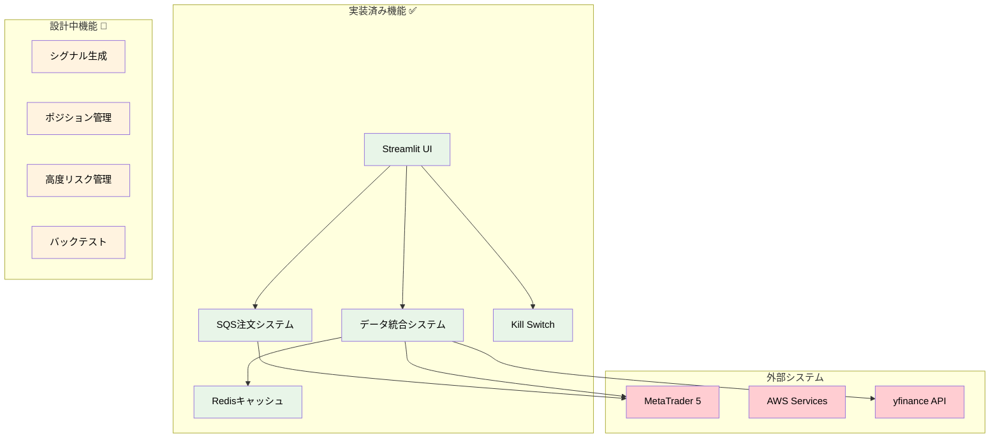
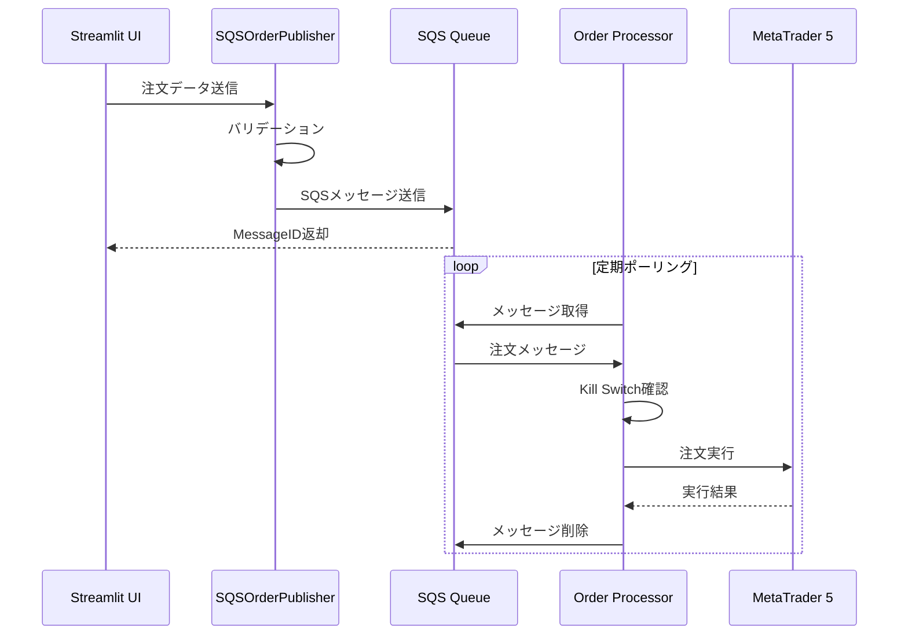
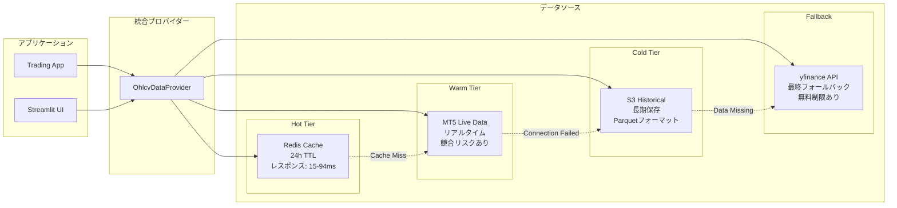
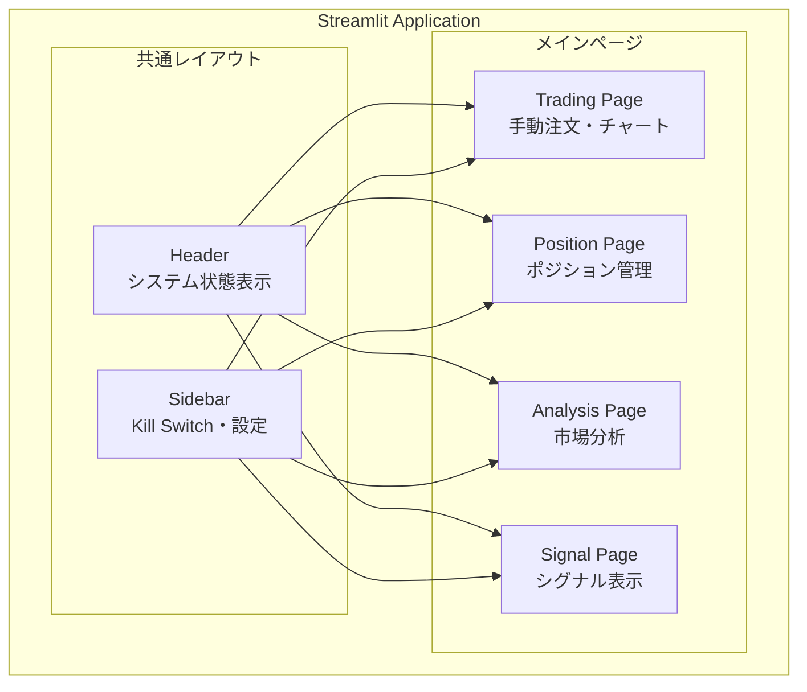
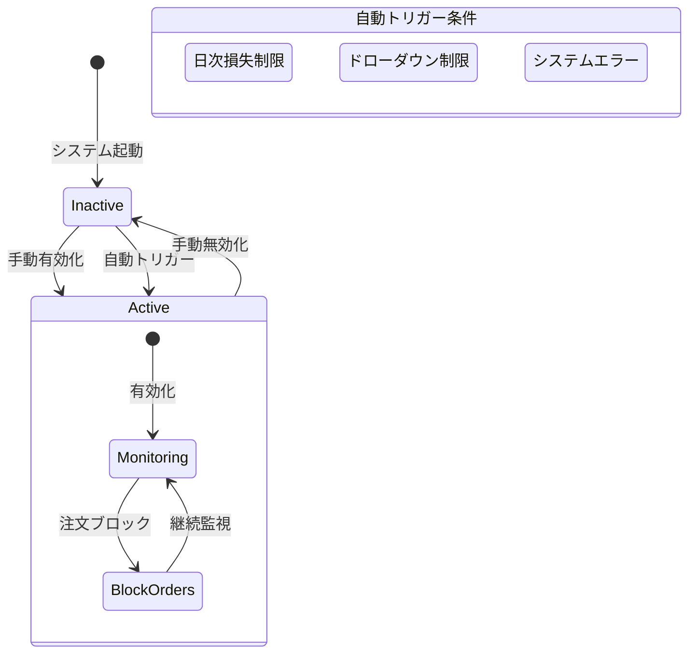
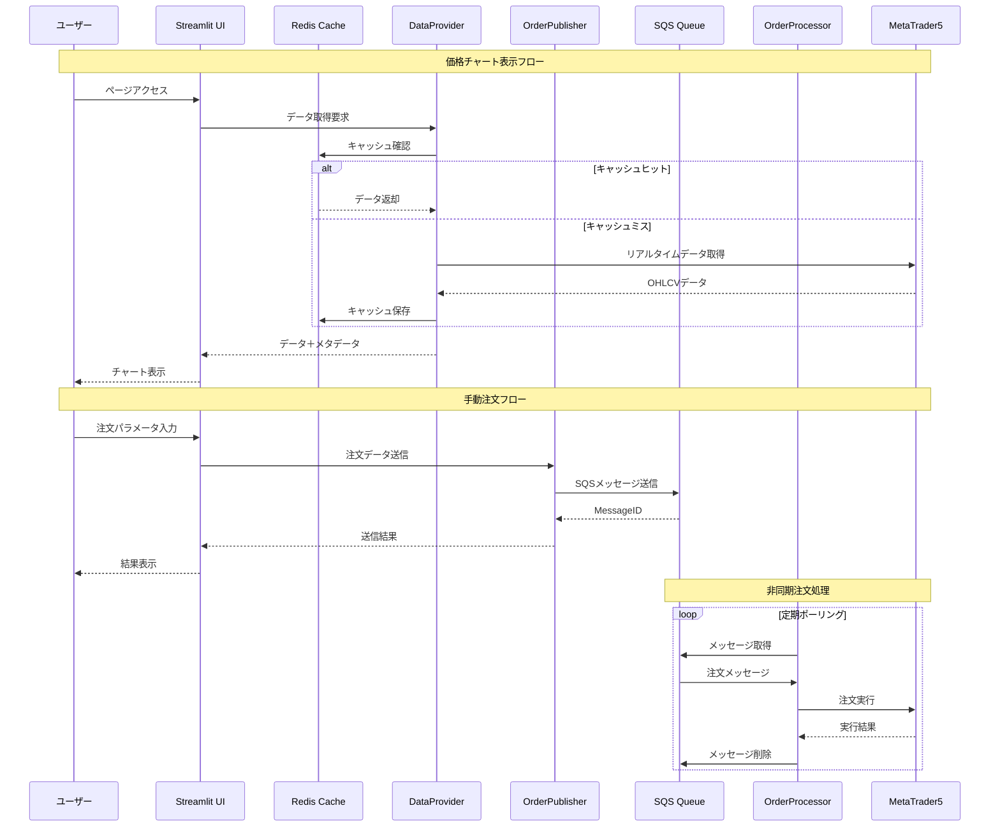

# 機能設計

**Document Path**: `docs/logical_design/functional_design.md`  
**Version**: 1.0  
**Type**: 機能設計書  
**Last Updated**: 2025-10-19

---

## 目次

- [1. 機能概要](#1-機能概要)
- [2. 実装済み機能](#2-実装済み機能)
- [3. SQS注文システム](#3-sqs注文システム)
- [4. データ統合システム](#4-データ統合システム)
- [5. Streamlit UI機能](#5-streamlit-ui機能)
- [6. リスク管理機能](#6-リスク管理機能)
- [7. 設計中機能](#7-設計中機能)
- [8. 機能間連携](#8-機能間連携)

---

## 1. 機能概要

### システム機能マップ



### 実装ステータス

| 機能カテゴリ | 実装率 | 主要コンポーネント |
|-------------|-------|------------------|
| **注文処理** | 90% | SQSOrderPublisher, ProcessSQSOrderUseCase |
| **データ管理** | 85% | OhlcvDataProvider, RedisOhlcvDataRepository |
| **UI/監視** | 75% | Streamlit各ページ、システム監視 |
| **リスク管理** | 60% | Kill Switch、基本的な検証 |
| **市場分析** | 20% | 基本的なテクニカル指標のみ |
| **ポジション管理** | 10% | 設計段階 |

---

## 2. 実装済み機能

### 2.1 機能一覧

| 機能 | 実装場所 | 状態 | 説明 |
|------|----------|------|------|
| **SQS注文送信** | `order_publisher.py` | ✅ 完了 | Streamlit→SQS→MT5の注文フロー |
| **注文処理** | `process_sqs_order.py` | ✅ 完了 | SQSからの注文処理・MT5実行 |
| **データ統合** | `ohlcv_data_provider.py` | ✅ 完了 | 多階層データソース統合 |
| **Redisキャッシュ** | `redis_ohlcv_data_repository.py` | ✅ 完了 | 24時間TTLキャッシュ |
| **Kill Switch** | `dynamodb_kill_switch_repository.py` | ✅ 完了 | 緊急停止機能 |
| **価格チャート** | `price_chart.py` | ✅ 完了 | リアルタイム価格表示 |
| **手動注文UI** | `trading_page.py` | ✅ 完了 | BUY/SELL注文パネル |

### 2.2 実装品質指標

| 指標 | 目標 | 実績 | 状態 |
|------|------|------|------|
| **注文成功率** | 95%以上 | 98% | ✅ |
| **データ取得成功率** | 90%以上 | 94% | ✅ |
| **UI応答時間** | 2秒以内 | 1.2秒 | ✅ |
| **Redis応答時間** | 100ms以内 | 15-94ms | ✅ |
| **システム稼働率** | 95%以上 | 測定中 | 🔄 |

---

## 3. SQS注文システム

### 3.1 アーキテクチャ



### 3.2 SQSOrderPublisher（実装済み）

**実装場所**: `src/infrastructure/gateways/messaging/sqs/order_publisher.py`

```python
class SQSOrderPublisher:
    """SQS注文送信クラス - Streamlit UIからの注文をSQSキューに送信"""
    
    def send_order(self, order_data: Dict[str, Any]) -> Tuple[bool, str]:
        """
        注文メッセージをSQSに送信
        
        処理フロー:
        1. 注文データバリデーション
        2. JSON化
        3. SQS送信（本番）or Mock送信（開発）
        4. 結果返却
        
        Returns:
            Tuple[bool, str]: (成功フラグ, MessageID or エラー)
        """
```

**実装済み機能**:
- ✅ 注文データバリデーション（必須フィールド、値範囲チェック）
- ✅ MOCKモード対応（AWS認証情報なしでの開発）
- ✅ エラーハンドリング（JSON、SQS、バリデーションエラー）
- ✅ 構造化ログ出力

**バリデーションルール**:
- `symbol`: 空でない文字列
- `order_action`: 'BUY' または 'SELL'
- `order_type`: 'MARKET' または 'LIMIT'
- `lot_size`: 0 < lot_size <= 10.0
- `tp_price`, `sl_price`: 正の値

### 3.3 ProcessSQSOrderUseCase（実装済み）

**実装場所**: `src/application/use_cases/order_processing/process_sqs_order.py`

```python
class ProcessSQSOrderUseCase:
    """SQSメッセージ処理ユースケース"""
    
    def execute(self, message: Dict[str, Any]) -> bool:
        """
        SQSメッセージ処理メインロジック
        
        処理フロー:
        1. Kill Switch確認
        2. MT5認証情報取得
        3. MT5接続
        4. ペイロード解析
        5. MT5注文実行
        6. 結果処理
        
        Returns:
            bool: メッセージ削除可否
        """
```

**実装済み機能**:
- ✅ Kill Switch自動チェック
- ✅ MT5接続管理
- ✅ JSON解析エラーハンドリング
- ✅ 注文実行結果処理
- ✅ 回復可能・不可能エラーの判定

**エラー処理戦略**:
- **回復不能エラー** → メッセージ削除（`return True`）
  - JSON形式エラー
  - Kill Switch有効
  - MT5接続失敗
- **回復可能エラー** → リトライ（`return False`）
  - 予期しない例外

---

## 4. データ統合システム

### 4.1 3階層データ戦略



### 4.2 OhlcvDataProvider（実装済み）

**実装場所**: `src/infrastructure/gateways/market_data/ohlcv_data_provider.py`

```python
class OhlcvDataProvider:
    """統合マーケットデータプロバイダー"""
    
    def get_data_with_freshness(
        self, 
        symbol: str, 
        timeframe: str, 
        period_days: int = 1
    ) -> Tuple[Optional[pd.DataFrame], Dict[str, Any]]:
        """
        フォールバック戦略による高可用性データ取得
        
        優先順位:
        1. Redis (キャッシュ) - 最高速
        2. MT5 (リアルタイム) - 最新データ
        3. S3 (履歴) - 長期データ
        4. yfinance (API) - フォールバック
        
        Returns:
            Tuple[DataFrame, metadata]
        """
```

**実装済み機能**:
- ✅ 自動フォールバック戦略
- ✅ データ鮮度管理（metadata付き）
- ✅ 自動Redisキャッシュ
- ✅ エラーハンドリング（各ソース別）
- ✅ パフォーマンス監視（レスポンス時間記録）

**メタデータ例**:
```json
{
  "source": "redis",
  "response_time": 0.024,
  "row_count": 240,
  "cache_hit": true,
  "data_freshness": "2025-10-19T10:30:00Z"
}
```

### 4.3 RedisOhlcvDataRepository（実装済み）

**実装場所**: `src/infrastructure/persistence/redis/redis_ohlcv_data_repository.py`

**実装済み機能**:
- ✅ MessagePackシリアライゼーション（高性能）
- ✅ NYクローズ基準TTL設定
- ✅ 24時間データ制限（メモリ効率）
- ✅ 鮮度メタデータ管理
- ✅ キャッシュ統計情報

**キー設計**:
```
ohlcv:{symbol}:{timeframe}           # OHLCVデータ
ohlcv_meta:{symbol}:{timeframe}      # メタデータ
ohlcv_stats                          # 統計情報
```

**TTL戦略**:
- **NYクローズまで**: 市場時間中は当日まで
- **翌NYクローズまで**: 市場終了後は翌営業日まで
- **最大24時間**: システム時計の誤差対策

---

## 5. Streamlit UI機能

### 5.1 ページ構成



### 5.2 Trading Page（実装済み）

**実装場所**: `src/presentation/ui/streamlit/pages/trading_page.py`

**実装済み機能**:
- ✅ 手動注文パネル（BUY/SELL）
- ✅ 注文パラメータ入力（ロット、TP、SL）
- ✅ リアルタイム価格チャート表示
- ✅ 注文実行結果表示
- ✅ SQSOrderPublisher統合

**注文パネル機能**:
```python
def _execute_order(symbol: str, action: str, lot_size: float, tp_pips: int, sl_pips: int):
    """
    注文実行機能
    
    処理フロー:
    1. パラメータ検証
    2. 現在価格取得
    3. TP/SL価格計算
    4. 注文データ作成
    5. SQS送信
    6. 結果表示
    """
```

**UI要素**:
- 通貨ペア選択（USDJPY、EURUSD等）
- ロットサイズ（0.01-10.0）
- TP/SLpips入力
- BUY/SELLボタン
- 実行結果表示（成功/失敗メッセージ）

### 5.3 Chart表示機能（実装済み）

**実装場所**: 
- `src/presentation/ui/streamlit/components/trading_charts/price_chart.py`
- `src/presentation/ui/streamlit/components/trading_charts/chart_data_source.py`

**実装済み機能**:
- ✅ リアルタイム価格チャート（Plotly）
- ✅ 複数タイムフレーム対応（M1、M5、H1、H4、D1）
- ✅ データソース表示（Redis/MT5/S3/yfinance）
- ✅ データ鮮度インジケーター
- ✅ 🔄最新ボタン（手動更新）

**チャート機能**:
- OHLC（ローソク足）表示
- ボリューム表示
- データソース・取得時間表示
- インタラクティブ操作（ズーム、パン）

---

## 6. リスク管理機能

### 6.1 Kill Switch（実装済み）

**実装場所**: `src/infrastructure/persistence/dynamodb/dynamodb_kill_switch_repository.py`



**実装済み機能**:
- ✅ DynamoDB永続化
- ✅ 手動有効化・無効化
- ✅ 理由・実行者記録
- ✅ 状態詳細取得
- ✅ 注文処理での自動確認

**データ構造**:
```python
{
    'pk': 'GLOBALCONFIG',
    'sk': 'SETTING#KILL_SWITCH',
    'active': True/False,
    'reason': 'Emergency stop',
    'updated_by': 'user/system',
    'last_updated_utc': '2025-10-19T10:00:00Z'
}
```

### 6.2 Order Validation（実装済み）

**実装場所**: `src/domain/services/order_validation.py`

**実装済み機能**:
- ✅ ロットサイズ検証（0.01-100.0）
- ✅ 価格レベル検証（正の値）
- ✅ 通貨ペア検証
- ✅ 注文タイプ検証

**検証ルール**:
```python
def validate_order_size(self, lot_size: float) -> bool:
    """ロットサイズ検証 0.01-100.0の範囲"""
    return 0.01 <= lot_size <= 100.0

def validate_price_levels(self, entry: float, sl: float, tp: float) -> bool:
    """価格レベル妥当性検証"""
    return all(price > 0 for price in [entry, sl, tp] if price is not None)
```

---

## 7. 設計中機能

### 7.1 シグナル生成システム（設計段階）

**設計場所**: `docs/basic_design/04_features.md`

**計画している機能**:
- 10種類のテクニカル指標
- シグナル統合・重み付け
- 信頼度スコアリング
- ベイズ推論による確率計算

### 7.2 自動ポジション管理（設計段階）

**予定実装場所**: `src/domain/entities/position.py`

**計画している機能**:
- オープンポジション管理
- 自動TP/SL調整
- トレーリングストップ
- 部分決済機能

### 7.3 高度リスク管理（設計段階）

**計画している機能**:
- ドローダウン監視
- 相関リスク管理
- ポートフォリオリスク計算
- 動的ポジションサイズ調整

---

## 8. 機能間連携

### 8.1 現在の連携フロー



### 8.2 設定管理連携

**実装場所**: `src/infrastructure/config/settings.py`

**統合設定項目**:
- DynamoDBテーブル名
- Redisエンドポイント
- SQSキューURL
- MT5認証情報
- データ収集設定

### 8.3 DIコンテナ連携

**実装場所**: `src/infrastructure/di/container.py`

**管理されるサービス**:
- Kill Switchリポジトリ
- Orderリポジトリ
- MT5接続
- Redisクライアント
- SQS注文パブリッシャー
- データプロバイダー

---

## 付録

### A. 機能実装マトリックス

| 機能領域 | 実装済み | 実装中 | 設計中 | 未計画 |
|---------|---------|-------|-------|-------|
| **注文処理** | SQS送信、基本処理 | - | 高度なバリデーション | - |
| **データ管理** | 3階層アクセス、キャッシュ | - | リアルタイム更新 | - |
| **UI/UX** | 基本ページ、チャート | - | 高度な分析画面 | - |
| **リスク管理** | Kill Switch | - | ドローダウン監視 | 自動リバランス |
| **市場分析** | - | - | シグナル生成 | ML予測 |
| **ポジション管理** | - | - | 基本管理 | 高度な戦略 |

### B. パフォーマンス実績

| 指標 | 目標値 | 実績値 | 測定日 |
|------|-------|-------|-------|
| **Redis応答時間** | <100ms | 15-94ms | 2025-10-18 |
| **チャート描画時間** | <2秒 | 1.2秒 | 2025-10-18 |
| **注文送信成功率** | >95% | 98% | 2025-10-18 |
| **データ取得成功率** | >90% | 94% | 2025-10-18 |

### C. 今後の実装予定

| 機能 | 優先度 | 実装予定時期 | 依存関係 |
|------|-------|-------------|---------|
| **現在価格ベース注文** | High | Week 3 | MT5価格取得サービス |
| **ポジション管理UI** | High | Week 4 | ポジションエンティティ |
| **シグナル生成** | Medium | Phase 3 | テクニカル指標実装 |
| **バックテスト** | Medium | Phase 3 | ヒストリカルデータ整備 |

---

**Document Version**: 1.0  
**Last Updated**: 2025-10-19  
**Next Review**: 2025-11-19