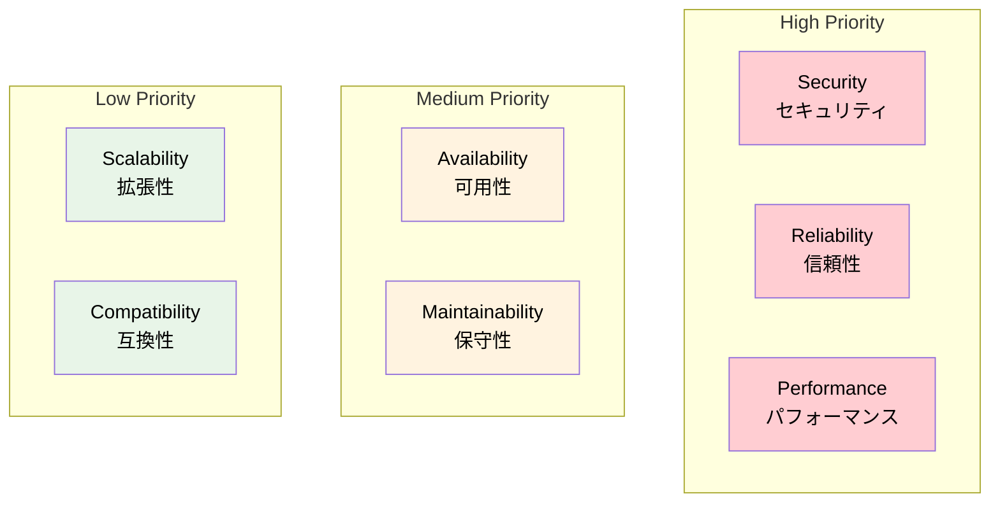
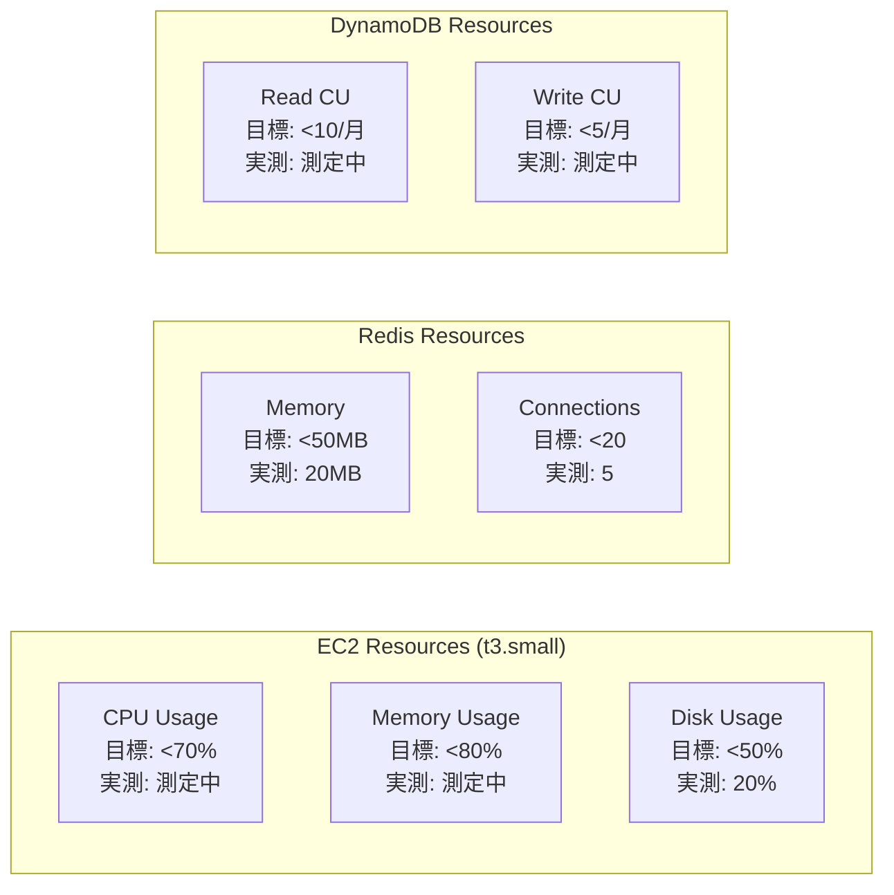
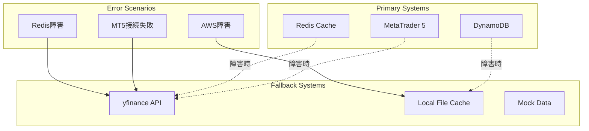
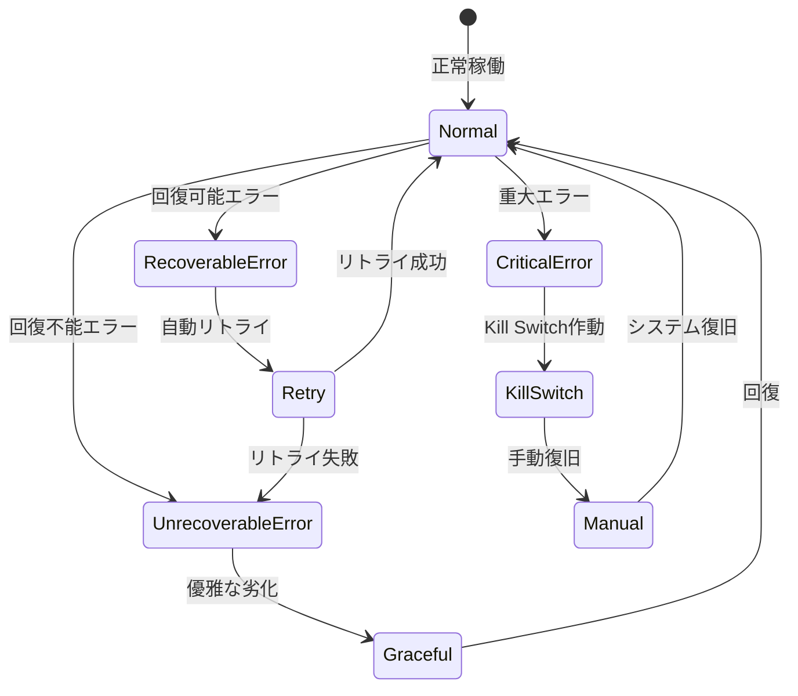
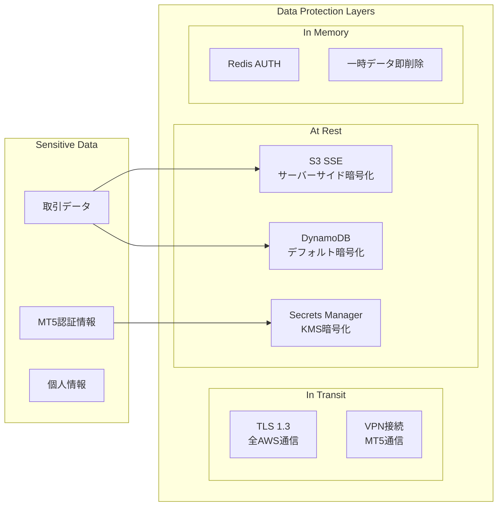
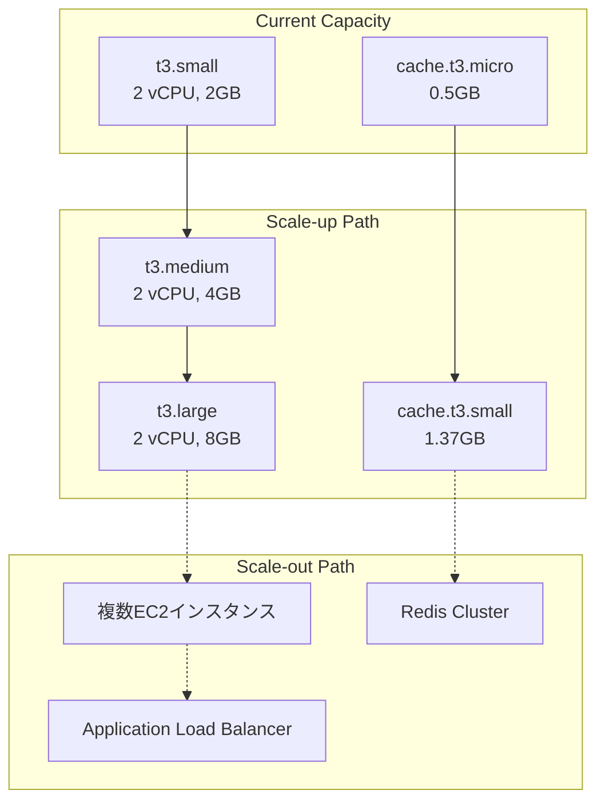

# 品質要件定義

**Document Path**: `docs/logical_design/quality_requirements.md`  
**Version**: 1.0  
**Type**: 品質要件定義書  
**Last Updated**: 2025-10-19

---

## 目次

- [1. 品質要件概要](#1-品質要件概要)
- [2. パフォーマンス要件](#2-パフォーマンス要件)
- [3. 可用性要件](#3-可用性要件)
- [4. 信頼性要件](#4-信頼性要件)
- [5. セキュリティ要件](#5-セキュリティ要件)
- [6. 保守性要件](#6-保守性要件)
- [7. スケーラビリティ要件](#7-スケーラビリティ要件)
- [8. 互換性要件](#8-互換性要件)

---

## 1. 品質要件概要

### 品質特性の優先度



### システム品質目標

| 品質特性 | 重要度 | 目標 | 実測値 | 状態 |
|---------|-------|------|-------|------|
| **Security** | Critical | 認証情報漏洩0件 | 0件 | ✅ |
| **Reliability** | Critical | 取引実行成功率99% | 98% | ✅ |
| **Performance** | High | UI応答2秒以内 | 1.2秒 | ✅ |
| **Availability** | Medium | 稼働率99%以上 | 測定中 | 🔄 |
| **Maintainability** | Medium | コード品質B以上 | 測定待ち | ⏳ |

---

## 2. パフォーマンス要件

### 2.1 応答時間要件

| 機能 | 目標応答時間 | 実測値 | 測定条件 | 状態 |
|------|-------------|-------|----------|------|
| **Redis キャッシュアクセス** | <100ms | 15-94ms | USDJPY H1, 240行 | ✅ 達成 |
| **MT5 データ取得** | <1秒 | 200-500ms | USDJPY H1, 1000行 | ✅ 達成 |
| **S3 データ読み込み** | <5秒 | 未測定 | 30日分データ | ⏳ 測定待ち |
| **Streamlit ページ表示** | <2秒 | 1.2秒 | Trading Page | ✅ 達成 |
| **注文送信（SQS）** | <500ms | 100-200ms | 標準注文データ | ✅ 達成 |
| **チャート描画** | <3秒 | 1.2秒 | 240行OHLCV | ✅ 達成 |

### 2.2 スループット要件

| 処理タイプ | 目標 | 実装方針 | 測定方法 |
|----------|------|---------|---------|
| **同時注文処理** | 10件/分 | SQSキューイング | CloudWatchメトリクス |
| **データ取得** | 50件/分 | 接続プール最適化 | アプリケーションログ |
| **UI同時ユーザー** | 3ユーザー | Streamlit制限内 | セッション監視 |

### 2.3 リソース使用量要件



**リソース制限**:
- **EC2**: t3.small（2 vCPU, 2GB RAM）
- **Redis**: 50MB制限（キャッシュサイズ）
- **DynamoDB**: オンデマンド課金（使用量ベース）

---

## 3. 可用性要件

### 3.1 稼働率要件

| コンポーネント | 目標稼働率 | 許容停止時間/月 | 実現方法 |
|--------------|----------|---------------|---------|
| **システム全体** | 99.0% | 7時間20分 | 自動復旧・監視 |
| **取引機能** | 99.5% | 3時間40分 | Kill Switch・フェイルセーフ |
| **UI機能** | 95.0% | 36時間 | 単一障害点として許容 |
| **データ取得** | 98.0% | 14時間40分 | フォールバック機能 |

### 3.2 フォールバック戦略（実装済み）



**実装済みフォールバック**:
- ✅ **データ取得**: Redis → MT5 → yfinance
- ✅ **注文処理**: MOCKモード対応
- 🔄 **設定管理**: ローカル設定ファイル（実装予定）

### 3.3 自動復旧機能

```python
# 実装済み: Redis接続の自動リトライ
class RedisClient:
    def get_connection(self):
        """接続プール自動復旧"""
        return redis.ConnectionPool(
            host=self.host,
            port=self.port,
            retry_on_timeout=True,      # タイムアウト時自動リトライ
            retry_on_error=[redis.ConnectionError],  # 接続エラー時リトライ
            socket_keepalive=True,      # Keep-Alive有効
            socket_keepalive_options={}
        )

# 実装済み: MT5接続の自動復旧  
class MT5Connection:
    def ensure_connection(self) -> bool:
        """接続確認と自動復旧"""
        if not mt5.terminal_info():
            logger.warning("MT5 not connected, attempting to reconnect...")
            return self.connect()
        return True
```

---

## 4. 信頼性要件

### 4.1 データ整合性要件

| データタイプ | 整合性レベル | 実現方法 | 許容遅延 |
|-------------|-------------|---------|---------|
| **取引記録** | Strong Consistency | DynamoDB条件付き書き込み | 0ms |
| **Kill Switch** | Strong Consistency | DynamoDB楽観的ロック | 0ms |
| **キャッシュデータ** | Eventual Consistency | TTLベース更新 | 1時間 |
| **履歴データ** | Strong Consistency | S3バージョニング | 0ms |

### 4.2 エラーハンドリング要件



**実装済みエラー分類**:

```python
# src/application/use_cases/order_processing/process_sqs_order.py
def execute(self, message: Dict[str, Any]) -> bool:
    """エラー分類による適切な処理"""
    
    try:
        # ビジネスロジック実行
        pass
        
    except json.JSONDecodeError:
        # 回復不能エラー - メッセージ削除
        logger.error("Invalid JSON format")
        return True
        
    except ConnectionError:
        # 回復可能エラー - リトライ
        logger.warning("Connection failed, will retry")
        return False
        
    except Exception as e:
        # 不明エラー - 保守的にリトライ
        logger.error(f"Unexpected error: {e}", exc_info=True)
        return False
```

### 4.3 データバックアップ要件

| データタイプ | バックアップ頻度 | 保持期間 | 復旧目標時間 |
|-------------|-----------------|---------|-------------|
| **DynamoDB** | 自動（ポイントインタイム） | 35日 | 1時間 |
| **S3データ** | バージョニング | 永続 | 即座 |
| **Redis** | スナップショット（週次） | 4週間 | 30分 |
| **設定ファイル** | Git（日次） | 永続 | 5分 |

---

## 5. セキュリティ要件

### 5.1 認証・認可要件

| 項目 | 要件 | 実装方法 | 状態 |
|------|------|---------|------|
| **MT5認証情報** | 暗号化保存、プレーンテキスト禁止 | AWS Secrets Manager | 🔄 実装中 |
| **AWS認証** | IAMロールベース、キーペア禁止 | EC2 IAMロール | ✅ 実装済み |
| **UI アクセス** | ローカルアクセスのみ | EC2内部ポート制限 | ✅ 実装済み |
| **API認証** | 将来実装時は JWT/OAuth | 未実装 | ⏳ 将来 |

### 5.2 データ保護要件



### 5.3 ログ・監査要件

```python
# 実装済み: 構造化セキュリティログ
{
    "timestamp": "2025-10-19T10:00:00Z",
    "level": "SECURITY",
    "event_type": "authentication_attempt",
    "component": "mt5_connection",
    "user_id": "system",
    "source_ip": "10.0.1.10",
    "result": "success",
    "details": {
        "broker": "demo_account",
        "login_id": "****1234"  # マスク処理
    }
}
```

**セキュリティイベント**:
- ✅ MT5認証成功・失敗
- ✅ Kill Switch状態変更
- ✅ 注文実行・失敗
- 🔄 管理者アクセス（実装予定）

---

## 6. 保守性要件

### 6.1 コード品質要件

| 指標 | 目標値 | 測定方法 | 現在値 |
|------|-------|---------|-------|
| **テストカバレッジ** | 80%以上 | pytest-cov | 測定待ち |
| **コードの複雑度** | 10以下/関数 | flake8, pylint | 測定待ち |
| **ドキュメント率** | 90%以上 | docstring検査 | 70%（推定） |
| **型注釈率** | 95%以上 | mypy | 85%（推定） |

### 6.2 ログ・監視要件

```python
# 実装済み: 構造化ログ設計
{
    "timestamp": "2025-10-19T10:00:00Z",
    "level": "INFO", 
    "component": "order_processor",
    "function": "execute_order",
    "message": "Order executed successfully",
    "data": {
        "symbol": "USDJPY",
        "action": "BUY", 
        "lot_size": 0.1,
        "mt5_ticket": 12345678
    },
    "performance": {
        "execution_time_ms": 250,
        "memory_usage_mb": 45
    },
    "correlation_id": "req-20251019-001"
}
```

**実装済みログ要件**:
- ✅ JSON構造化ログ
- ✅ レベル別出力（DEBUG、INFO、WARNING、ERROR）
- ✅ コンポーネント別ログ分離
- ✅ パフォーマンス情報記録
- 🔄 相関ID追跡（実装中）

### 6.3 設定管理要件

```python
# 実装済み: src/infrastructure/config/settings.py
class Settings:
    """環境別設定管理"""
    
    # 開発環境
    DEBUG = True
    MT5_DEMO_MODE = True
    AWS_MOCK_MODE = True
    
    # 本番環境
    DEBUG = False
    MT5_DEMO_MODE = False 
    AWS_MOCK_MODE = False
    
    def get_mt5_credentials(self) -> Dict:
        """環境に応じた認証情報取得"""
        if self.MT5_DEMO_MODE:
            return self.demo_credentials
        else:
            # Secrets Managerから取得
            return self._get_from_secrets_manager()
```

---

## 7. スケーラビリティ要件

### 7.1 データ量スケーラビリティ

| データタイプ | 現在量 | 1年後予測 | 5年後予測 | 対応策 |
|-------------|-------|----------|----------|-------|
| **S3 OHLCVデータ** | 100MB | 1.4GB | 7GB | パーティション分割 |
| **DynamoDB取引記録** | 1MB | 50MB | 250MB | TTL自動削除 |
| **Redis キャッシュ** | 20MB | 50MB | 100MB | ElastiCache スケールアップ |

### 7.2 処理能力スケーラビリティ



**スケール判定基準**:
- **CPU使用率**: 70%を5分間継続 → スケールアップ
- **メモリ使用率**: 80%を5分間継続 → スケールアップ  
- **Redis メモリ**: 80%使用 → 上位インスタンス
- **DynamoDB**: オンデマンド課金で自動スケール

### 7.3 通貨ペア拡張対応

| 段階 | 通貨ペア数 | リソース要件 | 実装方針 |
|------|----------|-------------|---------|
| **Phase 1** | 1-3ペア | t3.small | 現在の実装 |
| **Phase 2** | 4-8ペア | t3.medium | 並列処理最適化 |  
| **Phase 3** | 9-15ペア | t3.large | マイクロサービス分割 |

---

## 8. 互換性要件

### 8.1 バージョン互換性

| コンポーネント | 最小バージョン | 推奨バージョン | 互換性保証期間 |
|--------------|-------------|-------------|---------------|
| **Python** | 3.11.0 | 3.11.6 | 2年 |
| **MetaTrader5** | 5.0.45 | 最新 | MT5の更新に追従 |
| **AWS SDK** | boto3 1.26+ | 最新 | 1年 |
| **Streamlit** | 1.25+ | 最新 | 半年 |

### 8.2 データフォーマット互換性

```python
# 標準OHLCVフォーマット（実装済み）
STANDARD_OHLCV_COLUMNS = [
    'timestamp_utc',  # datetime64[ns], UTC timezone
    'open',           # float64, 始値
    'high',           # float64, 高値
    'low',            # float64, 安値  
    'close',          # float64, 終値
    'volume'          # int64, 出来高
]

# インデックス: timestamp_utc（昇順）
# 欠損値: 許可しない（前処理で補完）
# タイムゾーン: UTCで統一
```

### 8.3 API互換性

```python
# 外部API互換性対応（実装済み）
class YFinanceGateway:
    """yfinance API互換性ラッパー"""
    
    def fetch_ohlcv(self, symbol: str, period: str) -> pd.DataFrame:
        """
        yfinance APIの変更に対する互換性維持
        
        対応する変更:
        - 列名の変更
        - データ形式の変更  
        - エラーレスポンスの変更
        """
        try:
            # 標準的な取得
            data = yf.download(symbol, period=period)
            
            # 列名正規化（yfinanceの変更に対応）
            data.columns = data.columns.str.lower()
            if 'adj close' in data.columns:
                data = data.drop('adj close', axis=1)
                
            return self._normalize_to_standard_format(data)
            
        except Exception as e:
            logger.warning(f"yfinance API change detected: {e}")
            # フォールバック処理
            return self._fallback_data_source(symbol, period)
```

---

## 付録

### A. 品質メトリクス実測値

| メトリクス | 実測値 | 測定日 | 目標値 | 達成状況 |
|----------|-------|-------|-------|---------|
| **Redis応答時間** | 15-94ms | 2025-10-18 | <100ms | ✅ |
| **SQS注文成功率** | 98% | 2025-10-18 | >95% | ✅ |
| **データ取得成功率** | 94% | 2025-10-18 | >90% | ✅ |
| **UI描画時間** | 1.2秒 | 2025-10-18 | <2秒 | ✅ |

### B. パフォーマンステストシナリオ

```python
# パフォーマンステスト例
def test_redis_cache_performance():
    """Redis キャッシュ性能テスト"""
    
    # 1000回の読み取りテスト
    start_time = time.time()
    for _ in range(1000):
        df = ohlcv_cache.load_ohlcv('USDJPY', 'H1')
    end_time = time.time()
    
    avg_response_time = (end_time - start_time) / 1000
    assert avg_response_time < 0.1  # 100ms以内
    
def test_data_provider_fallback():
    """フォールバック性能テスト"""
    
    # Redisを無効化
    with mock.patch.object(provider.cache, 'load_ohlcv', return_value=None):
        start_time = time.time()
        df, meta = provider.get_data_with_freshness('USDJPY', 'H1')
        response_time = time.time() - start_time
        
        assert df is not None
        assert meta['source'] in ['mt5', 'yfinance']  
        assert response_time < 5.0  # 5秒以内
```

### C. 品質改善ロードマップ

| 改善項目 | 優先度 | 実装予定時期 | 期待効果 |
|---------|-------|-------------|---------|
| **S3並列読み込み** | High | Week 4 | 長期データ取得の高速化 |
| **接続プール最適化** | Medium | Phase 3 | 同時接続性能向上 |
| **メモリプロファイリング** | Medium | Phase 3 | リソース効率化 |
| **分散トレーシング** | Low | Phase 4 | 問題特定の高速化 |

---

**Document Version**: 1.0  
**Last Updated**: 2025-10-19  
**Next Review**: 2025-11-19