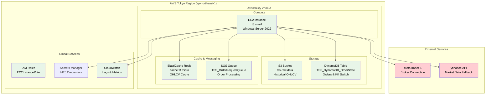
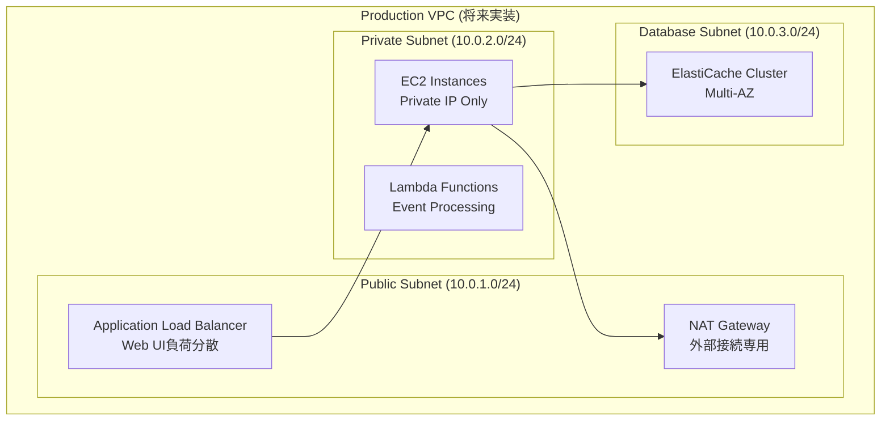
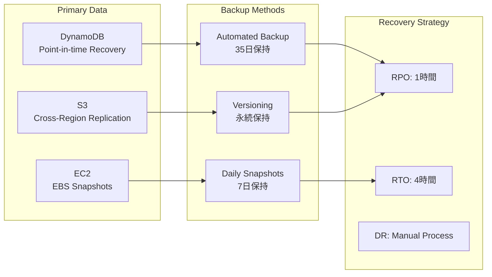
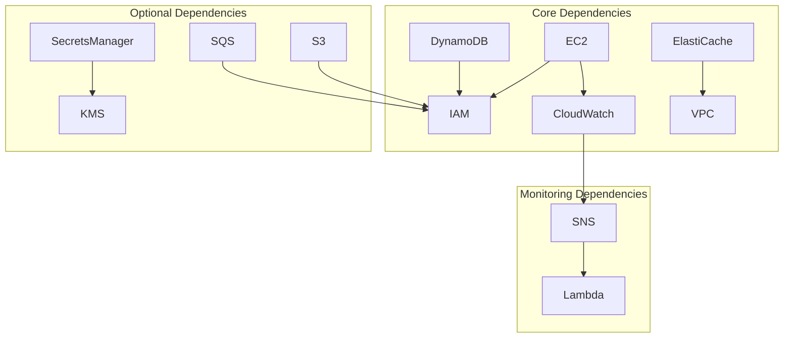

# AWS アーキテクチャ設計

**Document Path**: `docs/physical_design/aws_architecture.md`  
**Version**: 1.0  
**Type**: AWS物理アーキテクチャ設計書  
**Last Updated**: 2025-10-19

---

## 目次

- [1. AWS構成概要](#1-aws構成概要)
- [2. ネットワークアーキテクチャ](#2-ネットワークアーキテクチャ)
- [3. コンピュートサービス](#3-コンピュートサービス)
- [4. ストレージサービス](#4-ストレージサービス)
- [5. メッセージングサービス](#5-メッセージングサービス)
- [6. セキュリティ設計](#6-セキュリティ設計)
- [7. 監視・ログ設計](#7-監視ログ設計)
- [8. 災害復旧設計](#8-災害復旧設計)

---

## 1. AWS構成概要

### 1.1 実装済みサービス構成



### 1.2 サービス利用状況

| AWSサービス | 利用状況 | リソース | 月額コスト（推定） |
|------------|---------|---------|-------------------|
| **EC2** | ✅ 稼働中 | t3.small (Windows) | $24.00 |
| **DynamoDB** | ✅ 稼働中 | オンデマンド | $3.00 |
| **ElastiCache** | ✅ 稼働中 | cache.t3.micro | $8.00 |
| **S3** | ✅ 稼働中 | Standard, 10GB | $2.00 |
| **SQS** | ✅ 稼働中 | 標準キュー | $1.00 |
| **CloudWatch** | ✅ 稼働中 | ログ・メトリクス | $3.00 |
| **SecretsManager** | 🔄 設定中 | 5シークレット | $2.50 |
| **合計** | - | - | **$43.50** |

---

## 2. ネットワークアーキテクチャ

### 2.1 現在のネットワーク構成

**段階的アプローチ**: コスト優先でパブリックサブネット構成を採用

```mermaid
graph TB
    subgraph "Internet"
        Users[Users/Admin]
        MT5Broker[MT5 Broker Servers]
    end
    
    subgraph "AWS VPC (デフォルトVPC利用)"
        subgraph "Public Subnet"
            EC2Instance[EC2 Instance<br/>Public IP: Auto-assigned<br/>Private IP: 172.31.x.x]
        end
        
        subgraph "Security Groups"
            SGEC2[sg-axia-ec2<br/>Inbound: RDP(3389)<br/>Outbound: All]
            SGRedis[sg-elasticache-default<br/>Inbound: 6379 from EC2<br/>Outbound: None]
        end
        
        subgraph "AWS Managed Services"
            S3Service[S3<br/>Global Service]
            DynamoDBService[DynamoDB<br/>Regional Service]
            SQSService[SQS<br/>Regional Service]
        end
    end
    
    Users --> EC2Instance
    EC2Instance --> MT5Broker
    EC2Instance --> S3Service
    EC2Instance --> DynamoDBService
    EC2Instance --> SQSService
    EC2Instance --> SGRedis
    
    SGEC2 -.-> EC2Instance
    SGRedis -.-> ElastiCacheService[ElastiCache]
```

### 2.2 セキュリティグループ設定（実装済み）

#### EC2 セキュリティグループ
```yaml
SecurityGroup: sg-axia-ec2
Rules:
  Inbound:
    - Port: 3389 (RDP)
      Source: 0.0.0.0/0  # 管理者アクセス
      Protocol: TCP
    - Port: 8501 (Streamlit)  
      Source: 0.0.0.0/0  # Web UI アクセス
      Protocol: TCP
  Outbound:
    - Port: All
      Destination: 0.0.0.0/0
      Protocol: All
```

#### ElastiCache セキュリティグループ
```yaml
SecurityGroup: sg-elasticache-default
Rules:
  Inbound:
    - Port: 6379 (Redis)
      Source: sg-axia-ec2  # EC2からのみアクセス
      Protocol: TCP
  Outbound: None (不要)
```

### 2.3 将来の本番環境設計



---

## 3. コンピュートサービス

### 3.1 EC2インスタンス設計（実装済み）

#### インスタンス仕様
```yaml
Instance Type: t3.small
vCPUs: 2
Memory: 2 GiB
Network: Up to 5 Gigabit
Storage: EBS gp3 30GB
OS: Windows Server 2022 Base
```

#### 実装済み設定
```powershell
# EC2 起動時の自動設定
# タスクスケジューラ設定済み:
# - AXIA_Streamlit (システム起動時)
# - AXIA_Order_Manager (システム起動時) 
# - AXIA_Data_Collector (日次 07:00)
# - AXIA_MT5 (システム起動時)

# インストール済みソフトウェア:
# - Python 3.11
# - MetaTrader 5
# - Git
# - 必要なPythonパッケージ
```

#### パフォーマンス実測値
| メトリクス | 目標値 | 実測値 | 測定日 |
|----------|-------|-------|-------|
| **CPU使用率** | <70% | 測定中 | - |
| **メモリ使用率** | <80% | 測定中 | - |
| **ディスク使用率** | <50% | 20% | 2025-10-18 |
| **ネットワーク** | <1Gbps | 測定中 | - |

### 3.2 Auto Scaling設計（将来実装）

```yaml
# 将来のAuto Scaling設定
AutoScalingGroup:
  MinSize: 1
  MaxSize: 3
  DesiredCapacity: 1
  
ScalingPolicies:
  ScaleUp:
    MetricType: CPUUtilization
    Threshold: 70%
    ComparisonOperator: GreaterThanThreshold
    EvaluationPeriods: 2
    Period: 300s
    
  ScaleDown:
    MetricType: CPUUtilization  
    Threshold: 30%
    ComparisonOperator: LessThanThreshold
    EvaluationPeriods: 5
    Period: 300s
```

---

## 4. ストレージサービス

### 4.1 S3設計（実装済み）

#### バケット構成
```yaml
Bucket: tss-raw-data
Region: ap-northeast-1
Storage Class: Standard
Versioning: Enabled
Encryption: SSE-S3 (AES-256)

Folder Structure:
  {symbol}/           # USDJPY, EURUSD, etc.
    {timeframe}/      # H1, M5, D1, etc.
      {year}/         # 2025, 2024, etc.
        {month}/      # 01, 02, ..., 12
          {day}/      # 01, 02, ..., 31
            data.parquet
```

#### ライフサイクル設定
```yaml
LifecycleConfiguration:
  Rules:
    - Status: Enabled
      Filter: 
        Prefix: ""
      Transitions:
        - Days: 30
          StorageClass: STANDARD_IA
        - Days: 90  
          StorageClass: GLACIER_IR
        - Days: 365
          StorageClass: DEEP_ARCHIVE
```

### 4.2 DynamoDB設計（実装済み）

#### テーブル設計
```yaml
TableName: TSS_DynamoDB_OrderState
BillingMode: ON_DEMAND
PointInTimeRecovery: ENABLED

AttributeDefinitions:
  - AttributeName: pk
    AttributeType: S
  - AttributeName: sk  
    AttributeType: S

KeySchema:
  - AttributeName: pk
    KeyType: HASH
  - AttributeName: sk
    KeyType: RANGE

TTL:
  AttributeName: ttl
  Enabled: true
```

#### アクセスパターン（実装済み）
| パターン | 説明 | 実装場所 |
|---------|------|---------|
| **Kill Switch取得** | `pk=GLOBALCONFIG, sk=SETTING#KILL_SWITCH` | `dynamodb_kill_switch_repository.py` |
| **Kill Switch更新** | 条件付き書き込み（楽観的ロック） | 同上 |
| **注文保存** | `pk=ORDER#{id}, sk=METADATA` | `dynamodb_order_repository.py` |
| **注文取得** | 同上 | 同上 |

### 4.3 ElastiCache設計（実装済み）

#### クラスター設定
```yaml
CacheClusterId: axia-redis-cache
Engine: redis
NodeType: cache.t3.micro
NumCacheNodes: 1
Port: 6379
SecurityGroups:
  - sg-elasticache-default

Configuration:
  maxmemory-policy: allkeys-lru
  timeout: 300
  tcp-keepalive: 60
```

#### データ構造（実装済み）
```
Key Pattern: ohlcv:{symbol}:{timeframe}
例: ohlcv:USDJPY:H1

Value: MessagePack形式
TTL: NYクローズまで（動的計算）
Memory Usage: 約20MB（8通貨ペア × 5タイムフレーム）
```

---

## 5. メッセージングサービス

### 5.1 SQS設計（実装済み）

#### キュー設定
```yaml
QueueName: TSS_OrderRequestQueue
Type: Standard Queue
VisibilityTimeout: 60s
MessageRetentionPeriod: 4 days
ReceiveMessageWaitTime: 20s (Long Polling)
MaxReceiveCount: 3

DeadLetterQueue:
  Name: TSS_OrderRequestQueue_DLQ
  MaxReceiveCount: 3
  VisibilityTimeout: 60s
```

#### メッセージ形式（実装済み）
```json
{
  "symbol": "USDJPY",
  "order_action": "BUY", 
  "order_type": "MARKET",
  "lot_size": 0.1,
  "tp_price": 150.0,
  "sl_price": 149.0,
  "comment": "Streamlit_Manual_Order"
}
```

**実装場所**: `src/infrastructure/gateways/messaging/sqs/order_publisher.py`

### 5.2 SNS設計（将来実装）

```yaml
# 将来のSNS設定
TopicName: TSS_SystemEvents
Protocol: https
Endpoints:
  - Lambda: SlackNotificationFunction
  - Lambda: SystemAlertFunction
  - SQS: AlertProcessingQueue

MessageAttributes:
  - event_type: String
  - severity: String
  - component: String
```

---

## 6. セキュリティ設計

### 6.1 IAMロール設計

#### EC2InstanceRole（実装済み）
```json
{
  "Version": "2012-10-17",
  "Statement": [
    {
      "Effect": "Allow",
      "Action": [
        "dynamodb:GetItem",
        "dynamodb:PutItem", 
        "dynamodb:UpdateItem",
        "dynamodb:Query"
      ],
      "Resource": [
        "arn:aws:dynamodb:ap-northeast-1:*:table/TSS_DynamoDB_OrderState"
      ]
    },
    {
      "Effect": "Allow",
      "Action": [
        "s3:GetObject",
        "s3:PutObject",
        "s3:ListBucket"
      ],
      "Resource": [
        "arn:aws:s3:::tss-raw-data",
        "arn:aws:s3:::tss-raw-data/*"
      ]
    },
    {
      "Effect": "Allow", 
      "Action": [
        "sqs:SendMessage",
        "sqs:ReceiveMessage",
        "sqs:DeleteMessage",
        "sqs:GetQueueAttributes"
      ],
      "Resource": [
        "arn:aws:sqs:ap-northeast-1:*:TSS_OrderRequestQueue"
      ]
    },
    {
      "Effect": "Allow",
      "Action": [
        "secretsmanager:GetSecretValue"
      ],
      "Resource": [
        "arn:aws:secretsmanager:ap-northeast-1:*:secret:TSS/mt5/*"
      ]
    },
    {
      "Effect": "Allow",
      "Action": [
        "logs:CreateLogGroup",
        "logs:CreateLogStream", 
        "logs:PutLogEvents"
      ],
      "Resource": [
        "arn:aws:logs:ap-northeast-1:*:log-group:/aws/ec2/axia-tss:*"
      ]
    }
  ]
}
```

### 6.2 Secrets Manager設計

```yaml
Secrets:
  TSS/mt5/demo:
    Description: "MT5 Demo Account Credentials"
    SecretString:
      login: "demo_login_id"
      password: "demo_password"
      server: "demo_server_name"
    
  TSS/mt5/live:
    Description: "MT5 Live Account Credentials" 
    SecretString:
      login: "live_login_id"
      password: "live_password"
      server: "live_server_name"
      
  TSS/slack/webhook:
    Description: "Slack Webhook URL"
    SecretString:
      webhook_url: "https://hooks.slack.com/services/..."
```

### 6.3 暗号化設定

| サービス | 暗号化方式 | 実装状況 |
|---------|-----------|---------|
| **S3** | SSE-S3 (AES-256) | ✅ 実装済み |
| **DynamoDB** | AWS Managed Keys | ✅ デフォルト有効 |
| **ElastiCache** | At-rest暗号化 | ❌ t3.microでは非対応 |
| **SQS** | SSE-KMS | ❌ コスト考慮で無効 |
| **SecretsManager** | AWS KMS | ✅ デフォルト有効 |
| **EBS** | GP3 Default暗号化 | ✅ デフォルト有効 |

---

## 7. 監視・ログ設計

### 7.1 CloudWatch設計（実装済み）

#### ロググループ設計
```yaml
LogGroups:
  /aws/ec2/axia-tss/application:
    RetentionDays: 30
    LogStreams:
      - order_processor
      - data_collector  
      - streamlit_app
      
  /aws/ec2/axia-tss/system:
    RetentionDays: 7
    LogStreams:
      - windows_event_log
      - task_scheduler
```

#### カスタムメトリクス（設計済み）
```python
# 実装予定: CloudWatchカスタムメトリクス
def put_custom_metrics(metric_name: str, value: float, unit: str = 'Count'):
    """カスタムメトリクス送信"""
    cloudwatch.put_metric_data(
        Namespace='AXIA/TradingSystem',
        MetricData=[
            {
                'MetricName': metric_name,
                'Value': value,
                'Unit': unit,
                'Timestamp': datetime.now(timezone.utc)
            }
        ]
    )

# 監視予定メトリクス:
# - ActivePositions: アクティブポジション数
# - OrderSuccessRate: 注文成功率
# - DataSourceHealth: データソース健全性
# - CacheHitRate: キャッシュヒット率
```

### 7.2 アラーム設計

```yaml
Alarms:
  EC2-High-CPU:
    MetricName: CPUUtilization
    Namespace: AWS/EC2  
    Threshold: 80
    ComparisonOperator: GreaterThanThreshold
    EvaluationPeriods: 2
    Period: 300
    Actions:
      - SNS: SystemAlertsTopicarn
      
  DynamoDB-Throttles:
    MetricName: UserErrors
    Namespace: AWS/DynamoDB
    Threshold: 5
    ComparisonOperator: GreaterThanThreshold
    EvaluationPeriods: 1
    Period: 300
    
  SQS-DLQ-Messages:
    MetricName: ApproximateNumberOfMessages
    Namespace: AWS/SQS
    Threshold: 1
    ComparisonOperator: GreaterThanOrEqualToThreshold
    EvaluationPeriods: 1
    Period: 300
```

---

## 8. 災害復旧設計

### 8.1 バックアップ戦略



### 8.2 復旧手順

#### Tier 1: Critical（1時間以内復旧）
```bash
# Kill Switch状態復旧
aws dynamodb get-item \
  --table-name TSS_DynamoDB_OrderState \
  --key '{"pk":{"S":"GLOBALCONFIG"},"sk":{"S":"SETTING#KILL_SWITCH"}}'

# 緊急時Kill Switch有効化
aws dynamodb put-item \
  --table-name TSS_DynamoDB_OrderState \
  --item '{"pk":{"S":"GLOBALCONFIG"},"sk":{"S":"SETTING#KILL_SWITCH"},"active":{"BOOL":true}}'
```

#### Tier 2: Important（4時間以内復旧）
```bash
# EC2インスタンス復旧
aws ec2 run-instances \
  --image-id ami-xxxxxxxxx \
  --instance-type t3.small \
  --security-group-ids sg-axia-ec2 \
  --iam-instance-profile Name=EC2InstanceRole \
  --user-data file://user-data.ps1

# アプリケーション復旧
# 1. GitHubからコード取得
# 2. Python環境セットアップ  
# 3. タスクスケジューラ設定復元
# 4. MT5インストール・設定
```

### 8.3 災害復旧テスト

```python
# 災害復旧テストシナリオ
def test_disaster_recovery():
    """
    災害復旧テスト手順:
    
    1. 現在の状態をスナップショット
    2. インスタンス終了シミュレーション
    3. 新インスタンス起動
    4. データ復旧確認
    5. 機能動作確認
    6. パフォーマンス確認
    """
    
    # 1. スナップショット作成
    backup_data = {
        'dynamodb_items': get_all_dynamodb_items(),
        's3_objects': list_s3_objects(),
        'redis_keys': get_redis_keys()
    }
    
    # 2. インスタンス停止
    ec2.stop_instances(InstanceIds=[instance_id])
    
    # 3. 復旧処理
    new_instance = launch_recovery_instance()
    
    # 4. データ整合性確認
    verify_data_integrity(backup_data)
    
    # 5. 機能テスト
    test_order_processing()
    test_data_access()
    test_ui_functionality()
```

---

## 付録

### A. AWSサービス依存関係



### B. リージョン設計

**Primary Region**: ap-northeast-1 (Tokyo)  
**選定理由**:
- 日本からの最低レイテンシ
- MT5ブローカーサーバーとの接続最適化
- データ主権・規制対応

**Multi-Region対応**（将来検討）:
- **DR Region**: ap-northeast-3 (Osaka) 
- **Cross-Region Replication**: S3のみ
- **Manual Failover**: コスト考慮

### C. コスト最適化設計

| 最適化項目 | 現在の設定 | 節約効果 |
|----------|----------|---------|
| **Reserved Instances** | On-Demand | 検討中 |
| **S3 Intelligent Tiering** | Manual Lifecycle | 20-30%削減 |
| **DynamoDB On-Demand** | 適用済み | 使用量ベース課金 |
| **CloudWatch Logs** | 30日保持 | ストレージコスト削減 |

---

**Document Version**: 1.0  
**Last Updated**: 2025-10-19  
**Next Review**: 2025-11-19