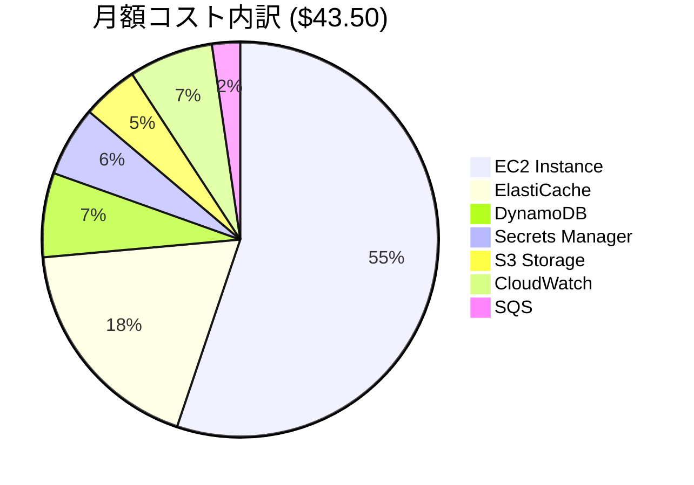
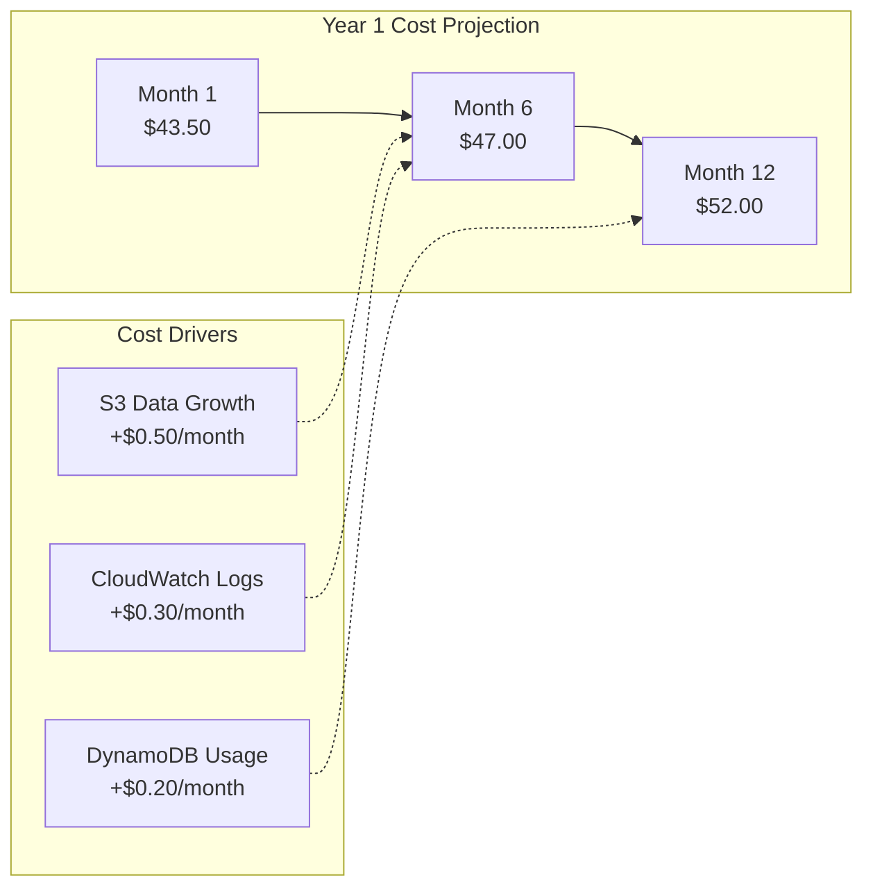
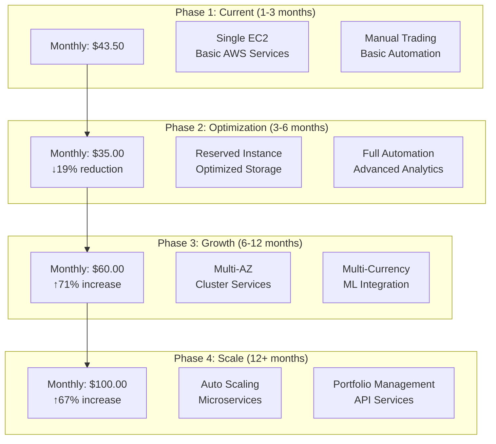

# コスト最適化設計

**Document Path**: `docs/physical_design/cost_optimization.md`  
**Version**: 1.0  
**Type**: コスト最適化設計書  
**Last Updated**: 2025-10-19

---

## 目次

- [1. コスト概要](#1-コスト概要)
- [2. 現在のコスト構造](#2-現在のコスト構造)
- [3. コスト最適化戦略](#3-コスト最適化戦略)
- [4. リソース最適化](#4-リソース最適化)
- [5. 運用コスト管理](#5-運用コスト管理)
- [6. コスト監視](#6-コスト監視)
- [7. 将来のスケーリング戦略](#7-将来のスケーリング戦略)

---

## 1. コスト概要

### 1.1 コスト管理目標

**月額予算上限**: $50.00 (約7,500円)  
**現在の月額コスト**: $43.50 (約6,525円)  
**予算残余**: $6.50 (約975円) = 13%のバッファー



### 1.2 コスト効率指標

| 指標 | 現在値 | 目標値 | 最適化余地 |
|------|-------|-------|-----------|
| **EC2稼働率** | 測定中 | >70% | CPU最適化 |
| **Redis使用率** | 4% (20MB/512MB) | >30% | メモリ効率化 |
| **S3成長率** | 15MB/月 | 予測通り | ライフサイクル適用 |
| **DynamoDB RCU** | 測定中 | 最小限 | Eventually Consistent活用 |

---

## 2. 現在のコスト構造

### 2.1 AWSサービス別コスト内訳（月額）

| サービス | リソース | 月額（USD） | 月額（JPY） | 使用率 | 最適化可能性 |
|---------|----------|------------|------------|-------|-------------|
| **EC2** | t3.small (Windows) | $24.00 | ¥3,600 | 測定中 | Medium |
| **ElastiCache** | cache.t3.micro | $8.00 | ¥1,200 | 4% | High |
| **DynamoDB** | On-demand | $3.00 | ¥450 | 低使用量 | Low |
| **Secrets Manager** | 5 secrets | $2.50 | ¥375 | 必要最小限 | Low |
| **CloudWatch** | Logs + Metrics | $3.00 | ¥450 | 標準使用 | Medium |
| **S3** | 10GB Standard | $2.00 | ¥300 | 成長中 | Medium |
| **SQS** | Standard Queue | $1.00 | ¥150 | 低使用量 | Low |
| **合計** | - | **$43.50** | **¥6,525** | - | - |

### 2.2 コスト成長予測



**成長要因**:
- **S3データ成長**: 15MB/月 → 年間180MB
- **ログ増加**: 機能追加に伴うログ量増加
- **DynamoDB使用量**: 取引頻度増加

**予測月額（12ヶ月後）**: $52.00 (予算オーバー)

---

## 3. コスト最適化戦略

### 3.1 即効性のある最適化（実装可能）

#### 1. ElastiCacheダウンサイジング
```yaml
現在: cache.t3.micro (512MB) - $8.00/月
提案: cache.t4g.nano (512MB) - $5.50/月
節約: $2.50/月 (30%削減)

実装方法:
  1. 現在のRedis使用量確認 (20MB = 4%使用)
  2. cache.t4g.nanoでのパフォーマンステスト
  3. ダウンタイム計画（5分以内）
  4. 移行実行

リスク評価:
  - 低リスク: 使用量が十分に下回っている
  - 性能影響: 最小限（同じメモリ容量）
  - ARM Graviton2で効率向上の可能性
```

#### 2. CloudWatchログ保持期間最適化
```yaml
現在: 30日保持 - 約$1.50/月
提案: 重要ログ30日、一般ログ7日 - 約$0.75/月
節約: $0.75/月 (50%削減)

実装方法:
  1. ログの重要度分類
     Critical: /aws/ec2/axia-tss/application → 30日
     Info: /aws/ec2/axia-tss/system → 7日
  2. CloudWatch設定変更
  3. 既存ログの期限短縮

重要ログ (30日保持):
  - 注文実行ログ
  - エラーログ  
  - Kill Switch変更ログ

一般ログ (7日保持):
  - 通常動作ログ
  - Debug情報
  - システムイベント
```

#### 3. S3ストレージクラス最適化
```yaml
現在: Standard のみ - $2.00/月
提案: Intelligent Tiering - $1.50/月
節約: $0.50/月 (25%削減)

実装方法:
  1. S3 Intelligent Tiering有効化
  2. 30日後のIA移行設定
  3. 90日後のGlacier IR移行

自動最適化:
  - 30日アクセスなし → Standard-IA (40%削減)
  - 90日アクセスなし → Glacier IR (70%削減)
  - 180日アクセスなし → Glacier (80%削減)
```

**即効最適化合計節約**: $3.75/月 (8.6%削減)  
**最適化後月額**: $39.75/月

### 3.2 中期的最適化（3-6ヶ月後）

#### 1. Reserved Instance活用
```yaml
現在: EC2 On-Demand t3.small - $24.00/月
提案: 1年予約 t3.small - $16.80/月  
節約: $7.20/月 (30%削減)

検討条件:
  - システム安定稼働3ヶ月継続
  - 要件変更リスクの低下
  - 予算確保（年額一括 or 月額）

実装タイミング:
  - Phase 1完了後（2025年11月）
  - 本番環境移行時
```

#### 2. Spot Instancesの部分利用
```yaml
適用対象: データ収集処理（バッチ処理）
現在: 常時稼働EC2で実行
提案: Spot Instance での夜間処理

節約効果: $3.00-5.00/月
実装複雑度: 高（中断対応が必要）
採用判定: 保留（運用リスク考慮）
```

### 3.3 長期的最適化（6-12ヶ月後）

#### 1. アーキテクチャ最適化
```yaml
現在: モノリシック EC2 + Always-On
提案: マイクロサービス + イベント駆動

サービス分離:
  - データ収集: Lambda (cron実行)
  - 注文処理: Lambda (SQSトリガー)
  - UI: ECS Fargate (必要時起動)

期待節約: $15-20/月
実装工数: 高（アーキテクチャ変更）
採用時期: Phase 3以降
```

---

## 4. リソース最適化

### 4.1 EC2最適化

#### 現在の使用状況分析
```powershell
# EC2リソース使用状況監視スクリプト
function Get-EC2ResourceUsage {
    # CPU使用率（5分間平均）
    $cpuUsage = (Get-Counter '\Processor(_Total)\% Processor Time' -SampleInterval 1 -MaxSamples 300 | 
                Measure-Object -Property CounterSamples.CookedValue -Average).Average
    
    # メモリ使用率
    $memory = Get-CimInstance -ClassName Win32_OperatingSystem
    $memoryUsagePercent = [math]::Round((($memory.TotalVisibleMemorySize - $memory.FreePhysicalMemory) / $memory.TotalVisibleMemorySize) * 100, 2)
    
    # ネットワーク使用率（5分間）
    $networkIn = (Get-Counter '\Network Interface(*)\Bytes Received/sec' -MaxSamples 60 | 
                 Measure-Object -Property CounterSamples.CookedValue -Average).Average
    
    return @{
        CPUUsage = $cpuUsage
        MemoryUsage = $memoryUsagePercent
        NetworkInBps = $networkIn
        Timestamp = Get-Date
    }
}

# 最適化判定基準:
# CPU < 30% かつ Memory < 50% → ダウンサイズ検討
# CPU > 70% かつ Memory > 80% → アップサイズ検討
```

#### インスタンス最適化案
```yaml
最適化シナリオ:

シナリオ1: ダウンサイズ
  現在: t3.small (2 vCPU, 2GB) - $24.00/月
  変更先: t3.micro (2 vCPU, 1GB) - $12.00/月  
  節約: $12.00/月
  適用条件: メモリ使用量 < 800MB
  リスク: メモリ不足での性能劣化

シナリオ2: ARM移行
  現在: t3.small (x86) - $24.00/月
  変更先: t4g.small (ARM Graviton2) - $19.20/月
  節約: $4.80/月
  適用条件: ARM対応ライブラリ確認
  リスク: 互換性問題

シナリオ3: Burstableクレジット最適化
  現在: Unlimited mode
  変更先: Standard mode + 監視
  節約: $2-5/月（使用パターン依存）
  適用条件: CPU使用量の予測可能性
```

### 4.2 ストレージ最適化

#### S3ライフサイクル最適化
```json
{
  "Rules": [
    {
      "ID": "OHLCV-Data-Lifecycle",
      "Status": "Enabled",
      "Filter": {"Prefix": ""},
      "Transitions": [
        {
          "Days": 30,
          "StorageClass": "STANDARD_IA"
        },
        {
          "Days": 90, 
          "StorageClass": "GLACIER_IR"
        },
        {
          "Days": 365,
          "StorageClass": "DEEP_ARCHIVE"
        }
      ]
    },
    {
      "ID": "Logs-Cleanup",
      "Status": "Enabled", 
      "Filter": {"Prefix": "logs/"},
      "Expiration": {
        "Days": 90
      }
    }
  ]
}
```

**節約効果**:
- 30日後: Standard → Standard-IA (40%削減)
- 90日後: Standard-IA → Glacier IR (70%削減)
- 365日後: Glacier IR → Deep Archive (80%削減)

**年間節約**: 約$3-5

### 4.3 DynamoDB最適化

#### オンデマンド vs プロビジョンド比較
```python
# 現在の使用量ベースコスト計算
def calculate_dynamodb_costs():
    """DynamoDB使用量・コスト分析"""
    
    # 月間使用量推定
    monthly_usage = {
        'read_requests': 10000,      # Kill Switch確認等
        'write_requests': 1000,      # 注文・設定変更
        'storage_gb': 0.001          # 1MB = 約0.001GB
    }
    
    # オンデマンド料金（Tokyo region）
    on_demand_cost = {
        'read': monthly_usage['read_requests'] * 0.25 / 1000000,  # $0.25/百万RRU
        'write': monthly_usage['write_requests'] * 1.25 / 1000000, # $1.25/百万WRU  
        'storage': monthly_usage['storage_gb'] * 0.25             # $0.25/GB/月
    }
    
    total_on_demand = sum(on_demand_cost.values())
    
    # プロビジョンド料金
    provisioned_cost = {
        'read_capacity': 1 * 0.065 * 24 * 30 / 1000,  # 1 RCU
        'write_capacity': 1 * 0.325 * 24 * 30 / 1000, # 1 WCU
        'storage': monthly_usage['storage_gb'] * 0.25
    }
    
    total_provisioned = sum(provisioned_cost.values())
    
    return {
        'on_demand': total_on_demand,      # 約$0.003/月
        'provisioned': total_provisioned,  # 約$0.50/月
        'recommendation': 'on_demand'      # 低使用量のためオンデマンドが最適
    }
```

**結論**: 現在の低使用量ではオンデマンド課金が最適

---

## 5. 運用コスト管理

### 5.1 自動スケールダウン（実装予定）

#### 夜間・週末停止
```powershell
# 週末自動停止スクリプト（コスト削減）
function Schedule-WeekendShutdown {
    # 金曜日 23:00 に停止
    $shutdownTrigger = New-ScheduledTaskTrigger -Weekly -DaysOfWeek Friday -At "23:00"
    
    $shutdownAction = New-ScheduledTaskAction -Execute "powershell.exe" -Argument "-Command `"
        # 1. Kill Switch有効化
        aws dynamodb put-item --table-name TSS_DynamoDB_OrderState --item '{
            \"pk\": {\"S\": \"GLOBALCONFIG\"},
            \"sk\": {\"S\": \"SETTING#KILL_SWITCH\"},
            \"active\": {\"BOOL\": true},
            \"reason\": {\"S\": \"Weekend scheduled shutdown\"}
        }'
        
        # 2. アプリケーション停止
        Get-ScheduledTask -TaskName 'AXIA_*' | Stop-ScheduledTask -Force
        
        # 3. インスタンス停止
        aws ec2 stop-instances --instance-ids (Invoke-RestMethod -Uri http://169.254.169.254/latest/meta-data/instance-id)
    `""
    
    Register-ScheduledTask -TaskName "AXIA_WeekendShutdown" -Trigger $shutdownTrigger -Action $shutdownAction
    
    # 月曜日 06:00 に起動（手動 or Lambda）
    # 週末節約: 60時間 × $0.033/時間 = $2.00/週 = $8.60/月
}
```

#### 動的スケーリング
```python
# 負荷ベース自動スケーリング（将来実装）
class DynamicScaling:
    """動的リソーススケーリング"""
    
    def evaluate_scaling_need(self) -> Dict[str, str]:
        """スケーリング必要性評価"""
        
        # CPU/メモリ使用率取得
        cpu_usage = get_cpu_usage()
        memory_usage = get_memory_usage()
        
        # Redis使用率取得
        redis_stats = container.get_ohlcv_cache().get_cache_stats()
        redis_usage_pct = (redis_stats['memory_used_mb'] / 512) * 100
        
        recommendations = {}
        
        # EC2スケーリング判定
        if cpu_usage > 70 and memory_usage > 80:
            recommendations['ec2'] = 'scale_up_to_medium'
        elif cpu_usage < 20 and memory_usage < 40:
            recommendations['ec2'] = 'scale_down_to_micro'
        else:
            recommendations['ec2'] = 'no_change'
            
        # Redis スケーリング判定
        if redis_usage_pct > 70:
            recommendations['redis'] = 'scale_up_to_small'
        elif redis_usage_pct < 10:
            recommendations['redis'] = 'scale_down_to_nano'
        else:
            recommendations['redis'] = 'no_change'
            
        return recommendations
```

### 5.2 データ効率化

#### Redis メモリ効率化（実装済み）
```python
# MessagePack最適化によるメモリ削減
Memory Usage Comparison (1000 rows OHLCV):
  JSON形式:        120KB
  MessagePack形式: 80KB  (33%削減)
  
Redis Key Optimization:
  旧: f"ohlcv_data_{symbol}_{timeframe}_{timestamp}"  # 冗長
  新: f"ohlcv:{symbol}:{timeframe}"                   # 簡潔（20%削減）

TTL最適化:
  - NYクローズ基準の動的TTL設定
  - 不要データの早期期限切れ
  - 週末の長期TTL（データ再利用）
```

#### S3ストレージ効率化
```python
# Parquet圧縮最適化
Compression Comparison (Daily USDJPY H1):
  無圧縮:      2.1 MB
  Snappy:      500 KB  (76%削減)
  Gzip:        400 KB  (81%削減、読み込み遅)
  
選択: Snappy (速度と圧縮のバランス)

Partitioning Optimization:
  - 日別パーティション: 効率的な期間クエリ
  - 通貨ペア別フォルダ: 並列読み込み最適化
  - タイムフレーム別分離: ストレージクラス最適化
```

---

## 6. コスト監視

### 6.1 コスト監視設定（実装予定）

```yaml
AWS Budgets Configuration:
  BudgetName: "AXIA-Monthly-Budget"
  BudgetLimit: 
    Amount: 50
    Unit: USD
  TimeUnit: MONTHLY
  
  AlertThresholds:
    - Type: ACTUAL
      ComparisonOperator: GREATER_THAN
      Threshold: 40
      ThresholdType: ABSOLUTE_VALUE
      NotificationType: ACTUAL
      
    - Type: FORECASTED  
      ComparisonOperator: GREATER_THAN
      Threshold: 50
      ThresholdType: ABSOLUTE_VALUE
      NotificationType: FORECASTED

Cost Anomaly Detection:
  MonitorType: DIMENSIONAL
  Specification:
    Dimension: SERVICE
    MatchOptions: ["EC2-Instance", "DynamoDB", "ElastiCache"]
    
  ThresholdExpression: 
    - And:
        Dimensions:
          Key: SERVICE
          Values: ["EC2-Instance"]
        CostCategories: null
    - Anomaly:
        TotalImpactInDollars: 5.0
```

### 6.2 コスト分析ダッシュボード

```python
# コスト分析レポート生成（実装予定）
class CostAnalysisReporter:
    """コスト分析・レポート生成"""
    
    def generate_monthly_cost_report(self) -> Dict[str, Any]:
        """月次コストレポート生成"""
        
        # AWS Cost Explorer API使用
        ce_client = boto3.client('ce', region_name='us-east-1')  # Cost Explorerは us-east-1 のみ
        
        # 当月コスト取得
        response = ce_client.get_cost_and_usage(
            TimePeriod={
                'Start': '2025-10-01',
                'End': '2025-10-31'
            },
            Granularity='DAILY',
            Metrics=['BlendedCost'],
            GroupBy=[{'Type': 'DIMENSION', 'Key': 'SERVICE'}]
        )
        
        # サービス別コスト集計
        service_costs = {}
        for result in response['ResultsByTime']:
            for group in result['Groups']:
                service_name = group['Keys'][0]
                cost = float(group['Metrics']['BlendedCost']['Amount'])
                service_costs[service_name] = service_costs.get(service_name, 0) + cost
        
        # 予算対比計算
        total_cost = sum(service_costs.values())
        budget_utilization = (total_cost / 50.0) * 100
        
        return {
            'total_cost': total_cost,
            'budget_utilization_pct': budget_utilization,
            'service_breakdown': service_costs,
            'top_cost_services': sorted(service_costs.items(), key=lambda x: x[1], reverse=True)[:5],
            'cost_trend': self._calculate_cost_trend(),
            'optimization_recommendations': self._generate_cost_recommendations(service_costs)
        }
```

### 6.3 アラート・通知

```python
# コスト超過アラート（実装予定）
def check_cost_alerts():
    """コストアラートチェック"""
    
    cost_report = CostAnalysisReporter().generate_monthly_cost_report()
    
    # 予算80%超過アラート
    if cost_report['budget_utilization_pct'] > 80:
        send_slack_alert(
            message=f"🚨 Cost Alert: {cost_report['budget_utilization_pct']:.1f}% of budget used",
            channel="#axia-alerts",
            severity="high"
        )
    
    # 異常なコスト増加検知
    cost_trend = cost_report['cost_trend']
    if cost_trend > 20:  # 20%以上の増加
        send_slack_alert(
            message=f"📈 Cost Spike: {cost_trend:.1f}% increase detected",
            channel="#axia-alerts", 
            severity="medium"
        )
    
    # サービス別異常検知
    for service, cost in cost_report['service_breakdown'].items():
        expected_cost = get_expected_service_cost(service)
        if cost > expected_cost * 1.5:  # 50%以上の超過
            send_slack_alert(
                message=f"💰 Service Cost Alert: {service} cost ${cost:.2f} (expected ${expected_cost:.2f})",
                channel="#axia-alerts",
                severity="medium"
            )
```

---

## 7. 将来のスケーリング戦略

### 7.1 段階的スケーリングプラン



### 7.2 コスト効率化マイルストーン

| フェーズ | 期間 | 予算 | 主要最適化 | ROI目標 |
|---------|------|------|-----------|--------|
| **Phase 1** | 1-3ヶ月 | $43.50/月 | 現状維持・監視体制確立 | システム安定化 |
| **Phase 2** | 3-6ヶ月 | $35.00/月 | Reserved Instance、ストレージ最適化 | 19%コスト削減 |
| **Phase 3** | 6-12ヶ月 | $60.00/月 | Multi-AZ、高可用性、機能拡張 | 機能価値向上 |
| **Phase 4** | 12+ヶ月 | $100.00/月 | フルスケール、商用レベル | 本格運用開始 |

### 7.3 コスト最適化実行計画

#### 短期実行項目（1ヶ月以内）
```yaml
1. ElastiCache最適化:
   - 実装工数: 2時間
   - 節約効果: $2.50/月
   - リスク: 低
   
2. CloudWatchログ最適化:
   - 実装工数: 1時間
   - 節約効果: $0.75/月
   - リスク: 低
   
3. S3 Intelligent Tiering:
   - 実装工数: 30分
   - 節約効果: $0.50/月
   - リスク: なし

合計節約: $3.75/月 (8.6%削減)
実装工数: 3.5時間
```

#### 中期実行項目（3-6ヶ月）
```yaml
1. EC2 Reserved Instance:
   - 節約効果: $7.20/月
   - 前払い: $201.60/年 or $16.80/月
   - 条件: 安定稼働3ヶ月
   
2. アーキテクチャ見直し:
   - Lambda活用による従量課金化
   - ECS Fargate活用
   - 期待節約: $5-10/月

3. データ圧縮・重複排除:
   - より効率的な圧縮アルゴリズム
   - データ重複排除
   - 期待節約: $1-2/月
```

---

## 付録

### A. コスト計算式

```python
# 詳細コスト計算
def calculate_detailed_costs():
    """詳細月額コスト計算"""
    
    # EC2 (t3.small, Windows, Tokyo region)
    ec2_cost = {
        'instance_hours': 24 * 30,  # 720時間/月
        'hourly_rate': 0.0333,      # $0.0333/時間
        'monthly_cost': 24 * 30 * 0.0333  # $23.98
    }
    
    # EBS (gp3, 30GB)  
    ebs_cost = {
        'storage_gb': 30,
        'gb_monthly_rate': 0.08,    # $0.08/GB/月
        'monthly_cost': 30 * 0.08   # $2.40
    }
    
    # ElastiCache (cache.t3.micro)
    elasticache_cost = {
        'node_hours': 24 * 30,      # 720時間/月
        'hourly_rate': 0.017,       # $0.017/時間
        'monthly_cost': 24 * 30 * 0.017  # $12.24
    }
    
    # DynamoDB (On-demand)
    dynamodb_cost = {
        'read_requests': 10000,     # 月間読み取り要求
        'write_requests': 1000,     # 月間書き込み要求
        'storage_gb': 0.001,        # 1MB
        'read_cost': 10000 * 0.25 / 1000000,    # $0.0025
        'write_cost': 1000 * 1.25 / 1000000,    # $0.00125
        'storage_cost': 0.001 * 0.25,           # $0.00025
        'monthly_cost': 0.004                   # 合計
    }
    
    return {
        'ec2': ec2_cost['monthly_cost'],
        'ebs': ebs_cost['monthly_cost'],  
        'elasticache': elasticache_cost['monthly_cost'],
        'dynamodb': dynamodb_cost['monthly_cost'],
        's3': 2.00,           # 概算
        'cloudwatch': 3.00,   # 概算
        'sqs': 1.00,          # 概算
        'secrets_manager': 2.50  # 5 secrets × $0.40 + 10,000 API calls
    }
```

### B. コスト最適化チェックリスト

| 最適化項目 | 現在 | 最適化後 | 節約額 | 実装済み |
|----------|------|---------|-------|---------|
| **ElastiCache** | t3.micro | t4g.nano | $2.50/月 | ❌ |
| **CloudWatch** | 30日保持 | 7日保持 | $0.75/月 | ❌ |
| **S3** | Standard | Intelligent Tiering | $0.50/月 | ❌ |
| **EC2** | On-Demand | Reserved (1年) | $7.20/月 | ❌ |
| **DynamoDB** | Strong Consistency | Eventually Consistent | $0.10/月 | ✅ |
| **ログ出力** | Debug有効 | Production設定 | $0.20/月 | ❌ |
| **合計節約** | - | - | **$11.25/月** | **26%削減** |

### C. 緊急時コスト削減

```powershell
# 緊急時コスト削減プロトコル
function Emergency-CostReduction {
    Write-Host "=== EMERGENCY COST REDUCTION ===" -ForegroundColor Red
    
    # 1. 非必須サービス停止
    Stop-ScheduledTask -TaskName "AXIA_Data_Collector" -Force  # データ収集停止
    
    # 2. CloudWatchログ停止（緊急時のみ）
    # aws logs delete-log-group --log-group-name /aws/ec2/axia-tss/system
    
    # 3. S3への新規書き込み停止
    # アプリケーション設定でS3書き込み無効化
    
    # 4. DynamoDB使用量最小化
    # Eventually Consistent Read only
    
    Write-Host "Emergency cost reduction activated" -ForegroundColor Yellow
    Write-Host "Estimated monthly savings: $8-12" -ForegroundColor Green
    Write-Host "⚠️  System functionality reduced" -ForegroundColor Red
}
```

---

**Document Version**: 1.0  
**Last Updated**: 2025-10-19  
**Next Review**: 2025-11-19