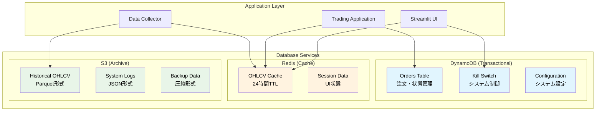

# データベーススキーマ設計

**Document Path**: `docs/physical_design/database_schema.md`  
**Version**: 1.0  
**Type**: データベーススキーマ設計書  
**Last Updated**: 2025-10-19

---

## 目次

- [1. データベース構成概要](#1-データベース構成概要)
- [2. DynamoDB スキーマ設計](#2-dynamodb-スキーマ設計)
- [3. Redis スキーマ設計](#3-redis-スキーマ設計)
- [4. S3 ストレージスキーマ](#4-s3-ストレージスキーマ)
- [5. データ移行・保守](#5-データ移行保守)
- [6. パフォーマンス最適化](#6-パフォーマンス最適化)

---

## 1. データベース構成概要

### 1.1 データベース役割分担



### 1.2 データベース選定理由

| データベース | 用途 | 選定理由 | 代替案 |
|------------|------|---------|--------|
| **DynamoDB** | トランザクション系 | サーバーレス、高可用性、柔軟なスキーマ | RDS（コスト高） |
| **ElastiCache Redis** | 高速キャッシュ | 高性能、TTL機能、データ構造豊富 | MemoryDB（コスト高） |
| **S3** | 大容量アーカイブ | 低コスト、無制限容量、Parquet対応 | EFS（パフォーマンス過剰） |

---

## 2. DynamoDB スキーマ設計

### 2.1 単一テーブル設計（実装済み）

**テーブル名**: `TSS_DynamoDB_OrderState`  
**設計思想**: Single Table Design + 汎用プライマリキー

```yaml
Table: TSS_DynamoDB_OrderState
Billing Mode: ON_DEMAND
Point In Time Recovery: ENABLED

Primary Key:
  PartitionKey: pk (String)
  SortKey: sk (String)

Global Secondary Index:
  GSI1:
    PartitionKey: gs1pk (String) 
    SortKey: gs1sk (String)
    ProjectionType: INCLUDE
    
Attributes:
  - pk: パーティションキー（例: ORDER#{id}, POSITION#{id}）
  - sk: ソートキー（例: METADATA）
  - item_type: エンティティタイプ（Order, Position, GlobalSetting）
  - version: 楽観的ロック用バージョン番号
  - last_updated_utc: 最終更新時刻
  - created_utc: 作成時刻
  - ttl: TTL（オプション）
  - gs1pk: GSI1パーティションキー（スパース）
  - gs1sk: GSI1ソートキー（スパース）
```

### 2.2 プライマリキー設計（実装済み）

#### Kill Switch設定
```python
# 実装場所: src/infrastructure/persistence/dynamodb/dynamodb_kill_switch_repository.py

Item Example:
{
    'pk': 'GLOBALCONFIG',                    # パーティションキー
    'sk': 'SETTING#KILL_SWITCH',            # ソートキー
    'item_type': 'GlobalSetting',
    'active': False,                         # Kill Switch状態
    'reason': 'Manual deactivation',        # 変更理由
    'updated_by': 'streamlit_user',         # 実行者
    'last_updated_utc': '2025-10-19T10:00:00Z',
    'version': 3                            # 楽観的ロック
}

Access Pattern:
- Read: GetItem(pk='GLOBALCONFIG', sk='SETTING#KILL_SWITCH')
- Write: PutItem + ConditionExpression(version check)
```

#### 注文データ
```python
# 実装場所: src/infrastructure/persistence/dynamodb/dynamodb_order_repository.py

Item Example:
{
    'pk': 'ORDER#ORD-20251019-001',         # パーティションキー
    'sk': 'METADATA',                       # ソートキー
    'item_type': 'Order',
    'ticket_id': 'ORD-20251019-001',       # アプリケーション識別子
    'symbol': 'USDJPY',
    'lot_size': '0.10',                     # Decimal→String変換
    'order_type': 'MARKET',
    'action': 'BUY',
    'status': 'PENDING',                    # PENDING/EXECUTED/FAILED
    'mt5_ticket': 12345678,                 # MT5チケット番号
    'entry_price': '149.500',
    'tp_price': '150.000',
    'sl_price': '149.000',
    'created_at': '2025-10-19T10:00:00Z',
    'executed_at': null,
    'version': 1
}

Access Patterns:
- Create: PutItem(pk='ORDER#{order_id}', sk='METADATA')  
- Read: GetItem(pk='ORDER#{order_id}', sk='METADATA')
- Update: UpdateItem + ConditionExpression(version check)
```

### 2.3 設計済みスキーマ（未実装）

#### ポジション管理
```python
# 将来実装予定
Position Item:
{
    'pk': 'POSITION#POS-20251019-001',
    'sk': 'METADATA', 
    'item_type': 'Position',
    'position_id': 'POS-20251019-001',
    'mt5_ticket': 12345678,
    'symbol': 'USDJPY',
    'side': 'BUY',                          # BUY/SELL
    'volume': '0.10',
    'entry_price': '149.500',
    'current_price': '149.750',             # リアルタイム更新
    'stop_loss': '149.000',
    'take_profit': '150.500',
    'status': 'OPEN',                       # OPEN/CLOSED
    'unrealized_pnl': '250.00',             # 含み損益
    'opened_at': '2025-10-19T10:00:00Z',
    'closed_at': null,
    'version': 1,
    
    # GSI用属性
    'gs1pk': 'SYMBOL#USDJPY',               # シンボル別検索用
    'gs1sk': 'STATUS#OPEN#2025-10-19T10:00:00Z',
    'ttl': 1735689600                       # 90日後削除（CLOSED時のみ）
}

Access Patterns:
- Get Position: GetItem(pk='POSITION#{id}', sk='METADATA')
- List Open Positions: Query(GSI1, gs1pk='SYMBOL#{symbol}', gs1sk begins_with 'STATUS#OPEN')  
- Update Position: UpdateItem + ConditionExpression(version check)
```

### 2.4 GSI1設計（実装済み - ADR-005）

**実装状況**: ✅ 作成済み（`deployment/shell/dynamodb/create_gsi1.sh`）

```yaml
GSI1: オープンポジション高速取得用
  Purpose: アクティブポジション一覧の高速取得
  IndexName: GSI1
  
  KeySchema:
    PartitionKey: gs1pk (String)  # 固定値 "OPEN_POSITIONS"
    SortKey: gs1sk (String)       # "SYMBOL#{symbol}#{timestamp}"
    
  ProjectionType: INCLUDE
  NonKeyAttributes:
    - position_id      # ポジション識別子
    - symbol          # 通貨ペア
    - side            # BUY/SELL
    - status          # OPEN/CLOSED（スパース条件）
    - size            # ロットサイズ
    - entry_price     # エントリー価格
    - stop_loss       # ストップロス
    - take_profit     # テイクプロフィット
    - current_price   # 現在価格
    - unrealized_pnl  # 含み損益
    - created_utc     # 作成日時

Sparse Index Design（スパースインデックス）:
  - OPENステータスのポジションのみインデックス化
  - CLOSEDポジションはgs1pk/gs1sk属性を削除してインデックスから除外
  - ストレージコスト最適化

Access Patterns:
  - 全オープンポジション: Query(gs1pk="OPEN_POSITIONS")
  - シンボル別オープンポジション: Query(gs1pk="OPEN_POSITIONS", begins_with(gs1sk, "SYMBOL#USDJPY"))
```

### 2.5 データ整合性制御（実装済み）

#### 楽観的ロック
```python
# src/infrastructure/persistence/dynamodb/dynamodb_kill_switch_repository.py
def update_with_reason(self, activate: bool, reason: str = None) -> bool:
    """楽観的ロック実装"""
    try:
        # 現在のアイテム取得
        response = self.table.get_item(
            Key={'pk': 'GLOBALCONFIG', 'sk': 'SETTING#KILL_SWITCH'}
        )
        current_item = response.get('Item', {})
        current_version = current_item.get('version', 0)
        
        # 条件付き更新
        self.table.put_item(
            Item={
                'pk': 'GLOBALCONFIG',
                'sk': 'SETTING#KILL_SWITCH',
                'item_type': 'GlobalSetting',
                'active': activate,
                'reason': reason,
                'updated_by': 'system',
                'last_updated_utc': datetime.now(timezone.utc).isoformat(),
                'version': current_version + 1
            },
            # 楽観的ロック条件
            ConditionExpression='attribute_not_exists(version) OR version = :current_version',
            ExpressionAttributeValues={':current_version': current_version}
        )
        return True
        
    except ClientError as e:
        if e.response['Error']['Code'] == 'ConditionalCheckFailedException':
            logger.warning("Optimistic lock conflict - concurrent update detected")
            return False
        raise
```

---

## 3. Redis スキーマ設計

### 3.1 実装済みキー設計

**実装場所**: `src/infrastructure/persistence/redis/redis_ohlcv_data_repository.py`

#### OHLCVデータキー
```
Format: ohlcv:{symbol}:{timeframe}
Examples:
- ohlcv:USDJPY:H1    # USDJPY 1時間足
- ohlcv:EURUSD:M5    # EURUSD 5分足
- ohlcv:GBPJPY:D1    # GBPJPY 日足

Value Format: MessagePack Binary
Structure: 
{
    'timestamp_utc': ['2025-10-19T01:00:00Z', '2025-10-19T02:00:00Z', ...],
    'open': [149.123, 149.145, ...], 
    'high': [149.234, 149.256, ...],
    'low': [149.100, 149.120, ...],
    'close': [149.145, 149.180, ...],
    'volume': [1000, 1500, ...]
}
```

#### メタデータキー
```
Format: ohlcv_meta:{symbol}:{timeframe}  
Examples:
- ohlcv_meta:USDJPY:H1

Value Format: JSON
Structure:
{
    'symbol': 'USDJPY',
    'timeframe': 'H1',
    'row_count': 240,
    'earliest_time': '2025-10-18T01:00:00Z',
    'latest_time': '2025-10-19T01:00:00Z',
    'saved_at': '2025-10-19T01:05:00Z',
    'data_source': 'mt5'
}
```

#### 統計情報キー
```
Key: ohlcv_stats
Value Format: JSON
Structure:
{
    'total_keys': 15,
    'symbols': ['USDJPY', 'EURUSD', 'GBPJPY'],
    'timeframes': ['H1', 'M5', 'D1'],
    'memory_used_mb': 20.5,
    'memory_status': 'OK',
    'last_updated': '2025-10-19T01:00:00Z'
}
```

### 3.2 TTL戦略（実装済み）

```python
def calculate_ttl_until_ny_close(self) -> int:
    """NYクローズまでのTTL計算 - 実装済み"""
    now = datetime.now(pytz.UTC)
    
    # 金曜22:00 UTC以降は月曜21:00 UTCまで
    if now.weekday() == 4 and now.hour >= 22:  # 金曜夜
        next_monday = now + timedelta(days=3)
        ny_close = next_monday.replace(hour=21, minute=0, second=0, microsecond=0)
    elif now.weekday() == 5:  # 土曜
        next_monday = now + timedelta(days=2)
        ny_close = next_monday.replace(hour=21, minute=0, second=0, microsecond=0)
    elif now.weekday() == 6:  # 日曜
        next_monday = now + timedelta(days=1) 
        ny_close = next_monday.replace(hour=21, minute=0, second=0, microsecond=0)
    else:  # 平日
        # 当日22:00まで（すでに過ぎている場合は翌営業日）
        ny_close = now.replace(hour=22, minute=0, second=0, microsecond=0)
        if now >= ny_close:
            ny_close += timedelta(days=1)
    
    return int((ny_close - now).total_seconds())

# TTL設定例（UTC統一）:
# 平日 UTC 15:00 → 7時間後（UTC 22:00 = NYクローズ翌日まで）
# 金曜 UTC 23:00 → 70時間後（月曜 UTC 21:00 = NYクローズまで）

# 重要: タイムゾーン統一設計
# - Windows Server: UTC タイムゾーン設定済み
# - Python: datetime.now(timezone.utc)で統一
# - Task Scheduler: UTC基準（22:00 UTC = 07:00 JST翌日）
# - ログ出力: UTC明記（例: [2025-10-19 14:30:45 UTC]）
```

### 3.3 メモリ使用量管理（実装済み）

```python
# src/infrastructure/persistence/redis/redis_ohlcv_data_repository.py
def get_cache_stats(self) -> Dict[str, Any]:
    """メモリ使用量監視 - 実装済み"""
    info = self.redis_client.info('memory')
    used_memory_mb = info['used_memory'] / (1024 * 1024)
    
    # メモリ制限判定
    if used_memory_mb < 10:
        memory_status = 'OK'        # 正常
    elif used_memory_mb < 50:  
        memory_status = 'WARNING'   # 注意
    else:
        memory_status = 'CRITICAL'  # 危険
    
    return {
        'memory_used_mb': round(used_memory_mb, 2),
        'memory_peak_mb': round(info['used_memory_peak'] / (1024 * 1024), 2),
        'memory_status': memory_status,
        'total_keys': len(self.redis_client.keys('ohlcv:*')),
        'fragmentation_ratio': info.get('mem_fragmentation_ratio', 1.0)
    }

# メモリ制限:
# - cache.t3.micro: 約512MB利用可能
# - 実使用目標: <50MB (約10%使用)
# - 監視アラート: 80%（約400MB）使用時
```

---

## 4. S3 ストレージスキーマ

### 4.1 バケット・フォルダ構造（実装済み）

**実装場所**: `src/infrastructure/persistence/s3/s3_ohlcv_data_repository.py`

```
Bucket: tss-raw-data
Structure:
tss-raw-data/
├── USDJPY/                    # 通貨ペア別
│   ├── H1/                    # タイムフレーム別  
│   │   ├── 2025/              # 年別
│   │   │   ├── 10/            # 月別
│   │   │   │   ├── 15/        # 日別
│   │   │   │   │   └── data.parquet   # 1日分データファイル
│   │   │   │   ├── 16/
│   │   │   │   │   └── data.parquet
│   │   │   │   └── 17/
│   │   │   │       └── data.parquet
│   │   │   └── 11/
│   │   │       └── ...
│   │   ├── 2024/
│   │   └── 2023/
│   ├── M5/
│   │   └── 2025/
│   │       └── ...
│   ├── M15/
│   ├── M30/  
│   ├── H4/
│   └── D1/
├── EURUSD/
│   ├── H1/
│   └── ...
├── GBPJPY/
└── ...
```

### 4.2 Parquetスキーマ（実装済み）

```python
# data.parquet のスキーマ定義
Schema:
    timestamp_utc: datetime64[ns]    # UTC基準タイムスタンプ（インデックス）
    open: float64                    # 始値
    high: float64                    # 高値  
    low: float64                     # 安値
    close: float64                   # 終値
    volume: int64                    # 出来高

Configuration:
    Index: timestamp_utc (昇順ソート済み)
    Compression: snappy              # 高速解凍
    Row Groups: 1000 rows/group      # 効率的な部分読み込み
    File Size: 約500KB/日（H1データ）

Quality Constraints:
    - timestamp_utcは一意かつ昇順
    - high >= max(open, close, low)
    - low <= min(open, close, high)  
    - volume >= 0
    - 欠損値なし
```

### 4.3 S3アクセスパターン

```python
# 実装済みアクセスパターン
def save_ohlcv(df: pd.DataFrame, symbol: str, timeframe: str) -> bool:
    """
    S3保存パターン - 日付ベースパーティション
    
    保存フロー:
    1. DataFrameを日付でグループ化
    2. 各日付のデータを個別のParquetファイルとして保存
    3. S3パスを生成: {symbol}/{timeframe}/{year}/{month}/{day}/data.parquet
    """
    
    # グループ化（日付別）
    df_grouped = df.groupby(df.index.date)
    
    for date, daily_df in df_grouped:
        s3_key = self._generate_s3_key(symbol, timeframe, date)
        
        # Parquet保存
        parquet_buffer = io.BytesIO()
        daily_df.to_parquet(parquet_buffer, compression='snappy')
        
        self.s3_client.put_object(
            Bucket=self.bucket_name,
            Key=s3_key,
            Body=parquet_buffer.getvalue(),
            ContentType='application/octet-stream'
        )
```

### 4.4 S3読み取り設計（設計済み・未実装）

```python
# 将来実装予定
def load_ohlcv(
    self, 
    symbol: str, 
    timeframe: str, 
    start_date: datetime,
    end_date: datetime
) -> Optional[pd.DataFrame]:
    """
    期間指定でのS3データ読み込み
    
    処理フロー:
    1. 日付範囲からS3キーリスト生成
    2. 各Parquetファイルを並列読み込み
    3. DataFrameを結合・ソート  
    4. 指定期間でフィルタリング
    """
    
    # パーティションキー生成
    partition_keys = self._generate_partition_keys(symbol, timeframe, start_date, end_date)
    
    # 並列読み込み（ThreadPoolExecutor）
    with ThreadPoolExecutor(max_workers=10) as executor:
        futures = {
            executor.submit(self._load_single_partition, key): key 
            for key in partition_keys
        }
        
        dataframes = []
        for future in as_completed(futures):
            df = future.result()
            if df is not None:
                dataframes.append(df)
    
    # 結合・ソート
    if dataframes:
        combined_df = pd.concat(dataframes, ignore_index=False)
        combined_df = combined_df.sort_index()
        
        # 期間フィルタリング
        mask = (combined_df.index >= start_date) & (combined_df.index <= end_date)
        return combined_df[mask]
    
    return None
```

---

## 5. データ移行・保守

### 5.1 バックアップ戦略

#### DynamoDB
```yaml
Backup Configuration:
  PointInTimeRecovery: ENABLED         # 35日間の復元ポイント
  AutomaticBackups: DISABLED           # コスト考慮
  OnDemandBackups: Manual              # 重要変更前にのみ

Recovery Options:
  - Point-in-time: 任意の秒単位で復元
  - Table Restore: 新しいテーブル名で復元
  - Cross-region: 手動でのクロスリージョンコピー
```

#### Redis
```yaml  
Backup Configuration:
  SnapshotRetentionLimit: 5           # 5個まで保持
  SnapshotWindow: 03:00-05:00 UTC     # 低負荷時間帯
  AutomaticFailover: DISABLED         # Single-node構成

Recovery Options:
  - Snapshot Restore: スナップショットからの復元
  - Replication: 本番環境では複数ノード構成
```

#### S3
```yaml
Backup Configuration:
  Versioning: ENABLED                 # オブジェクトバージョニング
  MFA Delete: DISABLED                # コスト・運用考慮
  
LifecyclePolicy:
  Current Versions:
    - 30 days: Standard → Standard-IA
    - 90 days: Standard-IA → Glacier Instant Retrieval
    - 365 days: Glacier IR → Glacier Deep Archive
    
  Non-current Versions:
    - 30 days: Delete
```

### 5.2 データ移行手順

#### 開発→本番移行
```python
# データ移行スクリプト（設計済み）
def migrate_data_to_production():
    """開発環境から本番環境へのデータ移行"""
    
    # 1. DynamoDBデータエクスポート
    export_dynamodb_table(
        source_table='TSS_DynamoDB_OrderState_Dev',
        dest_table='TSS_DynamoDB_OrderState_Prod'
    )
    
    # 2. S3データコピー
    copy_s3_bucket(
        source_bucket='tss-raw-data-dev',
        dest_bucket='tss-raw-data-prod'
    )
    
    # 3. Redis初期化（バックアップからの復元は不要）
    # 4. アプリケーション設定更新
    update_application_config(environment='production')
```

---

## 6. パフォーマンス最適化

### 6.1 DynamoDB最適化

#### パーティション設計
```python
# ホットパーティション回避設計
Partition Strategy:
    # OK: 高カーディナリティキー使用
    pk = 'ORDER#' + uuid.uuid4().hex[:16]        # ランダム性確保
    pk = 'POSITION#' + timestamp + random_suffix  # 時系列 + ランダム
    
    # NG: 低カーディナリティキー
    pk = 'ORDERS'                                # 全注文が同一パーティション
    pk = 'SYMBOL#USDJPY'                        # 特定通貨に集中
```

#### 読み取り最適化
```python
# Eventually Consistent Readでコスト削減
def get_kill_switch_status(self) -> bool:
    """Eventually Consistent Readを使用"""
    response = self.table.get_item(
        Key={'pk': 'GLOBALCONFIG', 'sk': 'SETTING#KILL_SWITCH'},
        ConsistentRead=False  # Eventually Consistent（0.5 RCU）
    )
    return response.get('Item', {}).get('active', False)

# Strong Consistencyは重要な更新時のみ使用
def get_kill_switch_detail(self) -> Dict:
    """Strong Consistent Readを使用"""
    response = self.table.get_item(
        Key={'pk': 'GLOBALCONFIG', 'sk': 'SETTING#KILL_SWITCH'},
        ConsistentRead=True   # Strong Consistent（1.0 RCU）
    )
    return response.get('Item', {})
```

### 6.2 Redis最適化（実装済み）

#### 接続プール最適化
```python
# src/infrastructure/persistence/redis/redis_client.py
class RedisClient:
    @classmethod
    def get_instance(cls, host: str, port: int = 6379, **kwargs):
        """接続プール最適化設定"""
        connection_pool = redis.ConnectionPool(
            host=host,
            port=port,
            db=kwargs.get('db', 0),
            max_connections=50,                 # 同時接続最大数
            socket_timeout=5,                   # ソケットタイムアウト
            socket_connect_timeout=5,           # 接続タイムアウト
            socket_keepalive=True,              # Keep-Alive有効
            socket_keepalive_options={},
            retry_on_timeout=True,              # タイムアウト時リトライ
            health_check_interval=30            # ヘルスチェック間隔
        )
        return redis.Redis(connection_pool=connection_pool)
```

#### データ形式最適化
```python
# MessagePack使用による高速シリアライゼーション
Performance Comparison (1000 rows OHLCV):
- JSON:        Serialize: 15ms, Size: 120KB, Deserialize: 8ms
- MessagePack: Serialize: 5ms,  Size: 80KB,  Deserialize: 3ms
- Improvement: 約3倍高速、33%サイズ削減
```

### 6.3 S3最適化

#### 並列アクセス設計（設計済み）
```python
# 将来実装: S3並列読み込み
from concurrent.futures import ThreadPoolExecutor, as_completed

class S3OhlcvDataRepository:
    def load_ohlcv_parallel(
        self, 
        symbol: str, 
        timeframe: str, 
        days: int
    ) -> Optional[pd.DataFrame]:
        """並列読み込みによる高速化"""
        
        # パーティションキー生成
        partition_keys = self._generate_partition_keys(symbol, timeframe, days)
        
        # 並列読み込み（最大10スレッド）
        with ThreadPoolExecutor(max_workers=10) as executor:
            futures = {
                executor.submit(self._load_single_partition, key): key
                for key in partition_keys
            }
            
            results = []
            for future in as_completed(futures, timeout=30):
                try:
                    df = future.result()
                    if df is not None:
                        results.append(df)
                except Exception as e:
                    logger.warning(f"Partition load failed: {e}")
        
        # DataFrame結合
        if results:
            return pd.concat(results, ignore_index=False).sort_index()
        return None

# 期待効果:
# - 30日分読み込み: 逐次15秒 → 並列3秒（5倍高速化）
# - メモリ効率: 分割読み込みにより一時的なメモリ使用量削減
```

---

## 付録

### A. 容量設計

#### 1年間のデータ増加予測
```python
# OHLCV データサイズ計算
Data Size Estimation:
    
Single Currency Pair (USDJPY):
    H1: 24 rows/day × 365 days = 8,760 rows/year
    M5: 288 rows/day × 365 days = 105,120 rows/year
    
    File Size (Parquet, snappy圧縮):
    H1: 500KB/日 × 365日 = 180MB/年
    M5: 6MB/日 × 365日 = 2.2GB/年

8 Currency Pairs:
    H1 Only: 180MB × 8 = 1.4GB/年
    H1+M5: 1.4GB + 17.6GB = 19GB/年

S3 Storage Cost (Tokyo region):
    Standard: 19GB × $0.025/GB = $0.48/月
    Standard-IA (30日後): 19GB × $0.019/GB = $0.36/月
    Glacier IR (90日後): 19GB × $0.012/GB = $0.23/月
```

#### DynamoDB容量設計
```python
Item Size Estimation:

Kill Switch Item:
    Attributes: 8個
    Size: 約200 bytes
    
Order Item:
    Attributes: 15個  
    Size: 約500 bytes
    
Position Item (将来):
    Attributes: 20個
    Size: 約800 bytes

Monthly Volume:
    Orders: 100件 × 500 bytes = 50KB
    Positions: 50件 × 800 bytes = 40KB
    Kill Switch: 1件 × 200 bytes = 200 bytes
    
Total: 約100KB/月

DynamoDB Cost:
    Storage: 100KB → 無視できるレベル
    RCU/WCU: オンデマンドで使用量ベース
```

### B. バックアップサイズ

| データソース | 現在サイズ | 1年後予測 | バックアップ頻度 |
|-------------|----------|----------|---------------|
| **DynamoDB** | 1MB | 50MB | 継続的（PITR） |  
| **Redis** | 20MB | 50MB | 週次スナップショット |
| **S3** | 100MB | 1.4GB | バージョニング |
| **EC2 EBS** | 8GB | 12GB | 日次スナップショット |

### C. インデックス設計（将来実装）

```python
# DynamoDB GSI設計（ポジション管理用）
GSI Design:

GSI1 - Symbol-Status Index:
    pk: gs1pk = 'SYMBOL#{symbol}'           # SYMBOL#USDJPY  
    sk: gs1sk = 'STATUS#{status}#{timestamp}'  # STATUS#OPEN#20251019T100000Z
    
    Use Cases:
    - シンボル別オープンポジション一覧
    - シンボル別クローズドポジション履歴
    
    Query Examples:
    # USDJPYのオープンポジション
    query(
        IndexName='GSI1-Symbol-Status',
        KeyConditionExpression='gs1pk = :symbol AND begins_with(gs1sk, :status)',
        ExpressionAttributeValues={
            ':symbol': 'SYMBOL#USDJPY',
            ':status': 'STATUS#OPEN'
        }
    )

GSI2 - Date Range Index:
    pk: gs2pk = 'DATE#{YYYY-MM-DD}'         # DATE#2025-10-19
    sk: gs2sk = 'TIME#{HH:MM:SS}#{position_id}'  # TIME#10:00:00#POS-001
    
    Use Cases:
    - 日付範囲でのポジション検索
    - 日次レポート生成
    
Sparse GSI3 - Active Positions Only:
    pk: gs3pk = 'OPEN_POSITIONS'            # スパースインデックス
    sk: gs3sk = 'SYMBOL#{symbol}#{timestamp}'
    
    条件: statusが'OPEN'の場合のみインデックス化
    Use Cases:
    - アクティブポジション高速一覧
    - ダッシュボード表示
```

---

**Document Version**: 1.0  
**Last Updated**: 2025-10-19  
**Next Review**: 2025-11-19