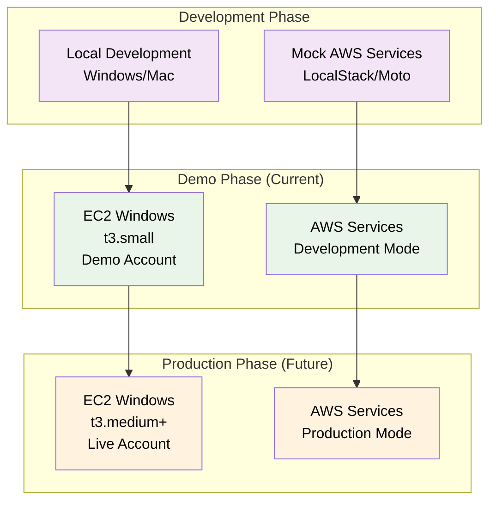
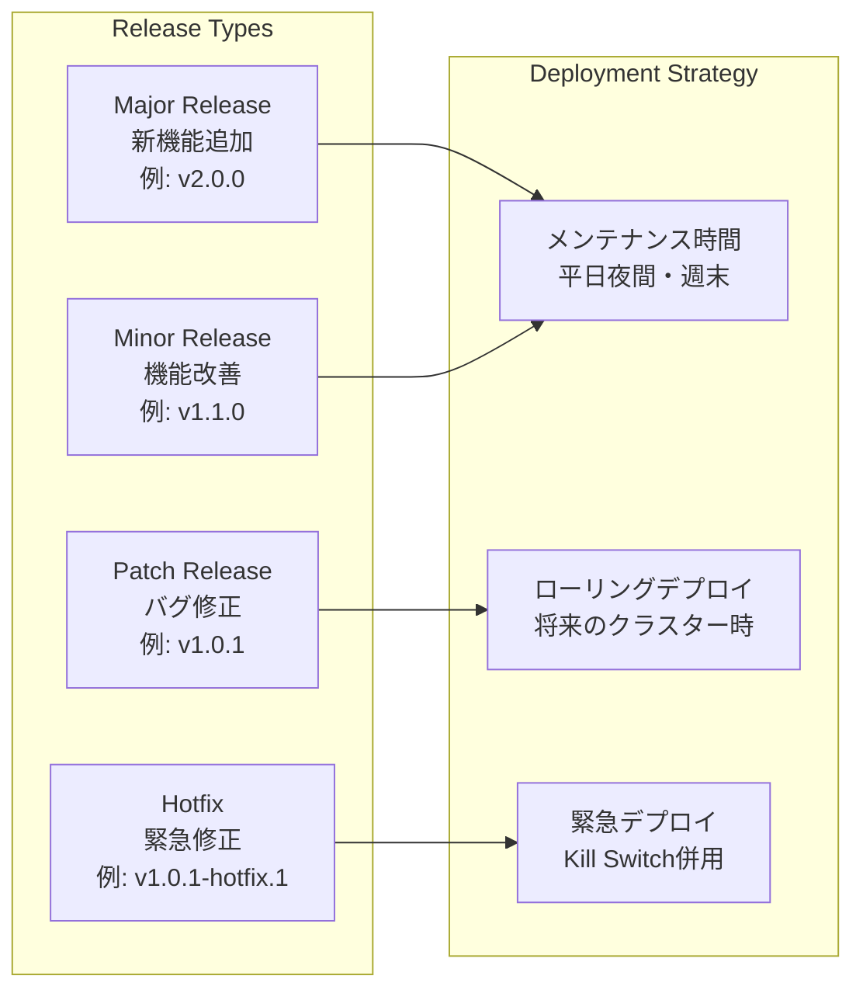
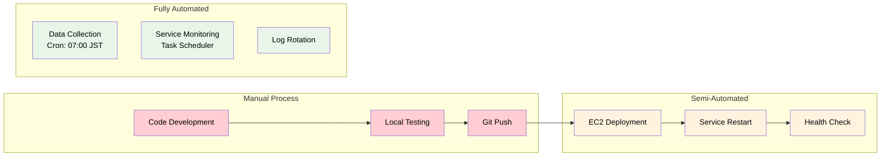

# デプロイメント設計

**Document Path**: `docs/physical_design/deployment.md`  
**Version**: 1.0  
**Type**: デプロイメント設計書  
**Last Updated**: 2025-10-19

---

## 目次

- [1. デプロイメント概要](#1-デプロイメント概要)
- [2. 環境構成](#2-環境構成)
- [3. デプロイメント手順](#3-デプロイメント手順)
- [4. 設定管理](#4-設定管理)
- [5. リリース戦略](#5-リリース戦略)
- [6. ロールバック戦略](#6-ロールバック戦略)
- [7. 自動化・CI/CD](#7-自動化cicd)

---

## 1. デプロイメント概要

### 1.1 デプロイメント戦略

**段階的デプロイメントアプローチ**: 単一EC2インスタンス上での段階的機能展開



### 1.2 現在のデプロイメント状態（実装済み）

| コンポーネント | デプロイ済み | 場所 | 状態 |
|--------------|------------|------|------|
| **AXIA Core Application** | ✅ | EC2: `C:\Users\Administrator\Projects\axia-tss\` | 稼働中 |
| **Python Environment** | ✅ | EC2: `.venv\` | 設定済み |
| **MetaTrader 5** | ✅ | EC2: `C:\Program Files\MetaTrader 5\` | 稼働中 |
| **Task Scheduler** | ✅ | Windows: 4タスク設定済み | 稼働中 |
| **AWS Services** | ✅ | ap-northeast-1 | 稼働中 |

---

## 2. 環境構成

### 2.1 開発環境（Local）

```yaml
Development Environment:
  OS: Windows 11 / macOS
  Python: 3.11+
  Dependencies: requirements-dev.txt
  
  AWS Services (Mock):
    LocalStack: DynamoDB, S3, SQS
    Redis: Docker Container
    
  MT5: Demo Account
  
  Configuration:
    DEBUG: true
    AWS_MOCK_MODE: true
    MT5_DEMO_MODE: true
    REDIS_HOST: localhost
```

### 2.2 Demo環境（現在のEC2）

```yaml
Demo Environment:
  Instance: EC2 t3.small (Windows Server 2022)
  Python: 3.11.6
  Dependencies: requirements.txt
  
  AWS Services (Real):
    DynamoDB: TSS_DynamoDB_OrderState
    ElastiCache: axia-redis-cache
    S3: tss-raw-data
    SQS: TSS_OrderRequestQueue
    
  MT5: Demo Account
  
  Configuration:
    DEBUG: false
    AWS_MOCK_MODE: false
    MT5_DEMO_MODE: true
    REDIS_HOST: axia-redis-cache.xxxxx.cache.amazonaws.com
```

### 2.3 本番環境（将来）

```yaml
Production Environment:
  Instance: EC2 t3.medium+ (Windows Server 2022)
  Python: 3.11.6
  Dependencies: requirements.txt
  
  AWS Services (Production):
    DynamoDB: TSS_DynamoDB_OrderState_Prod
    ElastiCache: axia-redis-cache-prod (Cluster)
    S3: tss-raw-data-prod
    SQS: TSS_OrderRequestQueue_Prod
    
  MT5: Live Account
  
  Configuration:
    DEBUG: false
    AWS_MOCK_MODE: false
    MT5_DEMO_MODE: false
    MONITORING_ENABLED: true
```

---

## 3. デプロイメント手順

### 3.1 初回デプロイ手順（実装済み）

#### Step 1: EC2インスタンス起動
```powershell
# AWS CLI によるEC2起動
aws ec2 run-instances `
  --image-id ami-0dafcef159b1fc745 `
  --count 1 `
  --instance-type t3.small `
  --key-name axia-keypair `
  --security-group-ids sg-axia-ec2 `
  --iam-instance-profile Name=EC2InstanceRole `
  --tag-specifications 'ResourceType=instance,Tags=[{Key=Name,Value=AXIA-Trading-System}]'
```

#### Step 2: 環境セットアップ
```powershell
# RDP接続後の初期セットアップ
# 1. Python 3.11 インストール
Invoke-WebRequest -Uri "https://www.python.org/ftp/python/3.11.6/python-3.11.6-amd64.exe" -OutFile "python-installer.exe"
Start-Process -FilePath "python-installer.exe" -Args "/quiet InstallAllUsers=1 PrependPath=1" -Wait

# 2. Git インストール  
Invoke-WebRequest -Uri "https://github.com/git-for-windows/git/releases/latest/download/Git-2.42.0-64-bit.exe" -OutFile "git-installer.exe"
Start-Process -FilePath "git-installer.exe" -Args "/VERYSILENT" -Wait

# 3. プロジェクトクローン
Set-Location "C:\Users\Administrator\Projects"
git clone https://github.com/username/axia-tss.git
Set-Location "axia-tss"

# 4. Python仮想環境作成
python -m venv .venv
& .venv\Scripts\activate
pip install -r requirements.txt
```

#### Step 3: MT5インストール
```powershell
# MetaTrader 5 セットアップ
# 1. MT5インストーラーダウンロード・実行
# 2. Demo account設定
# 3. Python連携ライブラリ有効化
# 4. 自動ログイン設定
```

#### Step 4: タスクスケジューラ設定
```powershell
# 4つのタスク自動設定
& "C:\Users\Administrator\Projects\axia-tss\scripts\setup-task-scheduler.ps1"

# 設定内容確認
Get-ScheduledTask -TaskName "AXIA_*" | Format-Table TaskName,State,LastRunTime
```

### 3.2 アプリケーション更新手順

#### 通常更新（ダウンタイムあり）
```powershell
# アプリケーション更新スクリプト
function Update-AXIAApplication {
    param(
        [string]$GitBranch = "main",
        [switch]$SkipBackup = $false
    )
    
    Write-Host "=== AXIA Application Update Started ===" -ForegroundColor Green
    
    # 1. 現在の状態バックアップ
    if (-not $SkipBackup) {
        Write-Host "Creating backup..." -ForegroundColor Yellow
        $BackupPath = "C:\Backups\axia-$(Get-Date -Format 'yyyyMMdd-HHmmss')"
        New-Item -ItemType Directory -Path $BackupPath -Force
        Copy-Item -Path "C:\Users\Administrator\Projects\axia-tss\*" -Destination $BackupPath -Recurse
    }
    
    # 2. サービス停止
    Write-Host "Stopping services..." -ForegroundColor Yellow
    Get-ScheduledTask -TaskName "AXIA_*" | Stop-ScheduledTask -Force
    
    # 3. コード更新
    Write-Host "Updating code..." -ForegroundColor Yellow
    Set-Location "C:\Users\Administrator\Projects\axia-tss"
    git fetch origin
    git checkout $GitBranch
    git pull origin $GitBranch
    
    # 4. 依存関係更新
    Write-Host "Updating dependencies..." -ForegroundColor Yellow
    & .venv\Scripts\activate
    pip install -r requirements.txt
    
    # 5. 設定ファイル更新確認
    Write-Host "Checking configuration..." -ForegroundColor Yellow
    & python -c "from src.infrastructure.config.settings import settings; print('Config OK')"
    
    # 6. サービス再起動
    Write-Host "Restarting services..." -ForegroundColor Yellow
    Get-ScheduledTask -TaskName "AXIA_*" | Start-ScheduledTask
    
    # 7. ヘルスチェック
    Start-Sleep -Seconds 30
    Write-Host "Health check..." -ForegroundColor Yellow
    Test-NetConnection -ComputerName "localhost" -Port 8501
    
    Write-Host "=== Update Completed ===" -ForegroundColor Green
}
```

#### ホットフィックス（緊急修正）
```powershell
# 緊急修正用スクリプト
function Deploy-HotFix {
    param(
        [string]$FixBranch,
        [string]$Component  # "order_processor", "streamlit", "data_collector"
    )
    
    # 1. Kill Switch有効化（安全措置）
    aws dynamodb put-item --region ap-northeast-1 --table-name TSS_DynamoDB_OrderState --item '{
      "pk": {"S": "GLOBALCONFIG"},
      "sk": {"S": "SETTING#KILL_SWITCH"},
      "active": {"BOOL": true},
      "reason": {"S": "Hotfix deployment"}
    }'
    
    # 2. 特定コンポーネントのみ停止
    Stop-ScheduledTask -TaskName "AXIA_$Component" -Force
    
    # 3. コード更新
    git checkout $FixBranch
    git pull origin $FixBranch
    
    # 4. 単一コンポーネント再起動
    Start-ScheduledTask -TaskName "AXIA_$Component"
    
    # 5. 動作確認後にKill Switch解除
    # 手動でKill Switchを無効化
}
```

---

## 4. 設定管理

### 4.1 設定ファイル構成（実装済み）

**実装場所**: `src/infrastructure/config/settings.py`

```python
class Settings:
    """環境別設定管理"""
    
    # 環境判定
    def __init__(self):
        self.environment = os.getenv('AXIA_ENV', 'demo')
        self.load_environment_config()
    
    def load_environment_config(self):
        """環境別設定読み込み"""
        if self.environment == 'development':
            self.load_development_config()
        elif self.environment == 'demo':
            self.load_demo_config()        # 現在の設定
        elif self.environment == 'production':
            self.load_production_config()
    
    def load_demo_config(self):
        """Demo環境設定（現在）"""
        # DynamoDB
        self.dynamodb_table_name = "TSS_DynamoDB_OrderState"
        
        # Redis
        self.redis_endpoint = "axia-redis-cache.xxxxx.cache.amazonaws.com"
        self.redis_port = 6379
        
        # SQS
        self.queue_url = "https://sqs.ap-northeast-1.amazonaws.com/xxx/TSS_OrderRequestQueue"
        
        # MT5
        self.mt5_demo_mode = True
        
        # Debug
        self.debug_mode = False
```

### 4.2 環境変数管理

```powershell
# Windows環境変数設定（EC2実装済み）
[System.Environment]::SetEnvironmentVariable("AXIA_ENV", "demo", "Machine")
[System.Environment]::SetEnvironmentVariable("AWS_DEFAULT_REGION", "ap-northeast-1", "Machine")
[System.Environment]::SetEnvironmentVariable("PYTHONPATH", "C:\Users\Administrator\Projects\axia-tss", "Machine")

# 確認
Get-ChildItem Env: | Where-Object {$_.Name -like "*AXIA*" -or $_.Name -like "*AWS*"}
```

### 4.3 シークレット管理（実装予定）

```python
# MT5認証情報のSecrets Manager統合
def get_mt5_credentials(self) -> Dict:
    """MT5認証情報を安全に取得"""
    
    if self.mt5_demo_mode:
        # Demo環境: ハードコード許可
        return {
            'login': self.mt5_demo_login,
            'password': self.mt5_demo_password,
            'server': self.mt5_demo_server
        }
    else:
        # 本番環境: Secrets Manager必須
        import boto3
        client = boto3.client('secretsmanager', region_name=self.aws_region)
        
        try:
            response = client.get_secret_value(SecretId='TSS/mt5/live')
            secret = json.loads(response['SecretString'])
            return {
                'login': secret['login'],
                'password': secret['password'],
                'server': secret['server']
            }
        except Exception as e:
            logger.critical(f"Failed to get MT5 credentials: {e}")
            raise
```

---

## 5. リリース戦略

### 5.1 リリースタイプ



### 5.2 リリース手順（標準）

```powershell
# リリーススクリプト: deploy-release.ps1
function Deploy-Release {
    param(
        [Parameter(Mandatory=$true)]
        [string]$Version,
        
        [Parameter(Mandatory=$true)]
        [string]$ReleaseNotes,
        
        [switch]$Production = $false
    )
    
    Write-Host "=== AXIA Release Deployment: $Version ===" -ForegroundColor Cyan
    
    # 1. プリフライトチェック
    Write-Host "1. Pre-flight checks..." -ForegroundColor Yellow
    
    # システム状態確認
    $healthStatus = & python -c "
from src.infrastructure.di.container import container
from src.presentation.ui.streamlit.controllers.system_controller import SystemController
controller = SystemController()
health = controller.get_system_health()
print(f'Overall: {health.overall_status.value}')
print(f'Kill Switch: {health.kill_switch[\"active\"]}')
"
    
    if ($healthStatus -match "unhealthy") {
        Write-Error "System is not healthy. Aborting deployment."
        return
    }
    
    # 2. バックアップ作成
    Write-Host "2. Creating backup..." -ForegroundColor Yellow
    $BackupPath = "C:\Backups\Release-$Version-$(Get-Date -Format 'yyyyMMdd-HHmmss')"
    New-Item -ItemType Directory -Path $BackupPath -Force
    
    # アプリケーションバックアップ
    Copy-Item -Path "C:\Users\Administrator\Projects\axia-tss" -Destination "$BackupPath\axia-tss" -Recurse
    
    # DynamoDBバックアップ（本番環境のみ）
    if ($Production) {
        aws dynamodb create-backup --table-name TSS_DynamoDB_OrderState --backup-name "Release-$Version-backup"
    }
    
    # 3. デプロイメント実行
    Write-Host "3. Deploying application..." -ForegroundColor Yellow
    
    # Kill Switch有効化（安全措置）
    & python -c "
from src.infrastructure.di.container import container
repo = container.get_kill_switch_repository()
repo.update_with_reason(True, 'Release deployment: $Version')
print('Kill Switch activated')
"
    
    # サービス停止
    Get-ScheduledTask -TaskName "AXIA_*" | Stop-ScheduledTask -Force
    Start-Sleep -Seconds 10
    
    # コード更新
    Set-Location "C:\Users\Administrator\Projects\axia-tss"
    git fetch --tags
    git checkout "v$Version"
    
    # 依存関係更新
    & .venv\Scripts\activate
    pip install -r requirements.txt
    
    # 4. サービス再起動
    Write-Host "4. Starting services..." -ForegroundColor Yellow
    Get-ScheduledTask -TaskName "AXIA_*" | Start-ScheduledTask
    
    # 5. ヘルスチェック
    Write-Host "5. Health check..." -ForegroundColor Yellow
    Start-Sleep -Seconds 30
    
    # Streamlit UIチェック
    $streamlitTest = Test-NetConnection -ComputerName localhost -Port 8501
    if (-not $streamlitTest.TcpTestSucceeded) {
        Write-Error "Streamlit UI is not responding"
        return
    }
    
    # 6. Kill Switch解除
    Write-Host "6. Activating system..." -ForegroundColor Yellow
    & python -c "
from src.infrastructure.di.container import container
repo = container.get_kill_switch_repository()
repo.update_with_reason(False, 'Release deployment completed: $Version')
print('Kill Switch deactivated')
"
    
    # 7. デプロイメントログ記録
    $LogEntry = @{
        timestamp = (Get-Date).ToString('yyyy-MM-ddTHH:mm:ssZ')
        version = $Version
        environment = $(if ($Production) {"production"} else {"demo"})
        status = "success"
        release_notes = $ReleaseNotes
        backup_path = $BackupPath
    }
    
    $LogEntry | ConvertTo-Json | Out-File -FilePath "C:\Logs\deployment-history.json" -Append
    
    Write-Host "=== Deployment Completed Successfully ===" -ForegroundColor Green
    Write-Host "Version: $Version" -ForegroundColor White
    Write-Host "Backup: $BackupPath" -ForegroundColor White
    Write-Host "Release Notes: $ReleaseNotes" -ForegroundColor White
}
```

### 5.3 デプロイメント検証

```powershell
# デプロイ後検証スクリプト
function Test-DeploymentSuccess {
    Write-Host "=== Post-Deployment Verification ===" -ForegroundColor Cyan
    
    $TestResults = @{}
    
    # 1. サービス稼働確認
    Write-Host "1. Checking scheduled tasks..." -ForegroundColor Yellow
    $tasks = Get-ScheduledTask -TaskName "AXIA_*"
    foreach ($task in $tasks) {
        $TestResults[$task.TaskName] = $task.State -eq "Running"
        Write-Host "  $($task.TaskName): $($task.State)" -ForegroundColor $(if ($task.State -eq "Running") {"Green"} else {"Red"})
    }
    
    # 2. ポート接続確認
    Write-Host "2. Checking port connectivity..." -ForegroundColor Yellow
    $portTests = @(
        @{Service="Streamlit"; Port=8501},
        @{Service="Redis"; Host="axia-redis-cache.xxxxx.cache.amazonaws.com"; Port=6379}
    )
    
    foreach ($test in $portTests) {
        $host = if ($test.Host) {$test.Host} else {"localhost"}
        $result = Test-NetConnection -ComputerName $host -Port $test.Port -WarningAction SilentlyContinue
        $TestResults["$($test.Service)_Port"] = $result.TcpTestSucceeded
        Write-Host "  $($test.Service) ($($test.Port)): $($result.TcpTestSucceeded)" -ForegroundColor $(if ($result.TcpTestSucceeded) {"Green"} else {"Red"})
    }
    
    # 3. 機能テスト
    Write-Host "3. Testing core functionality..." -ForegroundColor Yellow
    
    # Redis接続テスト
    try {
        & python -c "
from src.infrastructure.di.container import container
redis_client = container.get_redis_client()
redis_client.ping()
print('Redis: OK')
" 
        $TestResults["Redis_Connection"] = $true
        Write-Host "  Redis Connection: OK" -ForegroundColor Green
    } catch {
        $TestResults["Redis_Connection"] = $false
        Write-Host "  Redis Connection: FAILED" -ForegroundColor Red
    }
    
    # DynamoDB接続テスト
    try {
        & python -c "
from src.infrastructure.di.container import container
repo = container.get_kill_switch_repository()
status = repo.get_status_detail()
print(f'DynamoDB: OK, Kill Switch: {status[\"active\"]}')
"
        $TestResults["DynamoDB_Connection"] = $true
        Write-Host "  DynamoDB Connection: OK" -ForegroundColor Green
    } catch {
        $TestResults["DynamoDB_Connection"] = $false
        Write-Host "  DynamoDB Connection: FAILED" -ForegroundColor Red
    }
    
    # 4. 結果サマリー
    Write-Host "`n=== Verification Summary ===" -ForegroundColor Cyan
    $SuccessCount = ($TestResults.Values | Where-Object {$_ -eq $true}).Count
    $TotalCount = $TestResults.Count
    $SuccessRate = [math]::Round(($SuccessCount / $TotalCount) * 100, 1)
    
    Write-Host "Success Rate: $SuccessRate% ($SuccessCount/$TotalCount)" -ForegroundColor $(if ($SuccessRate -ge 90) {"Green"} else {"Red"})
    
    if ($SuccessRate -lt 90) {
        Write-Warning "Deployment verification failed. Consider rollback."
        return $false
    }
    
    return $true
}
```

---

## 6. ロールバック戦略

### 6.1 ロールバック手順

```powershell
function Rollback-Deployment {
    param(
        [Parameter(Mandatory=$true)]
        [string]$BackupPath,
        
        [string]$Reason = "Deployment issue"
    )
    
    Write-Host "=== EMERGENCY ROLLBACK STARTED ===" -ForegroundColor Red
    Write-Host "Reason: $Reason" -ForegroundColor Yellow
    
    # 1. Kill Switch即座有効化
    aws dynamodb put-item --region ap-northeast-1 --table-name TSS_DynamoDB_OrderState --item '{
      "pk": {"S": "GLOBALCONFIG"},
      "sk": {"S": "SETTING#KILL_SWITCH"},
      "active": {"BOOL": true}, 
      "reason": {"S": "Emergency rollback: '"$Reason"'"}
    }'
    
    # 2. 全サービス即停止
    Get-ScheduledTask -TaskName "AXIA_*" | Stop-ScheduledTask -Force
    Get-Process | Where-Object {$_.ProcessName -match "(python|streamlit)"} | Stop-Process -Force
    
    # 3. バックアップからの復元
    if (Test-Path $BackupPath) {
        Remove-Item -Path "C:\Users\Administrator\Projects\axia-tss" -Recurse -Force
        Copy-Item -Path "$BackupPath\axia-tss" -Destination "C:\Users\Administrator\Projects\" -Recurse
        Write-Host "Application restored from backup: $BackupPath" -ForegroundColor Green
    } else {
        Write-Error "Backup path not found: $BackupPath"
        return
    }
    
    # 4. サービス再起動
    Start-Sleep -Seconds 5
    Get-ScheduledTask -TaskName "AXIA_*" | Start-ScheduledTask
    
    # 5. 動作確認
    Start-Sleep -Seconds 30
    $verificationResult = Test-DeploymentSuccess
    
    if ($verificationResult) {
        Write-Host "=== ROLLBACK COMPLETED SUCCESSFULLY ===" -ForegroundColor Green
        # Kill Switch解除は手動で行う（安全確認後）
    } else {
        Write-Error "Rollback verification failed. Manual intervention required."
    }
}
```

### 6.2 データ復旧

```powershell
# DynamoDB復旧（本番環境用）
function Restore-DynamoDBData {
    param(
        [string]$BackupName,
        [string]$TargetTableName = "TSS_DynamoDB_OrderState_Restored"
    )
    
    # ポイントインタイム復旧
    aws dynamodb restore-table-from-backup `
      --target-table-name $TargetTableName `
      --backup-arn "arn:aws:dynamodb:ap-northeast-1:*:table/TSS_DynamoDB_OrderState/backup/$BackupName"
    
    # 復旧待ち
    do {
        Start-Sleep -Seconds 30
        $status = aws dynamodb describe-table --table-name $TargetTableName --query 'Table.TableStatus' --output text
        Write-Host "Restore Status: $status"
    } while ($status -ne "ACTIVE")
    
    Write-Host "Table restored successfully: $TargetTableName" -ForegroundColor Green
}
```

---

## 7. 自動化・CI/CD

### 7.1 現在の自動化レベル



### 7.2 将来のCI/CD設計

```yaml
# GitHub Actions ワークフロー（将来実装）
name: AXIA Deployment Pipeline

on:
  push:
    branches: [main]
    tags: ['v*']
  pull_request:
    branches: [main]

jobs:
  test:
    runs-on: ubuntu-latest
    steps:
      - uses: actions/checkout@v3
      - name: Setup Python
        uses: actions/setup-python@v4
        with:
          python-version: '3.11'
      - name: Install dependencies
        run: pip install -r requirements-dev.txt
      - name: Run tests
        run: pytest tests/ --cov=src/
      - name: Code quality check
        run: |
          flake8 src/
          mypy src/
  
  deploy-demo:
    needs: test
    runs-on: ubuntu-latest
    if: github.ref == 'refs/heads/main'
    steps:
      - name: Deploy to Demo Environment
        run: |
          # EC2インスタンスにSSH接続
          # デプロイスクリプト実行
          # ヘルスチェック実行
  
  deploy-production:
    needs: test
    runs-on: ubuntu-latest  
    if: startsWith(github.ref, 'refs/tags/v')
    environment: production
    steps:
      - name: Deploy to Production
        run: |
          # 本番環境デプロイ
          # 段階的ヘルスチェック
          # Kill Switch解除
```

### 7.3 デプロイメント監視

```python
# デプロイメント監視（実装予定）
class DeploymentMonitor:
    """デプロイメント監視クラス"""
    
    def monitor_deployment(self, version: str, timeout_minutes: int = 10):
        """デプロイメント成功監視"""
        start_time = time.time()
        timeout_seconds = timeout_minutes * 60
        
        while time.time() - start_time < timeout_seconds:
            # ヘルスチェック実行
            health_status = self.check_system_health()
            
            if health_status['overall'] == 'healthy':
                logger.info(f"Deployment {version} successful")
                return True
            
            time.sleep(30)
        
        logger.error(f"Deployment {version} timeout")
        return False
    
    def check_system_health(self) -> Dict[str, str]:
        """システムヘルス確認"""
        return {
            'overall': 'healthy',
            'streamlit': 'running',
            'order_manager': 'running', 
            'redis': 'connected',
            'dynamodb': 'connected'
        }
```

---

## 付録

### A. デプロイメント履歴

| Version | Date | Environment | Status | Notes |
|---------|------|-------------|--------|-------|
| v1.0.0 | 2025-10-18 | Demo | ✅ Success | 初回デプロイ |
| v1.0.1 | 2025-10-19 | Demo | ✅ Success | Redis統合 |
| v1.1.0 | 予定 | Demo | ⏳ Planned | ポジション管理 |

### B. トラブルシューティング

| 問題 | 症状 | 原因 | 解決方法 |
|------|------|------|--------|
| **Streamlit起動失敗** | Port 8501接続不可 | Python仮想環境問題 | `.venv\Scripts\activate` 確認 |
| **MT5接続失敗** | 認証エラー | 認証情報不正 | Secrets Manager確認 |
| **Redis接続失敗** | タイムアウト | Security Group設定 | sg-elasticache-default確認 |
| **SQS送信失敗** | 権限エラー | IAMロール問題 | EC2InstanceRole確認 |

### C. 運用コマンド

```powershell
# 日常運用コマンド集

# 現在のバージョン確認
Set-Location "C:\Users\Administrator\Projects\axia-tss"
git describe --tags --always

# サービス状態確認
Get-ScheduledTask -TaskName "AXIA_*" | Format-Table TaskName,State,LastRunTime,NextRunTime

# ログ確認（直近1時間）
Get-EventLog -LogName Application -After (Get-Date).AddHours(-1) | 
  Where-Object {$_.Source -match "Task Scheduler|Python"} | 
  Format-Table TimeGenerated,Source,Message

# システムリソース確認
Get-CimInstance -ClassName Win32_Processor | Select-Object LoadPercentage
Get-CimInstance -ClassName Win32_OperatingSystem | Select-Object @{Name="MemoryUsage%";Expression={[math]::Round((($_.TotalVisibleMemorySize-$_.FreePhysicalMemory)/$_.TotalVisibleMemorySize)*100,2)}}

# AWS サービス状態確認
aws dynamodb describe-table --table-name TSS_DynamoDB_OrderState --query 'Table.TableStatus'
aws sqs get-queue-attributes --queue-url https://sqs.ap-northeast-1.amazonaws.com/.../TSS_OrderRequestQueue --attribute-names All
```

---

**Document Version**: 1.0  
**Last Updated**: 2025-10-19  
**Next Review**: 2025-11-19