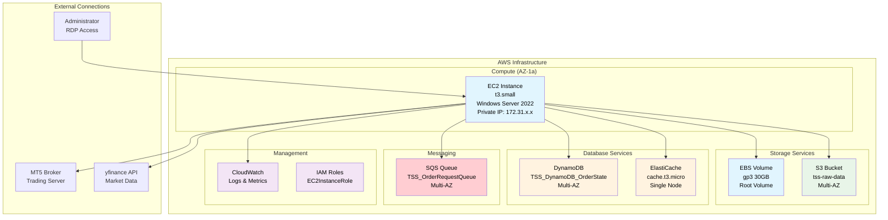
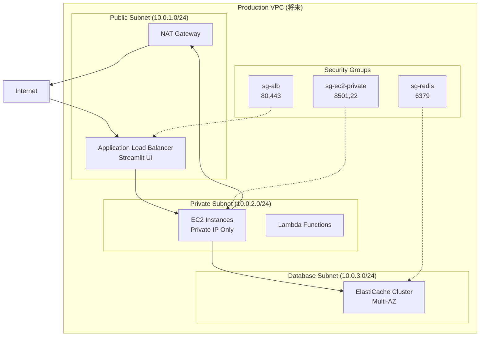
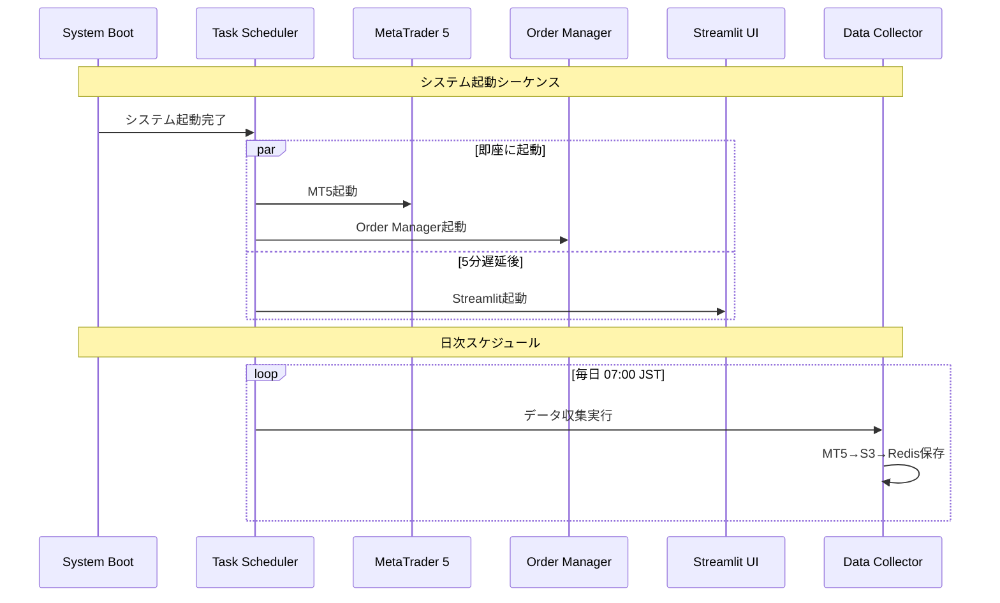
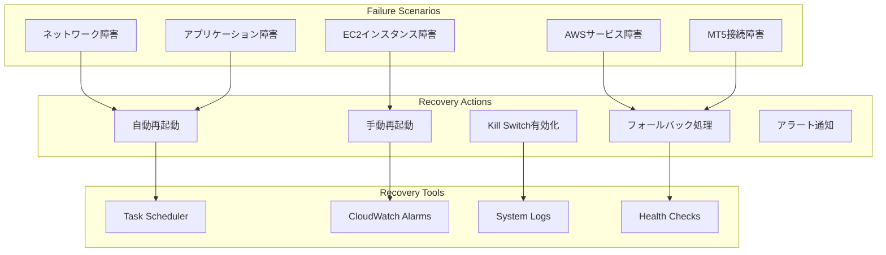

# インフラストラクチャ設計

**Document Path**: `docs/physical_design/infrastructure.md`  
**Version**: 1.0  
**Type**: インフラストラクチャ設計書  
**Last Updated**: 2025-10-19

---

## 目次

- [1. インフラ構成概要](#1-インフラ構成概要)
- [2. EC2インスタンス設計](#2-ec2インスタンス設計)
- [3. ネットワーク設計](#3-ネットワーク設計)
- [4. ストレージ設計](#4-ストレージ設計)
- [5. セキュリティ設計](#5-セキュリティ設計)
- [6. 自動化・オーケストレーション](#6-自動化オーケストレーション)
- [7. 障害対応設計](#7-障害対応設計)

---

## 1. インフラ構成概要

### 1.1 現在の構成（実装済み）



### 1.2 インフラ構成判定

**現在のフェーズ**: Development/Demo環境  
**選択理由**: コスト最適化とシンプルさを重視

| 項目 | 現在の選択 | 本番環境での変更予定 |
|------|----------|-------------------|
| **VPC** | デフォルトVPC | 専用VPC作成 |
| **Subnet** | Public | Private + NAT Gateway |
| **AZ** | Single AZ | Multi-AZ |
| **Instance** | t3.small | t3.medium（負荷に応じて） |
| **Redis** | Single Node | Cluster Mode |

---

## 2. EC2インスタンス設計

### 2.1 インスタンス仕様（実装済み）

```yaml
Instance Configuration:
  Type: t3.small
  vCPUs: 2
  Memory: 2 GiB
  Network: Up to 5 Gigabit
  EBS-Optimized: true
  
  Operating System: Windows Server 2022 Base
  Architecture: x86_64
  AMI: ami-0dafcef159b1fc745 (region specific)
  
  Storage:
    Root Volume:
      Type: gp3
      Size: 30 GB
      IOPS: 3000 (baseline)
      Throughput: 125 MB/s
      Encrypted: true
      
  Networking:
    VPC: Default VPC
    Subnet: Default Public Subnet
    Public IP: Auto-assign
    Security Groups: sg-axia-ec2
```

### 2.2 インストール済みソフトウェア

```powershell
# Windows Server 2022 構成
Installed Software:
├── Python 3.11.6
├── MetaTrader 5 (Latest)  
├── Git for Windows
├── PowerShell 7.x
└── Windows Terminal

Python Packages:
├── streamlit==1.28.1
├── pandas==2.0.3
├── numpy==1.24.3
├── plotly==5.17.0
├── boto3==1.29.7
├── redis==4.5.4
├── msgpack==1.0.5
├── MetaTrader5==5.0.45
└── yfinance==0.2.18
```

### 2.3 タスクスケジューラ設定（実装済み）

**重要**: 全タスクはUTCベースで設定され、Windows Server 2022のタイムゾーンもUTCに統一設定済み

```xml
<!-- AXIA_Streamlit Task -->
<Task version="1.2">
  <RegistrationInfo>
    <Description>AXIA Streamlit UI Service</Description>
  </RegistrationInfo>
  <Triggers>
    <BootTrigger>
      <StartBoundary>2025-01-01T00:00:00Z</StartBoundary>  <!-- UTC時刻 -->
      <Delay>PT5M</Delay>  <!-- 5分遅延 -->
      <Enabled>true</Enabled>
    </BootTrigger>
  </Triggers>
  <Principals>
    <Principal id="Author">
      <UserId>S-1-5-32-544</UserId>  <!-- BUILTIN\Administrators -->
      <LogonType>ServiceAccount</LogonType>
      <RunLevel>HighestAvailable</RunLevel>
    </Principal>
  </Principals>
  <Settings>
    <MultipleInstancesPolicy>IgnoreNew</MultipleInstancesPolicy>
    <DisallowStartIfOnBatteries>false</DisallowStartIfOnBatteries>
    <StopIfGoingOnBatteries>false</StopIfGoingOnBatteries>
    <AllowHardTerminate>true</AllowHardTerminate>
    <StartWhenAvailable>false</StartWhenAvailable>
    <RunOnlyIfNetworkAvailable>false</RunOnlyIfNetworkAvailable>
    <ExecutionTimeLimit>PT0S</ExecutionTimeLimit>  <!-- 無制限 -->
    <Priority>7</Priority>
  </Settings>
  <Actions>
    <Exec>
      <Command>C:\Users\Administrator\Projects\axia-tss\.venv\Scripts\streamlit.exe</Command>
      <Arguments>run C:\Users\Administrator\Projects\axia-tss\src\presentation\ui\streamlit\app.py --server.port=8501 --server.address=0.0.0.0</Arguments>
      <WorkingDirectory>C:\Users\Administrator\Projects\axia-tss</WorkingDirectory>
    </Exec>
  </Actions>
</Task>
```

### 2.4 プロセス管理（実装済み）

**タイムゾーン設定**: 全システムUTC統一（Windows Server タイムゾーン: UTC）

| プロセス | 実行ファイル | 起動トリガー | 実行ユーザー | 状態 |
|---------|-------------|-------------|-------------|------|
| **Streamlit UI** | streamlit.exe | システム起動（5分遅延） | SYSTEM | ✅ 稼働中 |
| **Order Manager** | python.exe | システム起動 | SYSTEM | ✅ 稼働中 |
| **Data Collector** | python.exe | 毎日 22:00 UTC (= 07:00 JST翌日) | SYSTEM | ✅ 設定済み |
| **MetaTrader 5** | terminal64.exe | システム起動 | Administrator | ✅ 稼働中 |

#### Data Collector実行スケジュール（UTC基準）
- **月-金 22:00 UTC** = 火-土 07:00 JST
- **週末実行なし**: 土日はFX市場クローズのため
- **NYクローズ後**: UTC 21:00がNYクローズ、22:00でデータ確定

---

## 3. ネットワーク設計

### 3.1 セキュリティグループ設計（実装済み）

#### EC2セキュリティグループ
```yaml
Security Group: sg-axia-ec2
Description: AXIA Trading System EC2 Instance

Inbound Rules:
  - Type: RDP
    Protocol: TCP  
    Port: 3389
    Source: 0.0.0.0/0
    Description: Administrator Remote Access
    
  - Type: Custom TCP
    Protocol: TCP
    Port: 8501  
    Source: 0.0.0.0/0
    Description: Streamlit Web UI Access
    
Outbound Rules:
  - Type: All Traffic
    Protocol: All
    Port: All
    Destination: 0.0.0.0/0
    Description: Unrestricted outbound access
```

#### ElastiCacheセキュリティグループ
```yaml
Security Group: sg-elasticache-default

Inbound Rules:
  - Type: Custom TCP
    Protocol: TCP
    Port: 6379
    Source: sg-axia-ec2
    Description: Redis access from EC2 only
    
Outbound Rules: None (不要)
```

### 3.2 ネットワークフロー

```mermaid
graph LR
    subgraph "Internet"
        AdminPC[Admin PC]
        MT5Servers[MT5 Broker Servers<br/>Port: 443, 993]
        APIs[External APIs<br/>yfinance, etc.]
    end
    
    subgraph "AWS VPC (Default)"
        subgraph "Public Subnet"
            EC2Instance[EC2 Instance<br/>172.31.x.x<br/>Public IP: Auto]
        end
        
        subgraph "Private Services"
            ElastiCache[ElastiCache<br/>172.31.y.y<br/>Port: 6379]
        end
        
        subgraph "Regional Services"
            DynamoDB[DynamoDB]
            S3[S3]
            SQS[SQS]
        end
    end
    
    AdminPC -->|RDP(3389)<br/>HTTPS(8501)| EC2Instance
    EC2Instance -->|HTTPS(443)<br/>SMTP(993)| MT5Servers
    EC2Instance -->|HTTPS(443)| APIs
    EC2Instance -->|Redis(6379)| ElastiCache
    EC2Instance -->|HTTPS(443)| DynamoDB
    EC2Instance -->|HTTPS(443)| S3
    EC2Instance -->|HTTPS(443)| SQS
```

### 3.3 将来のネットワーク設計



---

## 4. ストレージ設計

### 4.1 EBSボリューム設計（実装済み）

```yaml
Root Volume Configuration:
  VolumeType: gp3
  Size: 30 GB
  IOPS: 3000 (baseline)
  Throughput: 125 MB/s
  Encrypted: true
  DeleteOnTermination: true
  
Usage Breakdown:
  Windows OS: ~15 GB
  Python Environment: ~2 GB
  MetaTrader 5: ~1 GB  
  Application Code: ~100 MB
  Logs & Cache: ~2 GB
  Free Space: ~10 GB (33%)

Performance Metrics:
  Read IOPS: 3000 sustained
  Write IOPS: 3000 sustained  
  Read Throughput: 125 MB/s
  Write Throughput: 125 MB/s
```

### 4.2 S3バケット設計（実装済み）

```yaml
Bucket: tss-raw-data
Region: ap-northeast-1
Configuration:
  Versioning: Enabled
  Encryption: 
    Type: SSE-S3
    Algorithm: AES256
  PublicAccess: 
    BlockPublicAcls: true
    IgnorePublicAcls: true
    BlockPublicPolicy: true
    RestrictPublicBuckets: true
    
Access Patterns:
  Read Frequency: Daily (Data Collection)
  Write Frequency: Daily (Historical Storage)
  Data Size Growth: ~500KB/day/currency pair
  
Current Usage:
  Objects: ~100 files
  Size: ~50 MB
  Growth Rate: ~15 MB/month
```

### 4.3 ElastiCache設計（実装済み）

```yaml
Cluster Configuration:
  CacheClusterId: axia-redis-cache
  Engine: redis
  Version: 7.0
  NodeType: cache.t3.micro
  NumCacheNodes: 1
  Port: 6379
  
  SubnetGroup: default  
  SecurityGroup: sg-elasticache-default
  
  BackupConfiguration:
    SnapshotRetentionLimit: 1
    SnapshotWindow: 03:00-05:00 UTC
    
  Maintenance:
    MaintenanceWindow: sun:05:00-sun:06:00 UTC
    
Performance Characteristics:
  Memory: 512 MB
  vCPUs: 2
  Network: Low to Moderate
  
Current Usage:
  Memory Used: ~20 MB (4%)
  Connections: ~5
  Commands/sec: ~100
```

---

## 5. セキュリティ設計

### 5.1 IAM設計（実装済み）

#### EC2InstanceRole
```json
{
  "Version": "2012-10-17",
  "Statement": [
    {
      "Sid": "DynamoDBAccess",
      "Effect": "Allow",
      "Action": [
        "dynamodb:GetItem",
        "dynamodb:PutItem",
        "dynamodb:UpdateItem", 
        "dynamodb:DeleteItem",
        "dynamodb:Query",
        "dynamodb:Scan"
      ],
      "Resource": [
        "arn:aws:dynamodb:ap-northeast-1:*:table/TSS_DynamoDB_OrderState",
        "arn:aws:dynamodb:ap-northeast-1:*:table/TSS_DynamoDB_OrderState/index/*"
      ]
    },
    {
      "Sid": "S3Access",
      "Effect": "Allow", 
      "Action": [
        "s3:GetObject",
        "s3:PutObject",
        "s3:DeleteObject",
        "s3:ListBucket"
      ],
      "Resource": [
        "arn:aws:s3:::tss-raw-data",
        "arn:aws:s3:::tss-raw-data/*"
      ]
    },
    {
      "Sid": "SQSAccess",
      "Effect": "Allow",
      "Action": [
        "sqs:ReceiveMessage", 
        "sqs:SendMessage",
        "sqs:DeleteMessage",
        "sqs:GetQueueAttributes",
        "sqs:GetQueueUrl"
      ],
      "Resource": [
        "arn:aws:sqs:ap-northeast-1:*:TSS_OrderRequestQueue",
        "arn:aws:sqs:ap-northeast-1:*:TSS_OrderRequestQueue_DLQ"
      ]
    },
    {
      "Sid": "CloudWatchAccess",
      "Effect": "Allow",
      "Action": [
        "logs:CreateLogGroup",
        "logs:CreateLogStream",
        "logs:PutLogEvents",
        "cloudwatch:PutMetricData"
      ],
      "Resource": "*"
    }
  ]
}
```

### 5.2 ネットワークセキュリティ

#### アクセス制御
```yaml
Network Access Control:
  Administrator Access:
    Protocol: RDP
    Port: 3389
    Source: 0.0.0.0/0  # 暫定的に全IP許可
    # 本番環境: 管理者IPに限定
    
  Web UI Access:
    Protocol: HTTPS  
    Port: 8501
    Source: 0.0.0.0/0  # Streamlit UI用
    # 本番環境: VPN経由に限定
    
  MT5 Broker Connection:
    Protocol: HTTPS/TCP
    Ports: 443, 993, 80
    Destination: MT5 Broker IPs
    Direction: Outbound
    
  AWS Services:
    Protocol: HTTPS
    Port: 443
    Destination: AWS Service Endpoints
    Direction: Outbound
```

### 5.3 データ暗号化（実装済み）

| Layer | 暗号化方式 | 実装状況 | 備考 |
|-------|-----------|---------|------|
| **In Transit** | TLS 1.3 | ✅ 実装済み | 全AWS API通信 |
| **At Rest (EBS)** | AWS Managed Keys | ✅ 実装済み | デフォルト暗号化 |
| **At Rest (S3)** | SSE-S3 | ✅ 実装済み | AES-256 |
| **At Rest (DynamoDB)** | AWS Managed Keys | ✅ 実装済み | デフォルト暗号化 |
| **At Rest (ElastiCache)** | Not Available | ❌ 未対応 | t3.microでは非対応 |
| **Application Level** | 認証情報マスキング | ✅ 実装済み | ログでのマスク処理 |

---

## 6. 自動化・オーケストレーション

### 6.1 プロセス自動起動（実装済み）



### 6.2 自動復旧機能（実装済み）

```xml
<!-- Order Manager - 自動再起動設定 -->
<Settings>
  <RestartOnFailure>
    <Count>3</Count>           <!-- 最大3回再試行 -->
    <Interval>PT10M</Interval> <!-- 10分間隔 -->
  </RestartOnFailure>
  <ExecutionTimeLimit>PT0S</ExecutionTimeLimit>  <!-- 無制限実行 -->
</Settings>
```

### 6.3 ヘルスチェック機能

```python
# 実装済み: src/infrastructure/monitoring/connection_checkers.py
class SystemHealthChecker:
    """システムヘルスチェック"""
    
    def check_all_services(self) -> Dict[str, bool]:
        """全サービスの稼働状況確認"""
        return {
            'dynamodb': self._check_dynamodb(),
            'redis': self._check_redis(),
            'mt5': self._check_mt5(),
            'sqs': self._check_sqs(),
            's3': self._check_s3()
        }
    
    def _check_redis(self) -> bool:
        """Redis接続確認"""
        try:
            redis_client = container.get_redis_client()
            redis_client.ping()
            return True
        except Exception:
            return False
```

---

## 7. 障害対応設計

### 7.1 障害シナリオと対応



### 7.2 障害対応手順

#### Tier 1: Critical（即座対応）
```powershell
# Kill Switch緊急有効化
# 手順1: DynamoDBから直接更新
aws dynamodb put-item --region ap-northeast-1 --table-name TSS_DynamoDB_OrderState --item '{
  "pk": {"S": "GLOBALCONFIG"},
  "sk": {"S": "SETTING#KILL_SWITCH"}, 
  "active": {"BOOL": true},
  "reason": {"S": "Emergency activation"},
  "updated_by": {"S": "emergency_admin"}
}'

# 手順2: 全プロセス停止
Get-ScheduledTask -TaskName "AXIA_*" | Stop-ScheduledTask -Force

# 手順3: MT5全ポジションクローズ（手動）
```

#### Tier 2: Important（1時間以内）
```powershell
# EC2インスタンス復旧
# 手順1: インスタンス状態確認
aws ec2 describe-instances --region ap-northeast-1 --instance-ids i-xxxxxxxxx

# 手順2: インスタンス再起動
aws ec2 reboot-instances --region ap-northeast-1 --instance-ids i-xxxxxxxxx

# 手順3: サービス復旧確認  
# - タスクスケジューラ状態確認
# - ログファイル確認
# - Streamlit UI アクセス確認
# - MT5接続確認
```

### 7.3 ログ・監視設定

```python
# PowerShell ログ監視スクリプト
# monitor_services.ps1
function Monitor-AXIAServices {
    $services = @(
        @{Name="AXIA_Streamlit"; Expected="Running"}
        @{Name="AXIA_Order_Manager"; Expected="Running"}
        @{Name="AXIA_MT5"; Expected="Running"}
    )
    
    foreach ($service in $services) {
        $task = Get-ScheduledTask -TaskName $service.Name -ErrorAction SilentlyContinue
        if ($task) {
            $status = $task.State
            Write-Host "[$((Get-Date).ToString('yyyy-MM-dd HH:mm:ss'))] $($service.Name): $status"
            
            if ($status -ne "Running" -and $service.Expected -eq "Running") {
                Write-Warning "Service $($service.Name) is not running. Attempting restart..."
                Start-ScheduledTask -TaskName $service.Name
            }
        }
    }
}

# 5分間隔で実行
while ($true) {
    Monitor-AXIAServices
    Start-Sleep -Seconds 300
}
```

---

## 付録

### A. リソース使用量実測

| リソース | 現在使用量 | 容量 | 使用率 | 状態 |
|---------|----------|------|-------|------|
| **EC2 CPU** | 測定中 | 2 vCPU | - | 🔄 |
| **EC2 Memory** | 測定中 | 2 GB | - | 🔄 |
| **EBS Storage** | 6 GB | 30 GB | 20% | ✅ |
| **Redis Memory** | 20 MB | 512 MB | 4% | ✅ |
| **S3 Storage** | 50 MB | 無制限 | - | ✅ |

### B. 性能ベンチマーク

```powershell
# PowerShell性能測定スクリプト
function Test-SystemPerformance {
    # CPU性能
    $cpu = Get-Counter '\Processor(_Total)\% Processor Time' | Select-Object -ExpandProperty CounterSamples | Select-Object -ExpandProperty CookedValue
    
    # メモリ使用率
    $memory = Get-CimInstance -ClassName Win32_OperatingSystem
    $memoryUsage = [math]::Round(($memory.TotalVisibleMemorySize - $memory.FreePhysicalMemory) / $memory.TotalVisibleMemorySize * 100, 2)
    
    # ディスク性能
    $disk = Get-Counter '\LogicalDisk(C:)\% Disk Time' | Select-Object -ExpandProperty CounterSamples | Select-Object -ExpandProperty CookedValue
    
    Write-Host "CPU Usage: $cpu%"
    Write-Host "Memory Usage: $memoryUsage%"  
    Write-Host "Disk Usage: $disk%"
    
    # Redis接続テスト
    $redisTest = Test-NetConnection -ComputerName axia-redis-cache.xxxxx.cache.amazonaws.com -Port 6379
    Write-Host "Redis Connection: $($redisTest.TcpTestSucceeded)"
}
```

### C. インフラ改善ロードマップ

| 改善項目 | 現在 | Phase 2 | Phase 3 |
|---------|------|--------|--------|
| **EC2** | t3.small | t3.medium | t3.large or Auto Scaling |
| **Redis** | Single Node | Cluster Mode | Multi-AZ Cluster |
| **Network** | Public Subnet | Private Subnet + NAT | VPC + ALB |
| **Security** | Basic SG | WAF + Private CA | Advanced Security |
| **Backup** | Manual | Automated | Cross-Region |

### D. 運用コマンド

```powershell
# 日常運用コマンド集

# サービス状態確認
Get-ScheduledTask -TaskName "AXIA_*" | Format-Table TaskName,State,LastRunTime

# プロセス確認
Get-Process | Where-Object {$_.ProcessName -match "(python|terminal64|streamlit)"} | Format-Table ProcessName,Id,CPU,WorkingSet

# ログ確認
Get-EventLog -LogName Application -Source "Task Scheduler" -Newest 10

# ディスク使用量
Get-WmiObject -Class Win32_LogicalDisk | Select-Object DeviceID,@{Name="Size(GB)";Expression={[math]::Round($_.Size/1GB,2)}},@{Name="Free(GB)";Expression={[math]::Round($_.FreeSpace/1GB,2)}}

# ネットワーク接続確認
Test-NetConnection -ComputerName axia-redis-cache.xxxxx.cache.amazonaws.com -Port 6379
```

---

**Document Version**: 1.0  
**Last Updated**: 2025-10-19  
**Next Review**: 2025-11-19