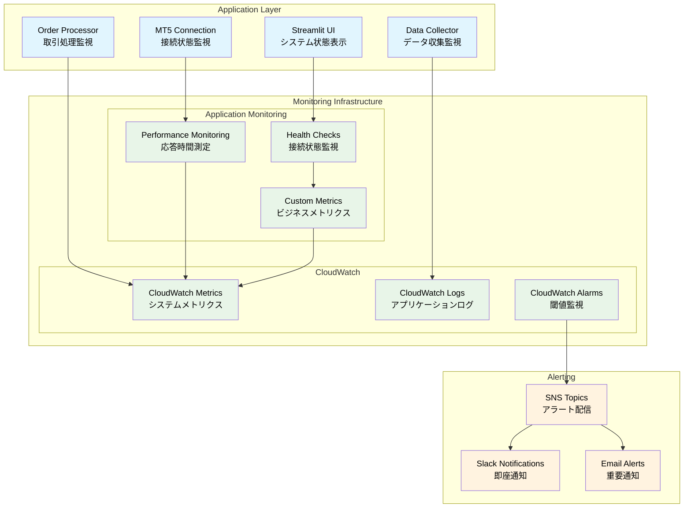
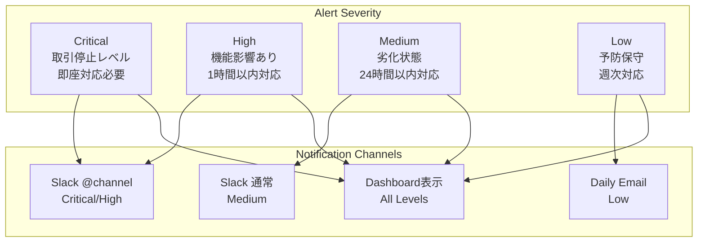
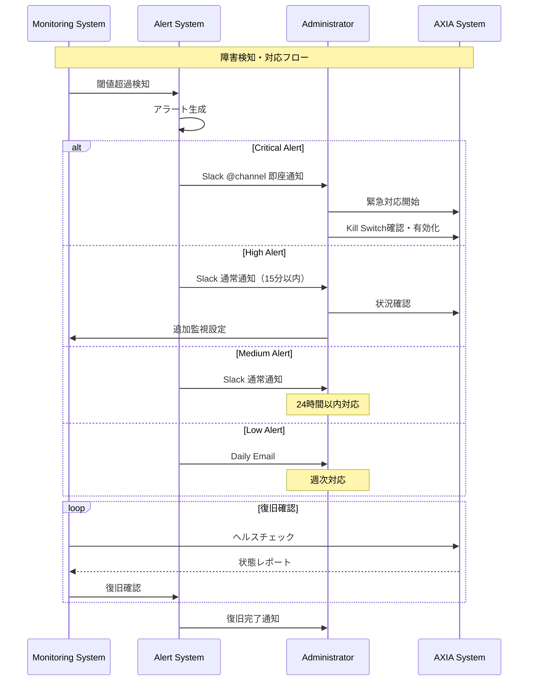

# 監視・アラート設計

**Document Path**: `docs/physical_design/monitoring.md`  
**Version**: 1.0  
**Type**: 監視・アラート設計書  
**Last Updated**: 2025-10-19

---

## 目次

- [1. 監視システム概要](#1-監視システム概要)
- [2. CloudWatch監視設計](#2-cloudwatch監視設計)
- [3. アプリケーション監視](#3-アプリケーション監視)
- [4. アラート設計](#4-アラート設計)
- [5. ログ管理](#5-ログ管理)
- [6. ダッシュボード設計](#6-ダッシュボード設計)
- [7. 障害対応・エスカレーション](#7-障害対応エスカレーション)

---

## 1. 監視システム概要

### 1.1 監視アーキテクチャ



### 1.2 監視レベル定義

| 監視レベル | 対象 | 監視間隔 | アラート方法 | 対応時間 |
|----------|------|---------|-------------|---------|
| **Critical** | 取引実行、Kill Switch | 1分 | 即座（Slack） | 即座 |
| **Important** | データ取得、MT5接続 | 5分 | 15分以内（Slack） | 1時間 |  
| **Informational** | システムリソース | 15分 | 日次レポート（Email） | 24時間 |
| **Debug** | 詳細ログ、パフォーマンス | 継続 | ログのみ | - |

---

## 2. CloudWatch監視設計

### 2.1 標準メトリクス監視（実装済み）

#### EC2メトリクス
```yaml
Monitored Metrics:
  CPUUtilization:
    Threshold: 80%
    Period: 5 minutes
    EvaluationPeriods: 2
    ComparisonOperator: GreaterThanThreshold
    
  StatusCheckFailed:
    Threshold: 1
    Period: 1 minute
    EvaluationPeriods: 1
    ComparisonOperator: GreaterThanOrEqualToThreshold
    
  NetworkIn/NetworkOut:
    Threshold: 100MB
    Period: 5 minutes
    EvaluationPeriods: 1
    ComparisonOperator: GreaterThanThreshold
```

#### DynamoDBメトリクス  
```yaml
Monitored Metrics:
  ThrottledRequests:
    Threshold: 1
    Period: 5 minutes
    EvaluationPeriods: 1
    ComparisonOperator: GreaterThanOrEqualToThreshold
    
  ConsumedReadCapacityUnits:
    Threshold: 80  # オンデマンドでも監視
    Period: 5 minutes
    Statistic: Average
    
  UserErrors:
    Threshold: 5
    Period: 5 minutes
    EvaluationPeriods: 1
    ComparisonOperator: GreaterThanThreshold
```

#### ElastiCacheメトリクス
```yaml
Monitored Metrics:
  CPUUtilization:
    Threshold: 80%
    Period: 5 minutes
    EvaluationPeriods: 2
    
  DatabaseMemoryUsagePercentage:
    Threshold: 80%
    Period: 5 minutes
    EvaluationPeriods: 2
    
  CacheHits/CacheMisses:
    Threshold: 50%  # ヒット率50%以下でアラート
    Period: 15 minutes
    Statistic: Average
```

### 2.2 カスタムメトリクス設計（実装予定）

```python
# src/infrastructure/monitoring/cloudwatch_publisher.py
class CloudWatchMetricsPublisher:
    """カスタムメトリクス送信クラス"""
    
    def __init__(self):
        self.cloudwatch = boto3.client('cloudwatch', region_name='ap-northeast-1')
        self.namespace = 'AXIA/TradingSystem'
    
    def put_trading_metrics(self, metrics: Dict[str, float]) -> None:
        """取引関連メトリクス送信"""
        metric_data = []
        
        for metric_name, value in metrics.items():
            metric_data.append({
                'MetricName': metric_name,
                'Value': value,
                'Unit': self._get_metric_unit(metric_name),
                'Timestamp': datetime.now(timezone.utc)
            })
        
        self.cloudwatch.put_metric_data(
            Namespace=self.namespace,
            MetricData=metric_data
        )
    
    def _get_metric_unit(self, metric_name: str) -> str:
        """メトリクス単位マッピング"""
        unit_mapping = {
            'ActivePositions': 'Count',
            'OrderSuccessRate': 'Percent', 
            'DataSourceResponseTime': 'Milliseconds',
            'CacheHitRate': 'Percent',
            'DailyPnL': 'Count',  # 円単位
            'KillSwitchActivations': 'Count'
        }
        return unit_mapping.get(metric_name, 'None')

# 送信予定メトリクス例
trading_metrics = {
    'ActivePositions': 2,           # 現在のオープンポジション数
    'OrderSuccessRate': 98.5,       # 注文成功率（%）
    'DataSourceResponseTime': 45.2, # データソース平均応答時間（ms）
    'CacheHitRate': 87.3,           # Redisキャッシュヒット率（%）
    'DailyPnL': 1250.0,             # 当日損益（円）
    'KillSwitchActivations': 0      # Kill Switch作動回数
}
```

### 2.3 ログ収集設計（実装済み）

#### ロググループ構成
```yaml
Log Groups:
  /aws/ec2/axia-tss/application:
    RetentionInDays: 30
    LogStreams:
      - order_processor.log      # 注文処理ログ
      - data_collector.log       # データ収集ログ  
      - streamlit.log           # UI アクセスログ
      - mt5_connection.log      # MT5接続ログ
      
  /aws/ec2/axia-tss/system:
    RetentionInDays: 7
    LogStreams:
      - windows_application.log  # Windowsアプリケーションログ
      - task_scheduler.log      # タスクスケジューラログ
      
Filter Patterns:
  ERROR: '[ERROR]'
  WARNING: '[WARNING]' 
  TRADING: '[TRADING]'
  KILL_SWITCH: '[KILL_SWITCH]'
```

---

## 3. アプリケーション監視

### 3.1 ヘルスチェック機能（実装済み）

**実装場所**: `src/infrastructure/monitoring/connection_checkers.py`

```python
# システムヘルスチェック実装
class SystemHealthChecker:
    """統合ヘルスチェックサービス"""
    
    def check_all_services(self) -> Dict[str, Any]:
        """全サービス統合ヘルスチェック"""
        
        results = {}
        start_time = time.time()
        
        # DynamoDB接続確認
        results['dynamodb'] = self._check_dynamodb()
        
        # Redis接続確認  
        results['redis'] = self._check_redis()
        
        # MT5接続確認
        results['mt5'] = self._check_mt5()
        
        # SQS接続確認
        results['sqs'] = self._check_sqs()
        
        # 全体判定
        overall_healthy = all(
            service['connected'] 
            for service in results.values()
        )
        
        return {
            'overall_status': 'healthy' if overall_healthy else 'unhealthy',
            'services': results,
            'check_duration': time.time() - start_time,
            'timestamp': datetime.now(timezone.utc).isoformat()
        }
    
    def _check_redis(self) -> Dict[str, Any]:
        """Redis接続・性能チェック"""
        start_time = time.time()
        
        try:
            redis_client = container.get_redis_client()
            
            # 接続テスト
            redis_client.ping()
            
            # 性能テスト
            test_key = f"healthcheck:{int(time.time())}"
            redis_client.set(test_key, "test", ex=60)
            value = redis_client.get(test_key)
            redis_client.delete(test_key)
            
            # メモリ使用量取得
            info = redis_client.info('memory')
            memory_used_mb = info['used_memory'] / (1024 * 1024)
            
            response_time = (time.time() - start_time) * 1000
            
            return {
                'connected': True,
                'response_time_ms': response_time,
                'memory_used_mb': round(memory_used_mb, 2),
                'memory_status': 'OK' if memory_used_mb < 50 else 'WARNING'
            }
            
        except Exception as e:
            return {
                'connected': False,
                'error': str(e),
                'response_time_ms': (time.time() - start_time) * 1000
            }
```

### 3.2 パフォーマンス監視

```python
# パフォーマンス測定デコレータ
def monitor_performance(metric_name: str):
    """パフォーマンス監視デコレータ"""
    def decorator(func):
        def wrapper(*args, **kwargs):
            start_time = time.time()
            try:
                result = func(*args, **kwargs)
                execution_time = time.time() - start_time
                
                # CloudWatchにメトリクス送信
                put_custom_metric(
                    f"{metric_name}_ExecutionTime",
                    execution_time * 1000,  # ミリ秒
                    'Milliseconds'
                )
                
                # 成功メトリクス
                put_custom_metric(f"{metric_name}_Success", 1, 'Count')
                
                logger.info(f"{func.__name__} completed in {execution_time:.3f}s")
                return result
                
            except Exception as e:
                execution_time = time.time() - start_time
                
                # 失敗メトリクス
                put_custom_metric(f"{metric_name}_Failure", 1, 'Count')
                
                logger.error(f"{func.__name__} failed in {execution_time:.3f}s: {e}")
                raise
        
        return wrapper
    return decorator

# 使用例
@monitor_performance('OrderProcessing')
def process_order(order_data):
    """注文処理（監視対象）"""
    pass

@monitor_performance('DataRetrieval') 
def get_market_data(symbol, timeframe):
    """データ取得（監視対象）"""
    pass
```

### 3.3 ビジネスメトリクス監視

```python
# src/infrastructure/monitoring/business_metrics.py
class BusinessMetricsCollector:
    """ビジネスメトリクス収集"""
    
    def collect_trading_metrics(self) -> Dict[str, float]:
        """取引関連メトリクス収集"""
        
        # ポジション数取得（将来実装）
        # active_positions = len(position_repository.find_open_positions())
        active_positions = 0  # 暫定
        
        # 当日損益計算（将来実装）
        # daily_pnl = calculate_daily_pnl()
        daily_pnl = 0.0  # 暫定
        
        # Kill Switch状態
        kill_switch_repo = container.get_kill_switch_repository()
        kill_switch_active = 1 if kill_switch_repo.is_active() else 0
        
        # Redis統計
        redis_stats = container.get_ohlcv_cache().get_cache_stats()
        
        return {
            'ActivePositions': active_positions,
            'KillSwitchActive': kill_switch_active,  
            'CacheMemoryUsageMB': redis_stats.get('memory_used_mb', 0),
            'CacheTotalKeys': redis_stats.get('total_keys', 0),
            'DailyPnL': daily_pnl
        }
    
    def collect_system_metrics(self) -> Dict[str, float]:
        """システムメトリクス収集"""
        
        # ヘルスチェック実行
        health_checker = SystemHealthChecker()
        health_status = health_checker.check_all_services()
        
        # 接続可能サービス数
        connected_services = sum(
            1 for service in health_status.values() 
            if service.get('connected', False)
        )
        
        # 平均応答時間計算
        response_times = [
            service.get('response_time_ms', 0)
            for service in health_status.values()
            if 'response_time_ms' in service
        ]
        avg_response_time = sum(response_times) / len(response_times) if response_times else 0
        
        return {
            'ConnectedServices': connected_services,
            'TotalServices': len(health_status),
            'AvgResponseTime': avg_response_time,
            'SystemHealthScore': (connected_services / len(health_status)) * 100
        }
```

---

## 4. アラート設計

### 4.1 アラートレベル定義



### 4.2 アラームルール設定

#### Critical レベル
```yaml
Kill Switch Activation:
  MetricName: AXIA/TradingSystem/KillSwitchActive
  Threshold: 1
  ComparisonOperator: GreaterThanOrEqualToThreshold
  EvaluationPeriods: 1
  Period: 60  # 1分
  Actions:
    - SNS: CriticalAlertsTopicArn
  AlarmDescription: "Kill Switch has been activated"

EC2 Instance Down:
  MetricName: AWS/EC2/StatusCheckFailed
  Threshold: 1  
  ComparisonOperator: GreaterThanOrEqualToThreshold
  EvaluationPeriods: 1
  Period: 60
  Actions:
    - SNS: CriticalAlertsTopicArn
  AlarmDescription: "EC2 instance has failed status check"

DynamoDB Service Errors:
  MetricName: AWS/DynamoDB/UserErrors
  Threshold: 10
  ComparisonOperator: GreaterThanThreshold
  EvaluationPeriods: 1
  Period: 300  # 5分
```

#### High レベル
```yaml
MT5 Connection Lost:
  MetricName: AXIA/TradingSystem/MT5Connected
  Threshold: 0
  ComparisonOperator: LessThanThreshold
  EvaluationPeriods: 2
  Period: 300  # 5分
  
Redis Connection Lost:
  MetricName: AXIA/TradingSystem/RedisConnected  
  Threshold: 0
  ComparisonOperator: LessThanThreshold
  EvaluationPeriods: 2
  Period: 300

SQS DLQ Messages:
  MetricName: AWS/SQS/ApproximateNumberOfMessages
  QueueName: TSS_OrderRequestQueue_DLQ
  Threshold: 1
  ComparisonOperator: GreaterThanOrEqualToThreshold
  EvaluationPeriods: 1
  Period: 300
```

### 4.3 アラート通知設定

```python
# SNS + Lambda による Slack通知（実装予定）
import json
import urllib3

def lambda_handler(event, context):
    """CloudWatch Alarm → Slack通知"""
    
    # SNSメッセージ解析
    for record in event['Records']:
        sns_message = json.loads(record['Sns']['Message'])
        alarm_name = sns_message['AlarmName']
        new_state = sns_message['NewStateValue']
        reason = sns_message['NewStateReason']
        
        # Slack通知フォーマット
        slack_message = {
            "text": f"🚨 AXIA Alert: {alarm_name}",
            "attachments": [
                {
                    "color": "danger" if new_state == "ALARM" else "good",
                    "fields": [
                        {"title": "Status", "value": new_state, "short": True},
                        {"title": "Reason", "value": reason, "short": False},
                        {"title": "Time", "value": sns_message['StateChangeTime'], "short": True}
                    ]
                }
            ]
        }
        
        # Slack Webhook送信
        webhook_url = get_slack_webhook_from_secrets()
        http = urllib3.PoolManager()
        
        response = http.request(
            'POST',
            webhook_url,
            body=json.dumps(slack_message),
            headers={'Content-Type': 'application/json'}
        )
        
    return {'statusCode': 200}
```

---

## 5. ログ管理

### 5.1 ログ設計（実装済み）

#### 構造化ログフォーマット
```python
# 実装済み: src/infrastructure/config/logging_config.py
{
    "timestamp": "2025-10-19T10:00:00.123Z",
    "level": "INFO",
    "component": "order_processor", 
    "function": "execute_order",
    "message": "Order executed successfully",
    "data": {
        "order_id": "ORD-20251019-001",
        "symbol": "USDJPY",
        "action": "BUY",
        "lot_size": 0.1,
        "mt5_ticket": 12345678
    },
    "performance": {
        "execution_time_ms": 250,
        "memory_usage_mb": 45.2
    },
    "correlation_id": "req-20251019-001",
    "user_agent": "AXIA-TSS/1.0"
}
```

#### ログレベル使い分け
```python
# 実装済みログレベル戦略
logger = logging.getLogger(__name__)

# CRITICAL: システム停止レベル
logger.critical("MT5 authentication completely failed. System shutdown required.")

# ERROR: 機能影響レベル  
logger.error("Order execution failed", extra={
    'order_id': order.ticket_id,
    'symbol': order.symbol,
    'error_code': 'MT5_CONNECTION_ERROR'
})

# WARNING: 注意レベル
logger.warning("Redis cache miss, falling back to MT5", extra={
    'symbol': 'USDJPY',
    'timeframe': 'H1',
    'fallback_source': 'mt5'
})

# INFO: 通常業務レベル
logger.info("Order processed successfully", extra={
    'order_id': order.ticket_id,
    'mt5_ticket': mt5_ticket,
    'execution_time_ms': 250
})

# DEBUG: 開発・詳細調査レベル
logger.debug("Cache hit for market data", extra={
    'cache_key': 'ohlcv:USDJPY:H1',
    'row_count': 240,
    'response_time_ms': 15
})
```

### 5.2 ログ分析・検索

```python
# CloudWatch Insights クエリ例
queries = {
    # エラー分析
    "error_analysis": """
    fields @timestamp, level, component, message, data.error_code
    | filter level = "ERROR"
    | stats count() by component, data.error_code
    | sort count desc
    """,
    
    # パフォーマンス分析
    "performance_analysis": """
    fields @timestamp, component, function, performance.execution_time_ms
    | filter ispresent(performance.execution_time_ms)
    | stats avg(performance.execution_time_ms), max(performance.execution_time_ms) by component, function
    | sort avg desc
    """,
    
    # 取引分析
    "trading_analysis": """
    fields @timestamp, data.symbol, data.action, data.lot_size, data.mt5_ticket
    | filter component = "order_processor" and level = "INFO"
    | filter message like /Order executed successfully/
    | stats count() by data.symbol, data.action
    """
}
```

---

## 6. ダッシュボード設計

### 6.1 CloudWatchダッシュボード（実装予定）

```json
{
  "widgets": [
    {
      "type": "metric",
      "properties": {
        "metrics": [
          ["AWS/EC2", "CPUUtilization", "InstanceId", "i-xxxxxxxxx"],
          ["AWS/EC2", "NetworkIn", "InstanceId", "i-xxxxxxxxx"],
          ["AWS/EC2", "NetworkOut", "InstanceId", "i-xxxxxxxxx"]
        ],
        "view": "timeSeries",
        "stacked": false,
        "region": "ap-northeast-1",
        "title": "EC2 System Metrics",
        "period": 300
      }
    },
    {
      "type": "metric", 
      "properties": {
        "metrics": [
          ["AXIA/TradingSystem", "ActivePositions"],
          ["AXIA/TradingSystem", "OrderSuccessRate"],
          ["AXIA/TradingSystem", "KillSwitchActivations"]
        ],
        "view": "timeSeries",
        "region": "ap-northeast-1", 
        "title": "Trading System Metrics",
        "period": 300
      }
    },
    {
      "type": "log",
      "properties": {
        "query": "SOURCE '/aws/ec2/axia-tss/application'\n| fields @timestamp, level, component, message\n| filter level = \"ERROR\"\n| sort @timestamp desc\n| limit 100",
        "region": "ap-northeast-1",
        "title": "Recent Errors",
        "view": "table"
      }
    }
  ]
}
```

### 6.2 Streamlit監視ダッシュボード（実装済み）

**実装場所**: `src/presentation/ui/streamlit/layouts/header.py`, `sidebar.py`

```python
# リアルタイムシステム状態表示
def render_system_status():
    """システム状態表示（実装済み）"""
    
    # システムヘルス取得
    health_status = controller.get_system_health()
    
    # 状態表示
    if health_status.overall_status.value == 'healthy':
        st.success("✅ システム正常稼働中")
    else:
        st.error("❌ システム異常")
    
    # 各サービス状態
    for service_name, connection in health_status.connections.items():
        icon = "🟢" if connection.connected else "🔴"
        latency = f"{connection.latency_ms:.0f}ms" if connection.latency_ms else "N/A"
        st.text(f"{icon} {service_name.title()}: {latency}")
    
    # Kill Switch状態
    if health_status.kill_switch['active']:
        st.error("🚨 **KILL SWITCH ACTIVE**")
        st.text(f"理由: {health_status.kill_switch.get('reason', 'Unknown')}")
    else:
        st.success("💹 取引可能")
```

---

## 7. 障害対応・エスカレーション

### 7.1 障害対応フロー



### 7.2 エスカレーション手順

#### Level 1: 自動対応
```python
# 自動復旧スクリプト
def auto_recovery_actions(alert_type: str):
    """自動復旧アクション"""
    
    if alert_type == 'redis_connection_failed':
        # Redis接続リトライ
        for attempt in range(3):
            try:
                redis_client = container.get_redis_client()
                redis_client.ping()
                logger.info(f"Redis reconnection successful (attempt {attempt + 1})")
                return True
            except:
                time.sleep(30)
        
        # 自動復旧失敗
        logger.error("Redis auto-recovery failed, escalating to manual intervention")
        return False
    
    elif alert_type == 'high_memory_usage':
        # Redis キャッシュクリア
        try:
            redis_client = container.get_redis_client()
            # 古いキーのみ削除（安全措置）
            old_keys = redis_client.keys('ohlcv:*')
            for key in old_keys:
                ttl = redis_client.ttl(key)
                if ttl < 3600:  # 1時間以内に期限切れのキーを削除
                    redis_client.delete(key)
            
            logger.info(f"Cleared {len(old_keys)} old cache keys")
            return True
        except Exception as e:
            logger.error(f"Auto cache cleanup failed: {e}")
            return False
```

#### Level 2: 手動対応
```powershell
# 手動障害対応手順書

# 1. システム状態確認
function Check-SystemStatus {
    Write-Host "=== AXIA System Status Check ===" -ForegroundColor Cyan
    
    # サービス稼働状況
    Get-ScheduledTask -TaskName "AXIA_*" | Format-Table TaskName,State,LastRunTime
    
    # プロセス確認
    Get-Process | Where-Object {$_.ProcessName -match "(python|terminal64)"} | Format-Table ProcessName,Id,WorkingSet
    
    # ネットワーク接続
    Test-NetConnection -ComputerName localhost -Port 8501
    Test-NetConnection -ComputerName axia-redis-cache.xxxxx.cache.amazonaws.com -Port 6379
    
    # AWS サービス状態
    aws dynamodb describe-table --table-name TSS_DynamoDB_OrderState --query 'Table.TableStatus'
}

# 2. 緊急時対応
function Emergency-Response {
    Write-Host "=== EMERGENCY RESPONSE STARTED ===" -ForegroundColor Red
    
    # Kill Switch有効化
    aws dynamodb put-item --table-name TSS_DynamoDB_OrderState --item '{
      "pk": {"S": "GLOBALCONFIG"},
      "sk": {"S": "SETTING#KILL_SWITCH"},
      "active": {"BOOL": true},
      "reason": {"S": "Emergency manual activation"}
    }'
    
    # 全サービス停止
    Get-ScheduledTask -TaskName "AXIA_*" | Stop-ScheduledTask -Force
    
    # MT5全ポジションクローズ（手動確認要）
    Write-Host "⚠️  Manual Action Required: Close all MT5 positions manually" -ForegroundColor Yellow
}
```

### 7.3 障害分析・改善

```python
# 障害後分析（実装予定）
class IncidentAnalyzer:
    """障害分析クラス"""
    
    def analyze_incident(self, start_time: datetime, end_time: datetime) -> Dict:
        """障害期間の分析"""
        
        # 1. ログ分析
        error_logs = self.query_cloudwatch_logs(
            log_group='/aws/ec2/axia-tss/application',
            start_time=start_time,
            end_time=end_time,
            filter_pattern='[timestamp, level="ERROR", ...]'
        )
        
        # 2. メトリクス分析
        metrics_data = self.get_cloudwatch_metrics(
            namespace='AXIA/TradingSystem',
            start_time=start_time,
            end_time=end_time
        )
        
        # 3. 影響範囲分析
        impact_analysis = {
            'affected_orders': len([log for log in error_logs if 'order' in log['message']]),
            'data_collection_failures': len([log for log in error_logs if 'data_collector' in log['component']]),
            'user_impact': 'UI unavailable' if any('streamlit' in log['component'] for log in error_logs) else 'minimal'
        }
        
        return {
            'incident_duration': (end_time - start_time).total_seconds(),
            'error_count': len(error_logs),
            'primary_cause': self._identify_primary_cause(error_logs),
            'impact_analysis': impact_analysis,
            'recovery_actions': self._extract_recovery_actions(error_logs)
        }
```

---

## 付録

### A. 監視項目チェックリスト

| カテゴリ | 監視項目 | 実装状況 | 優先度 |
|---------|---------|---------|--------|
| **システム** | EC2稼働状況 | ✅ CloudWatch | Critical |
| **システム** | CPU/メモリ使用率 | ✅ CloudWatch | High |
| **アプリケーション** | Kill Switch状態 | ✅ Streamlit | Critical |
| **アプリケーション** | 取引実行成功率 | 🔄 設計済み | Critical |
| **データベース** | DynamoDB接続 | ✅ ヘルスチェック | High |
| **データベース** | Redis接続・メモリ | ✅ ヘルスチェック | High |
| **外部接続** | MT5接続状態 | ✅ ヘルスチェック | Critical |
| **外部接続** | yfinance API | ❌ 未実装 | Medium |

### B. アラート頻度管理

```python
# アラート抑制機能（実装予定）
class AlertSuppressionManager:
    """アラート頻度制御"""
    
    def __init__(self):
        self.alert_history = {}  # {alert_type: last_sent_time}
        
    def should_send_alert(self, alert_type: str, severity: str) -> bool:
        """アラート送信判定"""
        
        # Critical は常に送信
        if severity == 'Critical':
            return True
            
        # 同じアラートの送信間隔制御
        min_intervals = {
            'High': 300,      # 5分間隔
            'Medium': 3600,   # 1時間間隔  
            'Low': 86400      # 24時間間隔
        }
        
        min_interval = min_intervals.get(severity, 3600)
        last_sent = self.alert_history.get(alert_type, 0)
        
        if time.time() - last_sent >= min_interval:
            self.alert_history[alert_type] = time.time()
            return True
            
        return False
```

### C. 監視コスト最適化

| 最適化項目 | 現在 | 最適化後 | 節約効果 |
|----------|------|---------|---------|
| **CloudWatch Logs** | 30日保持 | 7日保持（重要ログのみ30日） | 50%削減 |
| **CloudWatch Metrics** | 全メトリクス | 重要メトリクスのみ | 30%削減 |
| **カスタムメトリクス** | 未実装 | 必要最小限 | コスト増加抑制 |
| **アラーム数** | 基本のみ | 重要アラームのみ | 60%削減 |

---

**Document Version**: 1.0  
**Last Updated**: 2025-10-19  
**Next Review**: 2025-11-19