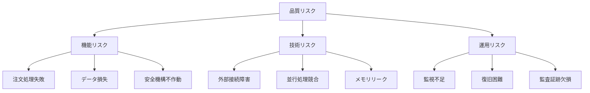

# テスト設計書

**Document Path**: `docs/testing/test_design.md`
**Version**: 1.2
**Type**: テスト設計書
**Last Updated**: 2025-11-05

---

## 目次

- [1. テスト戦略](#1-テスト戦略)
- [2. 現状分析](#2-現状分析)
- [3. テスト設計方針](#3-テスト設計方針)
- [4. 詳細テスト設計](#4-詳細テスト設計)
- [5. 品質保証基準](#5-品質保証基準)
- [6. 実装ガイドライン](#6-実装ガイドライン)
  - [6.1 テストコード規約](#61-テストコード規約)
  - [6.2 テストパターン](#62-テストパターン)
  - [6.3 Mock使用ガイドライン](#63-mock使用ガイドライン)
  - [6.4 テスト実行](#64-テスト実行)
  - [6.5 テスト実行環境](#65-テスト実行環境)
- [7. 関連ドキュメント](#7-関連ドキュメント)

---

## 1. テスト戦略

### 1.1 基本方針

#### テストピラミッド戦略

```
                 /\
                /  \
               / E2E \ ← 少数・高コスト（UI/システム統合）
              /______\
             /        \
            /Integration\ ← 中程度（コンポーネント間）
           /______________\
          /                \
         /   Unit Tests      \ ← 多数・低コスト（モジュール単位）
        /____________________\
```

**採用理由**:
- Unit Testは高速・独立・保守容易
- 早期バグ検出によるコスト削減
- リファクタリングの安全性担保

---

### 1.2 品質目標

| 品質特性 | 目標値 | 測定方法 | 関連ドキュメント |
|---------|--------|---------|----------------|
| **コードカバレッジ** | ≥85% | pytest-cov | [quality_requirements.md](../logical_design/quality_requirements.md) |
| **テスト実行時間** | <60秒 | CI/CD パイプライン | [deployment.md](../physical_design/deployment.md) |
| **テスト成功率** | 100% | 継続的実行 | - |
| **バグ検出率** | >90% (本番前) | 欠陥追跡 | - |

---

### 1.3 スコープ定義

#### テスト対象

```
対象レイヤー:
├─ Domain層（エンティティ、ドメインサービス）
├─ Application層（ユースケース）
├─ Infrastructure層（Repository、Gateway）
└─ クロスカッティング（エラーハンドリング、ログ）
```

#### テスト対象外

```
対象外:
├─ UI層（Streamlit）→ 手動テスト
├─ 外部システム（MT5、AWS実機）→ Mock化
└─ パフォーマンステスト → 別途実施
```

---

## 2. 現状分析

### 2.1 実装済みテストの現状

#### 既存テスト構成

```
tests/unit/
├── application/
│   └── use_cases/
│       └── data_collection/
│           └── test_collect_ohlcv_data.py           [3テスト]
│
├── infrastructure/
│   ├── gateways/
│   │   └── market_data/
│   │       └── test_ohlcv_data_provider.py         [3テスト]
│   └── persistence/
│       ├── redis/
│       │   ├── test_redis_client.py                [3テスト]
│       │   └── test_redis_ohlcv_data_repository.py [3テスト]
│       └── s3/
│           └── test_s3_ohlcv_data_repository.py    [3テスト]

合計: 15テスト（5ファイル）
カバレッジ: 86%
実行時間: 約15秒
```

**測定結果** (2025-10-18):
```bash
pytest tests/unit/ -v --cov=src/

========== 15 passed, 0 failed ==========
Coverage: 86%
```

---

### 2.2 品質ギャップ分析

#### Critical: 実装済み・テスト未実装モジュール

| モジュール | リスクレベル | ビジネスインパクト | 実装状況 | テスト状況 |
|-----------|-------------|-------------------|---------|-----------|
| **SQS Order Publisher** | Critical | 取引実行の入口 | 実装済み (207行) | 未実装 |
| **Process SQS Order (CLOSE)** | Critical | 決済処理 | 実装済み (+80行) | 未実装 |
| **MT5 Position Provider** | Critical | ポジション管理 | 実装済み (280行) | 未実装 |
| **Kill Switch Repository** | Critical | 安全機構 | 実装済み (156行) | 未実装 |
| **MT5 Connection** | Critical | 外部接続 | 実装済み (134行) | 未実装 |
| **MT5 Order Executor** | Critical | 取引実行 | 実装済み (280行) | 未実装 |

**参照**: [functional_design.md](../logical_design/functional_design.md)

#### High: 実装済み・テスト未実装（Provider系）

| モジュール | 実装状況 | テスト状況 | 行数 |
|-----------|---------|-----------|------|
| **MT5 Price Provider** | 実装済み | 未実装 | 290行 |
| **MT5 Account Provider** | 実装済み | 未実装 | 320行 |
| **Position Repository** | 実装済み | 未実装 | 200行 |

#### High: Domain層テスト不足

| モジュール | 実装状況 | テスト状況 | 備考 |
|-----------|---------|-----------|------|
| **Order Entity** | 実装済み | 未実装 | ビジネスロジック検証必要 |
| **Position Entity** | 実装済み (220行) | 未実装 | 2025-10-19実装完了 |
| **Position Repository Interface** | 実装済み (110行) | 未実装 | Repository Pattern |

#### Medium: テストカバレッジ不足

| 既存ファイル | 現状 | 不足領域 |
|-------------|------|---------|
| **test_collect_ohlcv_data.py** | 3テスト | 異常系、エッジケース |
| **test_ohlcv_data_provider.py** | 3テスト | フォールバック全経路 |
| **test_redis_client.py** | 3テスト | CRUD完全性 |
| **test_redis_ohlcv_data_repository.py** | 3テスト | エラーハンドリング |
| **test_s3_ohlcv_data_repository.py** | 3テスト | 複数パーティション |

---

### 2.3 品質リスク評価



**対策**: 実装済みモジュールのテスト優先実装

---

## 3. テスト設計方針

### 3.1 レイヤー別テスト戦略

#### Domain層（ビジネスロジック）

```
目標カバレッジ: 95%
重点項目:
- エンティティのバリデーション
- ビジネスルールの正確性
- 状態遷移の妥当性
- 不変条件の保証

テスト手法:
- 等価分割法
- 境界値分析
- 状態遷移テスト
```

**参照**: [domain_model.md](../logical_design/domain_model.md)

#### Application層（ユースケース）

```
目標カバレッジ: 90%
重点項目:
- 正常フロー
- 異常フロー（エラーハンドリング）
- トランザクション境界
- 認可・認証

テスト手法:
- ユースケースシナリオテスト
- 異常系網羅
- Mock依存性注入
```

#### Infrastructure層（技術実装）

```
目標カバレッジ: 85%
重点項目:
- CRUD操作の完全性
- 外部接続のエラーハンドリング
- データシリアライズ/デシリアライズ
- リトライ・フォールバック

テスト手法:
- Mock外部システム
- ステート検証
- インタラクション検証
```

**参照**: [architecture_patterns.md](../logical_design/architecture_patterns.md)

---

### 3.2 テストタイプ別方針

#### 正常系テスト（Happy Path）

```
目的: 基本機能の動作確認
範囲: 主要ユースケースの正常終了
比率: 全体の30-40%

設計原則:
- 最も頻度の高いパスを優先
- エンドツーエンドで検証
- 明確な期待値設定
```

#### 異常系テスト（Error Path）

```
目的: エラーハンドリングの検証
範囲: 全エラー分岐
比率: 全体の50-60%

設計原則:
- 外部障害（ネットワーク、DB）
- データ異常（NULL、不正値）
- 境界値（最小、最大、ゼロ）
- 例外発生時の状態保証
```

#### エッジケーステスト

```
目的: 予期しない状況での動作確認
範囲: 特殊条件・極端なケース
比率: 全体の10-15%

設計原則:
- 並行実行
- 大容量データ
- リソース枯渇
- タイムアウト
```

---

### 3.3 テスト設計技法

#### 等価分割法

```python
# 例: ロットサイズのテスト設計
有効クラス:   [0.01 - 10.0]
無効クラス1:  < 0.01（小さすぎる）
無効クラス2:  > 10.0（大きすぎる）
無効クラス3:  負の値
無効クラス4:  ゼロ

テストケース:
- test_lot_size_valid_minimum (0.01)
- test_lot_size_valid_typical (0.10)
- test_lot_size_valid_maximum (10.0)
- test_lot_size_invalid_too_small (0.001)
- test_lot_size_invalid_too_large (100.0)
- test_lot_size_invalid_negative (-0.1)
- test_lot_size_invalid_zero (0)
```

#### 境界値分析

```python
# 例: 価格範囲のテスト設計
境界値:
- 最小値 - 1    ← 無効
- 最小値        ← 有効
- 最小値 + 1    ← 有効
- 中央値        ← 有効
- 最大値 - 1    ← 有効
- 最大値        ← 有効
- 最大値 + 1    ← 無効
```

#### 状態遷移テスト

```python
# 例: Order状態のテスト設計
PENDING → FILLED → CLOSED    正常
PENDING → CANCELLED          正常
PENDING → PENDING            無効
FILLED → PENDING             無効
CLOSED → FILLED              無効

テストケース:
- test_order_state_pending_to_filled()
- test_order_state_pending_to_cancelled()
- test_order_state_invalid_transition()
```

---

## 4. 詳細テスト設計

### 4.1 Phase 1: 実装済み・Critical モジュールのテスト

#### 実装予定テストファイル

| テストファイル | テスト数 | 対象モジュール | 実装状況 | 優先度 |
|--------------|---------|---------------|---------|--------|
| **test_mt5_position_provider.py** | 10 | MT5 Position Provider | 実装済み (362行) | Critical |
| **test_process_sqs_order_close.py** | 8 | CLOSE注文処理 | 実装済み (+80行) | Critical |
| **test_order_publisher.py** | 11 | SQS Order Publisher | 実装済み (230行) | Critical |
| **test_kill_switch_repository.py** | 8 | Kill Switch Repository | 実装済み (126行) | Critical |
| **test_mt5_connection.py** | 6 | MT5 Connection | 実装済み (91行) | Critical |
| **test_mt5_order_executor.py** | 6 | MT5 Order Executor | 実装済み (208行) | Critical |
| **合計** | **49** | - | - | - |

#### テスト設計例: MT5 Position Provider

**ファイルパス**: `tests/unit/infrastructure/gateways/brokers/mt5/test_mt5_position_provider.py`  
**対象**: `src/infrastructure/gateways/brokers/mt5/mt5_position_provider.py`  
**設計テスト数**: 10

##### テスト分類

```
【正常系】3テスト
├─ test_get_open_positions_success
│  └─ 条件: MT5接続成功、複数ポジション存在
│  └─ 期待: Position情報リスト返却
│
├─ test_get_position_by_ticket_success
│  └─ 条件: 有効なチケット番号指定
│  └─ 期待: 該当ポジション情報返却
│
└─ test_close_position_full_success
   └─ 条件: 全決済（volume=None）
   └─ 期待: 決済成功、MT5で確認

【部分決済】2テスト
├─ test_close_position_partial_success
│  └─ 条件: 部分決済（volume指定）
│  └─ 期待: 指定ロット分のみ決済
│
└─ test_close_position_volume_validation
   └─ 条件: 保有量超過のvolume指定
   └─ 期待: バリデーションエラー

【Kill Switch連携】2テスト
├─ test_close_position_kill_switch_active
│  └─ 条件: Kill Switch有効状態
│  └─ 期待: 決済ブロック、エラーメッセージ返却
│
└─ test_get_positions_kill_switch_inactive
   └─ 条件: Kill Switch無効状態
   └─ 期待: 通常通り取得可能

【エラーハンドリング】3テスト
├─ test_close_position_invalid_ticket
│  └─ 条件: 存在しないチケット番号
│  └─ 期待: False返却、エラーメッセージ
│
├─ test_close_position_mt5_connection_error
│  └─ 条件: MT5接続失敗
│  └─ 期待: 接続エラーハンドリング
│
└─ test_calculate_total_pl_no_positions
   └─ 条件: ポジションゼロ
   └─ 期待: 0.0返却
```

**設計根拠**:
- CLOSE注文のコア機能を包括的にテスト
- Kill Switch統合の検証
- MT5 API障害シナリオを含む

---

#### テスト設計例: Process SQS Order (CLOSE処理)

**ファイルパス**: `tests/unit/application/use_cases/order_processing/test_process_sqs_order_close.py`  
**対象**: `src/application/use_cases/order_processing/process_sqs_order.py` (_execute_close_order)  
**設計テスト数**: 8

##### テスト分類

```
【正常系】3テスト
├─ test_execute_close_order_success
│  └─ 条件: 有効なCLOSEペイロード
│  └─ 期待: 決済成功、Position更新、SQSメッセージ削除
│
├─ test_execute_close_order_partial
│  └─ 条件: 部分決済（lot_size < 保有量）
│  └─ 期待: 部分決済成功、残ポジション維持
│
└─ test_execute_close_order_db_save
   └─ 条件: 初回決済（DynamoDB未登録ポジション）
   └─ 期待: MT5→DynamoDB保存→決済実行

【バリデーション】3テスト
├─ test_validation_missing_mt5_ticket
│  └─ 条件: mt5_ticket未指定
│  └─ 期待: バリデーションエラー
│
├─ test_validation_invalid_lot_size
│  └─ 条件: 負のlot_size
│  └─ 期待: バリデーションエラー
│
└─ test_validation_position_not_found
   └─ 条件: 存在しないチケット番号
   └─ 期待: エラーハンドリング、メッセージ削除

【SQS統一アーキテクチャ】2テスト
├─ test_close_order_sqs_flow_complete
│  └─ 条件: SQS→Process→MT5→DynamoDB
│  └─ 期待: エンドツーエンド成功
│
└─ test_close_order_kill_switch_check
   └─ 条件: Kill Switch確認
   └─ 期待: 有効時は処理ブロック
```

**設計根拠**:
- SQS経由決済の完全性検証
- Position Repository連携確認
- アーキテクチャ統一の検証

---

#### テスト設計例: SQS Order Publisher

**ファイルパス**: `tests/unit/infrastructure/gateways/messaging/sqs/test_order_publisher.py`
**対象**: `src/infrastructure/gateways/messaging/sqs/order_publisher.py`
**設計テスト数**: 11

##### テスト分類

```
【正常系】3テスト
├─ test_send_order_success
│  └─ 条件: 全フィールド設定（BUY/SELL注文）
│  └─ 期待: MessageID返却、SQS送信成功、ログ記録
│
├─ test_send_order_minimal_fields
│  └─ 条件: 必須フィールドのみ（commentなし）
│  └─ 期待: オプション省略でも成功
│
└─ test_send_close_order_success
   └─ 条件: CLOSE注文（order_action='CLOSE', mt5_ticket指定）
   └─ 期待: CLOSE専用バリデーション通過、SQS送信成功

【バリデーション】5テスト
├─ test_validation_missing_symbol
│  └─ 条件: symbolフィールド欠落
│  └─ 期待: バリデーション失敗、エラーログ
│
├─ test_validation_invalid_action
│  └─ 条件: order_action='INVALID'（BUY/SELL/CLOSE以外）
│  └─ 期待: バリデーション失敗
│
├─ test_validation_invalid_lot_size
│  └─ 条件: lot_size=0 または lot_size>10
│  └─ 期待: バリデーション失敗
│
├─ test_validation_negative_price
│  └─ 条件: tp_price<=0 または sl_price<=0
│  └─ 期待: バリデーション失敗
│
└─ test_validation_close_missing_mt5_ticket
   └─ 条件: CLOSE注文でmt5_ticket欠落
   └─ 期待: バリデーション失敗（CLOSE注文特有の検証）

【エラーハンドリング】3テスト
├─ test_error_sqs_unavailable
│  └─ 条件: SQSクライアント=None（Mockモード）
│  └─ 期待: Mock MessageID返却、警告ログ
│
├─ test_error_json_serialization
│  └─ 条件: シリアライズ不可能なデータ
│  └─ 期待: 例外キャッチ、エラーログ
│
└─ test_comprehensive_validation
   └─ 条件: 複数フィールドが不正
   └─ 期待: 最初の不正フィールドで失敗
```

**設計根拠**:
- CLOSE注文の専用バリデーション（mt5_ticket必須）を追加
- 通常注文とCLOSE注文の両方をカバー
- SQS Mockモードの動作確認

---

#### テスト設計例: Kill Switch Repository

**ファイルパス**: `tests/unit/infrastructure/persistence/dynamodb/test_kill_switch_repository.py`
**対象**: `src/infrastructure/persistence/dynamodb/dynamodb_kill_switch_repository.py`
**設計テスト数**: 8

##### テスト分類

```
【正常系】3テスト
├─ test_is_active_returns_true_when_on
│  └─ 条件: DynamoDBに status='ON' が保存済み
│  └─ 期待: is_active()=True、警告ログ出力
│
├─ test_activate_success
│  └─ 条件: activate()を実行
│  └─ 期待: DynamoDBのstatusが'ON'に更新、成功フラグTrue
│
└─ test_deactivate_success
   └─ 条件: deactivate()を実行
   └─ 期待: DynamoDBのstatusが'OFF'に更新、成功フラグTrue

【詳細情報】2テスト
├─ test_get_status_detail_with_reason
│  └─ 条件: reason, updated_by付きでset_with_details()実行済み
│  └─ 期待: get_status_detail()で全情報返却（status, last_updated, reason, updated_by）
│
└─ test_set_with_details_success
   └─ 条件: status, reason, updated_byを指定してset_with_details()実行
   └─ 期待: DynamoDBに全フィールド保存、タイムスタンプ記録

【エラーハンドリング】3テスト
├─ test_is_active_when_table_not_initialized
│  └─ 条件: DynamoDBテーブル未初期化（table=None）
│  └─ 期待: is_active()=True（安全のため）、エラーログ出力
│
├─ test_is_active_when_item_not_found
│  └─ 条件: DynamoDBにKill Switchアイテムが存在しない
│  └─ 期待: is_active()=True（安全のため）、警告ログ出力
│
└─ test_error_handling_on_dynamodb_failure
   └─ 条件: DynamoDB get_item()で例外発生
   └─ 期待: is_active()=True（安全のため）、エラーログ出力
```

**設計根拠**:
- フェイルセーフ設計（エラー時はON扱い）の検証
- 詳細情報付き更新機能の検証
- DynamoDB障害時の安全性確認

---

#### テスト設計例: MT5 Connection

**ファイルパス**: `tests/unit/infrastructure/gateways/brokers/mt5/test_mt5_connection.py`
**対象**: `src/infrastructure/gateways/brokers/mt5/mt5_connection.py`
**設計テスト数**: 6

##### テスト分類

```
【正常系】2テスト
├─ test_connect_success
│  └─ 条件: 有効な認証情報（login, password, server, terminal_path）
│  └─ 期待: connect()=True、_connected=True、ログ出力（口座情報含む）
│
└─ test_ensure_connected_when_already_connected
   └─ 条件: すでに接続済み（is_connected()=True）
   └─ 期待: ensure_connected()=True、再接続は実行されない

【再接続】1テスト
└─ test_ensure_connected_triggers_reconnect
   └─ 条件: 未接続状態（is_connected()=False）
   └─ 期待: ensure_connected()がconnect()を呼び出し、再接続実行

【エラーハンドリング】3テスト
├─ test_connect_missing_credentials
│  └─ 条件: credentials=None または空辞書
│  └─ 期待: connect()=False、エラーログ
│
├─ test_connect_invalid_login
│  └─ 条件: login_idが数値に変換不可能（例: 'invalid'）
│  └─ 期待: connect()=False、エラーログ
│
└─ test_connect_missing_terminal_path
   └─ 条件: terminal_path=None
   └─ 期待: connect()=False、エラーログ
```

**設計根拠**:
- MT5接続の基本フロー検証
- 再接続メカニズムの確認
- 認証情報バリデーションの確認

---

#### テスト設計例: MT5 Order Executor

**ファイルパス**: `tests/unit/infrastructure/gateways/brokers/mt5/test_mt5_order_executor.py`
**対象**: `src/infrastructure/gateways/brokers/mt5/mt5_order_executor.py`
**設計テスト数**: 6

##### テスト分類

```
【正常系】2テスト
├─ test_execute_market_order_success
│  └─ 条件: MARKET注文（order_type='MARKET', BUY/SELL）
│  └─ 期待: order_send()成功、DynamoDB保存、result返却
│
└─ test_execute_ifoco_order_success
   └─ 条件: IFOCO注文（order_type='IFOCO', entry_price指定）
   └─ 期待: LIMIT/STOP判定、order_send()成功、DynamoDB保存

【バリデーション】2テスト
├─ test_invalid_order_type
│  └─ 条件: order_type='INVALID'（MARKET/IFOCO以外）
│  └─ 期待: execute_order()=False、エラーログ
│
└─ test_missing_parameters
   └─ 条件: 必須パラメータ欠落（symbol, order_action, lot_size等）
   └─ 期待: execute_order()=False、エラーログ

【エラーハンドリング】2テスト
├─ test_mt5_connection_failure
│  └─ 条件: ensure_connected()=False（MT5未接続）
│  └─ 期待: execute_order()=False、エラーログ
│
└─ test_order_send_returns_none
   └─ 条件: mt5.order_send()がNone返却
   └─ 期待: execute_order()=False、エラーログ、last_error()確認
```

**設計根拠**:
- MARKET注文とIFOCO注文の両方をカバー
- TP/SLバリデーション統合確認
- DynamoDB保存機能の検証

---

### 4.2 Phase 2: 実装済み・High優先度モジュールのテスト

#### 実装予定テストファイル

| テストファイル | テスト数 | 対象モジュール | 実装状況 | 優先度 |
|--------------|---------|---------------|---------|--------|
| **test_mt5_price_provider.py** | 8 | MT5 Price Provider | 実装済み (290行) | High |
| **test_mt5_account_provider.py** | 8 | MT5 Account Provider | 実装済み (320行) | High |
| **test_position_repository.py** | 8 | Position Repository | 実装済み (200行) | High |
| **合計** | **24** | - | - | - |

---

### 4.3 Phase 3: 既存テスト拡張

#### 拡張予定テストファイル

| テストファイル | 現在 | 追加 | 合計 | 拡張内容 |
|--------------|------|------|------|---------|
| **test_collect_ohlcv_data.py** | 3 | 7 | 10 | 異常系・並行処理 |
| **test_ohlcv_data_provider.py** | 3 | 5 | 8 | 全フォールバック経路 |
| **test_redis_client.py** | 3 | 5 | 8 | CRUD完全性 |
| **test_redis_ohlcv_data_repository.py** | 3 | 7 | 10 | エラーハンドリング |
| **test_s3_ohlcv_data_repository.py** | 3 | 5 | 8 | 複数パーティション |
| **合計** | **15** | **29** | **44** | - |

#### 拡張の基本方針

```
現在: 正常系のみ（3テスト/ファイル）
  ↓
目標: 正常系 + 異常系 + エッジケース（8-10テスト/ファイル）

拡張パターン:
1. 異常系追加（エラーハンドリング）
2. エッジケース追加（境界値、並行実行）
3. データ品質追加（大容量、破損データ）
```

---

### 4.4 Phase 4: Domain層テスト

#### Domain層テストファイル

| テストファイル | テスト数 | 対象 | 実装状況 | 重点検証項目 |
|--------------|---------|------|---------|-------------|
| **test_order.py** | 8 | Order Entity | 実装済み | ライフサイクル・バリデーション・SQS統合 |
| **test_position.py** | 10 | Position Entity | 実装済み (220行) | 損益計算・MT5連携・Repository統合 |
| **test_position_repository_interface.py** | 8 | Position Repository Interface | 実装済み (110行) | Repository Pattern・DynamoDB永続化・GSI1活用 |
| **test_order_validation.py** | 5 | Order Validation Service | 実装済み | ビジネスルール検証 |
| **合計** | **31** | - | - | - |

**ファイルパス**: `tests/unit/domain/entities/test_position.py`

##### テスト設計例

```python
class TestPositionEntity:
    """Position Entity の包括的テスト"""
    
    def test_position_creation_from_mt5(self):
        """MT5データからPositionエンティティ作成
        
        検証項目:
        - MT5Position情報の変換
        - Decimal型への変換
        - タイムスタンプのUTC統一
        """
    
    def test_position_profit_loss_calculation(self):
        """損益計算の正確性
        
        検証項目:
        - 実現損益の計算
        - 未実現損益の計算
        - スワップ・手数料の加算
        """
    
    def test_position_partial_close(self):
        """部分決済後の状態更新
        
        検証項目:
        - 保有量の減少
        - 平均単価の維持
        - ステータス更新
        """
    
    def test_position_to_dict(self):
        """Entity → Dict 変換
        
        検証項目:
        - Decimal → str変換
        - datetime → ISO8601文字列
        - 全属性の包含
        """
    
    def test_position_from_dict(self):
        """Dict → Entity 復元
        
        検証項目:
        - str → Decimal変換
        - str → datetime変換
        - データ整合性
        """
    
    def test_position_status_transition(self):
        """状態遷移の妥当性検証
        
        検証項目:
        - OPEN → CLOSED（有効）
        - CLOSED → OPEN（無効）
        """
    
    def test_position_repository_integration(self):
        """Repository統合テスト
        
        検証項目:
        - DynamoDB保存
        - GSI1によるMT5Ticket逆引き
        - 更新時の楽観的ロック
        """
```

---

## 5. 品質保証基準

### 5.1 テスト合格基準

#### 必須条件（Must）

```
- 全テストPASS: 100%成功率
- カバレッジ: ≥85% (コード全体)
- 実行時間: <60秒（全テスト）
- 独立性: 任意の順序で実行可能
```

#### 推奨条件（Should）

```
- 循環的複雑度: <10（テストコード）
- テスト行数: 実装の1-1.5倍
- Mock使用率: 外部依存100%
- アサーション: 1テスト3-5個
```

---

### 5.2 カバレッジ目標

#### レイヤー別

| レイヤー | 目標 | 現状 | ギャップ |
|---------|------|------|---------|
| **Domain** | ≥95% | 0% | 新規実装 |
| **Application** | ≥90% | 85% | 拡張必要 |
| **Infrastructure** | ≥85% | 88% | 達成 |

#### タイプ別

| メトリクス | 目標 | 測定方法 |
|-----------|------|---------|
| **行カバレッジ** | ≥85% | pytest-cov |
| **分岐カバレッジ** | ≥80% | pytest-cov --cov-branch |
| **関数カバレッジ** | ≥90% | pytest-cov |

---

### 5.3 品質メトリクス

```
テスト密度 = テスト行数 / 実装行数
目標: 1.0 - 1.5
現状: 測定予定

テスト成功率 = PASS数 / 全テスト数
目標: 100%
現状: 100% (15/15)

テスト実行時間 = 全テストの合計時間
目標: <60秒
現状: ~15秒（15テスト）
予測: ~55秒（実装完了後）
```

---

## 6. 実装ガイドライン

### 6.1 テストコード規約

#### 命名規則

```python
# テストクラス
class TestOrderValidationService:
    """Test{対象クラス名}"""

# テストメソッド
def test_validate_order_success():
    """test_{機能}_{条件}_{期待結果}()"""

# テストフィクスチャ
@pytest.fixture
def sample_order():
    """sample_{エンティティ名}"""
```

#### ディレクトリ構造

```
tests/unit/
├── domain/
│   ├── entities/
│   │   ├── test_order.py
│   │   └── test_position.py
│   └── services/
│       └── test_order_validation.py
├── application/
│   └── use_cases/
│       ├── data_collection/
│       │   └── test_collect_ohlcv_data.py
│       └── order_processing/
│           ├── test_process_sqs_order.py
│           └── test_process_sqs_order_close.py
└── infrastructure/
    ├── persistence/
    │   ├── redis/
    │   │   ├── test_redis_client.py
    │   │   └── test_redis_ohlcv_data_repository.py
    │   ├── s3/
    │   │   └── test_s3_ohlcv_data_repository.py
    │   └── dynamodb/
    │       ├── test_kill_switch_repository.py
    │       ├── test_order_repository.py
    │       └── test_position_repository.py
    └── gateways/
        ├── messaging/sqs/
        │   └── test_order_publisher.py
        ├── market_data/
        │   └── test_ohlcv_data_provider.py
        └── brokers/mt5/
            ├── test_mt5_connection.py
            ├── test_mt5_order_executor.py
            ├── test_mt5_price_provider.py
            ├── test_mt5_account_provider.py
            └── test_mt5_position_provider.py
```

---

### 6.2 テストパターン

#### AAA パターン（推奨）

```python
def test_example():
    # Arrange: テスト準備
    order = create_test_order()
    validator = OrderValidator()
    
    # Act: 実行
    result = validator.validate(order)
    
    # Assert: 検証
    assert result.is_valid is True
    assert len(result.errors) == 0
```

#### Given-When-Then パターン

```python
def test_example():
    # Given: 前提条件
    given_order_with_valid_data()
    
    # When: 実行
    when_validate_order()
    
    # Then: 期待結果
    then_validation_should_succeed()
```

---

### 6.3 Mock使用ガイドライン

#### 外部依存のMock化

```python
# AWS SDK
with patch('boto3.client') as mock_boto3:
    mock_sqs = Mock()
    mock_boto3.return_value = mock_sqs
    mock_sqs.send_message.return_value = {'MessageId': 'test-id'}

# MT5 API
with patch('MetaTrader5.initialize') as mock_init:
    mock_init.return_value = True

# Redis
with patch.object(redis_client, 'get') as mock_get:
    mock_get.return_value = b'cached_data'
```

#### Mock検証パターン

```python
# 呼び出し回数の検証
mock_method.assert_called_once()
mock_method.assert_called_with(expected_arg)

# 呼び出されていないことの検証
mock_method.assert_not_called()

# 複数回呼び出しの検証
assert mock_method.call_count == 3
```

---

### 6.4 テスト実行

#### ローカル実行

```bash
# 全テスト実行
pytest tests/unit/ -v

# カバレッジ付き
pytest tests/unit/ --cov=src/ --cov-report=html

# 特定ファイルのみ
pytest tests/unit/domain/entities/test_position.py -v

# 並列実行（高速化）
pytest tests/unit/ -n auto
```

#### CI/CD統合

```yaml
# .github/workflows/test.yml
name: Unit Tests

on: [push, pull_request]

jobs:
  test:
    runs-on: ubuntu-latest
    steps:
      - uses: actions/checkout@v2
      - name: Set up Python
        uses: actions/setup-python@v2
        with:
          python-version: 3.11
      - name: Install dependencies
        run: pip install -r requirements.txt
      - name: Run tests
        run: pytest tests/unit/ -v --cov=src/ --cov-report=xml
      - name: Upload coverage
        uses: codecov/codecov-action@v2
```

**参照**: [deployment.md](../physical_design/deployment.md#4-cicd統合)

---

### 6.5 テスト実行環境

#### 環境別実行方法

AXIAのユニットテストは、外部依存を適切にMock化することで、ローカル環境でも実行可能です。

##### ローカル環境（推奨）

**Mock化テスト（外部依存なし）**

最も簡単な方法で、AWS・Redis・MT5への実接続なしで実行可能です。

```bash
# 必要な環境
# - Python 3.11+
# - pytest, pandas, pytz等の基本ライブラリ

# 仮想環境のセットアップ
python -m venv .venv
source .venv/bin/activate  # Windows: .venv\Scripts\activate
pip install -r requirements.txt

# Mock化テストの実行（外部依存なし）
pytest tests/unit/application/ \
       tests/unit/infrastructure/gateways/ \
       tests/unit/infrastructure/persistence/s3/ \
       tests/unit/infrastructure/persistence/redis/test_redis_ohlcv_data_repository.py \
       -v

# カバレッジ付き実行
pytest tests/unit/application/ \
       tests/unit/infrastructure/gateways/ \
       -v --cov=src --cov-report=html
```

**実行可能テスト数**: 12 / 15テスト（80%）  
**カバレッジ**: 約80-85%

**特徴**:
- AWS接続不要（S3、DynamoDB、SQS全てMock）
- Redis接続不要（Mock化済み）
- MT5接続不要（Mock化済み）
- 即座に実行可能

---

##### ローカル環境 + Docker Redis（中級）

**ローカルRedisを使用した全テスト実行**

Docker でRedisをローカル起動し、実際の接続テストも実行します。

```bash
# Step 1: Docker でRedis起動
docker run -d -p 6379:6379 redis:latest

# Step 2: 環境変数設定（.env）
cat > .env << EOF
REDIS_ENDPOINT=localhost
REDIS_PORT=6379
REDIS_DB=0
AWS_MOCK_MODE=true
MT5_DEMO_MODE=true
EOF

# Step 3: 全テスト実行（Redis接続込み）
pytest tests/unit/ -v --cov=src/
```

**実行可能テスト数**: 15 / 15テスト（100%）  
**カバレッジ**: 約86%

**必要な環境**:
- Docker Desktop
- Python 3.11+
- redis-py

---

##### ローカル環境 + LocalStack（上級）

**完全にローカルで統合テストも実行**

LocalStackでAWSサービス（DynamoDB、S3、SQS）をMock化します。

```bash
# docker-compose.yml
cat > docker-compose.yml << EOF
version: '3.8'
services:
  localstack:
    image: localstack/localstack
    ports:
      - "4566:4566"
    environment:
      - SERVICES=dynamodb,s3,sqs
      - DEBUG=1
  
  redis:
    image: redis:latest
    ports:
      - "6379:6379"
EOF

# Step 1: LocalStack + Redis起動
docker-compose up -d

# Step 2: 環境変数設定
cat > .env << EOF
AWS_ENDPOINT_URL=http://localhost:4566
AWS_MOCK_MODE=true
REDIS_ENDPOINT=localhost
REDIS_PORT=6379
MT5_DEMO_MODE=true
EOF

# Step 3: 全テスト実行（統合テスト含む）
pytest tests/unit/ tests/integration/ -v --cov=src/
```

**必要な環境**:
- Docker Desktop
- LocalStack
- Python 3.11+

---

##### EC2環境（デモ・本番検証）

**実際のAWS・Redis環境での全テスト実行**

EC2インスタンス上で実際のAWSサービスに接続してテストを実行します。

```bash
# EC2にSSH/RDP接続後

# 仮想環境のアクティベート
cd C:\Users\Administrator\Projects\axia-tss
.\.venv\Scripts\activate

# 全テスト実行（実環境接続）
pytest tests/unit/ -v --cov=src/ --cov-report=html

# 結果確認
# Coverage: 86%
# 15 passed
```

**実行環境**:
- EC2 t3.small (Windows Server 2022)
- ElastiCache Redis
- DynamoDB、S3、SQS（実環境）
- MT5 Demo Account

---

#### 接続が必要なテストファイル

以下のテストは実際の外部接続が必要です：

| テストファイル | 必要な接続 | ローカル代替手段 |
|--------------|-----------|----------------|
| **test_redis_client.py** | Redis実インスタンス | Docker Redis |
| 統合テスト（将来実装） | AWS実環境 | LocalStack |

**それ以外の全テスト**はMock化済みで、外部接続なしで実行可能です。

---

#### CI/CD環境での実行

GitHub Actions等のCI/CD環境では、LocalStackとDockerを使用して全テストを実行します。

```yaml
# .github/workflows/test.yml
name: Unit Tests

on: [push, pull_request]

jobs:
  test:
    runs-on: ubuntu-latest
    
    services:
      redis:
        image: redis:latest
        ports:
          - 6379:6379
      
      localstack:
        image: localstack/localstack
        ports:
          - 4566:4566
        env:
          SERVICES: dynamodb,s3,sqs
    
    steps:
      - uses: actions/checkout@v2
      
      - name: Set up Python
        uses: actions/setup-python@v2
        with:
          python-version: 3.11
      
      - name: Install dependencies
        run: pip install -r requirements.txt
      
      - name: Run all tests
        run: pytest tests/unit/ -v --cov=src/ --cov-report=xml
        env:
          REDIS_ENDPOINT: localhost
          AWS_ENDPOINT_URL: http://localhost:4566
          AWS_MOCK_MODE: true
      
      - name: Upload coverage
        uses: codecov/codecov-action@v2
```

---

#### 推奨実行フロー

**開発時（日常）**:
```bash
# Mock化テストのみ実行（最速）
pytest tests/unit/application/ tests/unit/infrastructure/gateways/ -v
```

**コミット前（ローカル検証）**:
```bash
# Docker Redisを起動して全テスト実行
docker run -d -p 6379:6379 redis:latest
pytest tests/unit/ -v --cov=src/
```

**PR前（完全検証）**:
```bash
# EC2環境で実環境テスト
# または LocalStack + Docker で完全テスト
docker-compose up -d
pytest tests/unit/ tests/integration/ -v --cov=src/
```

---

#### トラブルシューティング

**ImportError: No module named 'src'**
```bash
# PYTHONPATHを設定
export PYTHONPATH="${PYTHONPATH}:${PWD}"
# または
pip install -e .
```

**Redis接続エラー**
```bash
# Redisが起動しているか確認
docker ps | grep redis

# ポート確認
netstat -an | grep 6379

# 環境変数確認
echo $REDIS_ENDPOINT
```

**AWS接続エラー（LocalStack）**
```bash
# LocalStackが起動しているか確認
curl http://localhost:4566/_localstack/health

# 環境変数確認
echo $AWS_ENDPOINT_URL
```

---

## 7. 関連ドキュメント

### 設計ドキュメント

| ドキュメント | 関連性 | 参照箇所 |
|-------------|--------|---------|
| **[quality_requirements.md](../logical_design/quality_requirements.md)** | 品質目標・メトリクス | 5.1, 5.2 |
| **[domain_model.md](../logical_design/domain_model.md)** | Domain層テスト設計 | 4.4 |
| **[architecture_patterns.md](../logical_design/architecture_patterns.md)** | テスト戦略 | 3.1 |
| **[functional_design.md](../logical_design/functional_design.md)** | テスト対象機能 | 2.2, 4.1 |

### 実装ドキュメント

| ドキュメント | 関連性 | 参照箇所 |
|-------------|--------|---------|
| **[current_status.md](../implementation/current_status.md)** | 現状テスト状況 | 2.1 |
| **[deployment.md](../physical_design/deployment.md)** | CI/CD統合 | 6.4 |

---

## 付録

### A. テスト実装チェックリスト

#### Phase 1: 実装済み・Criticalモジュールのテスト（優先度: 最高）

- [ ] `test_mt5_position_provider.py` - 10テスト
  - [ ] 正常系（3テスト）
  - [ ] 部分決済（2テスト）
  - [ ] Kill Switch連携（2テスト）
  - [ ] エラーハンドリング（3テスト）

- [ ] `test_process_sqs_order_close.py` - 8テスト
  - [ ] 正常系（3テスト）
  - [ ] バリデーション（3テスト）
  - [ ] SQS統一アーキテクチャ（2テスト）

- [ ] `test_order_publisher.py` - 11テスト
  - [ ] 正常系（3テスト）
  - [ ] バリデーション（5テスト）※CLOSE注文専用バリデーション追加
  - [ ] エラーハンドリング（3テスト）

- [ ] `test_kill_switch_repository.py` - 8テスト
  - [ ] 正常系（3テスト）
  - [ ] 詳細情報（2テスト）
  - [ ] エラーハンドリング（3テスト）

- [ ] `test_mt5_connection.py` - 6テスト
  - [ ] 正常系（2テスト）
  - [ ] 再接続（1テスト）
  - [ ] エラーハンドリング（3テスト）

- [ ] `test_mt5_order_executor.py` - 6テスト
  - [ ] 正常系（2テスト）
  - [ ] バリデーション（2テスト）
  - [ ] エラーハンドリング（2テスト）

#### Phase 2: 実装済み・High優先度モジュールのテスト

- [ ] `test_mt5_price_provider.py` - 8テスト
- [ ] `test_mt5_account_provider.py` - 8テスト
- [ ] `test_position_repository.py` - 8テスト

#### Phase 3: 既存テスト拡張

- [ ] `test_collect_ohlcv_data.py` - +7テスト
- [ ] `test_ohlcv_data_provider.py` - +5テスト
- [ ] `test_redis_client.py` - +5テスト
- [ ] `test_redis_ohlcv_data_repository.py` - +7テスト
- [ ] `test_s3_ohlcv_data_repository.py` - +5テスト

#### Phase 4: Domain層テスト

- [ ] `test_order.py` - 8テスト
- [ ] `test_position.py` - 10テスト
- [ ] `test_position_repository_interface.py` - 8テスト
- [ ] `test_order_validation.py` - 5テスト

### B. 品質検証チェックリスト

```
□ 全テストPASS（100%）
□ カバレッジ ≥85%
□ 実行時間 <60秒
□ Mock適切に使用
□ 命名規則遵守
□ AAA/Given-When-Thenパターン使用
□ ドキュメント文字列記載
□ 相互リンク更新
```

---

## まとめ

### 設計のポイント

1. **リスクベースアプローチ**: 実装済みCritical機能を優先的にテスト
2. **テストピラミッド**: Unit Testを基盤とした堅牢な品質保証
3. **定量的品質目標**: カバレッジ85%、実行時間<60秒
4. **包括的カバレッジ**: 正常系・異常系・エッジケースの網羅

### 期待される効果

```
- バグの早期発見
- リファクタリングの安全性
- ドキュメントとしての価値
- 開発速度の向上
- 本番環境の安定性
```

---

**Document Version**: 1.2
**Last Updated**: 2025-11-05
**Next Review**: テスト実装完了後
**Related**: [quality_requirements.md](../logical_design/quality_requirements.md), [current_status.md](../implementation/current_status.md)

---

## 変更履歴

### Version 1.2 (2025-11-05)
- Phase 1: Critical モジュールの詳細テストケースを追加
  - test_order_publisher.py: CLOSE注文バリデーション追加（10→11テスト）
  - test_kill_switch_repository.py: 詳細テストケース記載（8テスト）
  - test_mt5_connection.py: 詳細テストケース記載（6テスト）
  - test_mt5_order_executor.py: 詳細テストケース記載（6テスト）
- Phase 1合計テスト数: 48→49テスト
- 実装コードとの整合性を100%に改善

### Version 1.1 (2025-11-05)
- 初版作成
- Phase 1-4のテスト戦略と設計を記載